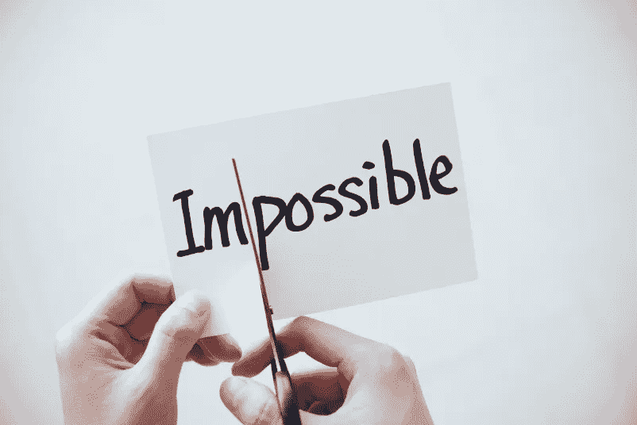
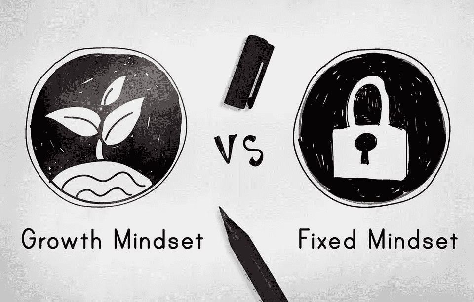

# 固定思维和成长思维的区别。

> 原文：<https://medium.datadriveninvestor.com/difference-between-having-a-fixed-or-growth-mindest-4bb6ace7ec2?source=collection_archive---------33----------------------->

积极是美妙的，但是如果你保持积极却不采取行动，你将不会走得很远。至少我是这么断言的。

对我来说，采取行动意味着致力于成长。

谈论想法、制定计划和策略比积极行动和完成任务要容易得多。

有固定思维模式的人不一定要思想封闭，然而这些人采取的行动最少，成长也很少(如果有的话)。

●固定的思维模式，僵化而不灵活

●以增长为导向的动态增长思维

成长心态坚定地相信自己，如果他们努力奋斗，不断发展自己，他们可以取得任何成就。

这些人不仅更成功，而且压力也更小，因为他们相信自己处理困难的能力。

此外，具有成长心态的人很好奇，想要发展，并且意识到需要努力才能达到重要的里程碑。

此外，他们不认为错误是一个问题，而是一个学习新事物和超越自我的机会。这些人有非常高的挫折承受力，尽管失败和挫折也努力尝试。

相比之下，思维定势的人坚信能力是与生俱来的。

他们相信不能被进一步影响或提高的天赋。

如果这些人失败了，他们把失败归因于缺乏天赋。

# 改变心态——可能吗？

虽然我们的童年极大地塑造了我们的心态，但我们总能积极地影响和改变它。

对新事物的开放态度和接受挑战的意愿是成长心态的第一步。

错误和挫折最终是我们生活的一部分。

重要的是你愿意做出改变并进一步发展自己。

然而，你必须意识到，成长思维的培养是一场漫长的马拉松，不会一蹴而就。

**进入专家视角—** [**订阅 DDI 英特尔**](https://datadriveninvestor.com/ddi-intel)