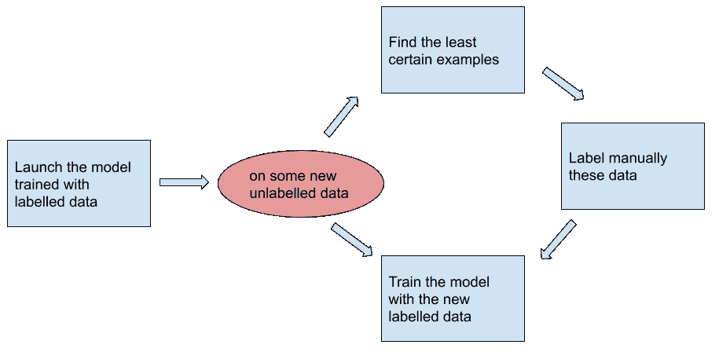

# 解决机器学习中数据标注瓶颈的不同方法

> 原文：<https://medium.datadriveninvestor.com/different-ways-to-tackle-the-data-labelling-bottleneck-in-machine-learning-77c0e4eae83b?source=collection_archive---------20----------------------->

Photo by [Brett Jordan](https://unsplash.com/@brett_jordan?utm_source=unsplash&utm_medium=referral&utm_content=creditCopyText) on [Unsplash](https://unsplash.com/s/photos/tag?utm_source=unsplash&utm_medium=referral&utm_content=creditCopyText)

数据是机器学习训练的食粮。每天都有越来越多的数据。但大多数时候，这些数据是没有标注的。手动给它们贴标签既费钱又无聊。

解决这个问题有不同的方法。

# 主动学习

主动学习优化了标签。它提取必须标记的数据。

系统要求对已识别的病例进行人工标记。这取决于你选择的策略。我将只讨论其中的两种策略。

**不确定性采样**

当使用一个模型时，你或多或少会得到一些确定的结果。这个想法是人工识别和标记最不确定的。

Uncertainty sampling example — original drawing

**半监督学习**

这种方法也寻找最确定的例子。它将它们用作标记数据。

Semi-supervised learning example — original drawing

进一步了解的链接:

*   [主动学习:好奇的人工智能算法](https://www.datacamp.com/community/tutorials/active-learning)
*   [主动学习简介](https://www.kdnuggets.com/2018/10/introduction-active-learning.html)

# 强化学习

在强化学习中，你从经验中学习。

你有目标了。代理试图通过执行操作来访问它。它的成功和失败把你的模型训练到正确的方向。

有一天，有人告诉我:

> 强化学习是一种有数据监督的学习。它只是随着时间的推移获取这些数据。

当与环境和有限的数据交互时，可以使用强化学习。

强化学习入门教程:

*   [问——学习简单](https://github.com/valohai/qlearning-simple)

# 数据扩充

从同一个数据中，你可以提取几个其他的。

你可以给猫拍照。你可以翻转、裁剪、缩放或旋转它。从一个带标签的图片，你现在有四个新的带标签的图片。

From one image, we can generate three others — original photo

关于数据扩充的阅读:

*   [数据扩充|如何在数据有限的情况下使用深度学习—第二部分](https://medium.com/@pierre_guillou/data-augmentation-par-fastai-v1-e2e69e071ccc)

用于图像增强的小型库；

*   [Codebox 软件](https://codebox.net/pages/image-augmentation-with-python)

# 无监督学习

标记是一个监督学习问题。为了解决这个问题，你可以使用无监督学习来代替。这种可能性取决于你遇到的问题。

假设您想从系综中提取异常。监督学习可以标记一些例子。然后，它训练模型。

相反，你可以把相似的东西聚集在一起。与其他群体非常不同的群体可能是异常现象。

这是一个简单的例子。然而，可以设想更复杂的解决方案。

使用 K 均值和 K 中值聚类的示例:

*   [机器学习中的聚类——K-Means 和 K-Medoids 示例](https://medium.zenika.com/clusterings-in-machine-learning-k-means-and-k-medoids-examples-894f37db9350)

# 结论

机器学习中的标记是一个问题。这是昂贵的，并导致无聊的任务。

您可以通过自动解决方案降低贴标成本。我想强调一些方法来做到这一点。

 [## 编码器解码器序列:多长是太长？数据驱动的投资者

### 在机器学习中，很多时候我们处理的输入是序列，输出也是序列。我们称这样的一个…

www.datadriveninvestor.com](https://www.datadriveninvestor.com/2020/03/24/encoder-decoder-sequences-how-long-is-too-long/)