# 深入调查 Numpy

> 原文：<https://medium.datadriveninvestor.com/digging-into-a919dda9d3f?source=collection_archive---------35----------------------->

Numpy 是一个用于处理数学计算的 python 包。它就像 C 语言的一层薄薄的包装。

这使得 numpy 计算执行得非常快。它比 python 列表更接近 C 数组。

## 数量和安装的先决条件

要开始使用 numpy，唯一的先决条件是您应该安装 python

Python 可以从[这里](https://www.python.org/ftp/python/3.9.1/python-3.9.1-amd64.exe)下载。

下载 python 的同时也安装了 pip 包管理器，可以用来下载 numpy 包。

> pip 安装数量

# Numpy 及其优势

*   Numpy 数组本质上是同质的。这意味着每个数组只包含一次数据。相反，这些清单在本质上是不同的。
*   numpy 数组存储在连续的内存位置，就像在 c 中一样。另一方面，c 中的列表存储就像一个链表实现。这使得访问 numpy 数组更快。
*   与列表相比，Numpy 数组占用的空间也更少。这是因为列表需要一个指针来引用下一个节点或元素。这需要额外的内存。
*   Numpy 数组有助于对大量数据进行数学和其他类型的运算。通常，与使用 pythons 内置序列相比，这种操作的执行效率更高，代码更少

也许你对 100 万个单元不太在意，但对 10 亿个单元你肯定会在意——这两种方法都不适合 32 位架构，但对于 64 位版本，NumPy 可以用 4 GB 左右，Python 本身至少需要大约 12 GB，这是一种昂贵得多的硬件。

然而，这不应该作为 numpy 数组比列表更好的论据。两者都有不同的用例，我多次引用列表来说明阵列的优势。

numpy 的强大和受欢迎程度可以通过几乎每个机器学习或数据科学库(如 scikit-learn、tensorflow 等)都只接受 numpy 数组的输入来了解

# Numpy 的局限性

就像我前面提到的，numpy 数组处理同源数据。因此，如果我们想存储异构数据，我们将不得不使用列表。

除此之外，numpy 没有太多的限制。这是因为大部分的限制是缺乏其他补充模块如 pandas、matplotlib 等所解决的特性。

例如，如果我们想要可视化，我们可以使用 seaborn 或 matplotlib，如果我们想要更多的数据库类型来查看我们正在查看的数据，我们可以使用构建在 numpy 本身之上的 pandas。

# 让我们来看看 Numpy 中的一些常见操作

现在我将重点介绍一些可以使用 numpy 执行的操作。

## 初始化

*   **创建全零数组**

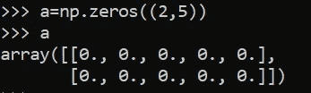

np.zeros( <specify_size>)用于创建一个用零初始化的 numpy 数组。</specify_size>

*   **创建全 1 数组**

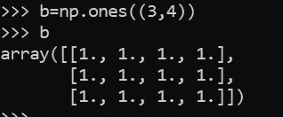

这与用零初始化所有元素的操作相似。

*   **创建一个元素间隔相等的数组**

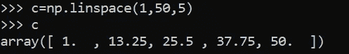

Linspace 帮助创建一个具有等距元素的数组。在给定的示例中，它创建了一个大小为 5 的数组，其中 1 到 50 之间的元素等距分布。

> np.linspace( <start_range>、<end_range>、<shape_of_array>)</shape_of_array></end_range></start_range>

要简单地创建自定义数组，我们可以使用以下命令

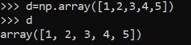

我们传入一个列表，numpy 将它转换成一个数组

还有许多其他的初始化方法，比如从正态分布或以 0 为中心的正态分布中获取值等等。

## 访问元素

我们可以使用索引来访问数组的元素。

> 使用列表和数组之间的切片来访问元素的一个关键区别是，数组支持垂直和水平切片，而列表只支持水平切片。

在解释这一点之前，我会解释什么是切片

**切片:**

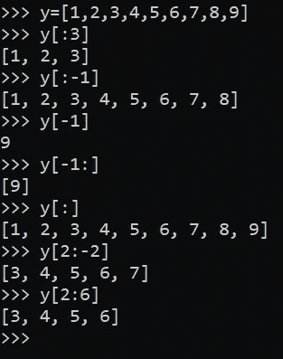

要访问一组元素，我们可以使用切片。切片的语法:

> <array_or_list_name>[ <start_index>: <end_index>]</end_index></start_index></array_or_list_name>

需要注意的一点是，当我们指定<end_index>时，它被排除在外。例如，当计算 y[:3]时，输出是[1，2，3]而不是[1，2，3，4]。</end_index>

类似地，当我们想访问最后几个元素，但不知道或者不想知道最后一个索引时，也会出现这种情况。为此我们可以使用负数。负 1 代表最后一个数字，从这里我们可以访问其他元素。你可以在上面的例子中看到。

**列表 vs 数组切片**

为了解释这个区别，你可以看下面的例子

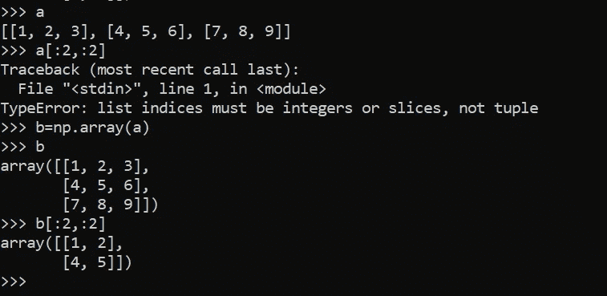

您可以看到，我们无法使用列表切片来访问同一列不同行的垂直元素。虽然当我们把同样的列表转换成数组时，我们可以很容易地做到这一点。这显示了我前面引用的列表中数组的一个重要属性。

# 查看与复制

每当我们访问这些元素时，我们都能在屏幕上看到输出。然而，这可以代表两件事。当内容被物理地存储在另一个位置时，它被称为**拷贝**。另一方面，如果提供相同存储器内容的不同视图，我们称之为**视图**。

视图只是原始阵列的视图，视图不拥有数据。当我们对视图进行更改时，它会影响原始阵列，当对原始阵列进行更改时，它会影响视图。

# 数字线性代数

线性代数是数据科学领域中最重要的课题之一。Numpy 提供了高度优化的线性代数函数，因为它们是围绕 C 函数包装的。

# 矢量化运算

*   当向量与标量相乘时，向量的每个元素都与标量相乘:

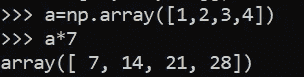

*   另一个常见的操作是**点积**。两个向量的点积是关于位置的元素乘积的和。一个向量的第一个元素乘以第二个向量的第一个元素，依此类推。这些积的和就是点积，可以用 **np.dot()** 函数来做。

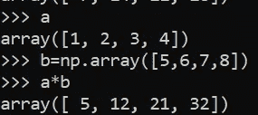

*   向量的元素求和与减法是通过标准的数学运算完成的。

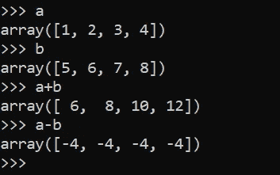

# 广播

每个通用函数接受数组输入，并通过对输入逐元素执行核心函数来产生数组输出(其中元素通常是标量，但可以是向量或广义 ufuncs 的高阶子数组)。应用标准的广播规则，使得不共享完全相同形状的输入仍然可以被有效地操作。广播可以用四个规则来理解:

1.  ndim 小于最大 ndim 的输入数组的所有输入数组的形状前都有 1。
2.  输出形状的每个维度中的大小是该维度中所有输入大小的最大值。
3.  如果输入在特定维度中的大小与该维度中的输出大小匹配，或者其值正好为 1，则可以在计算中使用该输入。
4.  如果输入在其形状中的维度大小为 1，则该维度中的第一个数据条目将用于该维度上的所有计算。换句话说， [ufunc](https://numpy.org/doc/stable/glossary.html#term-ufunc) 的步进机械将不会沿该维度步进(对于该维度，[步距](https://numpy.org/doc/stable/reference/arrays.ndarray.html#memory-layout)将为 0)。

如果上述规则产生有效结果，*即*，则一组数组被称为“可广播”到相同的形状，以下情况之一为真:

1.  这些阵列都有完全相同的形状。
2.  这些数组都具有相同的维数，并且每个维数的长度要么是共同的长度，要么是 1。
3.  维度太少的数组可以在形状前添加长度为 1 的维度，以满足属性 2。

# 通用函数

在 NumPy 中，通用函数是 numpy.ufunc 类的实例。许多内置函数都是用编译后的 C 代码实现的。基本的 ufuncs 对标量进行操作，但还有一种通用类型，其基本元素是子数组(向量、矩阵等)。)，而广播是在其他维度之上完成的。

通用函数(或简称为 [ufunc](https://numpy.org/doc/stable/glossary.html#term-ufunc) )是一个以逐个元素的方式对数组进行操作的函数，支持[数组广播](https://numpy.org/doc/stable/reference/ufuncs.html#ufuncs-broadcasting)、[类型转换](https://numpy.org/doc/stable/reference/ufuncs.html#ufuncs-casting)以及其他几个标准特性。也就是说，ufunc 是一个函数的“[矢量化](https://numpy.org/doc/stable/glossary.html#term-vectorization)”包装器，它接受固定数量的特定输入并产生固定数量的特定输出。

# 以数字表示的日期和时间

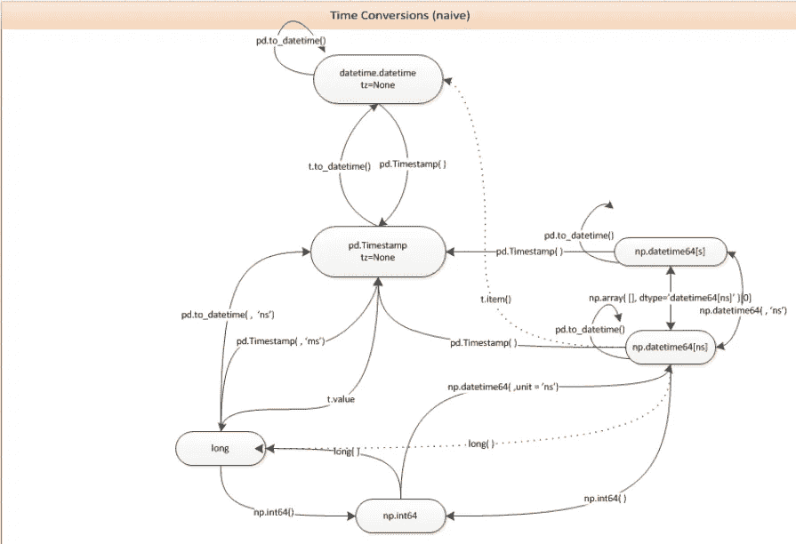

有些核心数组数据类型本身支持日期时间功能。数据类型称为“datetime64”，这样命名是因为 Python 中包含的 datetime 库已经采用了“datetime”。

我们可以通过解析 datetime64 函数中的字符串来创建日期时间。它的语法是

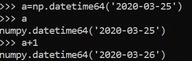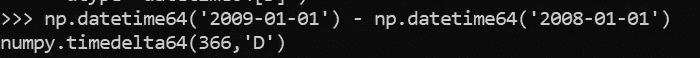

我们可以看到在日期的情况下加减是有意义的，所以我们可以执行这些操作。我们也可以在这些日期执行算术运算。

datetime 类型与许多常见的 NumPy 函数一起使用，例如，arange 可用于生成日期范围。

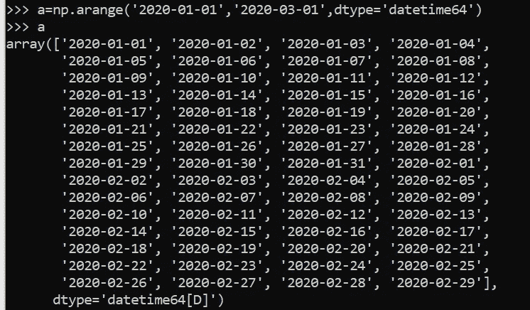

我们还有处理工作日的功能。默认情况下，工作日被指定为从星期一到星期五。

当输入日期是周末或假日时，busday_offset 首先应用规则将日期滚动到有效的工作日，然后应用偏移量。默认规则是“引发”，它只是引发一个异常。最常用的规则是“向前”和“向后”。

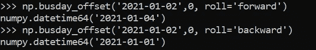

因为 2021 年 1 月 2 日是星期六，所以如果我们想要下一个工作日，下一个工作日将是 1 月 4 日。然而，我们希望最后一个工作日是 1 月 1 日，也就是星期五。

**访问专家视图—** [**订阅 DDI 英特尔**](https://datadriveninvestor.com/ddi-intel)

# 参考

*   [https://web courses . ucf . edu/courses/1249560/pages/python-lists-vs-numpy-arrays-what-is-the-difference](https://webcourses.ucf.edu/courses/1249560/pages/python-lists-vs-numpy-arrays-what-is-the-difference)
*   [https://www . tutorialspoint . com/numpy/numpy _ copies _ and _ views . htm](https://www.tutorialspoint.com/numpy/numpy_copies_and_views.htm)
*   [https://scipy-cookbook . readthedocs . io/items/viewsvscopies . html](https://scipy-cookbook.readthedocs.io/items/ViewsVsCopies.html)
*   https://numpy.org/doc/stable/reference/routines.linalg.html
*   【https://numpy.org/doc/stable/reference/ufuncs.html 
*   [https://stack overflow . com/questions/13703720/converting-between-datetime-timestamp-and-date time 64](https://stackoverflow.com/questions/13703720/converting-between-datetime-timestamp-and-datetime64)
*   [https://numpy.org/doc/stable/reference/arrays.datetime.html](https://numpy.org/doc/stable/reference/arrays.datetime.html)
*   [https://numpy . org/doc/stable/reference/generated/numpy . busday _ offset . html # numpy . busday _ offset](https://numpy.org/doc/stable/reference/generated/numpy.busday_offset.html#numpy.busday_offset)

**访问专家视图—** [**订阅 DDI 英特尔**](https://datadriveninvestor.com/ddi-intel)