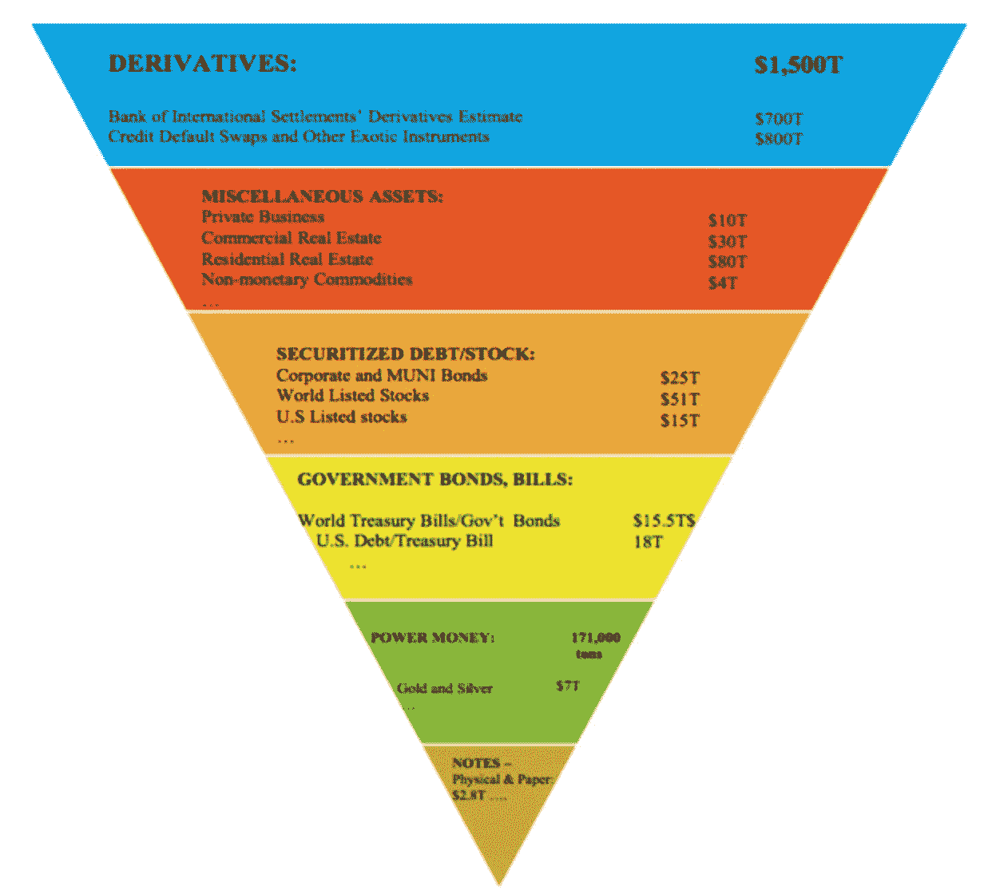

# 衍生品支持的数字资产是下一件大事吗？

> 原文：<https://medium.datadriveninvestor.com/digital-assets-backed-by-derivatives-the-next-big-thing-d487da552525?source=collection_archive---------13----------------------->

[2 分钟视频](https://youtu.be/Cl2XNDRCibQ)讲述全球最大的资产——衍生品如何数字化！

对数字资产的一个持续抱怨是，流动性差，机构没有交易它们的真正动机。随着国际互换和衍生品协会 [(ISDA)与律师事务所年利达(Linklaters)联手创建了一个利用智能合约进行衍生品交易的平台，这种情况可能即将改变。这可能是让衍生品市场能够使用智能合约和区块链技术的重要一步。大约一年前，法律委员会的](https://www.waterstechnology.com/operations/7568801/isda-create-takes-first-step-toward-smart-contracts)[法官沃斯](https://www.judiciary.uk/announcements/the-chancellor-of-the-high-court-sir-geoffrey-vos-launches-legal-statement-on-the-status-of-cryptoassets-and-smart-contracts/)，英格兰和威尔士高等法院的大法官，裁定智能合同应该被视为具有法律约束力。这是一项重要的裁决，因为它为依赖法律支持使用智能合同的行动和影响的机构提供了更大的法律确定性。

与其他资产相比的衍生品

来源: [IB 次](https://www.ibtimes.co.uk/alchemy-derivatives-market-could-trigger-next-global-financial-crisis-1613137)

国际清算银行(BIS)声称全球衍生品市场有 640 万亿美元，尽管其他人声称它可能高达 1 万亿美元。鉴于衍生品市场产生的巨大交易规模和交易量，在 DeFi(去中心化金融)交易所交易衍生品的方式开始开放只是时间问题。我们已经见证了 TradFi(传统金融部门)DeFi 之间的界限随着数字资产的使用而继续模糊，值得注意的是，CME 自 2017 年以来一直在利用衍生品[提供对 BTC 的敞口。现在，Bitfinex 正在使用衍生品来投资欧洲 50 大股票，结算在 USDT。](https://news.bitcoin.com/mainstream-investment-vehicles-tied-to-cryptocurrencies-grow-exponentially/)

DeFi 交易所，鸦片交易所(标榜自己为“*非托管交易方式*”)，现在正在提供信用违约掉期(CDS)。CDS 是一种金融衍生品，允许投资者与另一个投资者“互换”或减少他们的信用风险敞口，或者更简单地说，CDS 实际上为投资者提供了一种押注贷款人信用价值的方式。例如，Opium 向[提供 Tether](https://www.coindesk.com/credit-default-swaps-tether-opium) 信用评级的 CDS，这样人们就可以打赌/赚钱，Tether 是否真的 100%由美元担保。纽约联邦储备银行的一份报告称，CDS 市场价值超过 8 万亿美元，因此即使全球 CDS 市场的一小部分转移到使用数字资产进行交易，也会有大量的流动性。

因此，构建模块已经到位，可以发行更多由衍生品支持的数字资产，因此现在可以使用像 Synthetix 这样的 DeFi 协议，其本身已经锁定了 4.94 亿美元的总价值(TVL)。然而，问题是，为什么机构需要在数字资产中包装衍生品？从中期来看，我们不太可能看到两个市场和两种监管环境。资产的数字化使资产可以全天候交易，可以“实时”洞察发行人(实际上是整个市场)面临的系统性风险，更大的透明度，可能更快更便宜的结算，因此更强的合规性和更深的风险控制当前的模拟交易和市场可能会让位于数字交易和市场。