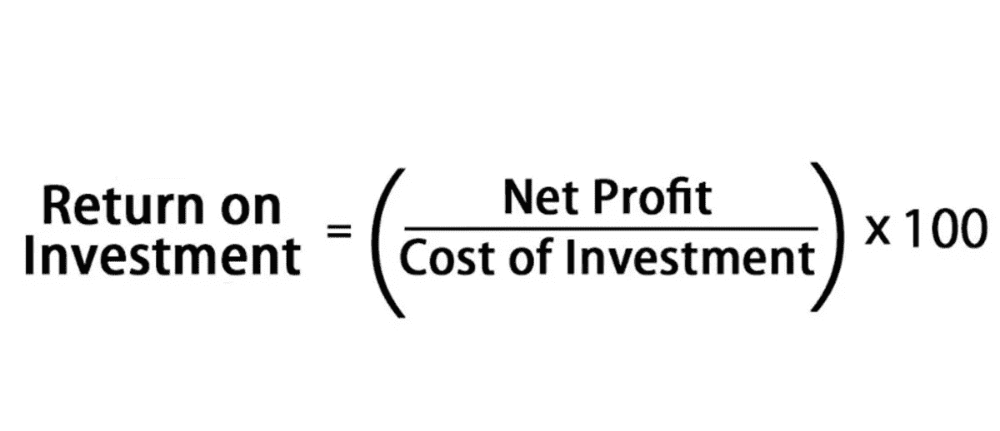
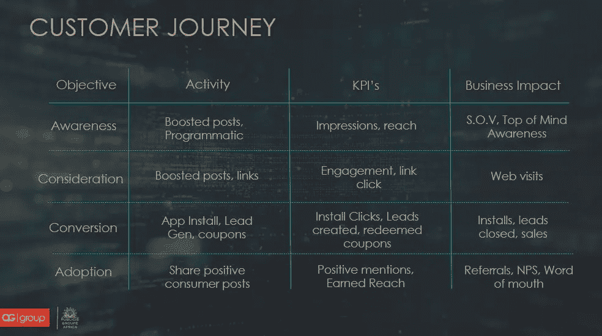

# 数字魅力带来收益

> 原文：<https://medium.datadriveninvestor.com/digital-charm-brings-benefits-347a289e926a?source=collection_archive---------10----------------------->

## 企业家期望营销结果在好年景和坏年景

不管是什么行业，成功的证明在于数字。关键绩效指标和投资回报——KPI 和 ROI——在神秘的字母汤里煨着。企业预计会有大量的啤酒供应，因此企业家可以衡量他们的企业健康状况。

其中一名厨师是热情且固执己见的[约翰·b·巴比鲁卡穆](https://twitter.com/babirukamu/)。他是著名的教师和领导者——数字营销[老师](https://en.wikipedia.org/wiki/Sensei)。他利用自己 15 年的经验，在 LinkedIn 和 Twitter 上发布社交媒体技巧。

在一次[非洲推特聊天](https://twitter.com/AfricaTweetChat)中，Babirukamu 描述了企业家——“那些给我们开支票的人”——在繁荣时期和萧条时期对数字营销人员的期望。

从一开始，老手和新手都必须知道关键绩效指标和投资回报是什么。然后理解这两个元素是如何协同工作的。

Babirukamu 说:“关键绩效指标仅仅是可衡量的值，用来显示宣传活动中 reach 等成分的有效性。”“投资回报率是关键的业务目标，它可能反映了最重要的意识或品牌认知度。

 [## 数据驱动始于数据素养|数据驱动的投资者

### 光是听到“数据”这个词就令人生畏。老实说，只有 21%的全球员工对自己的工作充满信心

www.datadriveninvestor.com](https://www.datadriveninvestor.com/2020/03/22/data-driven-starts-with-data-literacy/) 

他说:“投资回报率是你的企业主或经理感兴趣的东西——销售、品牌认知度、网站访问量、净推广者分数或口碑。“关键绩效指标是衡量投资回报率的方式，包括覆盖范围、印象、参与度、链接点击、情绪和其他因素。”

在许多方面，KPI 对营销人员很重要，而商业投资者则关注投资回报率。

Babirukamu 说:“数字投资回报率可以是整体营销投资回报率的一个子集。”“这取决于你如何分层。ROI 是业务目标和实现该目标的投资的产物。关键绩效指标只是衡量投资回报率。”

# **计划和预算**

在营销活动开始之前，应该考虑 KPI 和 ROI。

Babirukamu 说:“投资回报率是在提出广告活动时理想地确定的。“它必须始终伴随着你的竞选预算。一个没有投资回报的预算可能会被一个没有经验的经理削减或抛弃。此时还必须设置 KPI 以反映 ROI。

他说:“你的投资回报率和关键绩效指标会随着竞选期间环境的变化而变化，但一定要与你的经理或客户重新协商。”“KPI 是根据确定的目标设定的。首先是业务目标，然后是营销目标，最后是关键绩效指标。”

 [## 获得你的 2 美分价值:预算营销

### 以很少甚至没有成本的方式传播你的业务

blog.markgrowth.com](https://blog.markgrowth.com/get-your-2-cents-worth-marketing-on-a-budget-801786370414) 

当跟随或产生金钱时，所有这些混合在一起。

Babirukamu 说:“如果你不签支票，你需要投资回报率预测，让决策者给你一个预算和其他资源。”"没有清晰的投资回报是我们作为数字营销人员经常犯的错误."

对于非在线的产品或服务来说，证明投资回报率是一个额外的挑战。

“对于没有数字化的企业来说，这总是很艰难，”Babirukamu 说。“衡量投资回报率的简单方法是使用仅与数字渠道相关的优惠券，或者在接触点获取客户反馈。询问他们在哪里听说过你的公司，或者他们是如何看到一个产品的。

“后一种方法是一种清晰的顶级意识测量方法，”他说。“这本身就是一种投资回报形式。”

消费者的购买之旅和他们的 KPI 有几个步骤。

Babirukamu 说:“我总是使用下面的矩阵来帮助解释我的消费者之旅，从认知——当客户只是听说一种产品或服务时——到宣传，当他们乐意给你背书时。

“在活动的每个阶段，仔细衡量你的关键绩效指标对于显示每个阶段的投资回报率至关重要，”他说。“像这样的多层次营销活动不可能只有投资回报。每一步都很重要。”

# **从顶部回答**

各种指标的组合可以证明最重要的意识。

Babirukamu 说:“客户调查肯定会有所帮助。“人们倾向于从‘最先想到的’来回答。KPI 是公司中每个人的问题。甚至清洁工或司机都应该有。"

根据 Babirukamu 的说法，这张表显示了理想影响者活动的基本 KPI 和 ROI。他取消了采用，因为他认为这是品牌的唯一责任，而不是影响者的责任。

Babirukamu 说:“虽然这个表是一个活动的样本，但 KPI 总是可以改变的。“同样，客户调查可以很容易地告诉你，哪种渠道最能产生最重要的意识。

“我需要强调一下[顽童追踪舱标记](https://www.bluleadz.com/blog/what-are-utm-tags-and-how-to-use-them)，”他说。“这是你的分析能够向你展示社交媒体流量来源的唯一方式。这清楚地显示了每个影响者的贡献。”

Babirukamu 推荐了一个免费工具用于 UTM 标记。

 [## 投资回报全在数字里

### 有创造力的头脑聚集在一起以获取利润

medium.com](https://medium.com/datadriveninvestor/return-on-investment-is-all-in-the-numbers-cb252bd3cf24) 

关键绩效指标和预期投资回报率应根据营销活动的持续时间定期衡量。

Babirukamu 说:“理想情况下，人们应该在顾客旅程的每一步——意识、考虑和转化——之后进行衡量。定期评估，如每周、每月或每季度。

“虽然你的 KPI 和 ROI 可能会改变，但在改变目标之前，考虑调整你的行动，如广告支出，以及你发布的时间和次数，”他说。“那是核按钮。”

关键绩效指标和投资回报相结合，给出了一个公司成功和需要改进的地方的总体可衡量的画面。

Babirukamu 说:“有了这种理解，你就有了企业所有者和数字团队都同意的可衡量的目标。”“这清楚地显示了您的数字团队的表现及其对企业的价值。”

# **适合的分析**

营销活动中衡量 KPI 和 ROI 的工具取决于营销人员选择的具体衡量标准。基本分析包括来自谷歌、脸书和推特的分析。对于更复杂的 KPI，如情绪和赢得的影响力，社交倾听工具将会起作用。

Babirukamu 说:“我最喜欢的社交监听工具是 [Talkwalker](https://twitter.com/Talkwalker/) 和 [Brandwatch](https://twitter.com/Brandwatch/) 。“Brandwatch 的交易尤其划算。您可以将该工具用于短期活动，最多一周。

“一些聪明的测量方法是使用 UTM 电码，”他说。“他们在向你展示每个渠道、影响者、活动等网站的流量方面表现出色。我也爱[情敌智商](https://twitter.com/RivalIQ/)。”

 [## 创业公司和投资者寻求合适的契合点

### 企业家必须问自己是否做好了投资准备

medium.com](https://medium.com/datadriveninvestor/startups-and-investors-seek-the-right-fit-57671d9c07d6) 

第一次使用 KPI 和 ROI 的创业公司面临着特殊的挑战。

“任何创业公司的最大目标都是出名，”Babirukamu 说。“帖子的触及范围和广告的印象作为关键绩效指标是必不可少的。投资回报是最重要的意识和声音的分享。人们还记得你是谁吗？”

并非所有数据都具有同等的重要性。

Babirukamu 说:“最不重要的是推文或关注者的数量。”“许多营销人员太热衷于计算关注者。他们忘记了重要的关键绩效指标。”

当影响者签约进行社交媒体营销，最终目标是增加应用下载量时，某些 KPI 会优先考虑。

Babirukamu 说:“首先，给每个有影响力的人一个 UTM 标记的链接，让他们下载这个应用程序。”“然后根据 UTM 代码安装 measure app。请务必将您的谷歌 Play 商店与您的分析联系起来。一个简单的带有分析功能的重定向页面也可以为你的应用商店服务。”

尽管这些数字很诱人，但许多企业主同样不明白，追随者的数量并不是他们主要关心的问题。

“追随者的质量比数量更重要，”Babirukamu 说。"那是另一个单独的讨论."

缺乏现金的创业公司需要销售。在开始时创建的 KPI 可以帮助企业走上正确的道路，获得最重要的意识。

“人们不会买他们不知道的东西，”Babirukamu 说。“先自我介绍一下。然后卖掉。销售就像诱惑。魅力在“利益”之前"

**关于作者**

吉姆·卡扎曼是[拉戈金融服务公司](http://largofinancialservices.com/)的经理，曾在空军和联邦政府的公共事务部门工作。你可以在[推特](https://twitter.com/JKatzaman)、[脸书](https://www.facebook.com/jim.katzaman)和 [LinkedIn](https://www.linkedin.com/in/jim-katzaman-33641b21/) 上和他联系。