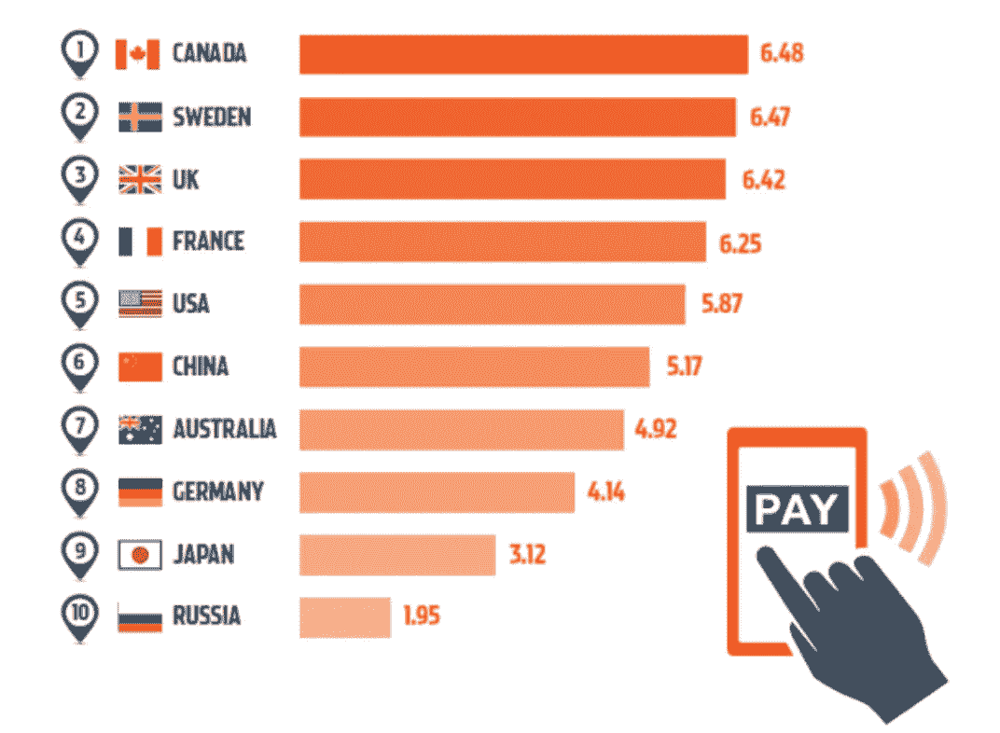
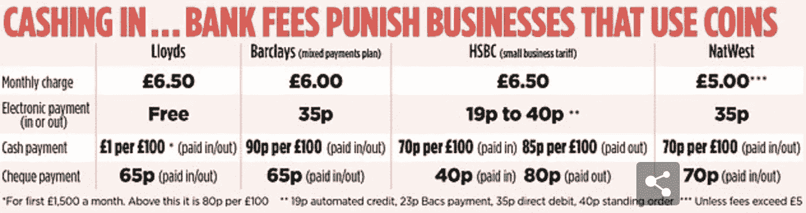

# 数字货币即将到来

> 原文：<https://medium.datadriveninvestor.com/digital-currencies-are-coming-ccd226c2deb8?source=collection_archive---------15----------------------->

瑞典的瑞典银行宣布，它正在与埃森哲合作，利用区块链技术创建一种数字货币，这可能会导致瑞典克朗被 e-Korona 取代。[瑞典银行](https://www.riksbank.se/en-gb/payments--cash/e-krona/)自 2017 年以来一直致力于这个项目[，据报道，目前的试点项目将持续到 2021 年，之后瑞典当局将决定是否正式进行。](https://www.riksbank.se/globalassets/media/rapporter/e-krona/2017/rapport_ekrona_uppdaterad_170920_eng.pdf)

**全球使用现金最少的国家**

来源:[WorldPay.com](https://www.worldpay.com/en-gb/insights-hub/article/cashless-society-learning-from-global-markets)

瑞典经济使用的现金比大多数国家都少，仅次于加拿大。在瑞典，使用现金的零售支付比例从 2010 年的 40%下降到 2018 年的 13%，该国约一半的零售商预测他们将在 2025 年前停止接受现金。随着越来越多的瑞典公民使用现金的替代品，如 Swish 和 iZettle，对现金的需求越来越少，导致瑞典只有不到一半的银行真正处理现金。

 [## 创新提醒:区块链 3.0、Terra 协议、ICO 门户和更多|数据驱动的投资者

### 尽管过去几个月加密货币的价格波动很小，但这项技术并没有停止发展…

www.datadriveninvestor.com](https://www.datadriveninvestor.com/2019/03/16/innovation-alert-blockchain-3-0-terra-protocol-an-ico-portal-more/) 

中央银行数字货币(CBDC)像电子科罗纳一样，有许多优点。处理、加工和运输成本更低。正如国际货币基金组织指出的那样，这不仅有助于降低国际支付的成本，而且 CBDC 将对低收入家庭和需要处理大量现金的小企业非常有利。

来源:周日邮报

事实上，英国银行估计 CBDC 会像减税一样潜在地提高经济的生产率。CBDC 还提供了更大的宏观经济稳定性，因为利率调整将具有不再局限于零利率的优势。

在发生经济冲击时，政府可以非常容易地将一定数量的数字货币直接放入每个公民的数字钱包，而且几乎不需要任何成本，而减税则需要时间，而且往往有利于富人。CBDC 的另一个优势是，它可以作为一种工具来帮助打击影子经济，即逃税、洗钱和其他非法和邪恶的活动，因为数字交易会产生“数字足迹”。

一切都不是一帆风顺的，为了被接受和广泛使用，CBDC 需要得到其公民的信任。一个典型的例子是厄瓜多尔，厄瓜多尔政府早在 2000 年就试图引入一种叫做[的数字货币。但是，到 2018 年](https://www.popularmechanics.com/culture/a29701931/100-dollar-bill-popularity/),由于厄瓜多尔人不再使用它(对政府不信任)并继续倾向于美元作为交易媒介，它被撤回。

在美国国家经济研究局的一份研究报告中，关于 CBDC 的结论是，“ *CBDCs 可以作为一种几乎没有成本的交易媒介、安全的价值储存手段和稳定的记账单位。然而，一个至关重要的问题是，各国央行是否应该尽快考虑采用这一方法。特别是，在监测私人支付的发展和 CBDC“早期采用者”的经验的同时，推迟这种考虑似乎是谨慎的，即使这种推迟涉及利益的放弃。尽管如此，决策者应该意识到采取相对被动和惯性方法的几个突出风险*。随着我们的社会变得越来越数字化和全球互联，随着国际贸易的不断扩大，有可能出现越来越多的压力，有 CBDCs。即使在美国，到目前为止，似乎一直不愿意数字美元，我们看到更多的辩论。有趣的是，在 2020 年 1 月的达沃斯论坛上，[商品期货交易委员会前主席 Christopher Giancarlo](https://www.cnbc.com/2020/01/23/davos-calls-for-a-us-digital-dollar-as-china-works-on-digital-yuan.html) 宣布成立一个组织来研究数字美元的机遇和挑战。

然而，最近 [MORI 和 OMFIF](https://www.ledgerinsights.com/digital-currency-survey-omfif-mori/) 进行了一项联合调查，使用 13，000 人的样本来给出消费者对 CBDCs 和其他数字货币的态度。调查发现，新兴市场和发达经济体之间的偏好存在显著差异，前者的公民对此很感兴趣，而后者的消费者则谨慎得多。因此，看起来，尽管有学术和经济上的争论，政府和监管机构需要在我们看到大规模采用之前赢得 populus 的支持