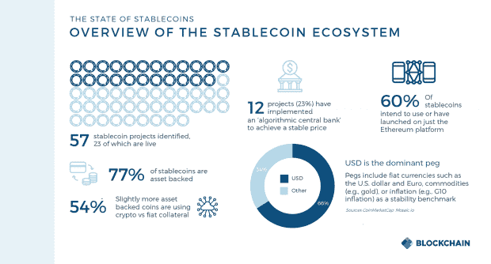
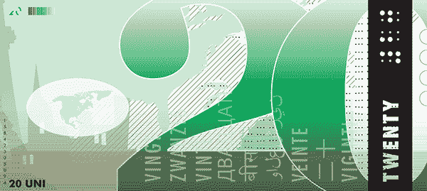
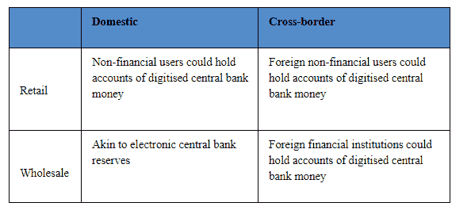
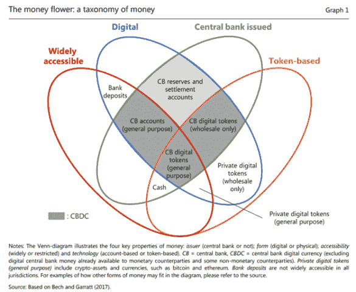

# 数字货币、区块链和货币的未来

> 原文：<https://medium.datadriveninvestor.com/digital-currencies-blockchain-and-the-future-of-money-2c3446a4df40?source=collection_archive---------15----------------------->

"[区块链](http://www.datadriveninvestor.com/glossary/blockchain/)、"加密货币"、"令牌化"，现在"央行数字货币"已经进入了技术炒作周期词汇，但所有这些术语之间有什么区别，它们对货币的未来意味着什么？为什么世界各地的监管者如此关注 Libra，为什么中国正在加速他们的[区块链](http://www.datadriveninvestor.com/glossary/blockchain/)计划，并如此渴望推出数字人民币？下面，我们将区分与数字货币相关的术语，并阐述政府和监管机构的全球目标，这可能在未来几年实现交易水平的完全透明(以及个人隐私风险)。

# 区块链

区块链是一个广泛用于使所有参与者能够就哪些交易在[分布式账本](http://www.datadriveninvestor.com/glossary/distributed-ledger/)技术(DLT)上达成一致的术语——这是一个在多个参与者之间自愿共享和同步的数据库，使用[密码术](https://en.wikipedia.org/wiki/Cryptography) [账本](http://www.datadriveninvestor.com/glossary/ledger/)(以达成“共识”)，并使它们无法被更改(以实现“不变性”)。DLT 不一定涉及像最初的[比特币](http://www.datadriveninvestor.com/glossary/bitcoin/)区块链那样使用数字信息块链的机制，但营销炒作导致这些术语被互换使用。

有公共区块链(如区块链)，其中分布式分类帐是“分散的”，因此任何人都可以访问并成为网络中的连接点(一个“[节点](http://www.datadriveninvestor.com/glossary/node/)”)，或者可以有私有(或“许可的”)区块链，其中只有某些方可以成为节点和/或具有访问权。许可区块链的一个例子是 [Hyperledger Fabric](https://www.hyperledger.org/projects/fabric) 。区块链提供公立和私立两种选择。

 [## 5 行业转型区块链应用

### 除非你一直生活在岩石下，否则我相信你现在已经听说过区块链了。而区块链…

www.datadriveninvestor.com](https://www.datadriveninvestor.com/2019/02/13/5-real-world-blockchain-applications/) 

# 加密货币

加密货币是一种数字资产，它使用 DLT 来管理货币单位的生成并验证资金转移，独立于中央银行运行。并且，鉴于这些加密货币不是法定货币(政府法令规定的法定货币)，它们在转换为法定货币或其他加密货币时的价值波动被认为会引起税收事件。在澳洲，这些交易的税收后果可以通过 [Ether](http://www.datadriveninvestor.com/glossary/ether/) (由区块链提供支持)使用 KPMG 加密税收估算器进行估算，这是一种流行的公开加密货币。这些加密货币经历了显著的[波动](https://coinmarketcap.com/currencies/bitcoin/historical-data/) [加密货币](http://www.datadriveninvestor.com/glossary/cryptocurrency/)兑换。

“稳定货币”是一种相对较新的整理加密货币，试图提供价格稳定。稳定货币可以与传统法定货币(如泰勒斯货币)、实物资产(如)或其他资产(包括)挂钩。stablecoins 的用例包括高效的跨境汇款，以及与其他加密货币[智能合约](http://www.datadriveninvestor.com/glossary/smart-contracts/)的可编程特性相关的功能。

Libra 是由脸书及其创始成员作为的一部分引入的，它被提议成为一个稳定的 Libra 协会，并由一篮子法定货币和短期政府证券提供支持。Libra 的宣布促使全球监管机构密切考虑加密货币的潜在风险和优势，特别关注有可能在全球范围内运营的稳定货币。

2019 年 10 月，它认识到他们有可能比现有的 [G7 更加高效和包容，发布了一份关于全球稳定账户](https://www.bis.org/cpmi/publ/d187.pdf) [支付](http://www.datadriveninvestor.com/glossary/payment/)方法的报告，特别是跨境支付。然而，七国集团也指出，此类提议引发了“重大的法律和监管风险，包括消费者/投资者保护、数据隐私、货币政策和金融稳定”。因此，它警告说，在所有风险和监管要求得到解决之前，不应允许启动私营部门全球稳定参与倡议。

# 中央银行数字货币

央行数字货币(CBDCs)不同于加密货币，它由国家发行，具有政府宣布的法定货币地位。因此，中央发展中国家可以与商业银行存款竞争，挑战当前部分准备金银行体系的现状。它可以作为批发 CBDC(由央行向商业银行和潜在的其他金融机构发行，用于银行间支付和证券交易)或零售 CBDC(公众可以拥有的央行货币和负债的第一种数字化形式)来实施。它可以由国内或跨境用户和金融机构持有。

CBDC 也可以使用 DLT 或混合方法来实施。还有一个区别是

国际清算银行(BIS)关于 CDBCs 的[报告中规定的](https://www.bis.org/cpmi/publ/d174.pdf)[基于令牌](http://www.datadriveninvestor.com/glossary/token/)与基于账户的货币，如下图所示:

中央银行能够使用 CDBC 或澳大利亚等先进金融系统中的现有机制来追踪支付，从而能够更好地控制反洗钱和反恐融资( [AML](http://www.datadriveninvestor.com/glossary/anti-money-laundering/) /CFT)。因此，它也使[避税和逃税更加困难](https://www.brookings.edu/blog/techtank/2019/12/13/the-current-landscape-of-central-bank-digital-currencies/)，因为它减少了离岸银行和未报告的就业等方法，以向中央银行或政府隐瞒金融活动。这有可能解决黑市经济，实现更快、更有效的汇款，并改善所有权的交换，如财产转让。然而，在出现违约的情况下，它也可能将责任从零售银行等现有中介机构转移到央行。

***CBD cs 的全球发展***

加拿大银行、英格兰银行、日本银行、欧洲中央银行、瑞典中央银行和瑞士国家银行，以及国际清算银行(国际清算银行)最近成立了一个小组，在评估本国管辖范围内的潜在 CBD 案例时分享经验。该小组将评估 CBDC 用例；经济、功能和技术设计选择，包括跨境互操作性；以及分享关于新兴技术的知识。它将与相关机构和论坛密切协调，特别是[金融稳定委员会](https://www.fsb.org/)和[支付和市场基础设施委员会](https://www.bis.org/cpmi/about/overview.htm) (CPMI)。

[中国的数字货币/电子支付(DC/电子支付)](https://www.reuters.com/article/us-china-markets-digital-currency/chinas-proposed-digital-currency-more-about-policing-than-progress-idUSKBN1XB3QP)有可能在今年推出，它提议对其双层货币使用分布式账本技术，其中第一部分涉及商业银行将其部分央行存款转换为 CBDC，然后银行将这种 CBDC 分发给消费者。该流程旨在反映实物现金的分配方式。自 2014 年以来，中国一直致力于 CDBC，以补充旨在通过提供大量贷款来促进中外贸易的[一带&道路倡议](http://english.www.gov.cn/beltAndRoad/)。中国的 CBDC 可能是挑战美元主导地位的一种方式。[Swift 2019 年 6 月的报告](https://www.swift.com/news-events/news/rise-of-the-chinese-influence-strengthens-rmb-demand)发现，非洲使用人民币的支付在 3 年内增长了 123%，而所有货币的增幅为 28%。

随着前美国商品期货交易委员会主席克里斯·吉安卡洛(Chris Giancarlo)也就是“加密老爹”加入数字商会，美国金融[在中国的加速发展也受到了 Libra](https://asia.nikkei.com/Business/Markets/Currencies/Digital-yuan-nears-launch-as-China-sweats-over-Libra) 的影响，这反过来又加速了[美国美联储对 CBDC](https://cointelegraph.com/news/us-federal-reserve-exploring-digital-dollar-and-its-effect-on-monetary-system) [的评估，呼吁建立美国 CDBC](https://www.coindesk.com/when-will-we-see-the-digital-dollar-the-former-cftc-chairman-speaks-out) [交易所](http://www.datadriveninvestor.com/glossary/exchange/)和。

***澳洲 CBDC 现状***

*   **支付的速度、成本和稳健性**。完全集成到区块链平台的 CBDC 可以实现参与者之间的实时全天候支付，而无需依赖外部支付系统。
*   **原子事务**。集成在区块链平台中的 CBDC 可以更容易地允许“原子”交易。原子事务是“要么全部执行，要么什么都不执行”，这意味着要么执行事务的所有部分，要么根本不执行。当应用于货银两讫时，这可以降低结算风险，因为付款和相应的资产可以同时交换。
*   **可编程货币**。CBDC 与区块链上的智能合约相结合，可能会创造出新型的“可编程货币”。这指的是对如何花费或转移资金附加条件的能力，这可以自动执行，而不需要可信的第三方。

该银行目前没有考虑将 CBDC 用于零售，但指出基于 DLT 的批发结算令牌的可用性可以使支付和结算流程与其他业务流程更加集成。尚不清楚是否会有对 CBDC 进行大规模结算的需求。澳大利亚央行表示，其创新实验室开发了“一个运行在许可的[以太坊](http://www.datadriveninvestor.com/glossary/ethereum/)网络上的批发结算系统的概念验证”。概念验证模拟了在[交易所](http://www.datadriveninvestor.com/glossary/exchange/)向商业银行发行中央银行支持的代币，以获得交易所结算账户余额，这些代币在商业银行之间进行交换，并最终在中央银行兑现”。澳大利亚央行“打算在未来一年扩大这项研究，可能通过与一个或多个外部伙伴的合作”。

还存在“NPP 的未来增强”的可能性，以促进具有支付的文档的交付，并支持具有专门为电子发票、超流支付、向税务和统计机构报告等定制的数据元素的支付消息。这些功能在未来几年内应该都是可行的，业界已经在研究其中的一些创新。向更丰富的数据支付的转变将为金融科技公司和其他公司创造机会，开发创新服务，利用这些数据提高便利性、效率并降低支付系统的风险”。

一个悬而未决的问题是，包括我们的重要贸易伙伴中国和美国在内的世界各国央行最近加速推进的举措，是否会产生对澳大利亚 CBDC 的需求，这可能是由与其他 CBD 发展中国家的跨境互操作性决定的，正如国际清算银行和其他六家央行的工作组所看到的那样。

# 令牌化和货币的未来

令牌化是使用 DLT 将有形(和无形)资产转换为数字令牌的过程，从而创建“数字孪生”。这可能包括房地产、艺术品、股票、钻石和其他商品和服务。

有机会对包含在现有的[全球贸易商品编号(GTIN)](https://www.gs1.org/standards/id-keys/gtin) 系统中的商品进行标记，这些商品可以在产品条形码上找到，并由标准化。这是来源平台目前采用的方法，如[毕马威来源](https://home.kpmg/au/en/home/services/blockchain-services/blockchain-platform.html)——一个总部位于区块链的 track &追踪平台，使全球贸易参与者能够共享信息，更快地进行交易，并更好地防范欺诈和不当行为。它允许生产商沿着供应链追踪每个产品，确保其真实性，以及可能影响质量的运输和储存条件。对于大米和葡萄酒等行业，它使组织能够讲述他们产品的故事，包括成分、原产地和认证。认证由相关认证机构记录和独立验证。

然而，与区块链在中国贸易融资和供应链领域的举措相比，这就相形见绌了。[中国建设银行的平台](https://www.ledgerinsights.com/china-construction-bank-trade-finance-blockchain/)已经处理了超过 500 亿美元的交易。其中一个国际网络 Voltron 最近试行了一项涉及汇丰银行的跨境人民币交易。使用 CBDC 进行链上交易结算可能是所有参与者的最佳方案。

**收尾思路**

如果 CBDC 与我们的全球贸易伙伴一起实施，它将实现交易处理(包括支付、兑换和结算)的自动化，精简、自动化和改善所有金融服务的覆盖面。它可以揭示目前不属于金融中介机构报告要求的数字交易。例如，外国学生和游客可以通过扫描澳大利亚供应商的二维码来使用，从而避免了澳大利亚的金融中介。然而，在一个无处不在的智能货币与人工智能和无处不在的 T2 物联网传感器融合的世界里，我们所有的活动不仅会受制于企业的算法，还会受制于政府，如果这些隐私风险得不到解决，就会产生一个老大哥场景。

Peter 是关于超人类主义和新兴技术的主题演讲人和作家。他是 Transhumanism Australia 的共同创始人，这是一个技术专家社区，致力于利用科学和技术帮助社会超越人类生物学的限制。他还为全球最大的咨询公司之一毕马威(KPMG)的技术和增长计划工作，帮助组织在这个前所未有的加速变革和破坏的时代导航和蓬勃发展。彼得是澳大利亚奇点大学的一员，也是顾问委员会成员。他还是澳大利亚科学党(Science Party Australia)的执行委员，该党致力于在政策制定中坚持科学方法

【http://www.datadriveninvestor.com】原载于 2020 年 2 月 18 日**。**