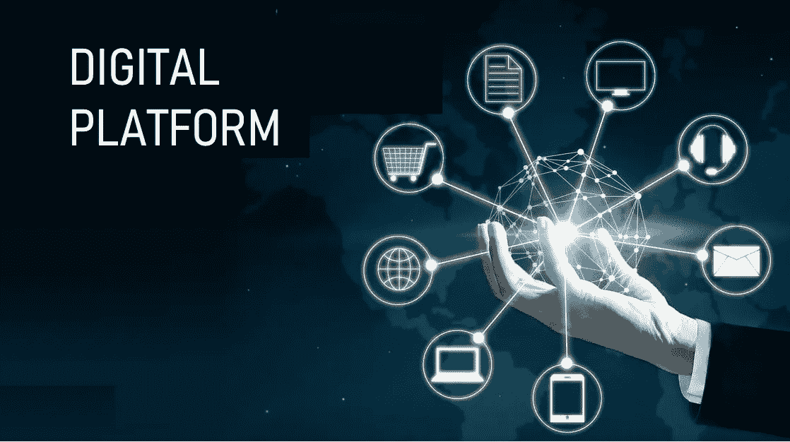

# 数字经济——由数字平台驱动

> 原文：<https://medium.datadriveninvestor.com/digital-economy-driven-by-digital-platforms-63ed2af5c679?source=collection_archive---------9----------------------->

底漆 III

# 数字平台

技术革新了现代企业的市场策略。在过去，财富 500 强公司平均需要 20 年才能达到 10 亿美元的估值。根据一项新的调查，今天的数字初创企业将在大约 4 年内成为独角兽。新的数字平台是这一变化的主要原因。一些流行的数字平台有:

*   谷歌——内容和广告
*   苹果——娱乐和软件
*   脸书—社交和分销
*   亚马逊—商务和履行

大公司看到了 GAFA(谷歌、亚马逊、脸书、苹果)和其他独角兽、本土数字巨头的惊人增长，他们多年来在没有政府资助的情况下，在技术基础上建立了自己的商业模式。

基于 GAFA 的成功，许多新进入者已经认识到这种模式的前景，并开始建立自己的数字平台。其中一些如网飞、Zoom、Twitter、whatsapp。已经成为新的商业独角兽，并进一步推动数字市场的增长。

在总结什么是数字平台之前，先举几个例子:

1.  搜索引擎谷歌:广告的商业模式。
2.  社交媒体:脸书、推特、Instagram、LinkedIn——“广告”的企业模式
3.  EdX、Coursera 等知识平台“随时随地教育”的商业模式。
4.  应用商店:苹果/谷歌 Play——商业模式“数字商品”
5.  市场:亚马逊、FlipKart、Ebay、阿里巴巴购物引擎:行业概念“电子商务”
6.  媒体平台:Spotify、网飞、Tiktok、商业模式”订阅。
7.  联盟平台:Commission Junction，Amazon Associates——商业模式“边做边赚”

还有其他几个网络概念，有些太复杂，有些太简单和容易。然而，数字平台的主要特征如下:

1.  这是一个技术驱动的市场概念。
2.  它促进了不同群体之间的相互作用，这些群体并不相互了解，例如终端消费者和制造商。
3.  这种福利相当于所针对的人口规模。创建独特的文化，为数字平台创造价值主张。
4.  它是信任的促成因素:它必须通过具体的一般条款和条件在知识产权和数据权利方面创造信任。
5.  它具有透明的连接性:它与来自第三方的开发者交换数据，以构建新的应用程序并拓宽生态系统。这是通过 API 实现的，API 是 API 经济的一部分。
6.  它可以大规模扩展以满足数百万消费者的需求，而不会降低性能参数。

# 数字平台的优势

1.产生收入

2.压缩开支

3.培育与新产品和服务的协作和创新

4.加快向目标市场交付商品的速度。

根据埃森哲的调查，这些平台的市场累计估值约为 4.3 万亿美元。它们雇用了大约 130 万名直接工人，另外 100 万名通过附属公司或补充网络间接雇用。

## 结论

数字平台的出现有力地推动了数字经济的发展，其中大部分是在过去十年左右出现的。许多其他推动共享经济的平台，如 AirBnB、优步、Ola、Oyo，也正在崛起，占据着突出的空间。

— — — —

*图片来源:谷歌图片*