# 数字欧洲:€2000 亿人工智能、数据和区块链投资策略

> 原文：<https://medium.datadriveninvestor.com/digital-europe-200-billion-investment-strategies-for-artificial-intelligence-data-and-blockchain-f7f656e66603?source=collection_archive---------2----------------------->

## 欧盟 2020-2030 十年间的数字化转型计划。

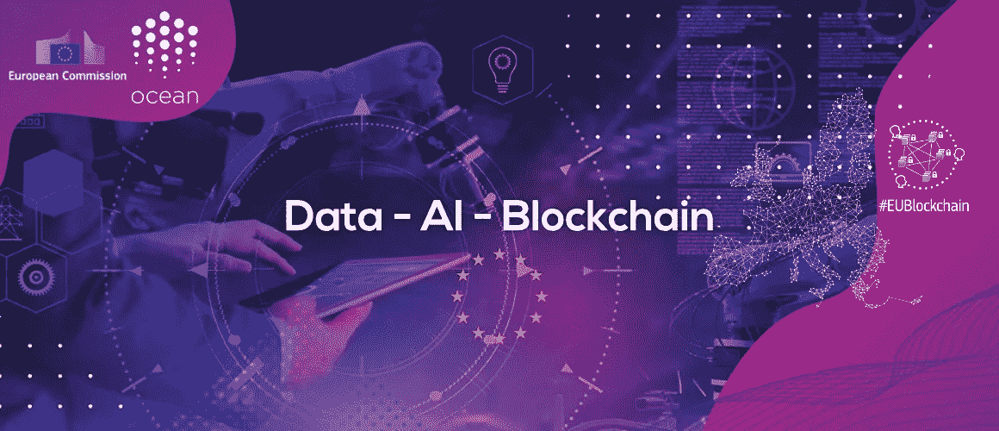

*   欧盟计划在未来 10 年吸引€2000 亿英镑的人工智能投资
*   新的数据战略和人工智能在多个行业的使用，以帮助研究人员、企业和公民
*   数字身份证和服务的区块链实现
*   基于欧洲安全和隐私价值观的数字化转型
*   加密货币/区块链项目合作——海洋协议

数字技术正在改变人们的生活。欧盟的数字战略旨在让这一转变为人民和企业服务，同时帮助实现到 2050 年欧洲气候中立的目标。

 [## 区块链降低商品交易的风险和成本|数据驱动的投资者

### 我们将讨论 DLTs 在商品领域的当前实现，包括贸易和供应链管理…

www.datadriveninvestor.com](https://www.datadriveninvestor.com/2020/06/17/blockchain-reduces-risk-and-costs-in-trading-commodities/) 

欧盟的人工智能(AI)和数据战略旨在鼓励企业使用和开发新技术，同时确保它们赢得公民的信任。数字技术极大地改善了我们的生活，从更好地获取知识和内容，到我们如何做生意、交流或购买商品和服务。欧盟将确保数字化转型造福所有人，而不仅仅是少数人。

企业将从一个框架中受益，该框架允许它们启动、扩大规模、汇集数据、创新，并在公平的条件下与大公司竞争。社会将受益于社会和环境的可持续性，以及尊重隐私、尊严、完整性和其他权利的完全透明的安全数字环境。

该委员会将专注于三个关键目标，以促进技术解决方案，帮助欧洲追求自己的数字化转型之路，为人民的利益服务，反映欧洲的最佳表现:开放、公平、多元化、民主和自信。

在未来五年中，委员会将侧重于三个关键目标:

为人们服务的技术；

公平竞争的经济；和

一个开放、民主和可持续发展的社会。

欧洲将在其悠久的技术、研究、创新和独创性历史的基础上，并在其对权利和基本价值观的强有力保护的基础上继续发展。新政策和框架将使欧洲能够部署尖端数字技术并加强其网络安全能力。与私营和公共部门合作，旨在动员整个价值链的资源，并建立正确的激励机制来加速人工智能的部署，包括中小型企业。支持可信人工智能和数据经济的发展。

# 背景

自 2014 年以来，欧盟委采取了若干步骤来促进数据敏捷经济的发展，例如:

*   [非个人数据自由流动的规定](https://ec.europa.eu/digital-single-market/en/free-flow-non-personal-data)
*   [网络安全法](https://ec.europa.eu/digital-single-market/en/eu-cybersecurity-act)
*   [开放数据指令](https://ec.europa.eu/digital-single-market/en/european-legislation-reuse-public-sector-information)
*   [通用数据保护条例](https://ec.europa.eu/info/law/law-topic/data-protection/data-protection-eu_en)

2018 年，委员会首次提出了一份 [AI 战略](https://ec.europa.eu/digital-single-market/en/news/commission-presents-plan-make-most-artificial-intelligence)，并与成员国商定了一份[协调计划](https://ec.europa.eu/commission/presscorner/detail/en/IP_18_6689)。人工智能高级专家组于 2019 年 4 月提交了他们关于可信人工智能的[道德准则](https://ec.europa.eu/digital-single-market/en/news/ethics-guidelines-trustworthy-ai)。

在她的政治指导方针中，欧盟委员会主席乌尔苏拉·冯·德·莱恩强调了引领向健康的地球和新的数字世界过渡的必要性。在这种背景下，她在上任的头 100 天里发起了关于道德人工智能和利用大数据为社会和企业创造财富的辩论。

欧盟将公布其拟议的人工智能(AI)法规。这是挑战美国和中国在该领域主导地位的计划的一部分。这包括投入数十亿美元的公共和私人基金来推进人工智能背后的科学。该投资的一部分将集中于从欧盟以外的其他地区——特别是美国——带回数据存储。它关注的主要问题之一是数据隐私。随着智能家居系统和面部识别等技术变得越来越普遍，欧盟委员会尤其担忧。

**近日，欧盟也** [**宣布**](https://www.crypto-world.gr/news/eu-artificial-intelligence-and-blockchain-investment-100-million-euros/) **将向 AI 和区块链的创业公司投资 1 亿+欧元。**

# 人工智能

关于人工智能的[白皮书](https://ec.europa.eu/info/files/white-paper-artificial-intelligence-european-approach-excellence-and-trust_en)阐述了委员会在确保尊重基本权利的同时促进人工智能在欧洲发展的建议。人工智能发展很快，这就是为什么欧洲需要保持和增加投资水平。与此同时，人工智能带来了许多需要解决的潜在风险。白皮书列出了最大限度地发挥人工智能优势和应对其挑战的选项。它提出了在充分尊重欧盟公民的价值观和权利的情况下，使人工智能在欧洲得到可信和安全发展的政策选择。

委员会支持以监管和投资为导向的方法，其双重目标是促进人工智能的吸收和解决与这种新技术的某些用途相关的风险。欧盟可以开发一个有益于人民、企业和政府的人工智能系统，并成为安全人工智能的全球领导者。

简单来说，AI 是结合了数据、算法和计算能力的技术集合。因此，计算的进步和数据可用性的增加是当前人工智能热潮的关键驱动因素。欧洲可以将其技术和工业优势与高质量的数字基础设施和基于其基本价值观的监管框架相结合，成为欧洲数据战略中规定的数据经济及其应用创新的全球领导者。

数据和人工智能(AI)可以帮助找到许多社会问题的解决方案，从健康到农业，从安全到制造。一些好处可以是:

1.  对公民而言:更好的医疗保健、更安全、更清洁的交通以及更好的公共服务；
2.  对企业而言:创新产品和服务，例如能源、安全、医疗保健；更高的生产率和更有效的制造；
3.  对政府而言:更便宜和更可持续的服务，如运输、能源和废物管理；

只有以赢得人们信任的方式开发和使用技术，才能实现这一目标。因此，基于基本价值观的欧盟战略框架将让公民有信心接受基于人工智能的解决方案，同时鼓励企业开发它们。其中一些目标是:

*   在人工智能和机器人领域建立新的公私合作伙伴关系
*   加强和连接人工智能研究卓越中心
*   每个成员国至少有一个专门从事人工智能的数字创新中心
*   在欧洲投资基金的帮助下，为人工智能的开发和使用提供更多的股权融资
*   使用人工智能提高公共采购流程的效率
*   支持公共机构采购人工智能系统

AI 是关于大数据的。数据越多，算法越智能。目标是在未来十年内，每年吸引超过 200 亿欧元的人工智能总投资到欧盟。

对研究人员和企业来说，访问数据非常重要。全球产生的数据量，当你从现在开始展望 5 年后，这个数据量将仅由欧洲产生。

欧洲在数据质量上有优势。它拥有广泛的经济多样性和中小型企业，在欧洲每天收集的数据多种多样，来自商业、数据、机器、汽车、气象站等行业。

# 欧洲数据战略

在一个个人将产生不断增长的数据量的社会中，收集和使用数据的方式**必须按照欧洲的价值观、基本权利和规则，将个人利益放在第一位**。只有当公民确信欧盟的任何个人数据共享都将完全符合欧盟严格的数据保护规则时，他们才会信任和接受数据驱动的创新。

与此同时，欧洲越来越多的非个人工业数据和公共数据，加上数据存储和处理方式的技术变革，将构成增长和创新的潜在源泉，应该加以利用。

> 这个数字欧洲应该反映出欧洲最好的一面——开放、公平、多元、民主和自信。

存储和处理数据的方式将在未来 5 年内发生巨大变化。如今，80%的数据处理和分析发生在数据中心和集中式计算设施中，20%发生在智能互联对象中，如汽车、家电或制造机器人，以及靠近用户的计算设施中(“边缘计算”)。到 2025 年，这些比例可能会逆转。除了这一发展带来的经济和可持续性优势之外，它还为企业提供了更多的机会，为数据生产者开发工具，以加强对自己数据的控制。

数据的可用性对于快速培训人工智能系统、产品和服务至关重要。目前， ***少数大型科技公司掌握着全球大部分数据。*** 这可能会降低数据驱动型企业在当今欧盟出现、发展和创新的动力，但未来仍有大量机会。未来很大一部分数据将来自工业和专业应用，公共利益领域或日常生活中的物联网应用，这些领域是欧盟的强项。

中国和美国等竞争对手已经在快速创新，并在全球推广他们的数据访问和使用概念。在美国，数据空间的组织工作留给了私人部门，存在相当大的集中效应。中国既有政府监控，也有大型科技公司对海量数据的强有力控制，但对个人没有足够的保护。

自 2014 年以来，欧盟委已经采取了多项措施。凭借《通用数据保护条例》( GDPR ),欧盟为数字信任创建了一个坚实的框架。促进数据经济发展的其他举措包括关于非个人数据自由流动的法规(FFD)、《网络安全法》和《开放数据指令》。

2020 年欧洲数据战略:

> “新的去中心化数字技术，如区块链，为个人和公司在个人自由选择和自决的基础上管理数据流和使用提供了进一步的可能性。这种技术将使个人和公司的实时动态数据可移植性成为可能，同时还有各种补偿模式”。

欧洲数据战略的目标是确保欧盟成为数据赋能社会的榜样和领导者。为此，它旨在建立一个真正的欧洲数据空间，一个单一的数据市场，以释放未使用的数据，使其在欧盟内部和跨部门自由流动，以利于企业、研究人员和公共行政部门。

公民、企业和组织应该有权根据从非个人数据中收集的信息做出更好的决策。这些数据应该对所有人开放，无论是公共的还是私人的，初创企业还是大型企业。

数据是数字化转型的核心。它塑造了我们生产、消费和生活的方式。对不断增长的数据量的访问和使用能力对于创新和增长至关重要。数据驱动的创新可以给公民带来重大而具体的好处——例如，通过个性化医疗或改善流动性——也可以给欧洲经济带来好处，从实现更好的决策到提升公共服务。如果你想了解更多，你可以阅读白皮书[这里](https://ec.europa.eu/info/sites/info/files/communication-european-strategy-data-19feb2020_en.pdf)。

# 单一数据市场

欧盟将创建一个单一的数据市场，其中:

*   为了所有人的利益，数据可以在欧盟内部和跨部门流动。
*   欧洲规则，特别是隐私和数据保护，以及竞争法，得到了充分的尊重。
*   获取和使用数据的规则是公平、实用和清晰的。

## 工业和商业数据使用示例:

*   装有数千个传感器的喷气发动机收集并传回数据，以确保高效运行，
*   风力发电场使用工业数据来减少视觉影响和优化风力发电。
*   实时交通回避导航可节省多达 7.3 亿小时。这相当于€高达 200 亿英镑的劳动力成本。
*   列车晚点的实时通知可以节省 2700 万个工作小时。这相当于€7 . 4 亿英镑的劳动力成本。

# 视频:Jennifer Zhu Scott——为什么你应该为你的数据付费

通过以下方式，欧盟将成为一个有吸引力、安全且充满活力的数据经济体

*   就数据的获取和再利用制定明确和公平的规则；
*   投资于存储和处理数据的下一代标准、工具和基础设施；
*   欧洲云能力的联合力量；
*   将欧洲关键部门的数据汇集在一起，在 EU-建立通用和可互操作的数据空间；
*   为用户提供权利、工具和技能，以保持对其数据的完全控制；

**数据战略:**[战略](https://ec.europa.eu/info/files/communication-european-strategy-data_en)的目标是创建一个真正的单一数据市场，在这个市场中，个人和非个人数据(包括机密和敏感数据)都是安全的，企业和公共部门可以轻松访问大量高质量的数据来进行创造和创新。一个**欧洲数据空间**释放未使用的数据，允许其在欧盟内部和跨部门自由流动。凭借《通用数据保护条例》(GDPR)，欧盟通过确保个人保持对其数据的完全控制，为以人为中心的数据经济奠定了坚实的基础。

部门内和部门间的数据互操作性；在遵守数据保护立法的情况下，促进为科学研究目的(包括人工智能)访问和重新使用敏感数据，如健康或社会数据；帮助人们为了公共利益提供他们的数据，以便研究人员为了社会的利益进行创新。

该委员会设想提出一项“数据法案”,研究不同类型的数据共享方案和增强个人权能的方式，以便他们更多地参与数据经济。它还将在今年晚些时候提出进一步的措施，如数字服务法案，为所有企业进入单一市场制定明确的规则，以加强在线平台的责任，并保护基本权利。它的一些行动将是:

1.  在企业之间、企业与政府之间以及政府内部建立关于数据治理、访问和重用的正确监管框架。这需要为数据共享创造激励。
2.  该委员会旨在支持技术系统和下一代基础设施的发展，这将使欧盟和所有参与者能够抓住数据经济的机遇。它将有助于对欧洲数据空间和值得信赖的高能效云基础设施的欧洲高影响力项目进行投资。
3.  最后，它将启动具体的部门行动，在工业制造、绿色交易、移动或健康等领域建立欧洲数据空间。

*(Source:* [*https://ec.europa.eu*](https://ec.europa.eu/)*)*

# 数据空间

## 1.欧洲通用工业(制造业)数据空间

欧洲拥有强大的工业基础，尤其是在制造业领域，数据的生成和使用可以对欧洲工业的绩效和竞争力产生重大影响。

2018 年的一项研究估计，到 2027 年，€制造业使用非个人数据的潜在价值为 1.5 万亿。

## 2.欧洲共同绿色交易数据空间

欧洲的绿色协议为欧洲设定了雄心勃勃的目标，到 2050 年成为世界上第一个气候中立的大陆。委员会的信函明确强调了数据对于实现这一目标的重要性。欧洲绿色数据空间可以利用数据的主要潜力，支持绿色交易在气候变化、循环经济、零污染、生物多样性、森林砍伐和合规保证方面的优先行动。

## 3.欧洲通用移动数据空间

交通和移动性是数据共享辩论的前沿，欧盟在这一领域拥有许多优势。这涉及到汽车行业，联网汽车严重依赖于数据和其他交通模式。

所有运输方式和物流中的数字化和数据将是“欧洲运输系统”未来工作的重要组成部分。这将包括所有运输部门的行动以及跨模式数据共享物流和乘客生态系统的行动。数字化和数据在支持交通可持续性方面发挥着越来越大的作用。

还将为卫生、金融、能源、农业等行业建立数据空间。

## 欧洲开放科学云

除了创建九个欧洲共同数据空间之外，将继续开展欧洲开放科学云的工作，通过可信和开放的分布式数据环境和相关服务，为欧洲研究人员、创新者、公司和公民提供无缝访问和可靠的研究数据再利用。

因此，欧洲开放科学云是科学、研究和创新数据空间的基础，该空间将汇集研究和部署方案产生的数据，并将与部门数据空间连接和充分衔接。

# 2025 年预测数字

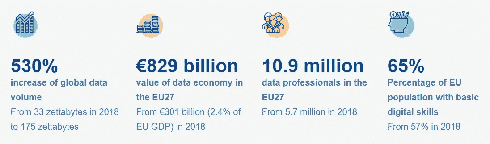

(Source: [https://ec.europa.eu](https://ec.europa.eu/))

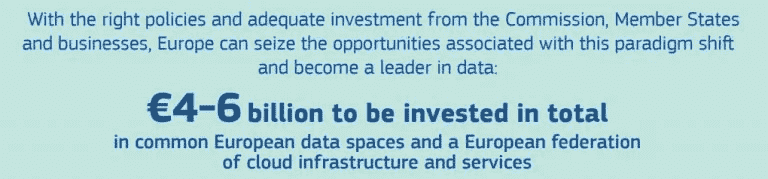

(Source: [https://ec.europa.eu](https://ec.europa.eu/))

# 面部识别

**什么是面部识别？**

面部识别可以采取不同的形式。它可以用于用户身份验证，即解锁智能手机，或在边境口岸进行验证/身份验证，以根据个人的旅行证件检查其身份(一对一匹配)。面部识别也可以用于远程生物识别，其中一个人的图像与数据库进行核对(一对多匹配)。这是最具侵入性的面部识别形式，原则上在欧盟是被禁止的。

**欧盟会对远程身份识别的面部识别进行监管吗？**

为远程识别目的收集和使用生物特征数据会给基本权利带来特定风险。欧盟数据保护规则原则上已经禁止为唯一识别自然人的目的处理生物特征数据，除非在特定条件下。

具体而言，远程生物特征识别只能出于实质性公共利益的原因而进行。它必须以欧盟或国家法律为基础，使用必须正当、适度并受到充分的保护。因此，允许面部识别目前是个例外。在《大赦国际白皮书》中，欧盟委员会希望发起一场广泛的辩论，讨论未来哪些情况可能证明例外是合理的(如果有的话)。

虽然今天，使用面部识别进行远程生物识别通常是被禁止的，并且只能在例外的、正当合理的和相称的情况下使用，但必须遵守保障措施并基于欧盟或国家法律，欧盟委员会希望就哪些情况(如果有的话)可能证明此类例外是合理的展开广泛的辩论。它希望确保数据集不偏不倚，并要求高风险的人工智能系统透明、可追踪并处于人类控制之下。

# Margrethe Vestager 和 Thierry Breton 关于委员会新战略的新闻发布会:塑造欧洲的数字未来

# 区块链

**欧盟委员会对区块链技术公司和 DLT 公司采取整体策略，旨在将欧洲置于区块链创新和吸收的前沿**。在这种快速发展的背景下，欧盟依靠以下主要倡议来实现全球包容性治理，加强在部署基于区块链/DLT 的应用程序方面的合作和投资，支持国际标准制定，并促进行业利益相关方和监管机构之间的对话，特别是建立在欧盟法律基础上的监管框架。

2020 年， [EBSI](https://ec.europa.eu/cefdigital/wiki/display/CEFDIGITAL/ebsi) 将在欧洲部署分布式区块链节点网络，支持专注于特定用例的应用。

2019 年 12 月，欧盟委员会开始进行公开市场咨询，为欧洲区块链预商业采购做准备，为欧洲区块链服务基础设施的未来发展寻找新颖、改进的区块链解决方案。

> “未来，所有公共服务都将使用区块链技术。区块链是欧洲和成员国重新思考其信息系统、促进用户信任和保护个人数据、帮助创造新的商业机会和建立新的领导领域的绝佳机会，使公民、公共服务和公司受益。
> 
> 数字伙伴关系使成员国能够与欧盟委员会合作，将区块链技术的巨大潜力转化为更好的公民服务。”— *数字经济与社会专员玛利亚·加布里埃尔*

# 公私伙伴关系

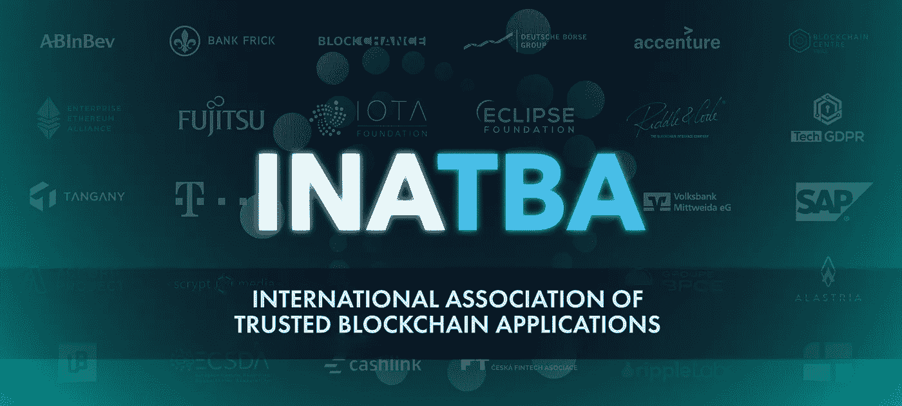

公私合作对进步和确保吸收至关重要。可信区块链应用国际协会(International Association for Trusted block chain Applications，简称)于 2019 年 4 月 3 日正式成立，是一家总部位于布鲁塞尔的多利益主体组织。它将分布式分类帐技术的供应商和用户与来自世界各地的政府组织和标准制定机构的代表聚集在一起。

法律确定性是企业在单一市场经营的成功因素。一项[“区块链研究:法律、治理和互操作性方面”](https://ec.europa.eu/digital-single-market/en/news/study-blockchains-legal-governance-and-interoperability-aspects)已经启动，以检查法律和监管方面以及区块链启发的技术的社会经济影响。

欧洲委员会目前认为，与区块链有关的两个领域可以受益于法律确定性的提高:

*   智能合同:欧盟委员会将研究当前的法律框架是否足够清晰，以确保智能合同的可执行性，并澄清法律纠纷情况下的管辖权。
*   代币化:当代币不被视为金融工具时，欧盟委员会将研究当前的法律框架是否适合发行和交易代币(即:加密资产)。

INATBA 的部分成员有:Algorand、Ambrosus、Cardano、Consensys、Crypto Valley、Enterprise Ethereum Alliance (EEA)、IOTA、Ledger、Lisk、LTO、Maker、Ontology、Ripple、R3 Corda、Quant、Unibright、Vechain 等。还有 IBM，富士通，欧莱雅，西门子& Swift。

# 欧洲区块链服务基础设施(EBSI)

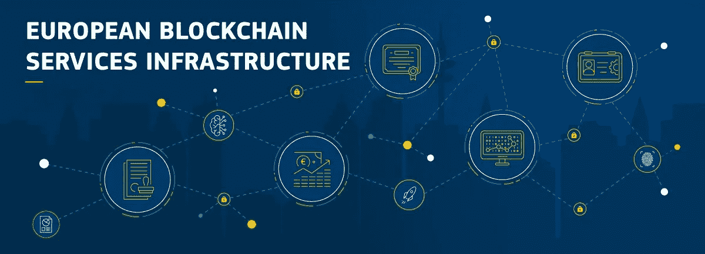

欧洲区块链服务基础设施( [EBSI](https://ec.europa.eu/cefdigital/wiki/display/CEFDIGITAL/ebsi) )是欧盟委员会和欧洲区块链伙伴关系(EBP)的一项联合倡议，旨在利用区块链技术提供 EU-范围的跨境公共服务。EBSI 将被具体化为一个遍布欧洲(区块链)的分布式节点网络，利用越来越多专注于特定用例的应用。

2020 年，EBSI 将成为 CEF 的一个组成部分，提供可重复使用的软件、规范和服务，以支持欧盟机构和欧洲公共管理部门的采用。

## 2019 年 EBSI 用例

从申请文凭的数字副本，公证文件，到创建一个分散的标识符来使用数字公共服务:EBSI 利用区块链技术为欧洲公民提供这些服务。服务可以在这里测试[。](https://ec.europa.eu/cefdigital/wiki/display/CEFDIGITAL/Functional+Testing#ebsi-functional-testing-service)

通过欧洲自我主权身份，公民将能够创建一个分散的标识符(DID ),它将由政府颁发，并访问他们的钱包。文凭管理将使公民能够验证他们的学士/硕士学位，并轻松地使用它们来申请课程等。通过使用区块链技术，任何文件的识别和核实都将变得更加容易。

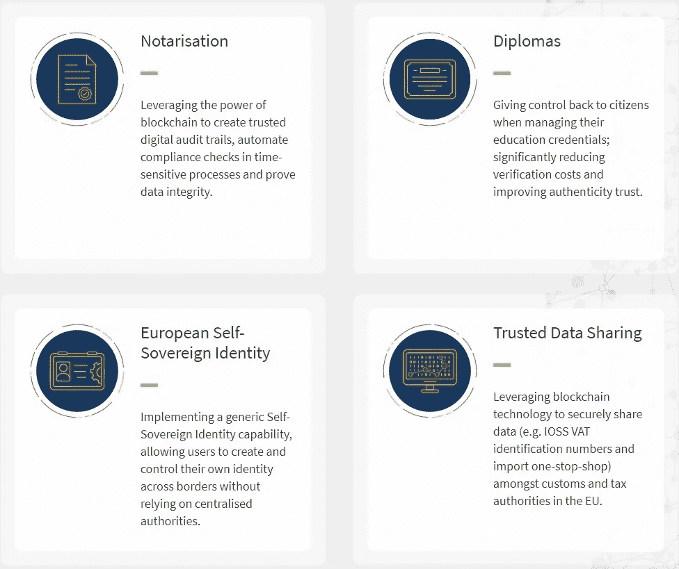

(Source: [https://ec.europa.eu](https://ec.europa.eu/))

# 关于数据和人工智能的加密货币/区块链项目

就个人而言，我认为有两个项目可以帮助数据和人工智能的安全去中心化，这两个项目是[海洋协议](https://oceanprotocol.com/)和[奇点网](https://singularitynet.io/)，它们都是开源项目。Ocean Protocol 旨在创建分散和安全的数据共享市场，而 SingularityNet 将创建一个分散的市场，开发者可以在那里共享和货币化他们的人工智能算法&软件代码。

我们将使用 Ocean 作为一个例子，来看看欧盟将如何建立一个合作伙伴关系并授权分散的开源公司:

# 海洋议定书

[Ocean Protocol](https://oceanprotocol.com/) 帮助开发者建立市场和其他应用，以私下&安全地发布、交换和消费数据。它还提供计算到数据服务，使私人数据能够留在本地，确保隐私，可用于训练机器学习算法或建立人工智能模型。

欧洲联盟的报告中提到了海洋议定书。

欧盟区块链论坛报告:

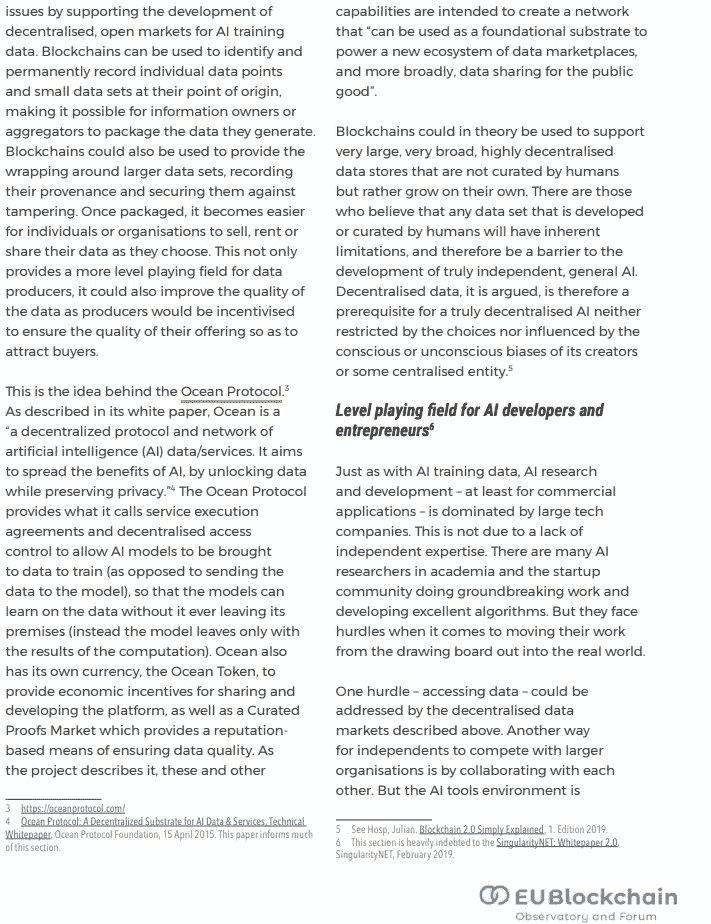

(Source: [https://www.eublockchainforum.eu/sites/default/files/report_convergence_v1.0.pdf](https://www.eublockchainforum.eu/sites/default/files/report_convergence_v1.0.pdf))

**BDVA(大数据价值协会)**
[大数据价值协会](https://www.bdva.eu/) (BDVA)是一个行业驱动的国际非营利组织，在欧洲各地拥有 200 个成员，由大、小、中型行业以及研究和用户组织组成。BDVA 和[大数据价值 PPP](https://www.bdva.eu/PPP) 追求一个共同的愿景，即**将欧洲定位为创造大数据价值的世界领导者。**

它们将通过实现数据交换和释放人工智能潜力，帮助迈向欧洲数据共享空间。该协会的目标是促进从事大数据技术的公司和研究人员，以确保欧盟数据科学的行业领先地位和卓越地位。

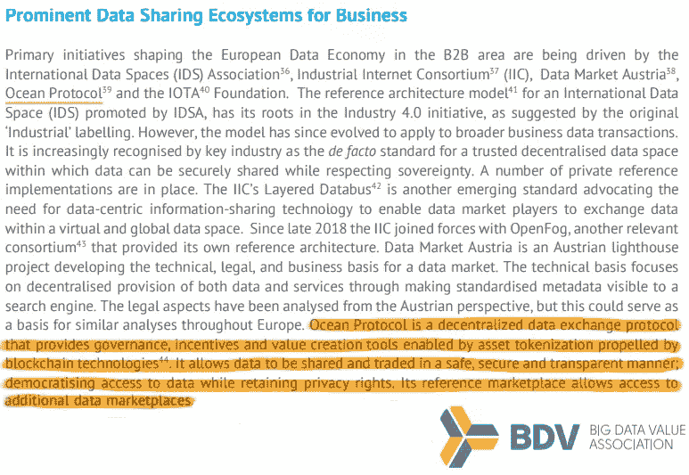

(Source: [https://www.eoscsecretariat.eu/sites/default/files/BDVA%20DataSharingSpace%20PositionPaper_April2019_V1.pdf](https://www.eoscsecretariat.eu/sites/default/files/BDVA%20DataSharingSpace%20PositionPaper_April2019_V1.pdf))

BDVA 的**使命是**开发创新生态系统**，实现欧洲**数据和人工智能驱动的数字化转型**带来最大的经济和社会效益，并实现和保持欧洲在**大数据价值创造**和**人工智能**方面的领先地位。**

董事会成员是源讯、弗劳恩霍夫、华为、IBM、诺基亚、飞利浦、西门子等公司的高级职员。BDVA [领导团队](https://www.bdva.eu/node/1154)由西门子公司首席软件专家托马斯·哈恩总裁和 SAP Research &研究项目总监劳雷·勒巴尔斯组成，创新团队担任副总裁。

DEX 已经成为 BDVA 的正式成员，这是一家让人们能够赚钱和分享数据以解决影响商业、社会和世界的问题的公司。DEX 是海洋协议基金会的创始人，通过开源软件、工具和服务来支持数据社区。

BDVA 成员的完整名单可以在这里找到:[https://www.bdva.eu/members-alph](https://www.bdva.eu/members-alph)

[Irene Lopez de Vallejo](https://www.linkedin.com/in/irenelopezdevallejo)博士(2018 年 4 月至 2019 年 10 月期间担任海洋协议创始成员和海洋合作伙伴负责人& DEX)目前在 [BDVA](https://www.linkedin.com/company/big-data-value-association) 工作，担任 [TF1:SG7](https://www.bdva.eu/node/1441) 数据共享空间的联合主席。她也是欧洲委员会的项目评估员。

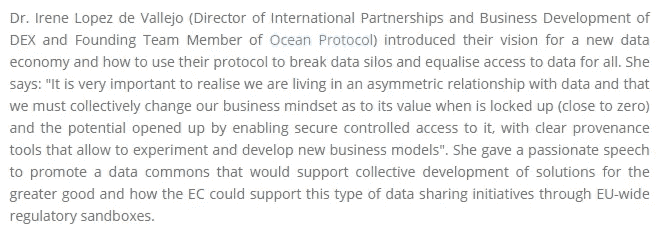

(Source: [https://www.bdva.eu/node/1220](https://www.bdva.eu/node/1220))

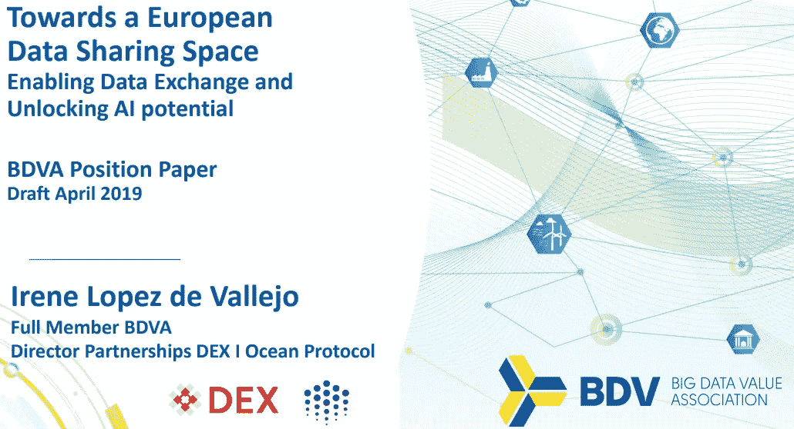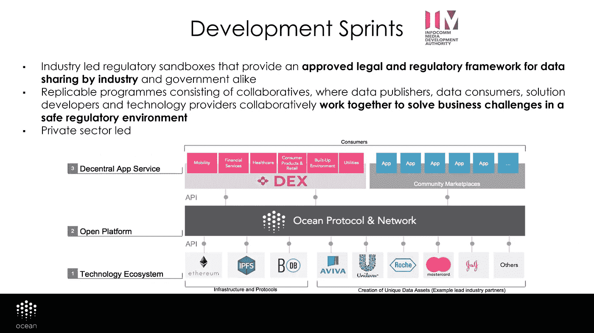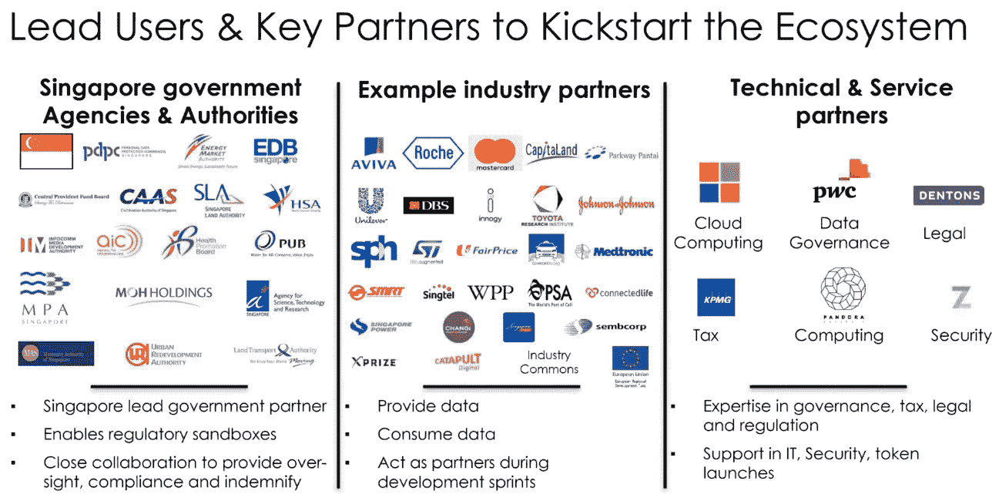

Partners & ecosystem of Ocean Protocol

上面的图片是由 Vallejo 博士为 BDVe 制作的海洋协议演示文稿拍摄的:

海洋协议也是 [**GAIA-X**](https://www.data-infrastructure.eu/GAIAX/Navigation/EN/Home/home.html) 的一部分，这是一个为数据创建欧洲云基础设施的项目，连接集中和分散的实体。

Question regarding Gaia-X from a recent Ocean Protocol [AMA](https://blog.oceanprotocol.com/november-2019-ama-5c84d729dd9).

## MOBI(移动开放区块链倡议)

[**MOBI**](https://dlt.mobi/)**是一个财团，致力于利用区块链及相关技术使交通运输更加环保、高效、实惠。通过研究、教育、创新平台、座谈会和工作组，MOBI 致力于创建和推广智能移动区块链采用的高行业标准。它的一些成员是埃森哲、宝马、康森斯、EEA、福特、本田、现代、IBM、Ocean Protocol、R3其他。**

**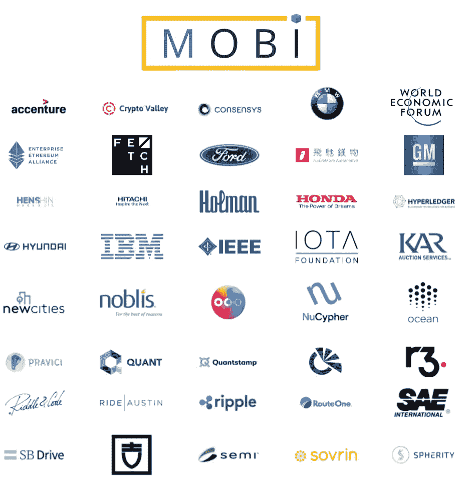**

**MOBI community members.**

**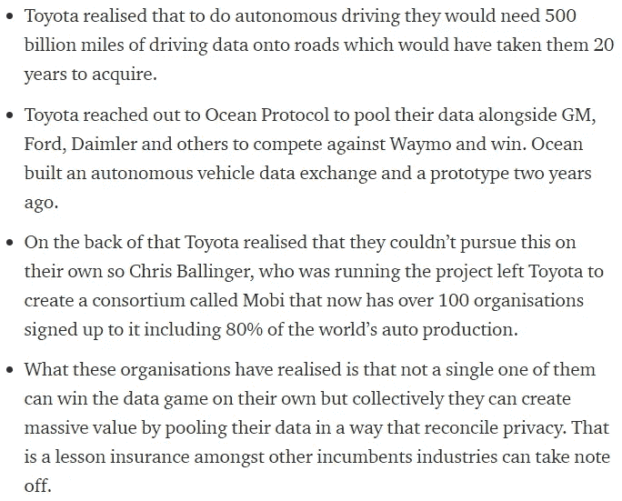**

**Story behind MOBI and collaboration of automotive giants. (Source: [https://medium.com/@HSVGTS/ocean-protocol-update-moco-berlin-europe](https://medium.com/@HSVGTS/ocean-protocol-update-moco-berlin-europe-has-a-plan-to-challenge-the-us-and-chinese-cloud-4b4238718bbe))**

**Ocean 最近还与梅赛德斯-奔驰的母公司戴姆勒建立了合作关系:**

** [## 海洋协议与戴姆勒东南公司合作，为戴姆勒股份公司提供概念验证…

### 此次合作探索了为戴姆勒使用分散式数据共享平台

blog.oceanprotocol.com](https://blog.oceanprotocol.com/ocean-protocol-delivers-proof-of-concept-for-daimler-ag-in-collaboration-with-daimler-south-east-564aa7d959ca)** 

**去中心化加密货币最好的一点是，政府和公民都可以投资和支持这些基金会，同时也可以参与治理。大数据正在向谷歌和亚马逊这样的大型科技公司集中，但这种情况即将改变。Ocean 将以安全和注重隐私的方式解锁和唤醒日常生活中的个人、企业和政府实体的休眠数据，实现数据的民主化。**

**如果你想知道如何投资$OCEAN token，你可以找到更多关于交易所的信息。这里:[https://coinmarketcap.com/currencies/ocean-protocol/](https://coinmarketcap.com/currencies/ocean-protocol/)**

## **奇点网**

**你可以在他们的网站[https://singularitynet.io/](https://singularitynet.io/)了解关于奇点网的一切。**

> **“人工智能目前被用于销售、间谍、杀人和赌博。广告、军事、监控和股票市场交易。”—本·戈尔策尔**

**AI 的去中心化很重要。在下面的视频中，SingularityNet 创始人兼首席执行官 Ben Goertzel 博士谈到了使用区块链技术的数据、人工智能和分散式开源项目:**

# **结论**

**欧盟将实现数据共享，并将试图解决巨大的技术垄断。这些数据将有助于 AI 的发展和完善。区块链将为每个公民快速、安全和轻松地创建数字身份证和验证官方文件提供动力。**

**对数据共享和基础设施数字化的一个担忧是，它们是否可能在未来被腐败的政府转变为监控系统。欧盟似乎正在考虑个人自由的重要性，这是一个好迹象。*这种安全的数据共享可能比亚马逊和谷歌拥有大数据要好。***

**有一点是肯定的，区块链技术已经证明了它的价值，并表明开源社区可以与价值数万亿美元的科技巨头相媲美。也许欧盟能从区块链社区学到的最有价值的一课就是自由、安全、分权和隐私的重要性。**

****访问专家视图—** [**订阅 DDI 英特尔**](https://datadriveninvestor.com/ddi-intel)**