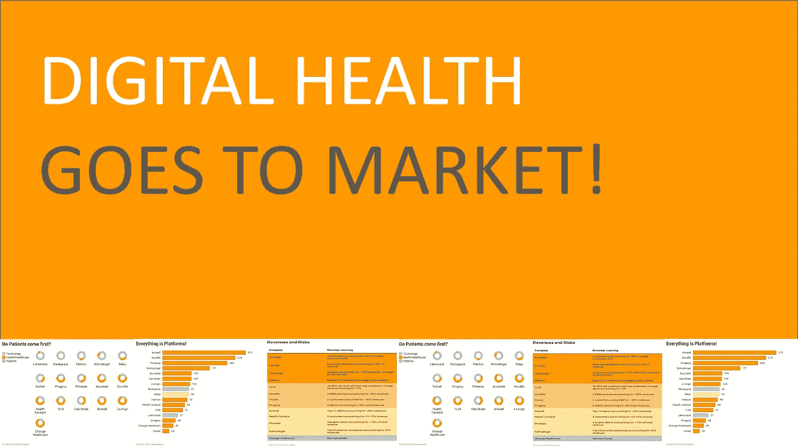
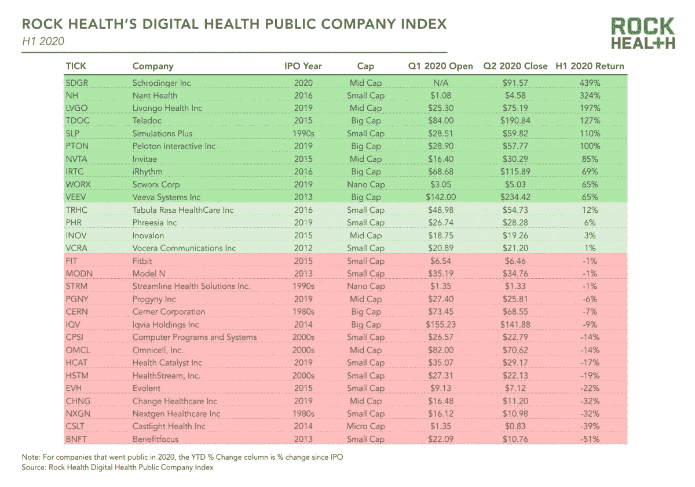
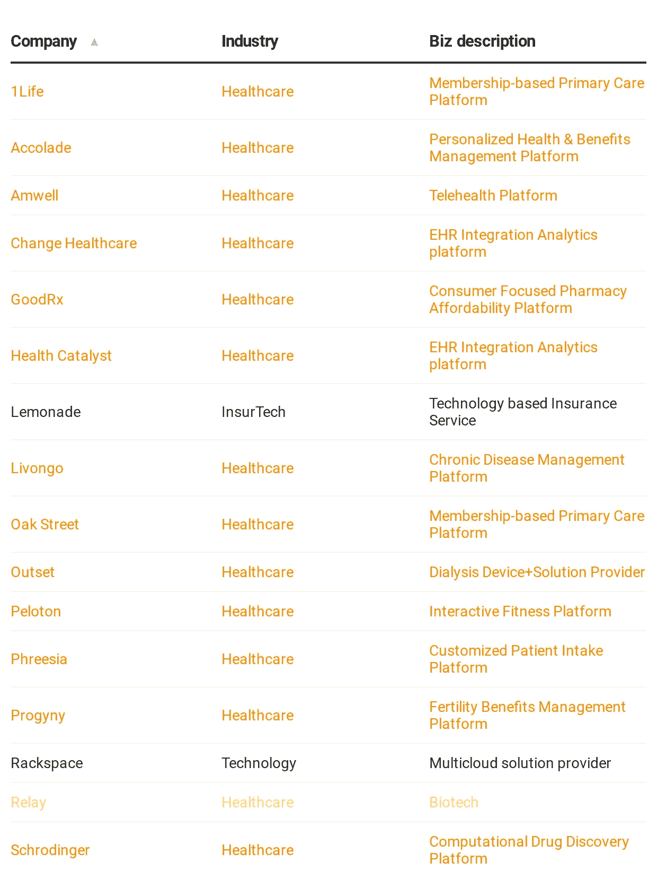
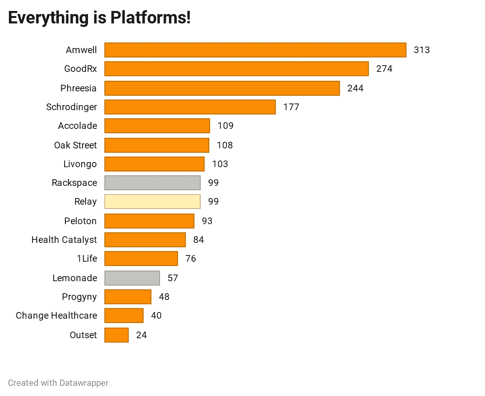
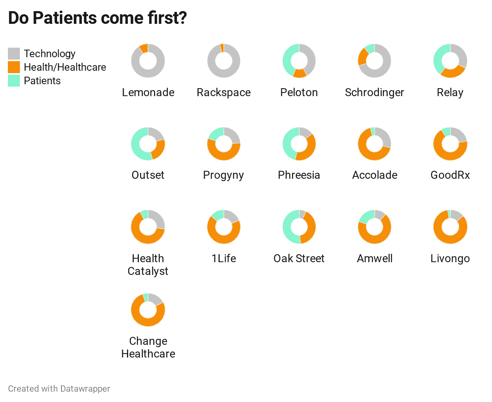
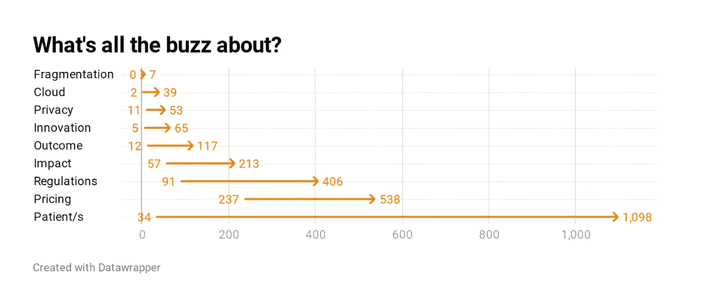
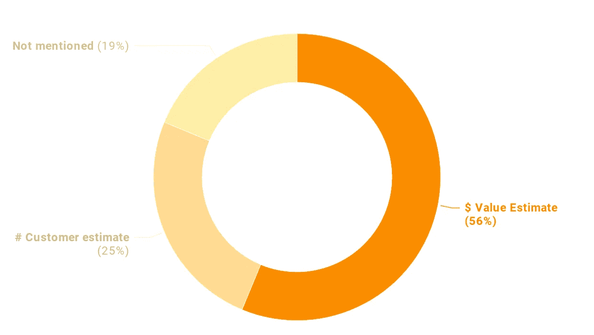
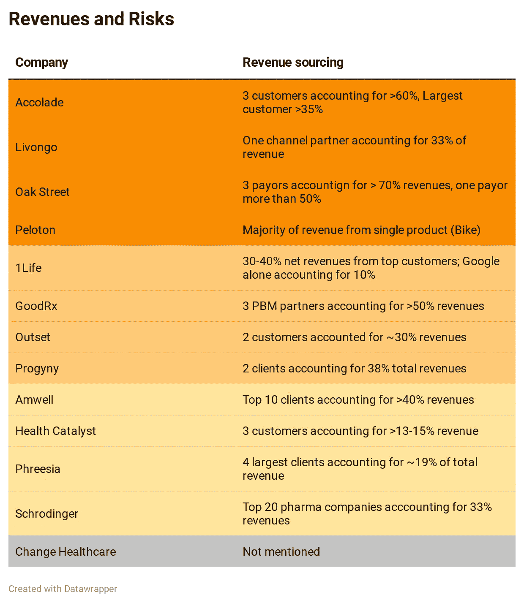

# 数字健康走向市场！

> 原文：<https://medium.datadriveninvestor.com/digital-health-goes-to-market-44cc2b73d640?source=collection_archive---------13----------------------->

## TL；速度三角形定位法(dead reckoning)

随着医疗保健和技术集成领域的进步，数字医疗保健主流化一直在认真进行。许多公司正在走出他们多少受到保护的风险资本和私人资金的世界，并着眼于公开市场，他们如何看待医疗保健世界？他们如何评估机会？更重要的是，他们是否遗漏了未知的风险？**我审查了数字医疗领域总共 13 家公司的 S-1，这些公司在 2019 年和 2020 年上市，以梳理出这些问题的一些答案。**

## 数字健康市场和表格 S-1

即使是对数字健康一无所知的人也知道这一点——数字健康的市场之路是漫长的、危险的，会经历许多起伏、循环和障碍！虽然与任何一年的更广泛的初创企业相比，数字医疗初创企业的融资方式没有太多结构性差异，但很少有人能够成功退出市场，其中很少有人能够成功通过 IPO。这种较高失败率的一些主要原因包括医疗保健系统的复杂性、市场的碎片化以及各种参与者的利益冲突。然而事情正在发生变化——目前有 29 家公司在 [***Rock Health 的数字健康上市公司指数***](https://rockhealth.com/reports/2020-midyear-digital-health-market-update-unprecedented-funding-in-an-unprecedented-time/) 上市。

Digital Health Public Company Index

随着这些公司上市，它们的商业模式和内部机制也随之改变。**当公司通过首次公开募股(IPO)在美国上市时，他们提交 S-1 表格，这是一份面向投资者的文件，为未来的投资者提供了一窥公司内部的机会。除了提供投资决策所需的重要财务信息外，企业还提供商业信息，帮助他们展示自己的优势并揭示可能的风险。**

在 2019 年和 2020 年申请 IPO 的许多公司中，我审查了数字医疗领域总共 13 家公司的 S-1；我还分析了同一时期 1 家生物技术公司和 2 家科技公司的申请文件，以进行比较和对比。这是公司和他们的简介-

## 鸟瞰

一些见解很快变得显而易见-

*   **退出时间:** **从公司成立到 IPO 申报的中间时间为 10 年。**申请时间最长的是 Schrodinger，30 年后上市，最短的是 Change Healthcare 和 Progyny，3 年后上市。考虑到研发周期较长的公司进入公开市场需要更长的时间，这是典型的一般上市时间。
*   **CEO &董事会组成:**所有 CEO 都是男性，除了一位——在起点医疗的 Leslie Trigg。 ***这一群体首席执行官的年龄中值为 50 岁，明显低于标准普尔 500 公司首席执行官的年龄中值 58 岁。*** 董事会中女性比例的中位数是 25%，还不错。
*   **商业模式**:鉴于全球医疗保健的高度分散性，尤其是美国医疗保健系统，以及这些公司申请美国市场的事实，企业对企业的模式必然更有利。毫不奇怪，在 13 家公司中，只有两家可以被认为是 B2C(outlet 和 Peloton)。其余的有更直接的 B2B 模式，或者在某些情况下 B2B2C 模式。
*   **大型技术合作伙伴关系:**随着这一群体被定义为数字医疗保健，很明显，它们都至少具有某种程度的技术渗透。然而，这种渗透的程度比我想象的要深。**所有的 S-1 都明确提到了与整个技术的广泛联系，以及与大型技术合作伙伴的许多合作。**这些合作伙伴关系主要针对他们的云基础架构，但许多也有其他依赖关系，从基础架构需求到首选合作伙伴关系。**13 家公司中有 11 家提到亚马逊、谷歌、微软或这些大型科技公司的组合是他们在云或其他基础设施需求方面的合作伙伴**。另一个信息丰富的方面是开源软件的使用越来越多，再次反映了医疗保健的“技术化”。

 [## 新的健康技术如何让我们活过 100 岁？数据驱动的投资者

### 不久前，我们都在看一台黑色电视，不得不带着天线跑遍整个公寓，以确保…

www.datadriveninvestor.com](https://www.datadriveninvestor.com/2020/08/12/how-new-health-technology-makes-us-live-past-100-years/) 

## 更深入一层

接下来，我绘制了词频图，因为它们出现在各自的 S-1 中，灵感来自斯科特·加洛韦教授对帕兰蒂尔 和 [*多面手的 S-1 俱乐部*](https://thegeneralist.substack.com/) 的 [*分析。这个活动非常简单，听起来可能很琐碎，但让我对数字医疗保健的发展有了一些了解。*](https://www.profgalloway.com/palanthiel-the-uncola)

所有的公司都称自己为平台。所有人都自豪地认为自己是不断分化的医疗保健世界中完美的端到端平台解决方案。所有的 S-1 都有大量的“平台”描述。安利似乎有点言过其实——它提到这个词超过 300 次，甚至超过了两家科技公司！

虽然“医疗保健”当然是最常用的词之一，但有几个词因提到了“技术”而脱颖而出。当我提到“病人”时，类似的见解也出现了。

创新的世界充斥着流行词汇，医疗创新不想被遗漏。杆位当然是给“病人”用的，橡树街用了 1000 多次；还经常提到“定价”和“监管”。

## 机遇、不确定性和风险

在对词频和映射有了一些兴趣之后，我转向了核心问题——数字医疗保健如何看待可用的机会，以及它们面临哪些风险/不确定性

## 市场尺寸

S-1s 中通常会有一个重要的部分，讨论公司如何考虑其客户群，这些计算背后的假设是否合理，以及这个基础是否可以扩展。虽然有 3 家公司没有披露他们的市场机会，但其余的公司要么提供了他们的潜在客户的可寻址市场，这些客户将从他们的服务中受益，要么将这些数字转换成美元价值。其中最雄心勃勃的是 GoodRx，它认为其潜在的市场总量是一个 8000 亿美元的巨大机会——处方药业务、与制药公司的合作机会和远程医疗业务的结合。

## 风险和不确定性

在 S-1 披露的所有部分中，不确定性和风险部分是最有见地的。以下是几乎所有披露中出现的一些最常见的“独特医疗保健”风险-

*   **收入来源和实现**:大多数公司都对其漫长的收入周期提出了警告，这似乎是全球医疗保健高度分散的特点，尤其是在美国。许多公司还在很大程度上依赖于少数精选的客户群，这使得它们的收入依赖于这些客户。

*   **法规:**对于这些新兴公司而言，有几个因素在发挥作用——美国和全球其他市场的医疗法规发展迅速，有时呈非线性发展，原因包括医疗价格上涨、获取渠道不充分和不平等、过度分散以及由此产生的复杂性。**所有这些变化提供了“灰色地带”,创新公司可以在这里茁壮成长，但是这些灰色地带也吸引了额外/更新的法规，这对这些公司来说可能是一种风险。**管理技术、数据分析和数据共享的法规也会增加这些监管风险，因此所有这些风险主要出现在所有披露中。
*   **数据安全和隐私:**这是对医疗保健数据依赖性增加的直接后果。法规的变化以及公众对数据安全和隐私问题的看法可能会给依赖技术解决方案作为其服务一部分的公司带来额外的风险。大多数公司知道这种担忧和对事件的任何反应会对他们的服务产生巨大影响，并在他们的 S-1 中提到了这一点。
*   **与 IT 基础设施相关的风险:**这些公司中有许多实际上“生活”在“云”中，因此严重依赖于对 IT 基础设施和互联网的可靠、便捷的访问。同样，他们中的许多人也依赖他们的技术合作伙伴来取得成功的业务成果。几乎所有的 S-1 都提到了这些风险。
*   **大流行！:**一个从未出现在公元前(COVID 之前)提交的 S-1 上的风险当然是疫情肆虐我们所知的世界的风险，以及对整体经济、公司运营和员工的所有后续影响。 ***所有 9 位 AC(COVID 之后)的 S-1 都显著地指出了 COVID 可能给他们的公司带来的风险。***

## 地图不是领土

在看了新冠肺炎·疫情在这些公司的准备阶段引起的剧变后，我觉得 S-1 就像地图，提供信息的快照，很多时候信息在一群人之外是永远得不到的。他们可能会尝试将其中一些定义为领域，但在不断变化的世界中，这些信息可能太短暂了。然而，它确实给了我们关于“现在”世界的真正有用的信号。

我最喜欢的时事通讯之一是 Vaughn Tan 的'*'，在他最近的[帖子](https://uncertaintymindset.substack.com/p/44-the-long-view?)中的&，他阐述了关于不确定性和长期与短期思维的问题-*

> *缩小到足够远，一切都变得清晰可见。长远的观点包含了一切。权衡的结果是，远景必然比特写视图粒度小、细节少。*

*仔细想想，这对 S-1 来说是有意义的；我们非常重视长期思考，但这并不意味着我们忽略了短期或中期的线索。同样重要的是，不要假设由于我们用于长期思考的低保真度镜头，未来是清晰的，只有我们迄今为止预测的起伏。*

*谭要求我们“缩小而不自欺欺人地认为未来是可知的”！*

## *有“从此幸福快乐”吗？*

*随着这些公司中的许多上市或采取步骤走向首次公开募股，世界已经完全改变了新冠肺炎的影响。虽然像 Amwell 这样的公司已经为自己在这种情况下做出了真正的改变，但许多其他公司都在不同程度上将其计划转向远程病人监护和远程医疗。所有这些都得到了投资者的积极回应，这一群体的总市值已经超过 1000 亿美元，至少市场似乎对他们现在的增长方式感到满意。*

*持续的疫情和大流行后世界的情况仍然是开放的；一些对数字健康的高适应率已经减弱，因此观察这些公司如何在不久的将来规划他们的道路将是令人着迷的——他们会坚持他们最初的价值主张还是继续投资于后 COVID 现实的新能力？他们会证明他们在 S-1 中创造的嗡嗡声是真实的吗？最后，哪些看不见的风险将在未来几年出现，以考验这些公司的勇气？我*

*我很乐意听到你的反馈和想法。如果你喜欢我的作品，你也可以留下一些“掌声”。我也很乐意通过 [***Twitter***](https://twitter.com/santoshshevade) 和[***LinkedIn***](https://www.linkedin.com/in/santosh-shevade/)连接。*

## *访问专家视图— [订阅 DDI 英特尔](https://datadriveninvestor.com/ddi-intel)*