# 数字营销是你所需要的

> 原文：<https://medium.datadriveninvestor.com/digital-marketing-is-all-you-need-1a3c91310ee5?source=collection_archive---------13----------------------->

## 目标明确的广告如何让你的利润飙升

Photo by [Carlos Muza](https://unsplash.com/@kmuza?utm_source=medium&utm_medium=referral) on [Unsplash](https://unsplash.com?utm_source=medium&utm_medium=referral)

年轻创业者的主要缺陷是**低估了营销对一家非常年轻的公司的显著影响，尤其是如果他或她来自技术或科技背景，充满想法但对商业管理知之甚少。**

我来自一个**技术掌握和创新至关重要的背景**，我一直沉浸在这样的想法中，只要你的项目有意义，有创意，有突破性，那么客户就会自己来，最好是专注于**开发产品性能**，而不是**建立一个合理有效的营销政策**。

## 那么是什么让我如此激进地改变了主意呢？

我最近遇到了一家年轻的法国初创公司 Silvr，它专注于为电子商务的营销活动提供资金。我必须为他们的一些客户分析**投资广告活动可能对他们的业务产生的影响**。结果令人震惊。

## 这个职位的目的

为了便于演示，我将一步一步地分析营销资金对周收入的影响**以一家公司为例，姑且称之为 XX。这将是对财务和会计数据的**深入计量经济学分析**，如果你想在自己的初创企业中重现这项研究，还会附带 Python 代码片段和结果。**

# 它是如何工作的？

这个想法很简单:你想在谷歌和/或脸书上投资一定数量的营销活动，但没有所需的资金。

**Silvr** 可以随时提供资金(正是你所需要的，当你需要的时候)，你的企业将逐步偿还贷款，而不会在紧迫的期限内危及其偿付能力:你只需退还每周业务收入的给定百分比，比如 20%，直到佣金增加的原始金额全部偿还。

最棒的是，你不会立即开始还钱，而是在大约 9 周的抵消之后，这让你有足够的时间享受营销活动的第一笔回报。

## 为什么这个广告如此有效？

谷歌和**脸书**，以及所有其他社交媒体平台(如 Instagram、Twitter……)，已经完全颠覆了广告世界。电视广告只针对一小部分听众的时代已经一去不复返了。现在是对用户进行超剖析的时代，你对他/她的兴趣了解得越精确，你的广告就越有可能吸引他/她的眼球，并最终获得购买。**社交媒体为企业提供了一扇通往潜在客户世界的大门。**

## 支持数据和方法

XX 是一家年轻的专门从事网络销售的企业。我有一系列会计数据，在他们开始资助广告活动之前和之后。

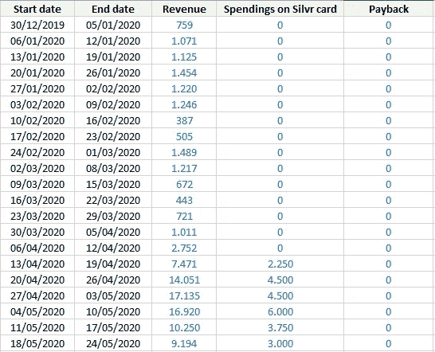

Example data for the company XX

XX 的案例特别有趣，因为我们有每周业务收入的数据:

*   **开始数字营销前**(至 4 月 12 日)，
*   **在第一次广告活动**(4 月 13 日至 6 月 7 日)，
*   **在随后的非广告期**(6 月 8 日至 8 月 2 日)，我们将寻求由于第一次广告活动所带来的新获得的声誉而带来的长期收入效应。
*   以及在从 8 月 3 日到 9 月 20 日的第二广告时段期间**。**

# 计量分析

## 描述统计学

让我们先看一下原始数据，以获得一个总体印象。

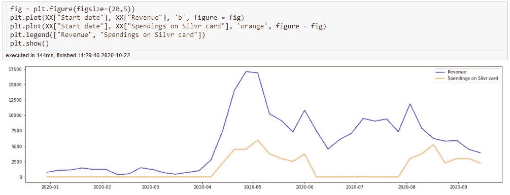

Plotting Weekly Business Revenue against Digital Advertising Spending for XX

乍看之下，第一次数字营销活动显然对每周收入产生了巨大影响，而且影响非常迅速。这似乎也产生了长期的影响，因为在第一次竞选结束后，收入稳定在比以前更高的水平。让我们深入了解一下。

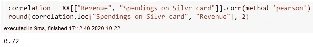

Weekly Revenues and Advertisement Spendings are correlated at 72%

**每周收入和每周在线广告支出高度相关** (72%)。因此，如果我们想模拟每周的收入，可变的营销费用将不得不发挥核心作用。

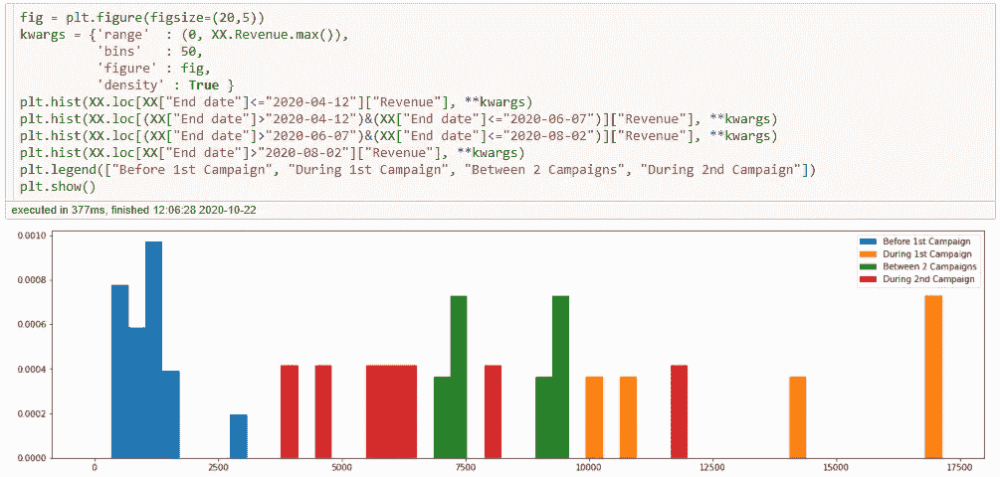

Histogram of Revenue Levels at Different Time Periods

从这个柱状图来看，很明显，在开始任何数字营销活动之前，每周的收入都远远低于未来任何时候的收入。

同样令人吃惊的是，第一次营销活动就让收入直线上升:在 3 周内，收入翻了 6 倍多！然而，第二次广告活动的效果是否与第一次广告活动的长期效果有明显不同，还很难说。

## 统计建模

在这一部分中，基于我迄今为止进行的探索性数据分析，我将做出几个假设，以便建立一个统计模型。

*   第一个假设是**在线广告的引入已经充分扰乱了收入序列的行为，我们可以对之前和之后的 2 个时期进行建模，或多或少地分开**。
*   第二个适合第 1 部分:我将假设，**在推出社交媒体营销之前，收入是给定均值的高斯过程**(准确地说是 1471 年的€)，**没有任何增长趋势**，这似乎与收入在时间上看起来稳定的图表一致。
*   第三，在第二部分中，收入必须与*广告支出* 成正比，这看起来很直观，但也与从数字营销 开始以来的*时间成反比。对此的论证有两个方面:一方面，在两个图表中可以明显看出，营销的引入深刻地改变了收入过程的行为(见假设 1)，而且即使在第一次活动结束后，社交媒体活动也产生了长期的影响，提高了消费者对品牌的认识，而第二次营销活动似乎没有产生同样的爆炸效应。*

因此，简而言之，我将假设时间 t 的*收入(t 将是一个周数，因为我们正在处理周收入)，称为 R，是以下各项的函数:*

*   *时间*本身，我将允许我的回归在开始做广告之前和之后的两个时期中的每一个时期有不同的常数项，以说明品牌意识的持久破坏性影响；
*   在时间 t 的*广告支出，称为 S，*
*   *自网络广告*开始以来的时间推移的平方根倒数，以便考虑数字营销活动的长期影响，尽管这种影响会持续下降。
*   对此，我添加了一个平均值为 0 的高斯噪声，这是每周观察到的趋势随机变化的原因。

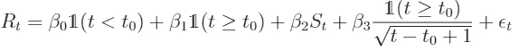

Model chosen for explaining revenue : 2 constants and 2 variables

让我们首先分析一下这个假设的含义:你可以注意到，在广告活动开始之前，只有第一项是非空的。它包括收入的初始行为，一个平稳的高斯过程，其平均值就是该时间段内的平均周收入。

在数字营销开始后，其他三个术语分别体现了一个常数(如果广告支出停止，XX 将在无限期内达到的平均收入)、广告支出对收入的影响以及自第一个广告显示以来的时间流逝。

## 解释数据

下一步是对这 4 个特征 (2 个变量和 2 个常数)执行**线性回归，以便**检查我们模型的可行性(系数的显著性、可解释性和预测能力)**。**

我将使用 Python 的 scikit-learn 工具执行回归，覆盖它，以便它也计算一些统计实体(p 值，t 统计)，这些统计实体在探索模型的有效性时非常有用。

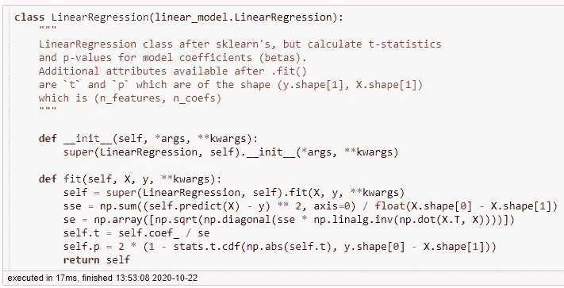

This Linear Regression is based on scikit-learn and calculates t statistics and p values of coefficients.

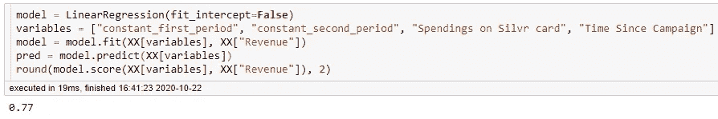

Fitting the model, 2 variables and 2 constants, gives an R2 of 77%

这个回归的 R2，也就是说，**我的特征** (2 个变量，2 个常数)解释的总收入变化的部分，**超过四分之三(77%)** ，这是一个相当不错的结果。我们必须看一下系数及其各自的 p 值，以确保它们都对模型有显著贡献:

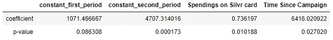

Coefficients and p-values of the regression

足够令人放心的是，**所有 p 值都非常低**，因此对于所有系数，我们可以拒绝它们与 0 没有显著差异的零假设。

我们的模型看起来很健壮！

## 预测数据

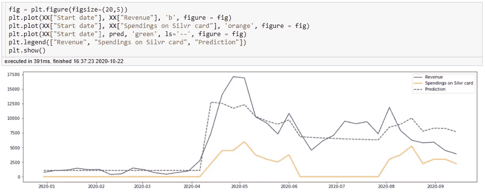

Predicted Revenue based on our Regression Model

如果我们使用我们的回归模型来预测收入，令人放心的是，我们会发现一个似乎与实际观察到的收入高度相似的趋势。为了证实这一观点，我们可以简单地看一下相关系数:

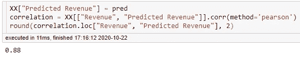

Actual and Predicted Revenues are correlated at 88%

# 但是它真的有什么用呢？

现在，你们都在问的问题:**真的值得吗？**我将做一个简单的测试:查看社交媒体广告开始后的实际收入，并尝试预测在初始趋势没有发生变化的情况下同期的收入，我将检查投资(总广告支出，加上 6%的 Silvr 佣金)是否有回报。

为了详细说明这一过程，你还记得，在解释经济计量模型时，我们看到初始阶段的模型相当于 1471€均值的简单高斯过程，完全平稳。因此，将这种模型化传播到第二个时期是相当容易的，预测收入简单地等于常数乘以我们所能预测的周数。

分析投资回报只需从第二阶段的实际收入中减去这一预测收入，以获得通过数字营销运营获得的净收入增长，并进一步减去活动的总成本(初始成本加上佣金)，以获得该阶段的最终净收益。

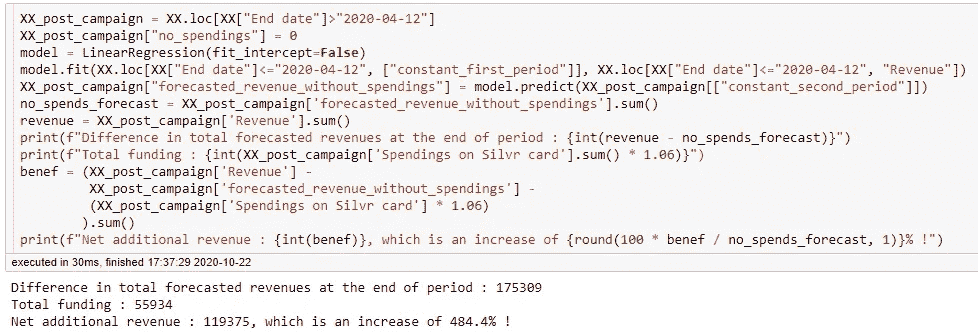

Checking whether the total investment in marketing was worth it

哇，印象深刻！**在 5 个月多一点的时间里，与该公司开展数字营销活动之前相比，平均收入增长了近 6 倍……**

# 结束了

## 感谢你阅读我的文章，不要犹豫，在下面留下你的评论或者关注我以获得更多的故事和见解！