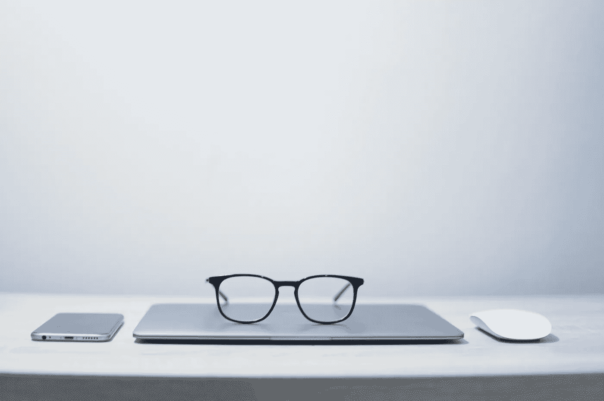
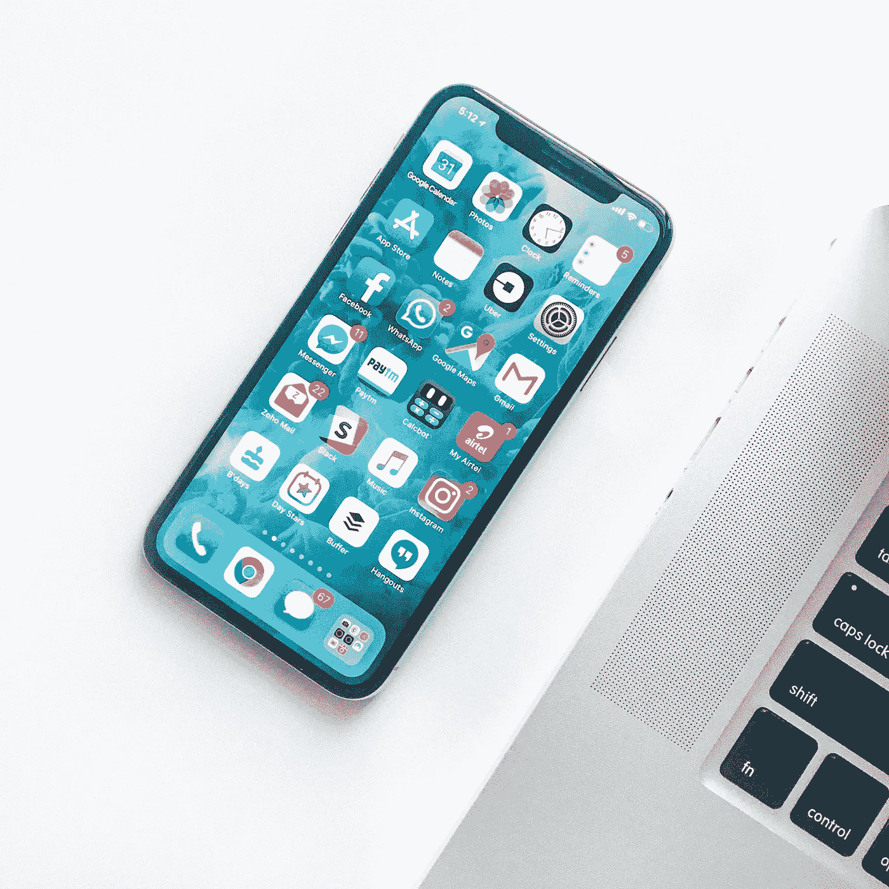

# 数字极简主义和应用程序排毒

> 原文：<https://medium.datadriveninvestor.com/digital-minimalism-and-app-detox-92217ec6d16f?source=collection_archive---------9----------------------->

Photo by [Jesus Kiteque](https://unsplash.com/@jesuskiteque?utm_source=unsplash&utm_medium=referral&utm_content=creditCopyText) on [Unsplash](https://unsplash.com/s/photos/digital-minimalism?utm_source=unsplash&utm_medium=referral&utm_content=creditCopyText)

极简主义实际上意味着只拥有对你有意义的东西。它实际上并不意味着扔掉你所有的东西，它只是意味着扔掉所有对你没有意义的东西。数字极简主义也是如此。随着时间的推移，我们开始收集我们不需要的应用和服务，最终在我们的设备上有很多我们从来没有使用过的应用。我有很多我不需要的应用和服务，而且是重复的。

 [## 跑步摆脱疯狂:锻炼如何提高你的生产力|数据驱动的投资者

### 没有比锻炼更好的方式来开始一天的工作了。我试着一周至少做四天，在…

www.datadriveninvestor.com](https://www.datadriveninvestor.com/2018/10/23/running-to-get-rid-of-the-crazy-how-working-out-increases-your-productivity/) 

通常情况下，你不需要两个电子邮件应用，两个笔记应用。不需要谷歌文档+微软 office +苹果文档。我在 iPad 和 iPhone 上使用 Spark 电子邮件。在这里，我有我所有的电子邮件帐户，所以我知道，如果我想在这里找到任何东西是在哪里得到它。我用 Evernote 做笔记，已经删除了 idea、OneNote、google keep、Apple notes。我在考虑换成苹果笔记，但如果我这么做了，我会从我所有的设备上删除 Evernote。然后我就知道去哪里搜索笔记，然后把笔记写出来。

Photo by [Rahul Chakraborty](https://unsplash.com/@hckmstrrahul?utm_source=unsplash&utm_medium=referral&utm_content=creditCopyText) on [Unsplash](https://unsplash.com/s/photos/apps?utm_source=unsplash&utm_medium=referral&utm_content=creditCopyText)

当我浏览我的系统时，我有微软办公套件、苹果文档和谷歌文档。为什么我需要三个这样的东西？我在哪里写什么？我决定继续使用谷歌文档，并删除了其余的内容。为我节省了很多钱，让我的设备和我的思维更有条理，更简洁

需要 Google Drive、Dropbox、Onedrive 等存储服务吗？寻找你需要的东西只是一件麻烦的事。我保留了 Google Drive，删除了其他所有服务。现在我只要整理一下我的 Google Drive，所有的东西都很容易找到。

曾经有一段时间，我有一台苹果电脑、工作用的个人电脑、一台 iPad 和一部 iPhone。为什么我需要所有这些设备？所以现在我只在家里用 iPad，用电话，工作时用电脑。从现在开始，我将不再购买家用电脑，这样可以节省很多钱，并且使我的设置更简单。

使用应用程序和服务排毒，你会发现一切都变得更容易、更便宜、更简单。希望这对你有用，就像对我一样