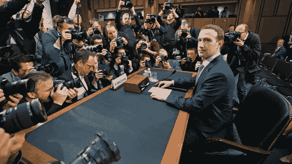

# 数字技术威胁着既定的选举程序，扰乱了政治精英

> 原文：<https://medium.datadriveninvestor.com/digital-technology-threatens-the-established-electoral-process-and-upsets-political-elites-574f19e7c7e?source=collection_archive---------18----------------------->

Image Source: [https://variety.com/2018/digital/news/facebook-congressional-hearings-mark-zuckerberg-business-analysis-1202755118/](https://variety.com/2018/digital/news/facebook-congressional-hearings-mark-zuckerberg-business-analysis-1202755118/)

作者米切尔和拉斐尔·里贝罗

想象一个世界，免费的互联网工具被用来根据你的个人喜好定制广告。反过来，这些平台或工具，像搜索引擎，收集信息，他们[将这些信息输入到产品生产中。他们生产的产品通常会卖给其他大公司，有时还会卖给政府机构。现在，让我们说这些免费的互联网工具对日常生活和民主的功能变得如此重要，以至于价格信号不再对运行这些互联网工具的公司产生有意义的影响。](https://medium.com/swlh/google-versus-we-the-people-96c96b1cdbf5)

本质上，一些主要的互联网工具是集中的。一个免费的社交媒体网络的好坏取决于它吸引大量用户的能力。为了扩大用户群，公司必须实施各种激励措施，并提供积极、有意义的用户体验。用户更喜欢根据他们的个人兴趣定制的内容，因此这些工具可以跟踪用户对内容的参与度，并提供可能与用户兴趣相似的更多内容。

 [## 研究发现政治网站上的定制内容伤害民主

### 布法罗大学的专家说流行的定制技术有其黑暗的一面纽约布法罗

www.buffalo.edu](http://www.buffalo.edu/ubnow/research/news.host.html/content/shared/university/news/news-center-releases/2017/04/044.detail.html) 

这些工具学习如何向用户提供内容，这些内容将继续把他们吸引到特定的平台。这个复杂的生态系统通过跟踪用户兴趣并为可能满足用户胃口的产品或服务投放广告来建立在用户兴趣的基础上。随着时间的推移，这些工具成为日常生活功能的核心，但更重要的是成为民主选举的核心。

2016 年，由于担心外国干涉西方选举，基于互联网的社交网络的民主影响成为人们关注的焦点。外国对手从事社会工程和操纵公众舆论从未如此容易。这种担心也延伸到了国内反对者的努力。

 [## 雅伊尔·博索纳罗如何利用“假新闻”赢得权力

### 2018 年 10 月雅伊尔·博索纳罗当选巴西总统标志着拉美政治的重大转变……

theconversation.com](https://theconversation.com/how-jair-bolsonaro-used-fake-news-to-win-power-109343) 

国内公共政策的反对者可以通过一种被称为“造势”的现象进行类似的社会工程，这种现象是在不存在这种人口普查的情况下创造一种共识形象的做法。互联网为一些用户提供了一种匿名感，这使得这种行为得以持续。匿名和社会工程能力的结合可以在选举政治中造成混乱，导致非典型的政治家或非建制人物当选。

在任的政治家可能会认为互联网的民主功能是一种武器，为了确保他们的连任，必须阻止这种武器。毕竟，众所周知，社交媒体网络在过去几年中放大了民粹主义者的信息。

 [## 新的健康技术如何让我们活过 100 岁？数据驱动的投资者

### 不久前，我们都在看一台黑色电视，不得不带着天线跑遍整个公寓，以确保…

www.datadriveninvestor.com](https://www.datadriveninvestor.com/2020/08/12/how-new-health-technology-makes-us-live-past-100-years/) 

**巴西的例子和阻力**

巴西[的民粹主义反弹始于 2013 年 6 月](https://www.americasquarterly.org/article/revisiting-brazils-2013-protests-what-did-they-really-mean/)。点燃这个火药桶的导火索是政府对公共交通的价格调整。社交媒体传播了这种不满，但随着时间的推移，对中央管理经济的不满越来越多。随着时间的推移，爆发了大规模起义，最终导致要求弹劾总统迪尔玛·罗塞夫(Dilma Rousseff)。罗塞夫后来在 2016 年被巴西国会弹劾。

在 2016 年第四季度，巴西人还成功选举出了新的市长和市议员。社交媒体网络被认为影响了当选官员的更替。毕竟，民众寻求透明、更有限的政府和政治复兴的新信息。年轻的领导人和政治组织者利用这一舆论转变，在脸书和 Twitter 等社交网络上与他人互动。随着右翼民粹主义者雅伊尔·博索纳罗总统的当选，社交媒体影响选举结果的程度变得最为突出。Bolsonaro 代表了各种非建制观点，他的当选标志着私营社交媒体网络可以隐喻性地推翻既定秩序的程度。

 [## 脸书被迫封锁亲博尔索纳罗的账户

### 脸书遵从了巴西最高法院的命令，冻结了十几个极右联盟的账户…

www.bbc.com](https://www.bbc.com/news/world-latin-america-53625728) 

This new political order relied on privately-run social media networks to engage with the public en-masse. In many ways, these networks existed outside the control of mainstream institutions. Unlike the more old-fashioned communication networks of cable television and radio, social media allowed individuals to tailor a message to a specific audience. Political advertisements could be narrowly targeted to users through readily available online data. In sum, a technology evolution of communication and networks disrupted politics as it was known.

In 2018, this trend continued and grew larger as over [50](https://agenciabrasil.ebc.com.br/en/politica/noticia/2019-02/brazil-congress-has-highest-number-new-members-recent-history)% of the Federal Congress, Governors, and Congressmen experienced turnover. The successful outsider campaign of Jair Bolsonaro was simply the icing on the cake. His platform seemed abhorrent to those in the established political order, but market innovation allowed for true and open dialogue among the public. To this day, the political establishment continues its [efforts](https://www.brasildefato.com.br/2020/04/28/understand-the-paths-that-may-lead-to-bolsonaro-s-impeachment) to tear down the populist president, but his support holds firmly. Why? In a country built on oligarchy and corruption, President Bolsonaro understood the policy preferences of everyday voters by maintaining an active social media presence.

**Government Control of Social Media to Stifle Democratic Debate**

Why does any of this matter? In the Era of Information, the ever-expansive usage of data and technological capabilities present new opportunities for society. Social media networks have led to [numerous revolutions](https://www.forbes.com/sites/gregsatell/2014/01/18/if-you-doubt-that-social-media-has-changed-the-world-take-a-look-at-ukraine/) throughout the world. The revolutionary fervor common online is so dangerous to tyrannical governments like Xi Jinping’s Communist China that many countries have taken steps to regulate user activity or communications on these private platforms. China’s efforts are so expansive that their controls are called “[the Great Firewall of China](https://www.theguardian.com/world/2020/jul/08/china-great-firewall-descends-hong-kong-internet-users).”

中国的努力是迄今为止最广泛的，但一些西方和民主国家已经采取措施安装自己的控制。例如，巴西联邦议会正在就所谓的“假新闻法案”进行投票这项立法将在打击“有害信息”传播的幌子下有效地摧毁网上言论自由，这是一种“仁慈的”家长式作风。此外，这项立法[提案](https://www.eff.org/deeplinks/2020/06/current-brazils-fake-news-bill-would-dismantle-crucial-rights-online-and-fast)包括阻碍用户访问社交网络的语言，强制建立社交媒体用户真实身份的数据库，从而消除匿名性，以及社交媒体公司追踪其平台上私人通信的积极义务。这一提议是在私人试图审查意识形态服务之后提出的。

最近，[巴西著名的电子学习平台之一](https://blog.hotmart.com/pt-br/novas-regras-da-plataforma-hotmart/)宣布暂停所谓的意识形态或政治服务。鉴于保守派和自由主义者在主流机构中往往不那么占主导地位，这样的[措施](https://twitter.com/felipeneto/status/1280234115988705282)将不可否认地对保守派内容制作者产生不同的影响。一些政治分析师将电子学习平台的变化与社交媒体广告抵制之间的联系联系起来，作为减少保守信息流行的共同努力的一部分。最近，在小唐纳德·川普分享了关于“可能的新冠肺炎疗法”的有争议的内容后，推特暂停了他的账户，这加剧了这些担忧

 [## 分析显示，脸书最近的算法变化是节流保守的内容

### 保守派权威人士德琳·博雷利指责脸书首席执行官马克·扎克伯格在…

www.conservativedailynews.com](https://www.conservativedailynews.com/2019/07/analysis-shows-facebooks-recent-algorithm-change-is-throttling-conservative-content/) 

很明显，这些极具影响力的平台受到了市场力量和党派政客的压力，采取了不符合言论自由原则的内容政策。当领导人要求变革时，私营部门应该如何应对？

不出所料，脸书的马克·扎克伯格呼吁美国国会严格监管脸书及其子公司。为什么？联邦监管将为脸书这样的平台提供具体指导，指导它们如何在网络环境中运营，并从党派政治指责游戏中去除企业责任。互联网的自由和相对宽松的监管给这些公司制造了一场混乱的噩梦。一方面，这些公司希望促进言论自由，但他们也必须权衡他们的广告客户的[利益冲突](https://www.theverge.com/platform/amp/2018/10/10/17961806/google-leaked-research-good-censor-censorship-freedom-of-speech-research-china)，这些客户更喜欢争议较少的平台。保护言论自由的关键是创新并推动这些社交网络平台改变其商业模式。

通向更自由互联网的道路是创新和技术进步，而不是监管。从本质上来说，[党人](https://www.reuters.com/article/us-brazil-fakenews/facebook-twitter-remove-accounts-of-bolsonaro-supporters-following-court-order-idUSKCN24Q009)总是会寻求将这些平台政治化，只要他们的政治权力处于危险之中。监管者和普通公民必须抵制压制言论自由的努力。此外，数字平台应该采取措施，将用户引向可信的信息。例如，Twitter 在特朗普总统的一条推文中放置了一个[警告标签](https://www.cnn.com/2020/06/23/tech/trump-twitter-violence-warning/index.html)，并允许该内容“保留在服务上，因为它与正在进行的公共对话相关。”这样的措施保护了公众与总统进行公开对话的权利，同时也保护了其他人不会在平台上看到总统潜在的虐待行为。这些平台必须认识到其工具的民主重要性。

向前发展，社会必须接受社交媒体影响政治、新闻和民主结果的程度。鉴于这一新机构的重要性，个人必须向这些平台施压，以保持信息和对话的自由流动。虽然有些人可能会试图利用政府的非凡权力来干预言论自由，但正如著名的公共利益律师 Jonathan Turley [所描述的那样,“这不是为了言论自由，而是为了谁来控制言论自由。民主党希望通过私人公司进行言论控制，而政府希望通过政府机构进行言论控制。选择在小哥哥和大哥哥之间。”不管从什么意识形态角度来看，民主价值观的支持者都应该警惕任何将政府言论控制强加于私人实体的“解决方案”。](https://jonathanturley.org/2020/06/01/little-brother-or-big-brother-the-public-applauds-as-free-speech-dies-on-the-internet/)

**访问专家视图—** [**订阅 DDI 英特尔**](https://datadriveninvestor.com/ddi-intel)