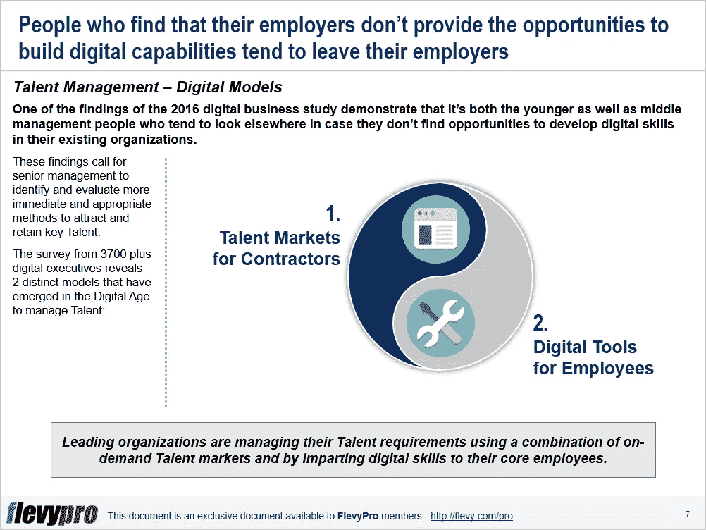

# 数字化转型:管理关键人才的两种不同模式

> 原文：<https://medium.datadriveninvestor.com/digital-transformation-2-distinct-models-to-manage-key-talent-e4e9fdd84831?source=collection_archive---------25----------------------->

传统的[人才管理](https://flevy.com/business-toolkit/talent-management)实践无法满足当今数字世界竞争中的高潜力人才需求。事实上，他们让市场上的关键人才失望了。

麻省理工学院斯隆管理评论(MIT Sloan Management Review)和德勤(Deloitte)对 3700 多名高管进行的 2016 年数字商业研究显示，吸引和留住人才是大型或小型组织最紧迫的问题。该研究表明，仍在使用传统方法管理人才的组织面临着许多紧迫的挑战，包括:

*   在有限的资源内建立新的能力。
*   文化、战略计划、人力资本和层级与组织目标的一致性。
*   吸引、选择和留住关键人才。
*   创建强大的[绩效管理](https://flevy.com/browse/stream/performance-management)，薪酬和福利系统。
*   发现和培养具有关键能力的人才，如前瞻性思维、变革愿景和变革焦点，以及技术技能。
*   提供需要数字技能的机会，吸引并留住关键人才。

2016 年数字商业研究的一项发现表明，年轻和中层管理人员都倾向于寻找其他地方，以防他们在现有组织中找不到发展数字技能的机会。这样的结果要求高级管理层识别、评估和实施更直接和合适的数字技术方法来吸引和留住关键人才。领先的组织现在正在将这些人才转型努力纳入他们的[数字化转型](https://flevy.com/digital-transformation)计划。

对 3700 多名数字原生受访者的研究进一步揭示，领先的组织正在使用两种不同模式的组合来管理他们的人才:

1.  **承包商人才市场**
2.  **员工数字工具**

现在，让我们详细讨论第一种人才管理方法。

# 承包商人才市场

获得合适的人才需要促进与按需人才市场的联系，以便及时获得所需的人才。许多组织从按需人才市场寻求帮助，以在数字商业环境中吸引和留住人才。这些组织追求灵活的招聘模式，利用数字平台来吸引熟练的承包商和顾问。数字人才市场可以根据工作量和所需技能进行扩张或收缩。

数字人才市场可以协调全职员工的工作，并更灵活可靠地覆盖承包商的现场活动。数字平台为评估和管理大型承包商人才库提供了优越的人才市场。一些组织正在尝试开发自己的按需人才市场，而一些组织则与其他组织合作共享人才市场。由高级管理层决定他们是想利用现有的按需人才市场，还是培养自己的人才市场，以确保在需要时获得所需的技能。人才市场可以通过 3 种最佳实践来培育:

1.  **将按需人才市场作为一个社区进行管理**
2.  **平衡全职和兼职人才**
3.  **创造一个让最优秀的人愿意工作的环境**

## 将按需人才市场作为一个社区进行管理

确保所需关键人才的可用性:

*   按需人才市场应被视为战略资源，并根据未来的人才需求精心培育。
*   公司应该投入资源和努力发展自己的人才库。

## 在全职和兼职人才之间取得平衡

人才市场是用来管理自由职业者的。然而，一些组织也开始与他们合作，并部署他们的全职员工从事对建立新能力至关重要的项目工作。这方面的一些考虑包括:

*   公司需要在全职和兼职人才之间取得平衡。
*   一些人更喜欢全职工作，而另一些人则喜欢灵活性或在家工作。
*   一些劳动力提供者甚至提供具有专业技能的退休人员的服务，这些人已被证明是宝贵的资产。
*   公司可以选择按需劳动力供应商，让全职员工保持稳定的员工基础，或者选择兼职承包商来应对工作量激增。

## 创造一个让最优秀的人愿意工作的环境

建立合适的环境对于吸引和留住最灵活、最受欢迎的人才至关重要。大多数公司认为自由职业者或独立承包人不如他们的永久雇员。想要吸引优秀人才的组织应该将承包商视为有价值的资源，并以此对待他们。要获得顶尖人才，组织需要:

*   培养一种有利于支持按需员工的组织文化。
*   设计同等重视承包商和全职员工的薪酬和奖励制度。
*   营造一种氛围，为员工提供有吸引力的工作体验。
*   将员工部署到感兴趣的项目中，让他们体验工作轮换，以提高他们的技能、解决问题的能力、跨部门团队协作，并提高他们的参与度。

有兴趣进一步了解通过数字化转型进行[人才管理的两种不同方法](https://flevy.com/browse/flevypro/digital-transformation-talent-management-5281)？你可以在[Flevy documents market place](https://flevy.com/browse)下载[一个关于**数字化转型:人才管理**的可编辑幻灯片](https://flevy.com/browse/flevypro/digital-transformation-talent-management-5281)。

## 你在这个框架中找到价值了吗？

您可以从 [FlevyPro 库](https://flevy.com/pro/library)下载关于这个和数百个类似业务框架的深入介绍。 [FlevyPro](https://flevy.com/pro) 受到 1000 名管理顾问和企业高管的信任和使用。有些人不得不说:

> “我的 FlevyPro 订阅为我提供了当今市场上最受欢迎的框架和平台。它们不仅增加了我现有的咨询和辅导产品和服务，还让我跟上了最新的趋势，为我的实践激发了新产品和服务，并以其他解决方案的一小部分时间和金钱教育了我。我强烈推荐 FlevyPro 给任何认真对待成功的顾问。”

–比尔·布兰森，战略商业建筑师事务所创始人

> “作为一家利基战略咨询公司，Flevy 和 FlevyPro 框架和文件是一个持续的参考，有助于我们为客户构建我们的调查结果和建议，并提高他们的清晰度、力度和视觉效果。对我们来说，这是增加我们影响力和价值的宝贵资源。”

–Cynertia Consulting 的咨询区域经理 David Coloma

> “作为一个小企业主，FlevyPro 提供的资源材料已被证明是非常宝贵的。根据我们的项目事件和客户要求按需搜索材料的能力对我来说很棒，并证明对我的客户非常有益。重要的是，能够针对特定目的轻松编辑和定制材料有助于我们进行演示、知识共享和工具包开发，这是整个计划宣传材料的一部分。虽然 FlevyPro 包含任何咨询、项目或交付公司都必须拥有的资源材料，但它是小公司或独立顾问工具箱中必不可少的一部分。”

–变革战略(英国)董事总经理迈克尔·达夫

> “作为一名独立的成长顾问，FlevyPro 对我来说是一个很好的资源，可以访问大量的演示知识库来支持我与客户的合作。就投资回报而言，我从下载的第一个演示文稿中获得的价值是我订阅费用的好几倍！这些资料的质量让我能够打出超出自己体重的水平，这就像是用很小一部分开销就能获得四大咨询公司的资源一样。”

–Roderick Cameron，SGFE 有限公司的创始合伙人

> “我每个月都会浏览几次 FlevyPro，寻找与我面临的工作挑战相关的演示文稿(我是一名顾问)。当主题需要时，我会进一步探索，并从 Flevy 市场购买。在所有场合，我都阅读它们，分析它们。我采纳与我的工作最相关和最适用的想法；当然，所有这些都转化为我和我的客户的利益。"

量子 SFE 公司首席执行官奥马尔·埃尔南·蒙特斯·帕拉

在 [**管理和企业咨询**](https://app.ddichat.com/category/management-and-corporate-consulting) **:** 中安排一个 DDIChat 会话

 [## 专家-管理和企业咨询- DDIChat

### DDIChat 允许个人和企业直接与主题专家交流。它使咨询变得快速…

app.ddichat.com](https://app.ddichat.com/category/management-and-corporate-consulting) 

在这里申请成为 DDIChat 专家[。
与 DDI 合作:](https://app.ddichat.com/expertsignup)[https://datadriveninvestor.com/collaborate](https://datadriveninvestor.com/collaborate)
点击此处订阅 DDIntel [。](https://ddintel.datadriveninvestor.com/)