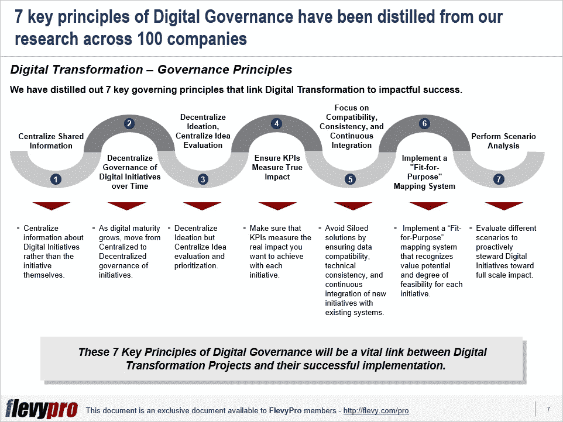

# 数字化转型:推动您数字化转型之旅走向成功的最重要因素是什么？

> 原文：<https://medium.datadriveninvestor.com/digital-transformation-what-is-that-high-priority-factor-to-catapult-your-digital-transformation-b3e06a4bf0b3?source=collection_archive---------25----------------------->

所有行业的高管都在利用数字技术的进步，如分析、移动、社交媒体和智能嵌入式设备，来转变他们的业务。他们正在改变客户互动、内部业务流程，甚至他们的业务模式，以利用新的技术能力。

不断发展的数字环境要求高管们动态地设计和管理他们的数字计划组合。

《全球数字化转型支出指南》中发布的最新研究结果表明，这些转型努力中的大部分都未能达到或超出预期。

根据麻省理工学院 2019 年进行的一项研究，与治理相关的问题对于大多数公司中领导[数字化转型](https://flevy.com/browse/stream/digital-transformation)工作的人来说具有“高优先级”。该数据反映了 1030 名数字高管的反馈，表明数字计划的无效结构和治理是他们失败或交付低于标准结果的主要原因

首席信息官们经常感叹企业高管缺乏数字敏锐度。德鲁克管理学院(Drucker School of Management)在其关于该主题的一份出版物中提出了一种见解，即单功能视角是成功数字化转型的障碍。他们研究中的一位受访者略带绝望地说，“我们 90%的一般管理团队根本不懂技术。普通的董事会成员并不比街上的任何人更了解技术。”

有效的[数字化转型治理](https://flevy.com/browse/flevypro/digital-transformation-governance-5079)将满足组织中不同利益相关者的需求。

基于对 100 多家公司的数字化挑战的研究和对 55 位数字化高管的采访，我们总结出了 7 条将数字化转型与卓有成效的成功联系起来的关键管理原则。

1.  **集中共享信息—** 集中关于数字计划的信息，而不是计划本身。
2.  **随着时间的推移，分散数字计划的治理—** 随着数字成熟度的增长，从计划的集中治理转移到分散治理。
3.  **分散思维。集中想法评估** —分散想法，但集中想法评估和优先排序。
4.  **确保 KPI 衡量真实影响** —确保 KPI 衡量您希望每个计划实现的真实影响。
5.  **关注兼容性、一致性和持续集成** —通过确保数据兼容性、技术一致性以及新计划与现有系统的持续集成，避免孤立的解决方案。
6.  **实施一个“适合目的”的映射系统** —实施一个“适合目的”的映射系统，识别每个计划的价值潜力和可行性程度。
7.  **执行场景分析** —评估不同的场景，积极引导数字化计划产生全面影响。

有兴趣更多地了解 7 项关键原则和[数字化转型治理](https://flevy.com/browse/flevypro/digital-transformation-governance-5079)？您可以在 Flevy documents marketplace 上了解更多信息，并下载关于**数字化转型治理**的可编辑 [PowerPoint。](https://flevy.com/browse/flevypro/digital-transformation-governance-5079)

## 你在这个框架中找到价值了吗？

你可以从 [FlevyPro 库](https://flevy.com/pro/library)下载关于这个和数百个类似业务框架的深入介绍。FlevyPro 得到了数千名管理顾问和企业高管的信任和使用。有些人不得不说:

> “我的 FlevyPro 订阅为我提供了当今市场上最受欢迎的框架和平台。它们不仅增加了我现有的咨询和辅导产品和服务，还让我跟上了最新的趋势，为我的实践激发了新产品和服务，并以其他解决方案的一小部分时间和金钱教育了我。我强烈推荐 FlevyPro 给任何认真对待成功的顾问。”

–比尔·布兰森，战略商业建筑师事务所创始人

> “作为一家利基战略咨询公司，Flevy 和 FlevyPro 框架和文件是一个持续的参考，有助于我们为客户构建我们的调查结果和建议，并提高他们的清晰度、力度和视觉效果。对我们来说，这是增加我们影响力和价值的宝贵资源。”

–Cynertia Consulting 的咨询区域经理 David Coloma

> “作为一个小企业主，FlevyPro 提供的资源材料已被证明是非常宝贵的。根据我们的项目事件和客户要求按需搜索材料的能力对我来说很棒，并证明对我的客户非常有益。重要的是，能够针对特定目的轻松编辑和定制材料有助于我们进行演示、知识共享和工具包开发，这是整个计划宣传材料的一部分。虽然 FlevyPro 包含任何咨询、项目或交付公司都必须拥有的资源材料，但它是小公司或独立顾问工具箱中必不可少的一部分。”

–变革战略(英国)董事总经理迈克尔·达夫

> “作为一名独立的成长顾问，FlevyPro 对我来说是一个很好的资源，可以访问大量的演示知识库来支持我与客户的合作。就投资回报而言，我从下载的第一个演示文稿中获得的价值是我订阅费用的好几倍！这些资料的质量让我能够打出超出自己体重的水平，这就像是用很小一部分开销就能获得四大咨询公司的资源一样。”

–Roderick Cameron，SGFE 有限公司的创始合伙人

> “我每个月都会浏览几次 FlevyPro，寻找与我面临的工作挑战相关的演示文稿(我是一名顾问)。当主题需要时，我会进一步探索，并从 Flevy 市场购买。在所有场合，我都阅读它们，分析它们。我采纳与我的工作最相关和最适用的想法；当然，所有这些都转化为我和我的客户的利益。"

量子 SFE 公司首席执行官奥马尔·埃尔南·蒙特斯·帕拉

在 [**管理和企业咨询**](https://app.ddichat.com/category/management-and-corporate-consulting) **:** 中安排一个 DDIChat 会话

 [## 专家-管理和企业咨询- DDIChat

### DDIChat 允许个人和企业直接与主题专家交流。它使咨询变得快速…

app.ddichat.com](https://app.ddichat.com/category/management-and-corporate-consulting) 

在这里申请成为 DDIChat 专家[。
与 DDI 合作:](https://app.ddichat.com/expertsignup)[https://datadriveninvestor.com/collaborate](https://datadriveninvestor.com/collaborate)
点击此处订阅 DDIntel [。](https://ddintel.datadriveninvestor.com/)