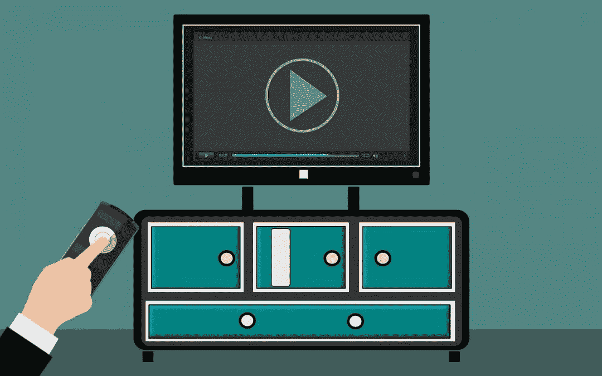
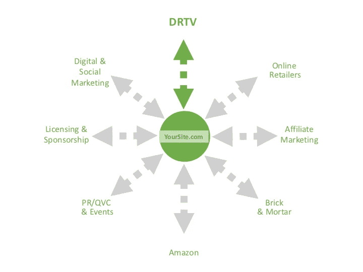

# 直接反应电视在这里停留。原因如下…

> 原文：<https://medium.datadriveninvestor.com/direct-response-tv-is-here-to-stay-heres-why-e91e49ef5a35?source=collection_archive---------5----------------------->

我最近读了一篇关于 DRTV 持久力的文章，这让我想起了我自己参与的直接回应营销——特别是这些年来发生了什么变化以及什么保持不变。在过去的 30 年里，我利用电视为 Juiceman 榨汁机、Sonicare 牙刷、乔治·福尔曼烤架和 GoPro 相机等产品发起了直接面向消费者的宣传活动。这些营销活动的营销基础继续分享许多相同的基本原则——真实的证明、有吸引力的报价和具体的行动号召。然而,**消费者体验视频的方式越来越多，这就需要更全面的营销策略——在众多分销渠道中培养客户群的信任和忠诚度。**光有一个伟大的产品是不够的。要在当今复杂的销售环境中取得成功，你需要一个企业对消费者的渠道网络，电视广告仍然可以推动销售。

 [## 在创业之旅中，拥抱学习|数据驱动的投资者

### 好像建立一个数百万美元的公司还不够困难，企业家必须额外照顾他们的…

www.datadriveninvestor.com](https://www.datadriveninvestor.com/2018/10/16/on-the-entrepreneurial-trek-embrace-the-learning/) 

**360 度战略**

10 年前，创造一个产品需要很长时间，你也有时间建立一个品牌。今天，几乎同时出现了相互竞争的选项，消费者只需点击一下鼠标，就能获得不同的选择。以搅拌机为例。一个卖家看到每个人都在买搅拌机，决定尽可能便宜地采购。他们现在可以以低于竞争对手的价格提供搅拌机——至少在六七个其他卖家注意到活动增加并以更低的价格在亚马逊上列出他们的搅拌机之前是如此。现在每个人都在争夺购买箱，降低价格；导致“竞相杀价”，因为他们只在价格上竞争。在这种情况下，没有什么独特的产品或包装，没有品牌。这是利润杀手。更糟糕的是，你无法与客户建立长期关系。

在这样的市场环境中，品牌的一个大问题是:**你如何让你的产品与众不同，这样当人们想到那个产品或类别时，他们就会购买你的产品——即使他们不得不为此付出更多？**我目前与许多亚马逊卖家合作，帮助他们在亚马逊上创建自己的品牌标识，并为愿意购买下一个产品的快乐顾客建立强大的数据库。这需要一个**多步骤营销方法**在直复营销的保护伞下，如下图所示:

**事情的核心**

每次我会见潜在客户时，我都会用这个例子来展示视频营销如何从我的直接面向消费者营销活动战略的中心推动业务。30 年前，我的战略是从电视广告开始的，而今天，我鼓励我的客户首先建立一个网站。这是他们业务的核心，他们可以在这里发展自己的起源故事，推出自己的品牌。这将使你在竞争中脱颖而出。从这里开始，**是视频推动了营销活动的关系建立要素，将有针对性的信息带给客户群，并号召他们采取具体行动来促进销售**。

电视广告的广告支出正在上升，因为为各种营销渠道带来流量的机会正在激增。**把电视加入你的营销组合就像往火上浇油。**它之所以有效，是因为视频的基本组成部分允许观众以某种方式与你的信息建立联系。以下是一些有趣的统计数据，说明为什么视频如此强大:

*   观众在观看视频时能记住 95%的信息，相比之下，以文本形式阅读时只能记住 10%
*   社交视频产生的份额比文本和图像的总和多 1，200 %( small biz 趋势)
*   在登录页面上包含视频可以提高 80%的转化率
*   64%的消费者在观看品牌社交视频后购买(Tubular Insights)

**你应该使用视频的五大理由**

**1 —我们正在成为视频第一社会**

每秒将产生近 17000 小时的新视频。如今，科技让每个人都能轻松制作视频。研究显示，到 2019 年，近 80%的互联网流量将由视频构成。

**2 —视频是一种强大的营销工具**

当你看视频时，你是在使用你的两种感官，而不是一种。此外，我们伴随着电视长大，我们倾向于相信我们在电视上看到的东西。最重要的是，人们只是喜欢与他们了解和信任的品牌做生意，视频是让潜在客户与人脸或声音以及个性联系的最佳方式。所有这些都使得情感的交流比仅仅通过文本更加有力。

**3 —视频让你传播你的起源故事**

当你分享自己真实的故事时，你与你的观众建立了强有力的联系，这有助于建立忠诚度和信任，使你在竞争中脱颖而出，并发展你的品牌。将这个故事固定下来，并在视频上分享，可以让它被讲述和重复讲述，这是当今数字市场的一个重要优势。

**4 —展示社会证明的有效方式**

视频是收集真实证明的理想格式。这些信息应该来自那些已经购买或尝试过你的产品或服务的特定目标人群，他们可以用他们的精彩言论来影响他人。推荐有助于建立打破购买障碍所需的可信度。这里的关键是建立对你所卖的东西和你的公司的信任。

**5 —通过视频，你可以建立信誉和权威**

人们倾向于追随权威人物。视频让你有机会通过一个代表你品牌的人物——代言人——与观众建立联系。事实一次又一次地证明，与只使用图像(或图像和画外音)相比，让一个人在屏幕上传递信息可以提高参与度和信息的有效性。

了解到直接面向消费者的电视营销正在兴起，对于像我这样几十年来一直使用视频销售产品的人来说是一个好消息。对于所有卖家来说，这也是一个好消息，因为如今视频无处不在，而且有多种新的渠道来部署视频。然而，电视本身不再推出价值十亿美元的品牌。但是，将视频营销融入 360 度直接回应策略可以让你从其他卖家中脱颖而出，让你走上创建成功品牌的道路。

最初发表于[瑞克·切萨里](https://rickcesari.com/direct-response-tv-is-here-to-stay-heres-why/)

Rick Cesari 自 1994 年以来一直从事直接回应和视频营销行业，自 1999 年以来一直从事咨询工作。他的热情是继续这项工作，并与组织分享这方面的知识。你可以在 RickCesari.com 的[上关注他的最新消息。](https://rickcesari.com/)