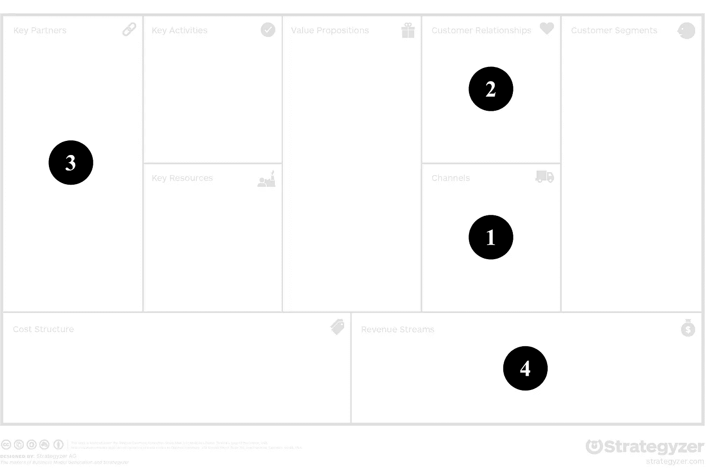

# 直销电子商务平台

> 原文：<https://medium.datadriveninvestor.com/direct-selling-e-commerce-platforms-126080dc0292?source=collection_archive---------3----------------------->

Direct selling e-commerce platforms — a new digital business model

如今，越来越多的公司依靠电子商务战略来销售和接触他们的客户。许多公司必须面对的决定是，是托管网上商店还是去像亚马逊那样的零售市场。两种选择都有优点和缺点。虽然托管包括管理供应链活动(如运输、支付和仓库管理)的巨大努力，但零售市场可能会限制在线存在的定制或给销售利润带来压力。还有第三种选择——电子商务平台允许公司管理他们的网上商店和所有的供应链活动。在数字时代，随着顾客行为的改变，第三种选择越来越注重顾客关系。

# **电子商务模式**

Gassmann 等人([链接](https://amzn.to/3cVP9Rq))已经将电子商务视为一种传统的商业模式，允许公司通过互联网以电子方式提供产品和服务。在线渠道消除了实体经营商店的需要。这种模式将提供产品的公司和可能购买这些产品的不同客户群体结合在一起。一方面，客户受益于更高的可访问性，另一方面，公司受益于廉价且易于维护的销售渠道。
零售市场为公司提供了一个广阔的客户群。例如，亚马逊的在线商店将几个品牌整合到一个市场中，在那里顾客可以买到各种不同的产品。在过去十年中，亚马逊成为最大的互联网零售商，许多公司选择它作为主要销售渠道。在描述不断变化的数字社会的特征之前，可能会强调客户细分的缺乏差异和竞争的共存。

# **业务转型和客户关系**

关于数字化转型的讨论强烈包括数字原生者，这是一群在技术时代出生和长大的人。这一客户群的一个方面比以往任何时候都更加重要——数字适应。数字原住民熟悉不断变化的技术和持续的变化，因为他们一直面临着它。他们被一切新的和创新的事物所吸引。因此，公司必须理解这种适应的特征，并且必须能够跟上不断变化的顾客感知。

直销策略可能有助于跟上客户的认知，更好地满足客户的需求。这种数字商业模式指的是这样一种场景:产品不是通过受管理的零售市场销售，而是直接从网上商店购买。这样，公司就可以建立客户体验，改善客户关系。此外，直销免除了与零售商市场相关的费用，可以增加收入来源。

# **直销电子商务平台模式**

直销电子商务平台模式的主要特征包括以下几个部分:

1.  **渠道:**该模式为如何向客户提供产品和服务提供了新的渠道。在某一点上，该模式也可以补充现有的渠道，例如实体商店，或者使现有的渠道过时，例如无利可图的零售市场存在。
2.  **客户关系:**根据客户的感知定制网上商店，通过创造一种软锁定，使客户难以离开，从而改善客户关系。客户群可以通过定制的在线展示来定位，而不再是一般化的。
3.  **关键合作伙伴:**平台提供商必须被视为一个新的关键合作伙伴，不仅要为在线展示做出贡献，还要为运输、支付和仓库管理等供应链活动做出贡献。
4.  **收入流:**收入模式包括遵循定制销售模式的直销。由于没有中间商，这种策略具有尽可能大的灵活性，并且不依赖于零售商的控制。

根据 Osterwalder 和 Pigneur ( [链接](https://amzn.to/2xQabSX))将特征映射到业务模型画布(BMC)中，可以最好地解释模式的影响，以显示他们在哪里采取行动。

Direct selling e-commerce platforms pattern in the BMC

# **Shopify 和 B2C 零售的未来**

有许多不同的电子商务平台提供商来经营网上商店。不完全列表包括 Magento、BigCommerce、Volusion、WooCommerce 和 Shopify。虽然它们都有优点和缺点，但是 Shopify 被示例性地选择来提供对该模式的更多见解，因为该提供商似乎提供了成熟的功能并提供了高度的灵活性。Shopify 的愿景是通过提供零售业所需的所有功能，让所有公司(从初创公司到大型企业)尽可能轻松地开展电子商务。

Shopify 以软件即服务的方式提供电子商务平台。通过一体式解决方案，可以绕过基础设施设置和运营等障碍。使用 Shopify 可以轻松创建在线商店，因为它直观、方便，并允许您从提供商店管理、营销、产品管理、网站托管和支持的应用程序商店中选择预定义的功能和特性。Shopify 的平台基于云托管，因此不同于其他平台提供商，如 Magento，后者往往是本地解决方案。借助集成的虚拟主机，Shopify 可以让您轻松专注于品牌展示，而不是供应链活动。该平台负责维护视图峰值的可扩展性、保持商店可用性的可靠性以及更新功能的部署。Shopify 提供多种级别的订阅计划，非常适合中小型公司。然而，Shopify 还提供了一个 Plus 版本，这是一个面向企业的平台，面向大公司的电子商务。此版本包括更大容量的选项和附加功能，以确保可扩展性和分析能力。Shopify 的商业模式旨在确定较低的月订阅费，并通过提供支付处理、仓库优化和运输来赚钱。这种策略为开设网上商店设置了较低的门槛，并让 Shopify 在商店的每笔销售中分享其成功。

# **举例:史泰博的网上商店**

通过提及关于 Staple 在线表示的案例研究([链接](https://www.shopify.com/plus/customers/staples))，可以给出更多的想法和细节。史泰博是一家办公用品供应商，在全球范围内开展不同的业务，业务源自美国。过去，他们想出了一个定制的电子商务平台，提供在线商店，负责送货、支付和仓库管理。该平台服务于其目的，但没有提供足够的灵活性来满足不断增长的市场，因为它需要网络托管和供应链活动的基础设施。重新搭建电子商务平台的最大挑战是整合 Staple 的资源规划系统——它们是一切的核心。选择迁移到 Shopify Plus 使 Staples 能够在 12 个月内使用预定义的电子商务功能以令人钦佩的成本重新搭建在线平台。史泰博将其庞大而复杂的在线商店转变为一个方便且易于管理的电子商务平台。新电子商务平台的特点是对新促销活动做出即时反应的灵活性，满足客户意见高峰的稳定性，以及降低供应链活动高成本的托管基础设施。

你怎么知道一个商店是不是用 Shopify 创建的？将 */admin* 添加到网上商店的基本 URL，看看是否会重定向到用于管理商店的 Shopify 登录页面。访问史泰博的加拿大网店([链接](https://www.staples.ca/))自己测试一下。

# **最佳实践**

有几个可以利用直销电子商务平台模式的最佳实践:

*   超个性化:为不同的客户群提供不同的网上商店可以改善客户体验。例如，为年轻受众创建一个现代、时髦的网上商店，为商业受众创建一个优雅的网上商店，这给人一种完全不同的感觉。
*   **无头电子商务:**平台提供了集成您自己的前端和通过标准化 API 使用其供应链功能的选项。该选项提供了定制在线商店外观和感觉的所有灵活性。
*   **直运:**网上商店的一大努力是维护仓库，在可以订购产品之前存储产品。现代电子商务平台将产品存储为服务，减少了对仓库和复杂交付模式的需求。
*   **销售点:**目前还没有考虑实体店销售产品。如果需要以这种方式提供产品，后台也可以集成到电子商务平台中，并配备零售硬件。

# **相关模式**

模式最好与其他模式结合使用，以利用可能的优势并减少显著的负面影响。体验销售模式([链接](https://amzn.to/3cVP9Rq))与直销电子商务平台模式直接相关，因为数字原住民希望改善客户体验。遵守这一点的影响是更高的需求和定价的灵活性。顾客体验不仅仅包括像星巴克这样的极端例子，更重要的是，一个无缝的商店展示可以提供独特的顾客体验。丰富网上商店顾客体验的一个想法是在网上展示中融入更多的内容。这可以是一种杂志式的方法，通过这种方法，网上商店可以提供一种生活方式的体验，或者是一种品牌意识的方法，让人们深入了解公司的过去及其崇高的目标。Dollar Shave Club 就是一个例子，它遵循一种针对大胡子男性的生活体验方式，允许他们认同原创内容。它不需要火箭科学，也不需要一种现代的网络表现形式，包括好看的插图、合适的描述和作为博客帖子发布的流行话题。

# **结论和最终想法**

许多公司选择在网上销售他们的产品和服务。虽然有许多方法可以做到这一点，例如使用受管理的零售市场，但电子商务平台提供了便利性和灵活性。随着数字化转型，为了跟上快速变化的客户认知，客户体验变得越来越重要。一种直接向目标客户群销售产品的方式允许公司通过提供定制内容来加强客户关系。Shopify 是一家电子商务平台提供商，使公司能够创建直销在线商店，包括支付、运输和仓库管理等供应链活动。此外，Staples 的例子表明了 Shopify 对公司陈旧的电子商务战略进行现代化改造的益处。

# **进一步阅读**

下面的阅读材料将帮助你更好地梳理上述主题。

> **数字时代的商业模式(** [**链接**](https://medium.com/@marcelpaulboer/business-models-of-a-digital-era-5a530ccbd52f) **)**
> 不要错过这篇关于数字化转型和数字原生者如何改变商业的文章。随着新兴技术和客户行为的采用，企业呈现出各种新的商业模式，模式面临数字化时代的特征。

> **数字业务和电子商务管理(** [**链接**](https://amzn.to/2L03qki) **)**
> 数字业务和电子商务管理正在汇集数字化转型和电子商务的所有重要方面，包括数字通信和内容营销。提供一种结构化的方法来规划和实施数字电子商务战略，有助于了解公司面临的变化速度。