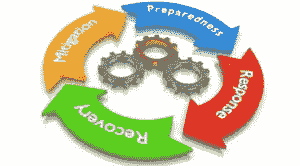

# 组织的灾难恢复策略

> 原文：<https://medium.datadriveninvestor.com/disaster-recovery-strategies-for-organizations-e0c4a460b593?source=collection_archive---------20----------------------->

Photo by [Matthew Henry](https://unsplash.com/@matthewhenry?utm_source=medium&utm_medium=referral) on [Unsplash](https://unsplash.com?utm_source=medium&utm_medium=referral)

**来源:** [**CIOReview**](https://www.cioreview.com?utm_source=medium&utm_campaign=mediumpost&utm_medium=medium)

组织在灾难恢复时最容易受到攻击。这是一次豪华的手术，需要每个队员都为迅速而彻底的康复做好准备。网络罪犯总是在寻找系统中的任何漏洞，以窃取有价值的数据和知识。这通常是企业付出额外努力来保护其数据的理由，尤其是在灾难恢复操作期间。

在采用安全的灾难恢复解决方案之前，企业需要考虑几个步骤。以下是灾难恢复期间注意安全的几个要点:

**保持一致:**公司必须在常规运营中保持无懈可击的安全标准，以顺利完成灾难恢复，避免遭受攻击。企业的每个组成部分，如软件、硬件、身份管理等。灾难恢复的核心应该是在整个传统业务流程中保持同等的安全标准。

**保持强大:**访问和授权是最新企业 IT 系统的基本组成部分。企业必须保护这些系统，以确保当主系统遭受灾难事件时，可以访问 API 和登录屏幕。

**坚持计划:**灾难恢复计划不应在灾难发生后开始。企业应该在现有技术和流程中融入安全的灾难恢复流程。企业在规划灾难恢复时应该检查各种安全措施。例如，企业应该加密所有敏感数据，并将所有备份和复制数据发送到辅助站点。企业应确保与灾难恢复相关的所有文档都不应包含密码，并且应安全地存储在异地服务中，以便在发生灾难时可以直接访问。

**构建层:**多层安全方法可以实现高效的灾难恢复。企业应该有加密和安全的连接，在灾难恢复期间使用。灾难恢复的备份计划可以帮助企业轻松完成灾难恢复，而不会造成任何损失。

 [## 提高网络安全的最低成本和最有效途径|数据驱动型投资者

### 在组织在 2020 年面临的诸多挑战中，网络安全(或缺乏网络安全)已成为新闻报道的焦点…

www.datadriveninvestor.com](https://www.datadriveninvestor.com/2020/09/04/the-lowest-cost-most-effective-path-to-better-cybersecurity/) 

> **变更控制:灾难恢复的基本要素**

由于存在相当大程度的风险，组织需要关注海量的知识，并随着时间的推移使其更加安全，这变得至关重要。安全问题是所有公司最关心的问题，灾难恢复(DR)对于任何组织的生存都至关重要。还没有一家公司没有因为某个事件或灾难而遭受意外的知识损失。强大而高效的现场灾难恢复(DR)计划是 IT 领域中敏捷而高效的组织的支柱。顾名思义，灾难恢复(DR)涉及公司的一组规则和法规，以便在发生人为灾难或自然灾害时能够恢复有价值的数据并继续重要的系统基础架构。当今灾难恢复中最重要的挑战之一是，大多数程序都是过时的，与当今不断变化的现实不同步。如果您向任何 IT 专业人员询问他们针对组织的灾难恢复计划，答案将是他们必须深入了解这一事实。IT 领域的发展速度如此之快，以至于每个组织都必须有一个行之有效的灾难恢复策略来避免任何不幸或灾难。灾难恢复计划与当今现实脱节的原因有很多:

这个项目本来只是为了分析，现在却被抛弃在组织的某个遥远的角落里。该程序已经过时，不符合本要求。该程序的陈旧本质使其不适合在今天的环境中使用。
·完全没有适当的变更控制流程，很多时候他们没有考虑灾难恢复(DR)计划。

根据 Gartner 的调查，大约 51%的受访者按照预设和预先确定的维护周期对灾难恢复计划进行了更改，而 35%的受访者委托变更管理流程来制定高效的灾难恢复(DR)计划。

没有什么事情会按计划进行，随机是统治宇宙的法则，而变化是唯一不变的。那么，我们该怎么办呢？我们是不是应该制定计划，希望它们尽可能好，然后放弃自己，让充满敌意的宇宙嘲笑我们，积极地不相信这些计划？不，我们必须为变化做好准备，小心翼翼地避免任何不幸或灾难，支持我们过去的经验和努力。

变革管理正是这样做的。这是一个适当的过程，确保产品或过程的变更与变化的需求一致，并以受控和协调的方式引入和实施。它降低了不必要的变化在没有积极计划和分析的情况下发生的可能性，这种变化可能导致系统或流程中的错误。灾难恢复(DR)计划期间变更管理的目的是减少运营中断，并经济高效地利用可用资源来实施这些变更。

出于几个原因，变更管理可能是灾难恢复车轮中的一个重要齿轮。变更管理通过密切关注灾难恢复计划和记录敏感信息提供了各种好处。这也有助于避免某些问题，如由于没有现场计划而无法回复事件。下面列出了构成任何变更管理流程核心的一些重要活动:

1)发现潜在变化的能力。彻底分析和评估每一个变更请求。精心计划，并在一段时间内根据需要实施改变。审查并关闭变更流程。

缺少变更管理是任何灾难恢复(DR)计划的主要敌人之一。实际上，现场缺乏任何变更管理流程可能会导致灾难恢复计划失败。但是，变革管理流程还有另一个方面——由于缺乏资源，中小型企业(SMB)在涉及变革管理时会发现自己尤其面临挑战。公司的灾难恢复计划应旨在规划和开发一个强大的变更管理流程，以满足任何可能发生的情况，并使组织能够尽可能有效地从人为灾难或自然灾害中恢复。一个整洁的 DRP 应该以 24 小时解决和恢复为目标。

**分揣摩**

业务影响分析包括指定的 IT 专业人员仔细观察整个灾难恢复计划，并完成评估以发现危险和威胁。
灾难恢复(DR)并不是一件真正复杂的事情，各种形式和规模的企业都应该正确检查当前流行的灾难恢复方法，并据此开展工作。
在评估变更的影响时，应注意确保变更控制管理考虑到灾难恢复计划。
·不要坐等闪电来更新当前的灾难恢复环境。
灾难恢复是一个持续的过程，应予以适当关注。它具有同等的价值，因为生产系统和组织应该以与装配过程中相同的方式检验灾难恢复。

变更控制和灾难恢复对于任何组织来说都是必须的，人们应该以一种适当的和有条理的方式来检查它，以便保护组织免受由于计划不周的变更而造成的任何影响。变更控制有助于使生产和灾难恢复环境保持完全同步，从而提高生产效率。

**新闻来源:**

[**有效的灾难恢复操作策略**](https://www.cioreview.com/news/strategies-for-an-effective-disaster-recovery-operation-nid-28077-cid-106.html?utm_source=medium&utm_campaign=mediumpost&utm_medium=medium)

**访问专家视图—** [**订阅 DDI 英特尔**](https://datadriveninvestor.com/ddi-intel)