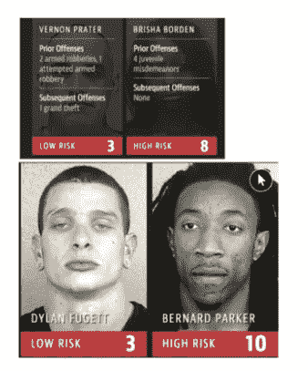
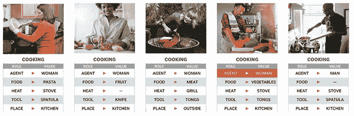
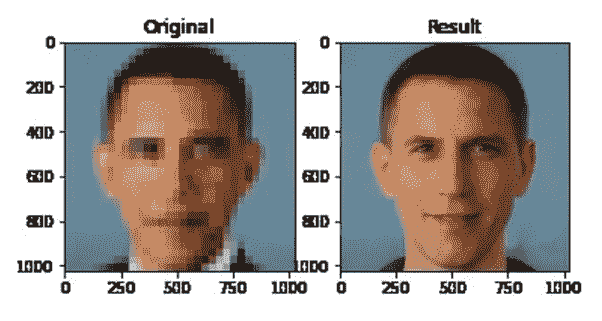
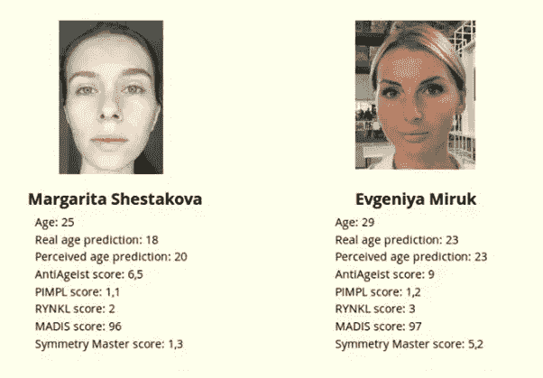
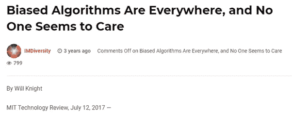
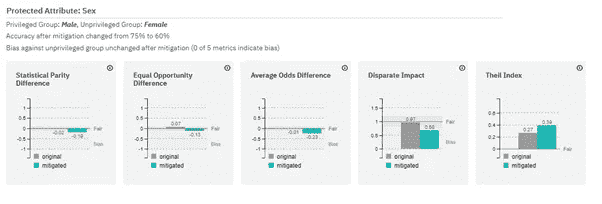

# 区分意识机器学习模型

> 原文：<https://medium.datadriveninvestor.com/discrimination-conscious-machine-learning-models-9bf5efaad8ec?source=collection_archive---------14----------------------->

## [机器学习](https://towardsai.net/p/category/machine-learning)，[观点](https://towardsai.net/p/category/opinion)，数据科学

## 从历史的角度来看，看不到人类偏见产生的问题是不可想象的。现在通过过程放大这一点，你开始确切地感觉到**人类偏见**到 **AI** 有多危险。

Photo by [h heyerlein](https://unsplash.com/@heyerlein?utm_source=medium&utm_medium=referral) on [Unsplash](https://unsplash.com?utm_source=medium&utm_medium=referral)

关于由人工智能**控制的框架**的许多令人担忧的区域在影响人们生活的环境中被传达，这是一个令人担忧的领域。

[ProPublica](https://www.propublica.org/article/machine-bias-risk-assessments-in-criminal-sentencing) 发表文章表示，全国各地用来预测未来违法者的算法偏向于特定的非白人个体。看了一眼这个，我想我们是否可以计划一些事情来利用现有的解决方案解决这个困难。

此外， [psychologytoday](https://www.psychologytoday.com/us/blog/psyched/201801/law-enforcement-ai-is-no-more-or-less-biased-people) 发表了一篇文章称，根据 COMPAS 算法，做坏事的黑人被认为是有罪的白人的两倍，被认为具有更高的危险性，但并不是真正的再次愤怒。

而 **COMPAS 算法**给出了与白人罪犯相反的结果:尽管他们的犯罪历史显示再次犯罪的可能性更高，但他们被认为比黑人罪犯风险更低。

Source: [https://www.psychologytoday.com/us/blog/psyched/201801/law-enforcement-ai-is-no-more-or-less-biased-people](https://www.psychologytoday.com/us/blog/psyched/201801/law-enforcement-ai-is-no-more-or-less-biased-people)

此外，在这个机器学习模型中，当照片是男性时，该框架已经知道如何在任何情况下将个人烹饪识别为女性。

Source: [https://www.wired.com/story/machines-taught-by-photos-learn-a-sexist-view-of-women/](https://www.wired.com/story/machines-taught-by-photos-learn-a-sexist-view-of-women/)

**另一个例子**，将美国总统巴拉克·奥巴马的低分辨率照片输入一个旨在创建去像素化人脸的算法，结果是一个白人。

Source: [https://www.vice.com/en/article/7kpxyy/this-image-of-a-white-barack-obama-is-ais-racial-bias-problem-in-a-nutshell](https://www.vice.com/en/article/7kpxyy/this-image-of-a-white-barack-obama-is-ais-racial-bias-problem-in-a-nutshell)

此外，抽样偏见导致人工智能选美比赛将所有奖项授予白人。它显示了人工智能中的阴影物质。

[公布的结果](http://winners2.beauty.ai/)显示，在 44 名被计算出具有吸引力的个人中，除了 6 名亚洲人之外，所有的领导者都是白人。

Source: [http://winners2.beauty.ai/](http://winners2.beauty.ai/)

此外，2019 年推出的苹果信用卡遇到了严重的问题，当时用户看到，由于苹果卡没有看到性别，它似乎很少向女性提供信贷延期。

这种令人眼花缭乱的性别算法最终可能会一边倒地对女性不利，只要它利用了任何碰巧与性别相关的信息或数据源。

同样，在 2018 年，亚马逊致力于机械化雇佣程序的人工智能工具必须被关闭，理由是它压迫女性。

Source: [https://www.datafaces.net/biased-algorithms-are-everywhere-and-no-one-seems-to-care/](https://www.datafaces.net/biased-algorithms-are-everywhere-and-no-one-seems-to-care/)

# **解决这个不公平的问题**

*   **重新加权**:重新加权是一种数据预处理方法，建议在每个(组，标签)混合中为训练模型产生不同的权重，以保证分类前的得体性。

思想是将合适的权重应用于训练数据集中的各种元组，以使训练数据集相对于敏感属性没有分离。

除了重新加权之外，还可以应用其他方法(非歧视性约束)，例如，抑制(删除易受攻击的属性)或摩擦数据集—更改标签(适当更改标签以排除训练数据中的不公平性)。

*   **优化预处理**:想法是熟悉一种概率变化，这种概率变化通过群体公平、个体残缺和数据恒常性要求和目标来改变数据中的变量和标签。
*   **对抗性去偏置**:找出一个分类器模型来增加预测的准确性，同时减少对手从预测中决定屏蔽属性的能力。

这种方法促进了合理的分类器，因为预测不能传达对手可能滥用的任何群体歧视数据。

*   **拒绝选项分类**:其思想是在具有最高值得注意的不确定性的决策边界周围的确定性带中，将正面结果给予非特权群体，将麻烦结果给予特权群体。

使用 [AI Fairness 360](http://aif360.mybluemix.net/data) 和应用优化的预处理导致了优越的执行模型。

Source: [http://aif360.mybluemix.net/data](http://aif360.mybluemix.net/data)

您了解了构建更高性能模型的偏差缓解策略，同时确保模型的区分度较低。

*现在，把你的想法放在****Twitter*******Linkedin****，以及****Github****！！**

****同意*** *还是* ***不同意*** *与绍拉夫·辛拉的观点和例子？想告诉我们你的故事吗？**

**他对建设性的反馈持开放态度——如果您对此分析有后续想法，请在下面的* ***评论*** *或伸出手来！！**

**推文*[***@ SauravSingla _ 08***](https://twitter.com/SAURAVSINGLA_08)*，评论*[***Saurav _ Singla***](http://www.linkedin.com/in/saurav-singla-5b412320)*，还有明星*[***SauravSingla***](https://github.com/sauravsingla)*马上！**