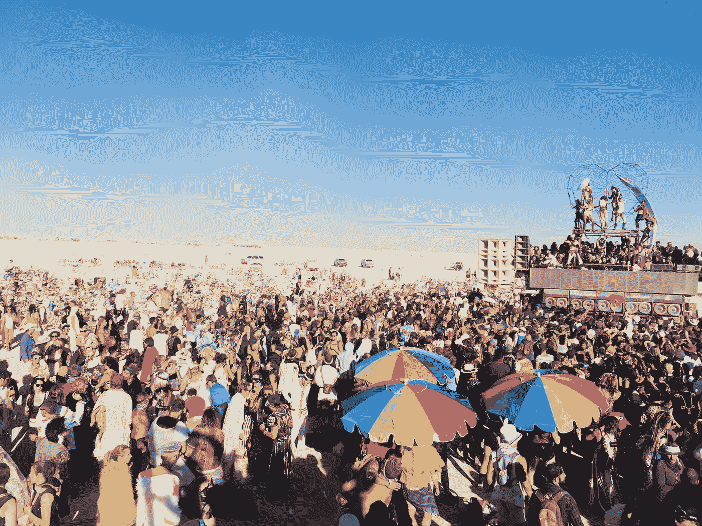

# 歧视与多样性

> 原文：<https://medium.datadriveninvestor.com/discrimination-diversity-6733f2eecea?source=collection_archive---------4----------------------->

两者我都支持。是的。两者

Burning man. A place where people from all over the world come together, as individuals and in groups. No bullshit government mandates or “laws” against discrimination are needed.

没有歧视就没有多样性。事情不是这样的。

这篇文章来自我在新的 YouTube 频道&播客上的一个话题，你可以在底部找到每个话题的链接。

这是这一集的链接(分为两部分):

Wake Up Ep 2

Wake Up Ep 3

“反对”歧视，但“支持”多样性的人(尤其是左派和集体主义者)存在着很大程度的认知失调。

像往常一样，因为他们说话前不花片刻思考，所以他们的立场是矛盾的！在本文中，我将打破这一矛盾，并指出歧视在通往多样性的道路上至关重要，因为歧视意味着选择，而选择是差异和多样性的基础。

 [## 对有商业头脑的投资者有用的行为经济学概念|数据驱动的投资者

### 在美国企业界，高斯统计，对我们周围世界的确定性解释，以及理性…

www.datadriveninvestor.com](https://www.datadriveninvestor.com/2020/07/09/helpful-behavioral-economics-concepts-for-the-business-minded/) 

# 歧视是多样性的核心。

两者缺一不可。

关于“平等”这个令人厌恶的东西，我已经说过很多次了。

简而言之，如果你支持平等，你就不在乎多样性。你更像一个纳粹或斯大林主义者，想要&要求每个人都是平等的，一样的。

多样性的支持者理解歧视的重要性，因为它允许我们选择与众不同。

为了一些被误导的平等观念而取消选择和强制执行反对歧视的盲目法令，破坏了你们许多人声称支持的东西的本质。

选择是自由的核心，选择的自由是多样性的种子所在。

会不会有一些不想要的副作用？当然可以。但给我看看世界上任何百分之百“积极”的东西？
(且不说你对“积极”的定义可能就是我对“消极”的定义——不过那是另一个兔子洞)。

100%肯定不存在。
睡眠很棒。太多不好。白天是美好的，但是没有夜晚就没有意义。

生活就是接受好的和坏的，经历起起落落。
如果你想要一个自由多元的社会，你必须接受歧视。

# 自我所有权

自我所有权和个人财产权的概念，无论是你的生意、你的钱(以及你选择花在哪里)、你的朋友、你的身体&存在、你的观点，还是你脑子里在想什么，都是你可以选择做一个决定(即:区别对待)，基于你想要的任何理由。这意味着你可以随心所欲。

这就是自由。

现在……如果你基于某种歧视性的原因，决定对另一个人发起暴力；问题不在于歧视。这是暴力——不管什么原因。侵略者就是侵略者——被侵犯的人有权保护自己。

不能辨别的概念意味着选择不存在。

你可能会说“哦，还没到那种程度”。

我说:“哦，真的吗？界限在哪里？谁来决定？下一批人开始要求更多时会发生什么？”。
我们就是这样进入“压迫奥运”这种可笑的运动的。

暴政从来不是从明目张胆开始的。它始于对我们自由的小小侵犯。它要求我们稍微违背我们的价值观，并不断地这样做，直到你知道它之前——我们是纳粹卫兵或精神错乱的凯伦。

我们需要尽早讨论这些事情，并在它们扩散之前切断它们的毒液。

# **反歧视法很暴力**

所有在工作场所强制禁止基于性取向、种族、国籍和任何他们认为有必要包括在内的歧视的立法都是对自由个人的侵犯行为。

此外，这只是一个永久的“底层竞赛”，只能起到缓冲最底层，最交叉和混乱的“受压迫的少数”。

很快，它就会延伸到智商、智力和其他各种抱怨，因此作为一家企业，你将不再有选择雇佣谁的权利，因为你会因为你的任何选择而被起诉。

言论自由和选择权到此为止。
这应该会激怒所有人。

根据你的道德观念强迫别人做出决定是暴力！！！

这项新法律是国家实施的一种暴力形式。

## 我们用一个例子来说明它的愚蠢:

LGBTQ 群体(尤其是 lgb)已经为被认可为社会的一个合法分支而奋斗了一段时间。这很好。

尤其是像同性婚姻这样的事情。两个人走到一起的非暴力行为。我个人对此不感兴趣，但如果两个同性相爱&想私奔，那就去吧。
我为你高兴！

我很高兴他们挺身而出，为争取这样做的权利而斗争。但是不要把“同性恋婚姻的权利”和“选择的权利”混为一谈，因为后者是真正的胜利，而前者仅仅是选择的一种表现。

注:他们需要为之奋斗的事实应该让你质疑这个社会有多疯狂。我们把自己的道德代理权交给了据称“更了解情况”的国家机构。LGB 社区应该买下 BTC，以消除那些他们不得不请求许可的小丑，这样他们就不会再遭受这种“乞求许可”了..

但是不管怎样…我跑题了..LGBs 获得了一些应得的胜利，我真心为他们感到高兴。

但是现在让我们来看看这条定律…

假设你有一个全是同性恋的企业，你的优势是你只雇佣同性恋，因为你的团队有共同的价值观、心智模式、品味和风格。这是你 USP 的一部分。

你不应该被允许那样做吗？如果你不雇佣一个和你完全不同的直男来和你一起工作，这难道不被认为是歧视吗？

如果政府明天转过身来说，“不；你不得不雇佣这个人是因为歧视法"？？

你不知道这一切有多荒谬吗？
喜欢认真。你怎么能支持给一些道德败坏的机构这种权力？？

私有财产意味着你有选择的权利(即；歧视的定义)你可以和将要对你自己的财产做什么(不管是 ***你*** ，你的东西还是你的思想)。

别人没有权利强迫你不这样做。

通过实施这些法律，你就消除了个人的能动性和责任。

你基本上承认你实际上不拥有任何东西，也不拥有你自己或你的选择。你只是政府的一个臣民。或者是一艘“船”,完成一项你既不同意也不理解的任务。

欢迎来到矩阵。恭喜你现在是无人机了。没有自由意志。

# 集体主义

集体主义者、国家主义者和政治家不想让你知道的关键部分是，对道德的垄断才是真正的问题所在，因为当一个人垄断了决定什么是对什么是错时，你就创造了系统性歧视的基础。

当一个群体垄断了伦理、道德、判断、经济和暴力时，它可以做任何事情。绝对的权力导致绝对的腐败。

当你去除了国家(或类似的腐败、制度垄断)，种族主义和歧视就不再是“系统性问题”了。它们成为地方性问题，很少成为问题。

事实上，在地方上，这些事情可以是积极的。
让我们看两个简单的例子:

1.  **关于“隐藏在表面之下”和怨恨的争论。**

我更想知道谁不喜欢我，并采取相应的行动，而不是把我的选票或钱给一些秘密的种族主义者或恐同者。

你自己想想吧。你真的想把自己辛苦赚来的钱给别人(即；你用宝贵的时间和精力换来的东西)如果你知道他们不喜欢你或“你的同类”？

绝对没有。

这是对你自己的不尊重，这些政府命令剥夺了你了解真相和自己决定的能力。你实际上是在支持那些不喜欢你的人。

**2。“我的工作怎么办”的争论。**

求职时被“歧视”的人怎么办？

又好了；我不明白为什么你会降低自己的身份，为一个基于种族或性取向而不喜欢你的人工作。让自己受制于此的想法类似于表现得像一个可怜的农奴。

这是你自己选择的契约奴役。
有点自尊；去别的地方。

此外，在这种“歧视”的情况下，你去其他地方工作，为值得你付出时间的人的生意增加价值！换句话说，如果你是一个能为企业增加价值的杰出人士，不雇佣你的损失不是你的。

损失的是固执的企业主或经理。他们成为受害者。不是你！

不要让他们从你的技能中受益(违背他们的意愿)，而是让他们通过雇佣一些像种族这样的表面狗屎来制造他们自己的毁灭，而不是雇佣能力。看看他们能走多远。

# 自由的经济个体

国家组织的歧视是一个问题，但在自由个人的层面上这不是一个问题。

当人们可以根据真实的信息自己决定时，他们就可以分配他们的资源(即:他们的时间、精力、激情、愿景、激情、意志)到对他们重要的事情上，以及和他们有共同价值观的人在一起。

有政府&他们愚蠢的命令挡道，人们无法做出有效的个人、经济或社会决策！

有人可能会说，在当前的体系中，“这是不可行的”，在很大程度上，你是对的。这就是为什么我们需要远离这些国营的，“民主的”(读作:社会主义/国家主义)系统。

这就是为什么#BitcoinFixesThis →但是我将把它留给更深入的文章。

我只想说，在一个以经济为法则的世界里，时间、努力、生产和工作都会得到回报(而不是身份政治)，歧视是完全可以接受的。事实上，它是个人和社会进步最有力的工具之一。

如果你喜欢这篇文章，一定要“为它鼓掌”，这样会有更多的人看到它。

同样，在 twitter 和你所在的其他社交网站上分享它。

不要脸的插一句:我在 YouTube 上开了一个新频道，涵盖了我觉得有意义的广泛话题。

 [## 醒来

### 世界在很大程度上沉睡了。我们生活在一个我们的自由慢慢被侵犯的时代，但是因为…

www.youtube.com](https://www.youtube.com/channel/UCMnW6a-bboF2XYMRLZuIdzA) 

播客链接:

最后，如果你想阅读或了解更多，请看下面的链接。

再次感谢！

# 作者:

 [## 阿列克斯·斯维茨基

### Aleks Svetski 的最新推文(@AleksSvetski)。无国籍的黑猩猩，抵制芯片，豆荚，虫子，大豆…

twitter.com](https://twitter.com/alekssvetski)  [## 亚历山大·斯维茨基—中等

### 阅读亚历山大·斯韦茨基在媒介上的作品。CEO @ www . amber . app . Editor @ https://bitcointimes . news .比特币…

medium.com](https://medium.com/@AleksSvetski) 

**进入专家视图—** [**订阅 DDI 英特尔**](https://datadriveninvestor.com/ddi-intel)