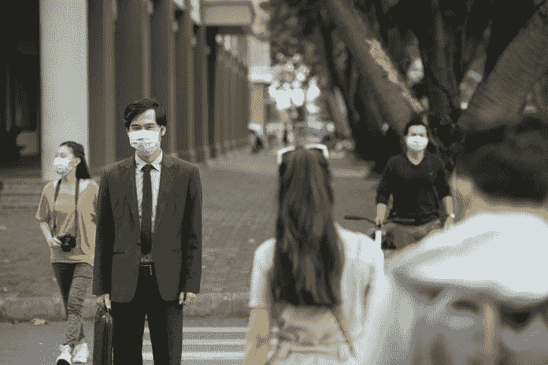
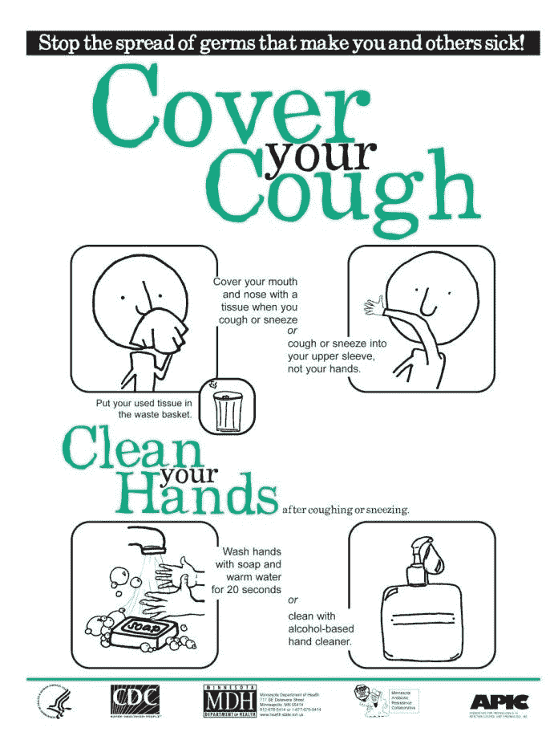
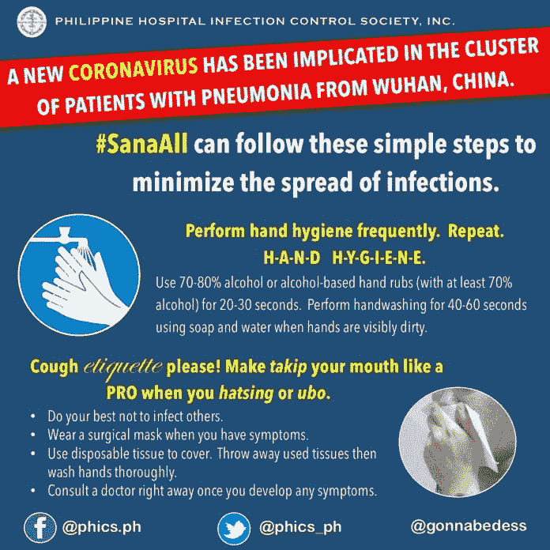
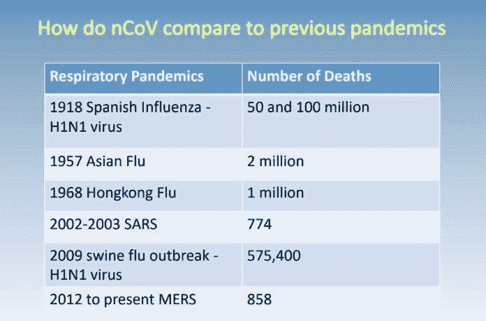

# 来自中国的疾病病毒式传播

> 原文：<https://medium.datadriveninvestor.com/disease-from-china-goes-viral-55bf258af012?source=collection_archive---------8----------------------->

## 感染随着焦虑在世界范围内迅速蔓延

为了应对健康恐慌，灼热的图像描绘了戴着面具的人们。不确定快速传播的冠状病毒何时会袭击，那些受到威胁的人知道感染可能是致命的。

Mainland China [拥有引发疾病的可疑特征](https://gisanddata.maps.arcgis.com/apps/opsdashboard/index.html#/bda7594740fd40299423467b48e9ecf6)，但随着感染在世界各地蔓延，其 100 万确诊冠状病毒病例和 6 万例死亡的比例到 2020 年 4 月初有所下降。

T4 的菲律宾微生物和传染病学会不会建议人们洗手不干，但这将是一个健康的开始。

“另一种新出现的病毒上了头条，”该协会的传染病医生亚瑟·德西·罗曼说。“尽管放松。一些好的老步骤可以保护我们免受感染。”

最明显最简单的老步骤就是肥皂和水。事实证明，良好的卫生习惯是病毒最大的敌人。

冠状病毒的一个促成因素是无知，这正是 Roman 和 PSMID 的同事 Marion Kwek 博士介入为焦虑的世界带来希望的地方。

“这是另一种新的冠状病毒——nCoV——从受感染的人体中鉴定出来的，”罗曼说。“有一些常见冠状病毒会感染人类并导致轻微疾病。这个 nCoV 是新东西。

“根据对其‘基因构成’的初步研究，它与被认为源自蝙蝠的 SARS 样病毒非常相似，”他说。

尽管在蝙蝠体内发现了 300 多种冠状病毒，但它们通常不会感染人类。

罗曼说:“偶尔会出现交叉，就像非典和中东呼吸综合征爆发时发生的情况一样。”“当人类与这些野生动物接触时，可能会发生传播。

“大多数情况下，从蝙蝠身上获得病毒的中间动物将病毒传播给人类，”他说。“对非典来说，是果子狸。对中东人来说，是骆驼。对于 nCoV，我们还不知道。可以是中国武汉那个动物市场卖的任何一种动物。”

# 健康洗涤

在长途旅行中，病毒不会飞，但人会飞，这就是为什么罗曼建议课外谨慎。

“完成旅行目标时要做好充分准备，”他说。“个人卫生很重要。在这个传染病不断出现的时代，不要从事超级“冒险”的活动。还要完成你的疫苗接种。”

从很多方面来说，nCoV 并不新鲜。

“有许多冠状病毒，”Kwek 说。“热门话题是这种新类型。因此，我们用‘小说’这个词，是在它在武汉被确定之后。”

专家指出，与麻疹等其他病毒相比，目前对 nCoV 传染性的估计显示了较低的基本繁殖数。这个数字反映了——在非免疫人群中——一个感染者平均可以感染的人数。患麻疹的人数是 18 人。非典是四。nCoV 的初始数值为 1.5 至 2.5。

人类的固执增加了疾病预防和治疗的复杂性。

“麻疹传染性很强，”Kwek 说。“令人惊讶的是，这种疾病有疫苗，但许多人选择不接种疫苗。”

此外，nCoV 的一些看似微小的迹象掩盖了它的威胁。

“症状包括发烧和呼吸道感染的迹象，如咳嗽或感冒，根据严重程度，可能包括呼吸困难和胸闷，”Kwek 说。

# 复杂的疾病

根据发表在《柳叶刀》上的一篇关于首批 41 名 nCoV 患者的论文，98%的人发烧。然后是 76%的咳嗽，28%的痰，55%的呼吸困难，44%的肌肉疼痛和 5%的痰中带血。

任何死亡都是不好的，然而流感——人们往往轻易接受——已经夺走了成千上万人的生命。在最初报告的 17 例 nCoV 死亡病例中，年龄从 48 岁到 89 岁不等。11 人患有肝病、心脏病和肺病。

该疾病的潜伏期估计长达 14 天，但随着调查的继续，这一估计可能会改变。

Kwek 说:“旅行史很重要，无论是对病人还是对他们的密切接触者来说。请注意，随着我们获得更多信息，案例定义可能会发生变化。

她说:“去有 nCoV 确诊病例的国家旅行不受限制。”“因为去过特定的地方，就把某人列为受调查的人还为时过早。”

护照可以很容易地记录到中国的旅行，这就提出了医院过滤特定旅行者的协议的问题。

“这是可能的，但我不确定这是否可行，”罗曼说。“此外，检疫局在入境口岸为我们做这项工作。从个人经验来看，这些旅行者大多和我们一样焦虑。他们在医疗采访中诚实地讲述了自己的旅行史。”

PSMID 说，防止 nCoV 传播的公共卫生措施看似简单:“捂住咳嗽，洗手。”

有先存病症的人应特别谨慎。

“特别要提到那些免疫系统低下的人，”罗曼说。“那些患有肾脏、肝脏、心脏疾病的人，服用类固醇的人，老年人——尽管年龄只是一个数字——需要格外小心。多做手部卫生，多做呼吸保护。”

尽管本地或国际旅行是不可避免的，但 PSMID 敦促那些在移动中的人注意自己和他们的周围:“自我意识在防止任何传染病传播方面非常重要。”

此外，世界卫生组织的在线培训据说是 T2 抗击冠状病毒爆发的最佳武器。该网站涵盖了检测、预防、响应和控制的方法。

**关于作者**

吉姆·卡扎曼是拉戈金融服务公司的经理，曾在空军和联邦政府的公共事务部门工作。你可以在[推特](https://twitter.com/JKatzaman)、[脸书](https://www.facebook.com/jim.katzaman)和 [LinkedIn](https://www.linkedin.com/in/jim-katzaman-33641b21/) 上和他联系。

*原载于 2020 年 1 月 26 日 https://www.datadriveninvestor.com***。**