# 疾病预测:下一个疫情会是什么？

> 原文：<https://medium.datadriveninvestor.com/disease-prediction-what-will-the-next-pandemic-be-3502b01fe479?source=collection_archive---------10----------------------->

Picture by Miroslava Chrienova from Pixabay

本文由沃克森大学的 Raul V. Rodriguez & Pooja Raj 博士共同撰写

# 摘要

世界上疾病的爆发与日俱增，夺去了数百万人的生命。医院、政府和企业都有必要防止这种情况的发生。

预测分析可以通过建立模型来帮助医疗专业人员预测疾病。根据统计方法，人工智能和机器学习可以用来做出这些预测。社会网络分析可以用来确定所需的信息。我们试图展示和分析具有不同预处理算法的模型如何预测输出。时间序列、朴素贝叶斯和 RNN- LSTM 等深度学习算法被用来预测疫情。

*关键词*:自然语言处理，文本挖掘，文本分析，时间序列，LSTM

# 1.简介:

疫情是一种同时在全球多个国家传播的疾病。流行病有可能在世界范围内杀死数百万人。历史上，世界目睹了几次大流行。自 20 世纪以来的一些重大流行病是西班牙流感、亚洲流感、香港流感、甲型 H1N1 流感病毒、艾滋病毒、非典、猪流感、中东呼吸综合征、埃博拉病毒和新冠肺炎病毒。在一场防止未来致命流行病的竞赛中，人工智能和机器学习被用来预测这些疾病。

在这个不断发展的研究领域，预测模型的优势越来越突出。研究人员正在利用分析的力量来分析数据，并从中创建关系。所有研究人员都将 twitter 数据的文本分析视为最重要的关注领域之一。一个这样的文本分析问题是情感分析。它已经成为分析与人机交互相关的一系列问题的有用工具。这可以扩展到社会学、广告、医疗保健和营销领域，并最终扩展到社交媒体领域。长短期记忆网络——通常简称为“lstm”——是一种特殊的循环神经网络，能够学习长期依赖关系。LSTM 分析被用来预测疫情的爆发。

 [## 在医疗保健中使用人工智能的伦理|数据驱动的投资者

### 人工智能(AI)正被应用于任何管理大量数据的行业，并且在一个…

www.datadriveninvestor.com](https://www.datadriveninvestor.com/2020/03/21/the-ethics-of-using-ai-in-healthcare/) 

# 1.1 背景:

多年来，科学家和医学研究人员一直在努力改变疫情的精确定义(它是疫情，还是流行病),但可以得出的一点是，这个词描述了疾病的广泛发生，超过了一个地理区域的正常预期。

人类历史上一些最残忍的杀手是霍乱、淋巴腺鼠疫、天花和流感。这些疾病在全球的爆发被定义为疫情，尤其是天花，在历史上，在其 12，000 年的存在中，已导致 3 亿至 5 亿人死亡。

*1。***–126681 并且还在计数**

**2。* ***艾滋病疫情—*** *死亡人数:3600 万**

**3。* ***流感疫情—*** *死亡人数:100 万，病因:流感**

*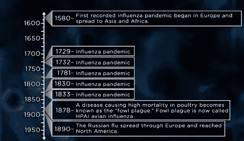*

**Image Courtesy: The great course plus**

# *1.2 疫情细菌的理想元素:*

***1。**人际传播*

***2。**迅速变异的潜力*

***3。**无已知疗法或疫苗*

***4。**能力迅速扩散*

***5。**高死亡率*

***6。**潜伏期短*

***7。**对多种抗生素或抗病毒药物的耐药性*

# *2.流行病中的人工智能和机器学习:*

**一个描绘人工智能和机器学习应用的故事-**

*几年前在西非有一个叫艾蒂安·瓦穆诺的人。他住在几内亚的一个偏远村庄，距离塞拉利昂和利比里亚边境只有几英里，2013 年底，他两岁的儿子埃米尔(Emile)出现发烧、呕吐和血性腹泻。*

*艾蒂安为埃米尔寻求帮助，但几天后，实际上就在圣诞节后几天，他的儿子死了，随后是他的女儿菲尔洛明，他怀孕的妻子，和他的岳母。接生他死胎的助产士也去世了，但在此之前她去了另一个村庄。显然，病毒从一个社区传播到另一个社区，几个月都没有被发现。三个月后，当官员们发现是埃博拉病毒时，病毒已经传播到了三个西非国家。卫生官员被弄得不知所措，无法应对已经失控的疫情:像卢克·巴沃这样的官员。*

*卢克在利比里亚领导埃博拉病毒观察。他知道他需要正确的信息来阻止埃博拉，但获得及时、无误的健康数据是一项日常工作。报道通过各种可能的方式传来，电话、短信、电子邮件。卢克正处于危机爆发的中期，数据无法让他对正在发生的事情有一个全面的了解。监视系统是粮仓和独立的，*

*从诊所到实验室结果，再到他们的联系人和社区，很难追踪到一个病人。这个系统根本没有准备好应对这种巨大灾难的爆发。对于像卢克这样高效的卫生官员来说，这就像蒙着眼睛试图应对流行病/疫情。卢克不能阻止他看不见的东西。在这个全球相连的世界，随着贸易、旅游、气候和土地使用的变化，像这样的疫情不能忽视。*

***疾病无国界**，威胁只会越来越大。在过去的四十年里，各种疾病的爆发增加了两倍。SARS、MERS、埃博拉、寨卡，这是我们的新习惯，所有专家都表示，全球流感疫情不是一个是否会发生的问题，而是一个何时发生的问题，其影响可能是灾难性的。西雅图疾病模型研究所估计，类似于 1918 年流感的全球性疫情流感可能在短短六个月内杀死 3300 万人。世界银行猜测对全球经济的影响将达到三万亿美元。事实上，比尔·盖茨认为全球性的疫情流感是人类面临的最大威胁之一。*

*当传染病爆发时，无论是疫情流感还是疫情全球流感都是人类面临的最大威胁之一。当传染病爆发时，无论是疫情流感还是伊波拉病毒，甚至是疟疾，我们都不能停止我们看不见的东西。目前，数据根本无法有效地收集、分析或部署，以推动决策，阻止疾病在其传播路径上爆发。但好消息是，我们正处于信息革命的中期，大数据和人工智能正在帮助我们每天做出更复杂的决定，无论是搜索最快的上班路线还是推荐我们接下来应该看什么电影。随着信心和预测的增加，我们相信最重要的信息。*

*有了更好的数据和模型，我们可以在对他们最重要的时候给像 Luke 这样的响应者增强的视线。事实上，我们现在可以想象未来的流行病情报系统从反应到预防和精确反应的重新定位。
有了更好的决策数据，**我们可以迅速发现疾病爆发**，**精确应对，快速消灭疾病，**和**甚至在疾病爆发前就开始预测。我们不能停止我们看不见的东西。信息是我们最好的解药。事实上，它是我们对抗疾病的超能力。大数据正被用来更快地检测疾病爆发。***

*通过清理从谷歌到百度的互联网上的新网站，健康地图正在识别世界各地的疫情。他们甚至在世卫组织之前就警告了世界 2014 年的埃博拉疫情。该团队还利用来自推特数据和谷歌搜索数据的信号追踪寨卡疫情。但是，随着数字技术的进步，得到了像这些智能温度计这样的最新数据流*

*连接到云上，当母亲或学校护士检查孩子的体温时，它会提醒社区出现发烧高峰。这些实时数据可以让我们在来自医生的疾病报告上占优势，这是加快反应的关键时间。现在，我们也开始改进工具，以便在疫情爆发时做出反应，这样我们就可以迅速扑灭疫情。*

*像卢克这样的应急人员需要了解，如果他们面临疾病爆发，疾病传播的速度有多快，接下来会发展到哪里，爆发的规模会有多大，以及他可以采取哪些最有效的行动来阻止它。最新的工具给他提供了他需要的视线。利用下一代测序的进展，科学家们现在可以查看病毒的遗传数据来追踪疾病的传播方式，为卢克提供关于疾病传播的关键信息。*

*使用来自手机的匿名汇总数据，我们现在可以追踪人口流动，这样我们就可以预测下一次疫情可能蔓延到哪里，让卢克和社区有时间做好准备。有了更好的数据和模型，我们现在可以评估哪些干预措施在阻止疫情爆发方面最有效，无论是安全掩埋还是边境筛查或社会距离，甚至是决定谁应该首先接种疫苗。可能性的愿景不需要就此止步。预测分析带来了令人振奋的进步。这就是人工智能的用武之地。如果我们将多个数据流放在一起，并使用机器学习的力量，我们就开始能够在疾病爆发前预测它们。这些例子很少。两年前，也门爆发了世界上最严重的霍乱疫情，病例超过 100 万。2000 人死亡，其中大多数是儿童。*

*因此，去年在一场对抗雨季的竞赛中，由马里兰大学领导的多学科团队参与进来尝试一些新的东西。他们绘制了详细的风险地图，将来自美国宇航局卫星的信息与温度、降雨量和清洁水源的数据进行分层。他们能够确定哪些社区最有可能在四周前爆发疫情。就像气象学家可以警告风暴一样，这个小组警告卫生官员霍乱可能即将来临。社区得到了警告，响应者知道将有限的资源集中在哪里，早期数据显示这极大地减少了死亡人数。如果向响应者提供八周的预警，他们将有时间部署疫苗，从一开始就防止人们生病。在未来十年，预测分析的影响将是非凡的。这些例子显示了疫情分析的潜在力量，但解决方案仍然是粮仓，进展太慢，而且很少真正集成到像 Luke 这样的响应者手边的工具中。有四个阻碍进步的障碍。巨大的挑战是数据质量和获取。*

*许多资源贫乏的国家使用纸和笔来收集患者数据，并且共享数据的交易成本对于拥有和需要数据的人来说都很高。
事实上，一名研究人员可能需要长达 9 个月的时间来部署与一家移动运营商的数据共享协议，但世界上有数百家移动运营商，如果在经历疫情爆发的国家没有达成协议，迅速调动这些数据将非常困难。但是，即使我们获得了信息，我们的疫情分析能力仍处于起步阶段。如果它们没有被用于更好的决策，那么拥有所有这些洞察力是没有用的。*

*从全球官员到像卢克这样的国家应急人员，再到处于行动位置的前线医护人员，都应该具备管理这些信息并利用这些增强的洞察力的能力和培训。确保从这些信息中获得更深刻的见解，通过围绕优先问题建立跨部门数据协作来夸大分析，并刺激关于如何使用数据的快速实验，并结合不同类型的数据以提取更有意义的见解，就像他们在也门所做的那样。
利用这些增强的洞察力，投资于最合适的解决方案、数据收集工具和利用这些尖端分析的开放平台，并确保它们都是为那些有能力采取行动的人设计和开发的。是时候将我们的爆发分析带入 21 世纪了。我们需要对疫情分析的承诺。*

*如果我们开启数据的预测能力，更快地识别风险和疫情，我们可以将范式从反应转变为预防和精确反应，但我们需要想象力和一致的行动。让我们用信息的力量来保护每个人。*

# *2.1 AI 和 ML:*

*在新闻报道和在线内容数据的帮助下，人工智能算法可以帮助预测流行病的比例，甚至在它们发生之前。电晕爆发就是这样一个例子。有证据表明，像蓝点这样的公司已经预测到了电晕的爆发，并提醒政府、医院和企业注意肺炎病例的异常增加。这是一种新的疾病，被命名为新冠肺炎。*

*全球病毒组项目——于 2016 年提出，旨在发现并测序鸟类和哺乳动物中所有可能传播到人类的病毒。*

# *2.2 传播方式:*

*1.直接接触*

*2.八英尺内的液滴传播*

*3.空气传播的微生物悬浮在空气中*

*4.粪-口途径*

*5.以上各项的组合*

*在数据集的帮助下，我们可以预测疾病的传播，并预测未来可能发生的疾病。*

*人类的数量与日俱增，我们以不同的方式与不同的栖息地和新物种互动。这为动物传播的疾病提供了机会，有近 80 万种动物传播的疾病尚未被命名。从动物传播到人类。大多数流行病，如艾滋病毒、流感和寨卡病毒，都是由动物体内的病毒引起的。导致西非约 11000 人死亡的埃博拉病毒被发现存在于蝙蝠体内。研究人员已经收集了近 600 种病毒和 750 多种可能感染的哺乳动物的数据库。利用人工智能和人工智能，他们检查模式，并了解是什么使动物病毒感染人类。*

*通过了解这些模式，可以进行预测，从而了解疾病通过病毒的传播。*

# ***2.3** **自然语言处理***

***答**算法有助于监控世界各地不同语言的新闻媒体和官方医疗保健报告。可以检查冠状病毒、艾滋病毒或结核病等高优先级疾病的详细信息。人工智能有能力在噪音中识别自己的模式，而不是在预定义的例子上训练。NLP 可以分析这些数据库以提供输出—数字媒体、全球机票数据、牲畜健康报告和人口统计数据。*

# *2.4 疾病控制系统:*

*1.更好的诊断和治疗*

*2.新疫苗*

*3.手套和口罩等更好的防护装备*

*4.来自全球来源的资金增加*

*5.协调应对措施的全球监测系统*

# *2.5 有助于疾病爆发的新技术:*

*1.移动健康*

*2.谷歌流感趋势报告*

*3.我附近的爆发应用程序*

*4.脸书发帖或新的 Twitter 推文*

*5.新闻媒体*

# *3.人工智能在对抗流行病中的应用:*

*人类正在努力遏制流行病，而人工智能现在将有助于缓解这种局面。*

*1.作为预警系统:*

*人工智能能够预测疾病如何从一个地区传播到另一个地区，从一个国家传播到另一个国家。例如——蓝点提醒政府、医院和企业注意中国武汉肺炎病例的异常增长。社交媒体渠道是强大的信息来源。人们在社交媒体上分享他们的故事，这给了进行进一步分析的空间。*

*2.作为感染途径预测器:*

*人工智能可以帮助预测疫情如何传播。它扩散的强度。可以分析“社会距离”的影响及其严重性。算法可以用来建立模型以确定感染的传播，数字实验可以帮助了解疫苗的潜力，也可以确定病毒的变异模式*

*3.作为诊断仪器:*

*有时，医生可能会错过看到医学图像，人工智能正在捕捉这些图像。使用预测模型，可以检查这些医学图像并分析模式。像少数镜头学习和转移学习这样的技术可以用来训练人工智能模型，以便在缺乏训练数据的情况下寻找爆发。*

*4.作为研究发现工具:*

*人工智能可以夸张地访问大量不断变化的研究文献、数据和分析工具，这些文献、数据和分析工具与疾病爆发、传播和有效治疗有关。近 29000 篇关于新爆发的 COVID-19 的研究论文提交给了麻省理工学院，该疾病在名为 CORD-19 的数据库中已知。*

*5.作为治疗工具:*

*人工智能可以用于药物研究和其他治疗，以阻止新冠肺炎病的发展，并可能找到治愈方法。*

*6.识别模式:*

*人工智能有助于识别模式。*

*7.有效的公共教育；*

*政府可以使用人工智能来决定如何向公众传达信息。使用人工智能可以确定向公众提供什么信息以避免恐慌。*

# *4.数据集:*

*为了理解对疾病爆发的预测，我们考虑了新冠肺炎的例子。这个数据集是从 Kaggle 下载的。数据集由 14812 行和 8 列组成。数据以 csv 格式下载。*

*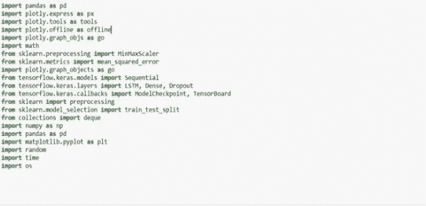**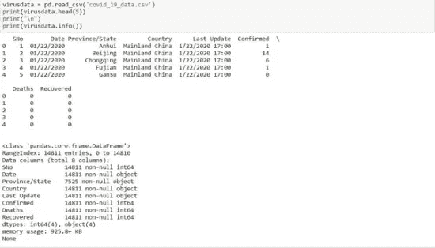*

*读取病毒数据。*

# *数据集的描述:*

*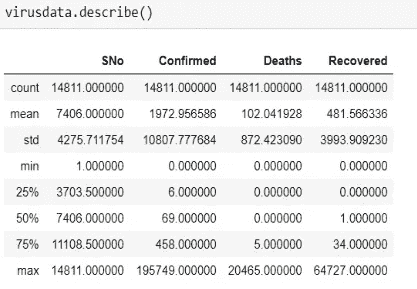*

# *确诊病例的平均值和标准偏差值:*

*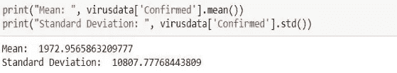*

# ***确诊病例直方图:***

*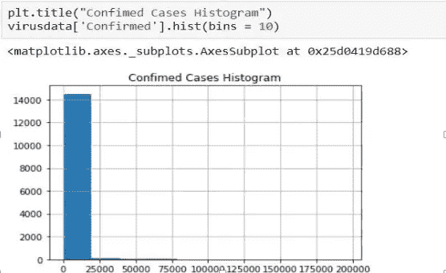*

***恢复病例的均值和标准差:***

*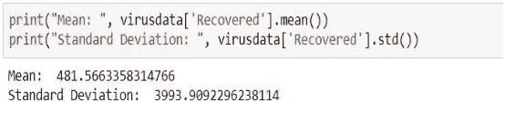**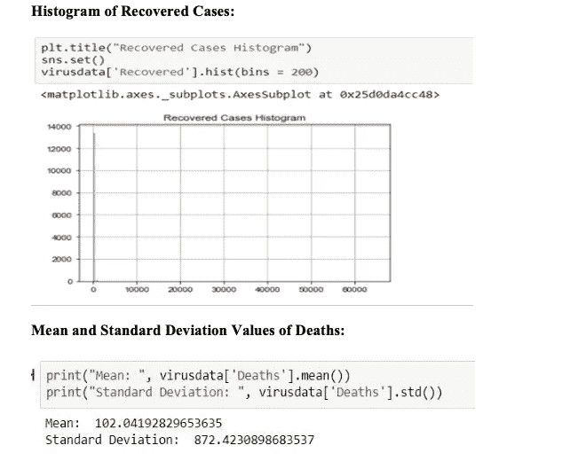**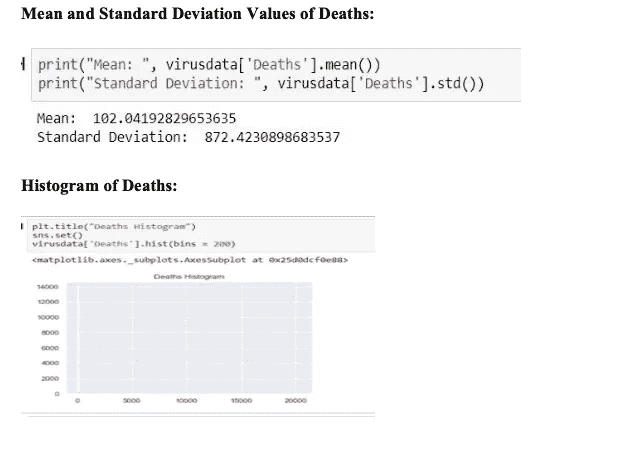*

*从以上数据可以推断，确诊病例与日俱增。与确诊病例相比，痊愈和死亡人数相对较少。*

# *使用收集模块中的“计数器”方法查看省/州的频率:*

*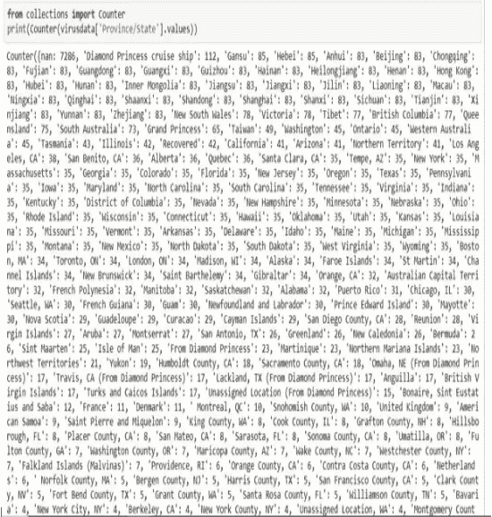**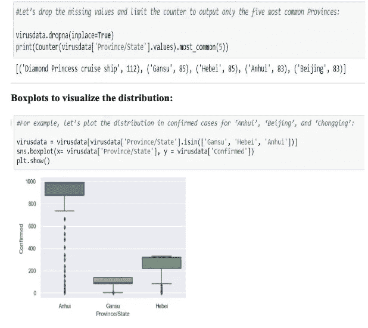**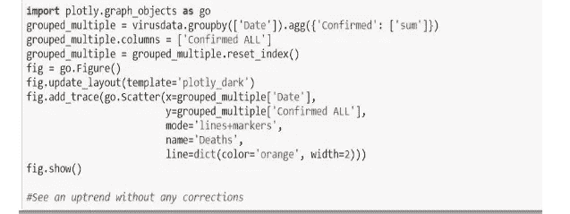**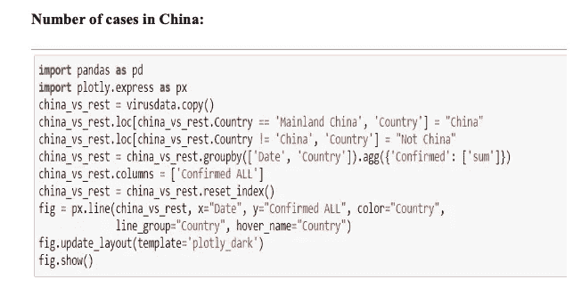**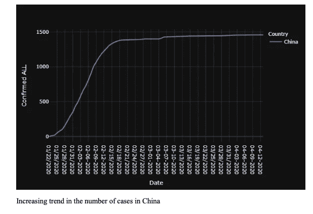*

*grouped _ multiple = virus data . group by([' Date '])。agg({ '死亡':['sum']，'恢复':['sum']})*

*grouped _ multiple . columns =[' Deaths ALL '，' Recovered ALL']*

*grouped _ multiple = grouped _ multiple . reset _ index()*

*fig = go。图()*

*图. update _ layout(template = ' plotly _ dark ')*

*图 add_trace(去。散点图(x=grouped_multiple['Date']，*

*y = grouped _ multiple[' Deaths ALL ']，*

*mode= '线条+标记'，*

*name= '死亡'，*

*line=dict(color='red '，width=2)))*

*图 add_trace(去。散点图(x=grouped_multiple['Date']，*

*y = grouped _ multiple[' Recovered ALL ']，*

*mode= '线条+标记'，*

*name= '已恢复'，*

*line=dict(color='green '，width=2)))*

*图显示()*

*#死亡人数远少于康复人数*

*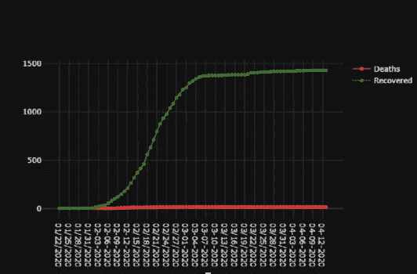*

*开始时，恢复的数量非常少。追回的数量逐渐增加。*

# *死亡率与恢复率的百分比数:*

*grouped _ multiple = virus data . group by([' Date '])。agg({ '死亡':['sum']，'恢复':['sum']})*

*grouped _ multiple . columns =[' Deaths _ ALL '，' Recovered_ALL']*

*grouped _ multiple = grouped _ multiple . reset _ index()*

*grouped _ multiple[' Deaths _ ALL _ % ']= grouped _ multiple . apply(lambda row:(row。死亡人数 _ 全部*100)//*

*(排。死亡 _ 所有+行。已恢复 _ 全部)*

*如果行。死亡 _ 所有其他 0，轴=1)*

*grouped _ multiple[' Recovered _ ALL _ % ']= grouped _ multiple . apply(lambda row:(row。Recovered_ALL*100)//*

*(排。死亡 _ 所有+行。已恢复 _ 全部)*

*如果行。死亡 _ 所有其他 0，轴=1)*

*fig = go。图()*

*图. update _ layout(template = ' plotly _ dark ')*

*图 add_trace(去。散点图(x=grouped_multiple['Date']，*

*y = grouped _ multiple[' Deaths _ ALL _ % ']，*

*mode= '线条+标记'，*

*name= '死亡'，*

*line=dict(color='red '，width=2)))*

*图 add_trace(去。散点图(x=grouped_multiple['Date']，*

*y = grouped _ multiple[' Recovered _ ALL _ % ']，*

*mode= '线条+标记'，*

*name= '已恢复'，*

*line=dict(color='green '，width=2)))*

*图显示()*

*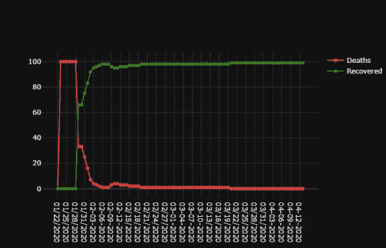*

*上图表明，死亡率在开始时达到峰值，随着时间的推移逐渐降低。回收率非常低，现在随着时间的推移有所增加。死亡率下降了，康复率提高了。*

# *我们要预测什么？*

*grouped _ multiple = virus data . group by([' Date '])。agg({ '死亡':['总和']，'恢复':['总和']，'确认':['总和']})*

*grouped _ multiple . columns =[' Deaths _ ALL '，' Recovered_ALL '，' ALL ']grouped _ multiple = grouped _ multiple . reset _ index()*

*grouped _ multiple[' Deaths _ Revocered ']= grouped _ multiple . apply(lambda row:row。死亡 _ 全部*

*+行。Recovered_ALL，axis=1)*

*fig = go。figure()fig . update _ layout(template = ' plotly _ dark ')fig . add _ trace(go。散点图(x=grouped_multiple['Date']，*

*y = grouped _ multiple[' Deaths _ ALL ']，*

*疾病预测:下一个疫情是什么？23*

*mode='lines+markers '，name='Deaths '，line=dict(color='red '，width=2))*

*图 add_trace(去。散点图(x=grouped_multiple['Date']，y = grouped _ multiple[' Recovered _ ALL ']，mode='lines+markers '，name='Recovered '，line=dict(color='green '，width=2)))*

*图 add_trace(去。散点图(x=grouped_multiple['Date']，y=grouped_multiple['All']，mode= '线条+标记'，*

*name='All '，line=dict(color='orange '，width=2)))*

*图 add_trace(去。散点图(x=grouped_multiple['Date']，y = grouped _ multiple[' Deaths _ Revocered ']，mode='lines+markers '，*

*name= '死亡+恢复'，line=dict(color='white '，width=2)))*

*图显示()*

*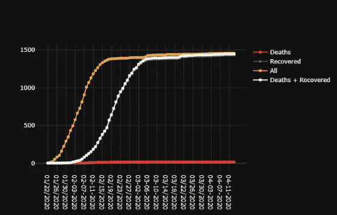*

*死亡人数日益减少。然而，死亡人数和康复人数加在一起仍然显示出上升趋势，这意味着病例数量没有减少。*

# *确诊、痊愈和死亡的百分比变化:*

*fig = go。figure()fig . update _ layout(template = ' plotly _ dark ')fig . add _ trace(go。Scatter(x=main_df['Date']，*

*y=main_df['infections_perc']，mode='lines+markers '，name='infections_perc '，line=dict(color='orange '，width=2)))*

*图 add_trace(去。Scatter(x=main_df['Date']，*

*y=main_df['recovered_perc']，mode='lines+markers '，name='recovered_perc '，line=dict(color='green '，width=2)))*

*图 add_trace(去。Scatter(x=main_df['Date']，*

*y=main_df['death_perc']，mode='lines+markers '，name='death_perc '，line=dict(color='red '，width=2)))*

*图显示()*

*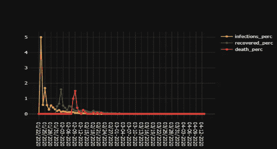*

*感染在开始时处于高峰。很明显，它会随着时间而减少。fig = go。图()*

*fig . update _ layout(template = ' plotly _ dark ')fig . add _ trace(go。散点图(x=df.index，*

*y=df['inc_total']，mode='lines '，name='inc_total '，*

*line=dict(color='orange '，width = 2)))fig . update _ layout(template = ' plotly _ dark ')fig . add _ trace(go。散点图(x=df.index，*

*y=df['inc_rec']，mode='lines '，name='inc_rec '，*

*line=dict(color='green '，width=2))) fig.add_trace(go。散点图(x=df.index，*

*y=df['inc_death']，mode='lines '，name='inc_death '，*

*line=dict(color='red '，width=2)))*

*图显示()*

*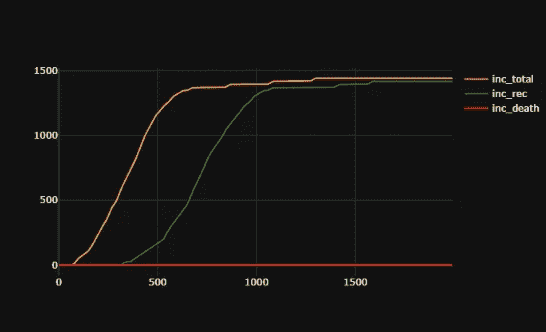*

# *使用 LSTM 训练模型进行预测:*

*# Class 培训班 TrainLSTM()的课程:*

*def create_dataset(self，dataset，look_back=1，column = 0): dataX，dataY = []，[]*

*对于范围内的 I(len(dataset)-look _ back-1):*

*a =数据集[i:(i+look_back)，列] dataX.append(a)*

*dataY . append(dataset[I+look _ back，column])返回 np.array(dataX)，np.array(dataY)*

*def TrainModel(自身、数据帧、列):*

*df = dframe.values*

*df = df . as type(' float 32 ')train _ size = int(len(df)* 0.90)test _ size = len(df)-train _ size*

*Train，Validate = df[0:train_size，:]，df[train_size:len(df)，:] look_back = 24*

*trainX，trainY = self . create _ dataset(Train，look_back，column) testX，testY = self . create _ dataset(Validate，look_back，column)trainX = NP . shape(trainX，(trainX.shape[0]，1，trainX . shape[1]))testX = NP . shape(testX，(testX.shape[0]，1，testX . shape[1]))model = Sequential()*

*model.add(LSTM(4，input_shape=(1，look _ back)))model . add(Dense(1))model . compile(loss = ' mean _ squared _ error '，optimizer = ' Adam ')model . fit(trainX，trainY，epochs=300，batch_size=1，verbose = 2)self . train predict = model . predict(trainX)*

*self . test predict = model . predict(testX)*

*Train Score = math . sqrt(mean _ squared _ error(trainY，self.trainPredict[:，0]))print(' Train Score:% . 2f RMSE ' %(Train Score))*

*Test Score = math . sqrt(mean _ squared _ error(testY，self.testPredict[:，0])) print('测试分数:% . 2f RMSE ' %(Test Score))Model _ prediction _ Resolved =[]*

*lastDT=testX[0][0] print(lastDT)*

*对于范围内的 I(168):*

*predi = model . predict(NP . array([[lastDT]]))*

*疾病预测:下一个疫情是什么？27*

*model _ prediction _ resolved . append(predi[0][0])lastDT = lastDT[:-1]*

*lastDT = np.append(predi，lastDT)返回 Model _ Prediciton _ Resolved*

*#总感染预测的训练模型 NeuralNets = TrainLSTM()*

*result_total =神经网络。训练模型(dff，0)*

*结果 _ 死亡=神经网络。训练模型(dff，1)结果 _ 记录=神经网络。火车模型(dff，2)*

*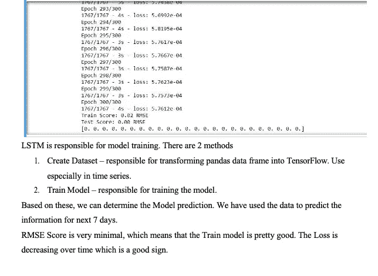*

*LSTM 负责模特培训。有两种方法*

*1.创建数据集-负责将 pandas 数据框转换为 TensorFlow。尤其用在时间序列中。*

*2.训练模型-负责训练模型。*

*基于这些，我们可以确定模型预测。我们已经用这些数据预测了未来 7 天的信息。*

*RMSE 得分很低，这意味着火车模型相当不错。随着时间的推移，损失在减少，这是一个好现象。*

*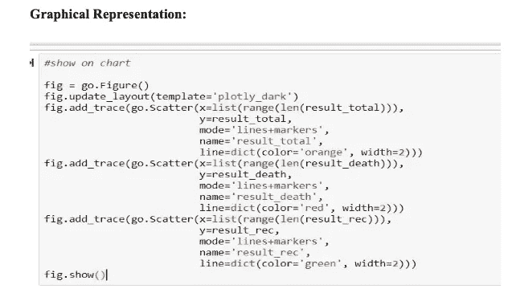**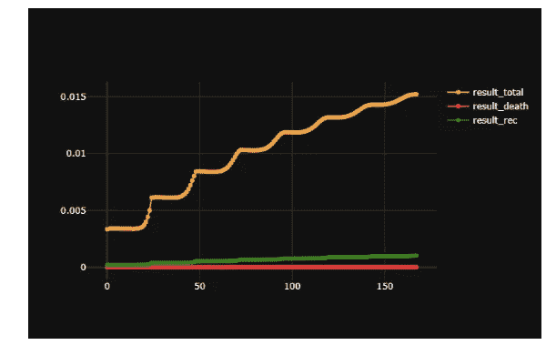**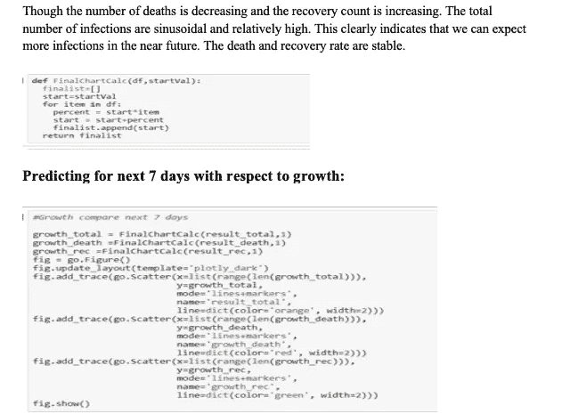**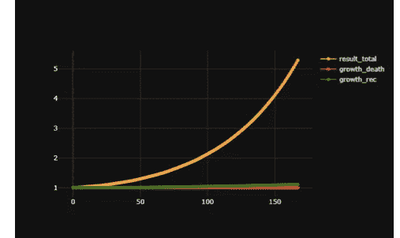**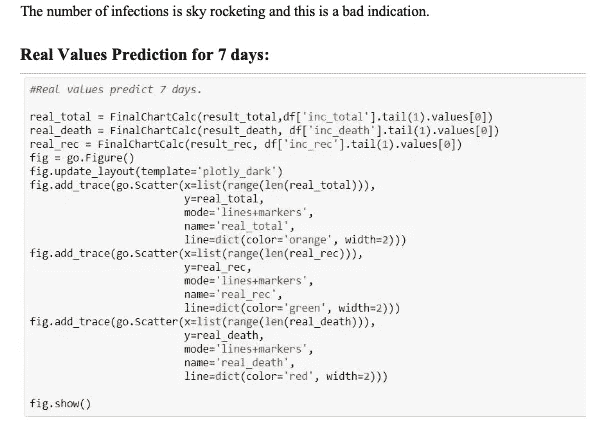****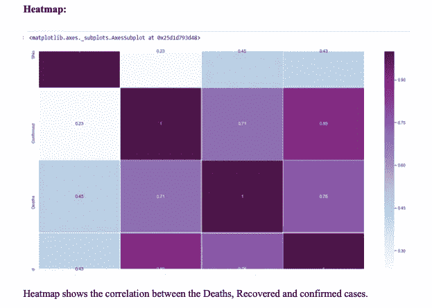*

*热图显示了死亡、康复和确诊病例之间的相关性。*

# *下载新闻媒体:*

*HTML: ('''*

*' ' ')

# 输出:

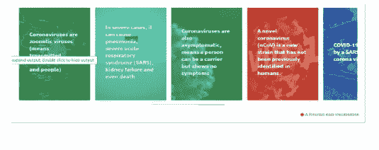

# 5.未来的疫情:

1.随时都可能发生

2.最有可能从东南亚或东亚开始

3.传播可能是气溶胶和空气传播

4.蜱和病媒传播的疾病不太可能

病毒、伊波拉病毒、天花、麻疹/腮腺炎、艾滋病毒和非典/中东呼吸综合征可以得到控制，但很可能的是,**流感**将成为下一个灾难性的疫情的原因，可能是 H5 n1 或其他类型的禽流感，如 H7 和 N9

流感证据:

1.与过去 100 年的 4 次大流行有关

2.48-72 小时的短暂潜伏期

3.难以实施隔离

4.让人杀人但通常不会杀人

5.会迅速变异

考虑到中国现在开放了市场，这些病毒很有可能像野火一样传播，我们可以预见流感相关疾病将是下一个疫情。一种禽流感或未知的新出现的人畜共患病毒是我们未来最有可能的罪魁祸首。

# 参考

1.世界没有为新冠肺炎做好准备:在未来，人工智能将遏制下一个疫情。更多阅读请访问[https://economic times . India times . com/magazines/panache/the-world-was-prepared-](https://economictimes.indiatimes.com/magazines/panache/the-world-wasnt-prepared-for-covid-19-in-future-ai-will-curb-the-next-pandemic/articleshow/74776209.cms?utm_source=contentofinterest&amp;utm_medium=text&amp;utm_campaign=cppst)[for-新冠肺炎-未来-ai-will-curb-the-next-](https://economictimes.indiatimes.com/magazines/panache/the-world-wasnt-prepared-for-covid-19-in-future-ai-will-curb-the-next-pandemic/articleshow/74776209.cms?utm_source=contentofinterest&amp;utm_medium=text&amp;utm_campaign=cppst) [疫情/articleshow/74776209.cms？UTM _ source = contentofinterest&UTM _ medium = t](https://economictimes.indiatimes.com/magazines/panache/the-world-wasnt-prepared-for-covid-19-in-future-ai-will-curb-the-next-pandemic/articleshow/74776209.cms?utm_source=contentofinterest&amp;utm_medium=text&amp;utm_campaign=cppst)[ext&UTM _ campaign = cppst](https://economictimes.indiatimes.com/magazines/panache/the-world-wasnt-prepared-for-covid-19-in-future-ai-will-curb-the-next-pandemic/articleshow/74776209.cms?utm_source=contentofinterest&amp;utm_medium=text&amp;utm_campaign=cppst)

2.人工智能可以帮助下一个疫情——但不是这个。威尔·道格拉斯·海天，2020 年 3 月 12 日。[https://www . technology review . com/2020/03/12/905352/ai-could-help-with the next-pandemic but-not-with the-one/](https://www.technologyreview.com/2020/03/12/905352/ai-could-help-with-the-next-pandemicbut-not-with-this-one/)

3.有可能预测下一个疫情吗？艾德·杨。2017 年 10 月。[https://www . theatlantic . com/science/archive/2017/10/疫情-预测-挑战/543954/](https://www.theatlantic.com/science/archive/2017/10/pandemic-prediction-challenge/543954/)

4.科学家们正在竞相预测下一个疫情将从哪里开始。作者瑞秋·贝克尔。2017 年 6 月 23 日。[https://www.theverge.com/2017/6/23/15865304/predict-大流行-暴发-人畜共患病-疾病-病毒-伊波拉-非典-艾滋病](https://www.theverge.com/2017/6/23/15865304/predict-pandemics-outbreaks-zoonoses-disease-virus-ebola-sars-hiv)

5.这家加拿大初创企业是如何在所有人都知道冠状病毒之前发现它的。发布于 2020 年 3 月 3 日星期二。https://www.cnbc.com/2020/03/03/bluedot-used-·artificial-intelligence-to-predict-coronavirus-spread.html

6.利用分析和人工智能来遏制下一个疫情。2020 年 3 月 9 日发布。[https://it brief . co . NZ/story/enlisting-analytics-and-ai-contain-the-next-疫情](https://itbrief.co.nz/story/enlisting-analytics-and-ai-to-contain-the-next-pandemic)

7.人工智能如何潜在地被用于对抗流行病。詹姆斯·科比勒斯。2020 年 3 月 20 日。【https://futurumresearch.com/research-notes/how-to-use-ai-在疫情的 /

8.人工智能 vs 流行病:人工智能如何防止下一个致命的疫情。2020 年 2 月 27 日发布。[https://www.zmescience.com/science/ai-vs-大流行-05433/](https://www.zmescience.com/science/ai-vs-pandemics-05433/)

9.伟大的课程加:[https://www.youtube.com/watch?v=uboMaitkp4k](https://www.youtube.com/watch?v=uboMaitkp4k)

10.迈克·帕宾斯基实验室:[https://www.youtube.com/watch?v=HeNlbWz7jvo&feature = youtu . be](https://www.youtube.com/watch?v=HeNlbWz7jvo&amp;feature=youtu.be)*