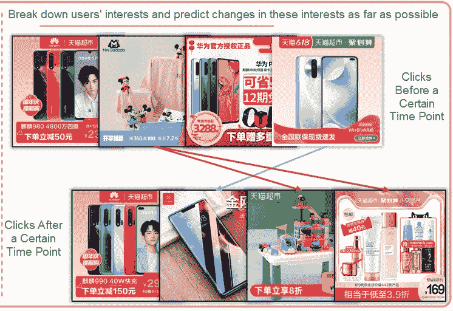
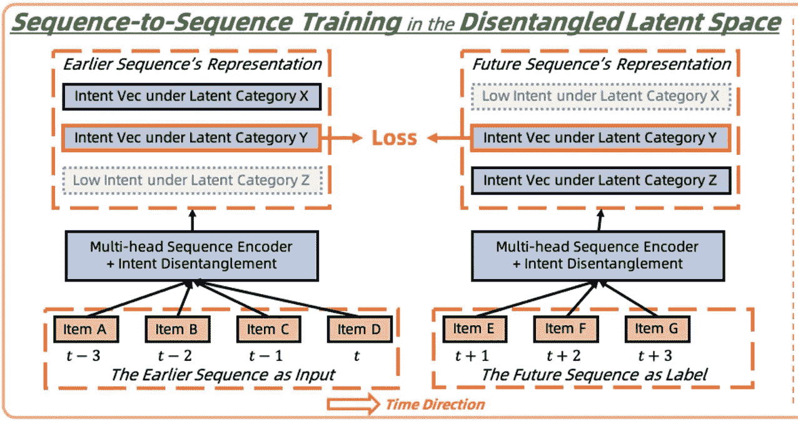
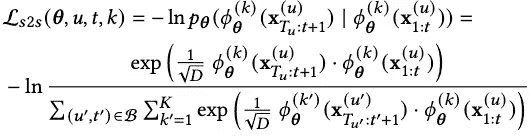
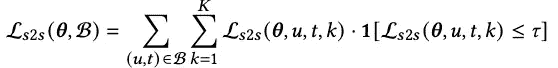
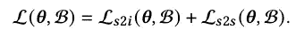
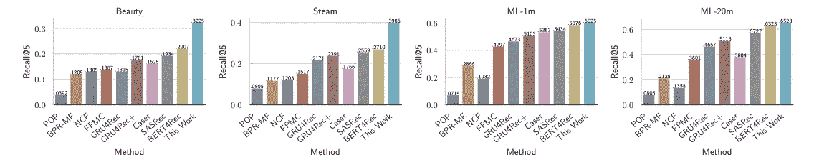
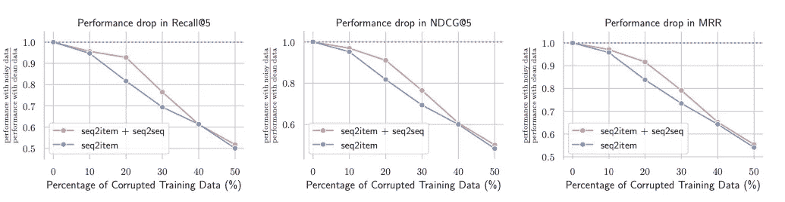

# 有序推荐器中的自我监督

> 原文：<https://medium.datadriveninvestor.com/disentangled-self-supervision-in-sequential-recommenders-d719b73fbf02?source=collection_archive---------14----------------------->

*下载“*[*【KDD 论文云知识发现】*](https://resource.alibabacloud.com/whitepaper/cloud-knowledge-discovery-on-kdd-papers_2592) *”白皮书，探索 12 篇 KDD 论文和 12 位阿里巴巴专家的知识发现。*

*作者:马建新、周畅、、、*

# 介绍

主流推荐算法的训练过程需要模型根据用户的历史行为来拟合用户的下一次行为。但是，仅拟合下一个行为有以下限制:

*   推荐结果是非多样性的。例如，如果训练数据包含许多类似“裙子，裙子，裙子，裙子，裙子，裙子，发饰”的序列，则从这些序列构造的训练样本中，大多数都包含标签“裙子”。在用户点击一条裙子后，学习到的算法倾向于推荐裙子，而不是发饰和其他裙子匹配类别。
*   用户可能对多个项目感兴趣，并对新项目表现出好奇心。结果，下一次点击序列可能与历史点击序列不相关，例如，下一次点击序列“裙子，裙子，椅子”。要求模特在训练过程中根据裙子来配椅子，意义不大。

本文提出了一种辅助训练思想，允许模型利用历史行为来拟合整个未来行为序列，而不仅仅是拟合下一个行为。我们的工作包括解开表征学习和自我监督对比学习，以解决两个主要挑战:

*   **挑战 1:** 压缩未来序列中同一兴趣的多次点击，提高训练效率，平衡比例不均匀的多个未来兴趣的权重。
*   **挑战 2:** 识别并移除未来序列中与历史行为无关的部分。

# 方法学

我们提出以下解决方案来应对上述挑战:

对于挑战 1，我们将未来点击序列中的每个项目映射到一个代表用户当时兴趣的向量。例如，50 多个项目被映射到 50 多个向量。然后，我们对这些向量进行聚类，以获取用户未来的主要兴趣向量。例如，超过 50 个载体被聚集成 8 个主要载体。在最终的训练过程中，模型预测的是这些未来的兴趣向量，而不是用户未来会点击的具体项目。这样，我们只需要拟合 8 个未来向量，而不是 50 多个项目。

对于挑战 2，我们要求模型估计训练数据中样本的可靠性，例如八个未来兴趣向量和八个历史向量之间的相似性，以及每个训练样本是噪声样本的可能性。大多数训练时间使用更可靠的样本。例如，从八个未来兴趣向量中选择最可靠的两到三个未来兴趣向量。该模型只需要适合所选择的未来兴趣向量。剩下的五到六个未来兴趣向量，可能与用户的历史行为并不密切相关。因此，模型不需要预测这些样本。

我们的新训练方法，即序列到序列的损失，是为了补充，而不是取代传统的序列到项目的损失。换句话说，我们在处理序列时将这两种损失都最小化。推荐项目时，仍然需要序列到项目损失方法。序列到序列丢失方法被设计来帮助提高表示学习质量。

# 实验

序列到序列损失方法基于具有复杂用户兴趣的公共数据显著地改进了离线推荐度量。

在将噪声样本连续添加到训练集之后，序列到序列损失方法比序列到项目损失方法表现得更稳健。

在使用淘宝移动数据进行的大量离线实验中，当用于预测接下来五次点击的点击率@50 时，仅序列到项目丢失方法就实现了 0.5%的绝对改善(12.6%对 12.1%)。在最初发布后，序列到序列丢失方法稍微提高了暴露和发现，但几乎没有增加点击率。我们将在我们团队对多向量模型 MultCLR 和向量召回损失函数 CLRec 进行改进的基础上，继续迭代这种方法，以优化其在线效果，并支持暴露偏差消除。

# 摘要

我们提出了一种新的向量回忆系统训练方法，旨在弥补短期训练目标导致的多样性和鲁棒性不足。核心的技术贡献是结合了无纠缠的表示学习和自我监督学习。

*本文观点仅供参考，不一定代表阿里云官方观点。*

# 原始来源:

 [## 有序推荐器中的自我监督

### Alibaba Clouder 年 10 月 15 日 139 下载《KDD 论文中的云知识发现》白皮书，探索 12…

www.alibabacloud.com](https://www.alibabacloud.com/blog/disentangled-self-supervision-in-sequential-recommenders_596747)