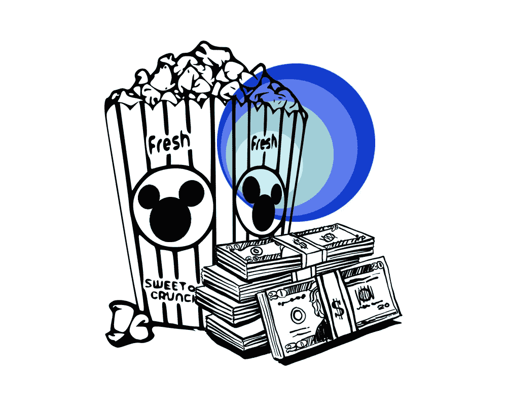
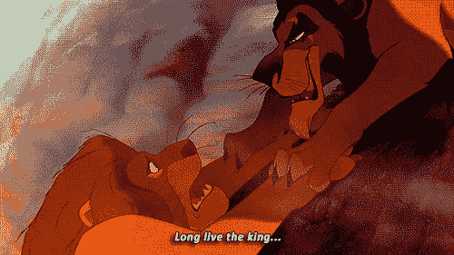
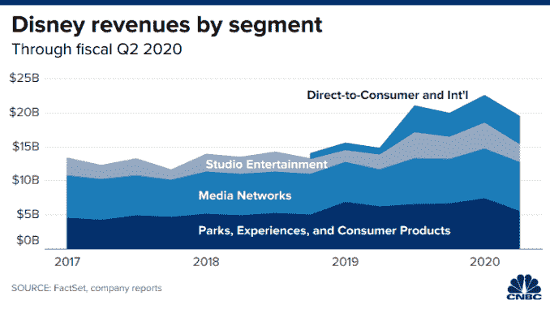
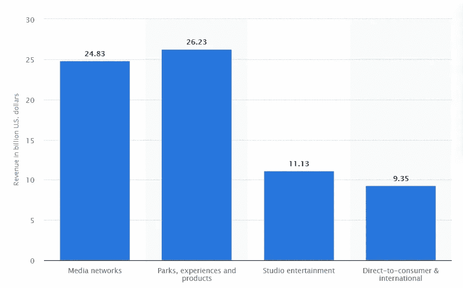
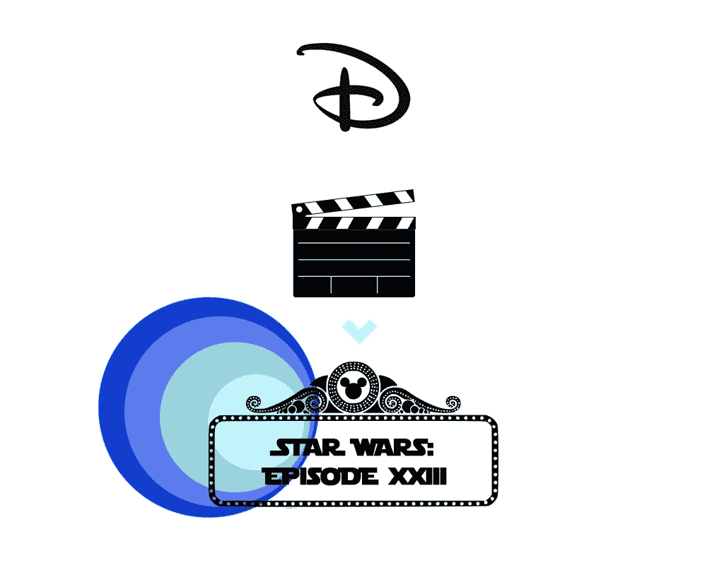
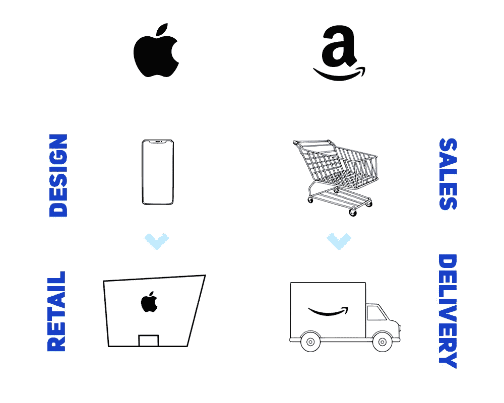

# 迪士尼应该投资一个垂死行业的 3 个理由

> 原文：<https://medium.datadriveninvestor.com/disney-movie-theaters-7ab29da5bec0?source=collection_archive---------7----------------------->

## 字节/大小

## 迪士尼电影院意味着:垂直整合+客户细分+虚拟现实=🤑🤑



Created by Murto Hilali

六年级时，我是老师的宠儿，这是我努力争取的职位。一年冬天，我正爬上一座雪山去滑雪橇，这时我的同学大卫把我推了下来——我飞快地回到了起点。



David and I during our legendary conflict, circa. 2014

每次他从我身边经过上山时，他都这样做*。当我最终到达山顶时，大卫没有看到我。我抓住他的雪橇，一路踢他(屁股)到山脚下。*

我疯狂地笑了。为什么我觉得我可以逃脱？因为我努力成为老师的宠儿，我*应该得到*特殊待遇，该死。

出售西半球童年的公司(迪士尼)报告称，由于疫情影响了主题公园、度假村和媒体制作，其营业收入下降了 37%。



Source: [CNBC](https://www.cnbc.com/2020/05/05/disney-dis-q2-2020-earnings.html)

但是当你是世界上最强的品牌之一时，你几乎可以经受住任何打在你腹股沟上的伤害。迪士尼的 DTC 细分市场正在爆发，他们可以通过**收购电影院**来最大化机会。

流媒体是未来的趋势，为什么会有公司投资影院呢？因为这意味着迪士尼可以为富有的客户提供特殊待遇，垂直发展，同时利用虚拟现实。

# 1.电影院是迪士尼细分客户群的新途径


Created by Murto Hilali

在迪士尼乐园，你可以排很长的队、很短的队或者根本不用排队——如果你愿意付钱的话。人们确实如此。迪士尼游轮套餐也是如此——这是资本主义种姓制度吗？谁知道，谁在乎？



Walt Disney Company revenue by operating segment 2019, [Statista](https://www.statista.com/statistics/193140/revenue-of-the-walt-disney-company-by-operating-segment/)

去年，迪士尼能够从公园、游轮和度假村获得 36%的收入——他们知道如何通过分层提供最大化他们资产的投资回报率。不同的价格水平=每个税级的收入。

> 强盗式的举动是将细分客户模型应用于 DTC 产品和迪士尼原创产品。

迪士尼非常擅长打造现场体验，所以我们可以期待他们为电影院带来新的活力。凭借专有的迪士尼剧院体验，您可以…

*   支付 5.99 美元/月观看上映 9 个月后的第 23 部《星球大战》电影。
*   花 20 美元买一张票，在上映当天在当地的 AMC 观看。
*   在上映前一个月支付 45 美元的晚餐和在华特·迪士尼剧院的演出。

如果消费者愿意支付 2199 美元购买迪士尼高级通行证，富有的迪士尼粉丝/父母会乐意多付一点钱，跳过气味难闻的 AMC，同时仍能获得影院体验。

额外的好处:ESPN+的订户(也属于迪士尼)可以支付额外的费用，拥有整个迪士尼剧院来观看这场大型比赛。

随着剧院之旅成为更大的事件(鉴于流媒体的突出地位)，迪士尼有机会将每个大厅变成一个迷你迪士尼世界——到处都是商品*。*

# *2.控制内容的分发+展示允许强大的垂直整合*

**

*Created by Murto Hilali*

*当一家公司**垂直整合时，**它拥有/控制其部分供应链。这可能是销售过程、分销或制造的一部分。近年来商业史上一些最大的突破来自苹果和亚马逊这样的公司走向垂直化:*

**

*Apple went vertical by opening its own retail locations, Amazon by fulfilling its own orders. | Murto Hilali*

*借助迪士尼剧院，公司可以(部分)拥有自己内容的展览。前向整合=降低成本和提高盈利能力——只要你不反竞争。*

*40 年代的一个巨大的反垄断案件决定电影工作室不能拥有自己的影院，因为它严重影响了独立影院。*

*近年来，规则有所放松，电影公司可以再次购买自己的剧院。只要迪士尼将其专有的影院体验定位于更富裕的人群，它就不必担心。*

# *3.更多的消费者可以获得虚拟现实影院体验*

**

*Created by Murto Hilali*

*迪士尼只有在创新的情况下才能证明收购剧院的合理性——他们可以通过虚拟现实(VR)做到这一点。*

*虚拟现实是一种 3D 模拟，你可以通过特殊的设备进行互动——通常是耳机和控制器。它有巨大的潜力来推进游戏、教育和培训，但电影往往被忽视。*

*像[正电子](https://gopositron.com/)这样的公司已经制造了虚拟现实座椅，这种机电一体化座椅经过精心设计，与数字虚拟现实体验相匹配。他们已经和很多公司合作过项目，比如将木乃伊中的飞机特技变成现实。*

*这部电影很烂，但看起来很酷。他们过去已经和迪士尼合作过，在美国有三个地点。*

> *走向垂直意味着迪士尼可以向更多客户提供 VR 体验，并将更多时间分配给 VR 内容开发。*

*推进电影院和虚拟现实将是一个双赢的局面，它可以为电影业注入一些急需的活力。*

# *消费者就像雪山顶上复仇心切的老师的宠物*

*他们愿意承担更大的个人成本，只要他们知道自己会得到特殊待遇。故事片在流媒体服务上的成功表明，everyman 剧院已经死亡，但仍有提供优质影院的空间。*

*拥有电影院将使迪士尼能够为其客户做到这一点，同时垂直发展和创新行业(通过虚拟现实)——只要他们不欺骗独立企业。*

*这个故事的寓意？如果你需要对任何人实施报复，首先成为老师的宠物——这会让其他事情变得容易得多。*

**

```
*B**yte-sized deep dives** into the world of **tech** and **business**.*
```

*[](https://medium.com/swlh/netflix-next-move-9ea44b42150f) [## 网飞现在比迪斯尼更有价值——他们的下一步是什么？

### 四个 3D 棋步可以让网飞成为冠军

medium.com](https://medium.com/swlh/netflix-next-move-9ea44b42150f) [](https://medium.com/datadriveninvestor/zoom-vs-goliath-aka-google-who-comes-out-on-top-344f18016252) [## Zoom vs. Goliath(又名 Google)——谁会胜出？

### 谷歌已经加入了视频会议的行列，在 9 月份之前免费提供 Meet

medium.com](https://medium.com/datadriveninvestor/zoom-vs-goliath-aka-google-who-comes-out-on-top-344f18016252) 

大家好，我是 Murto，18 岁，多伦多的企业家和学生。想聊天吗？在 [LinkedIn](https://www.linkedin.com/in/murtohilali/) 上联系我！后续步骤:

*   打败你的敌人
*   给朋友打电话
*   祝你愉快

谢谢！*