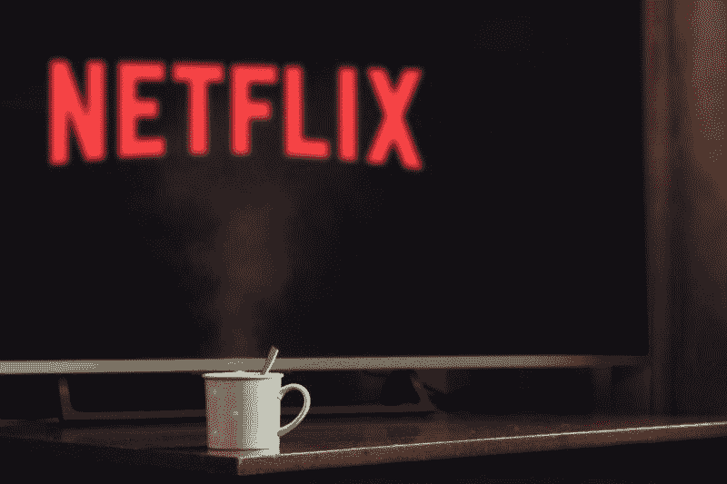
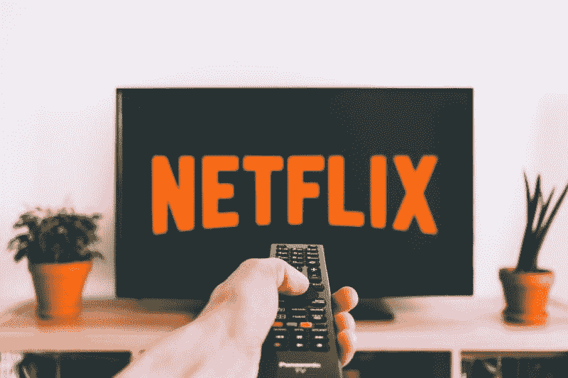

# 迪士尼大战网飞大战冠状病毒——市场疯人院

> 原文：<https://medium.datadriveninvestor.com/disney-vs-netflix-vs-coronavirus-market-mad-house-a86ca0e24d66?source=collection_archive---------11----------------------->

流媒体视频之战很快变成了迪士尼和网飞之间的冲突。解释一下，**华特·迪士尼公司(纽约证券交易所代码:DIS)** 直接拥有 Disney+和 ESPN+并控制 Hulu 75%的股份。

因此，迪斯尼现在是网飞在美国的主要竞争对手。是的，美国还有其他流媒体服务，但只有两家公司正在全力以赴主导市场:**网飞(纳斯达克代码:NFLX)** 和**迪士尼(纽约证券交易所代码:DIS)** 。

解释一下，流媒体视频是亚马逊(NASDAQ: AMZN)和其他娱乐公司的副业。然而，流媒体视频是网飞唯一的业务，而且流媒体视频正迅速成为迪士尼唯一的业务。

# 冠状病毒如何威胁和帮助迪士尼

冠状病毒已经关闭了迪士尼的三项主要业务；最近上映的电影、主题公园和游轮。

此外，我认为冠状病毒将消灭视频租赁市场和迪士尼商店所剩无几的东西。解释一下，许多人会停止外借或租借 DVD，因为他们害怕光盘会携带新冠肺炎病毒。

此外，许多人出于对冠状病毒的恐惧，不再去商店租视频。此外，他们关闭了全美的公共图书馆。公共图书馆是一个很受欢迎的获取视频的地方，因为他们免费分发视频。

 [## 苹果会成为新的网飞吗？数据驱动的投资者

### 有可能。然而，该公司肯定会与大公司竞争。许多人不得不看到这一天的到来…

www.datadriveninvestor.com](https://www.datadriveninvestor.com/2019/02/15/will-apple-be-the-new-netflix/) 

然而，更多的人，包括有孩子的家庭，被困在家里，没有什么可看的。更糟糕的是，他们关闭了所有的电影院。如果你想看除了*菲尔博士、*肥皂剧和*古董巡回展览*之外的东西，你需要流媒体视频。

# 冠状病毒如何帮助流式视频

因此，越来越多的人会订阅网飞、亚马逊 Prime 或迪士尼+,来看一些东西。

任何看过近年来美国广播电视的人都会明白这是为什么。20 分钟的《菲尔医生》、电视购物节目和《猎人》的重播会让习惯了《行尸走肉》《行尸走肉》*《喜剧中心》*和《绝命毒师》的人去点《网飞》或《葫芦》。

此外，现在有许多农村地区的无线电视已经不可用。解释一下，许多电视台切断电源，这意味着他们的信号不再到达许多家庭。相反，大多数农村居民依赖卫星电视，即使是当地电视台。

# 流媒体视频是娱乐行业最划算的交易

是的，你可以订购有线电视或卫星电视，但流媒体视频更便宜。包含 Disney+、Hulu 和 ESPN+的迪士尼套餐每月花费 12.99 美元。与此同时，网飞计划每月费用为 8.99 美元(基本)、12.99 美元(标准)或 15.99 美元(高级)。

相比之下，2020 年 3 月，Reviews.org 的平均有线电视费用为每年 58.49 美元。因此，你可以订购完整的迪士尼套餐、网飞套餐和亚马逊优惠套餐，而且价格更低。[亚马逊 Prime](https://www.amazon.com/gp/help/customer/display.html?nodeId=202213110) 价格为每月 12.99 美元，每年 119 美元，2020 年 4 月学生为 59 美元。

因此，对大多数人来说，流媒体视频是最好的娱乐方式。如果你有好的网络服务，你可以在数百小时的节目中选择你想看的。

记住，在视频流出现之前，疯狂观看并不是一件事。如今，流媒体视频已经成为我们生活的一部分，就像 20 世纪 70 年代网络电视是我们父母生活的一部分一样。

# 流媒体视频时代

流媒体视频的主导地位引发了许多关于我们社会的本质、媒体环境和现代技术影响的问题。

在像新冠肺炎这样的紧急情况下，政府如何联系公民？早在 1986 年，罗纳德·里根总统(R-California)所需要做的就是在电视网络上即时接触 80%到 90%的公民。

然而，如今只有不到 10%的人能看到特朗普的演讲。事实上，我估计 2020 年 4 月 12 日，略多于 5%的美国人口观看了广播网络电视。

我计算了一下，2020 年 4 月 12 日，美国五大广播电视网拥有 1710 万观众。与此同时，2020 年 4 月 13 日，美国人口为 3.30584 亿。此外，联合国估计美国 2020 年人口为 3.31003 亿。

详细来说，*截止日期【2020 年 4 月 14 日，554 万人观看了迪士尼的 ABC，704 万人观看了 CBS，304 万观众观看了 NBC，115 万人观看了 Fox，40 万人观看了 CW。另外 3.31 亿的 5%是 1655 万。*

另外，美国收视率最高的电视网络节目；CBS 的 *NCIS* 在 2020 年 4 月 11 日结束的一周吸引了 1155.5 万观众，*电视剧大结局*。是的，很多人会在 YouTube 上看那个地址。然而，会有更多的人不去理会川普，去玩视频游戏或看了不起的麦瑟尔夫人，而不是听总统讲话。

# 谁会看流媒体视频？

一个相关的问题是，数以千万计的人将通过他们最喜欢的评论员、播客或学者的意识形态动机过滤来收听总统讲话。因此，他们将听到那个人对总统所说的话的看法，而不是特朗普的实际话。

除此之外还有广告。企业如何接触到大量的人？网络电视上的广告现在覆盖了不到 1%的人口。

令人难以置信的各种观看选择，流媒体视频提供了撕裂社会。相比之下，传统的广播电视通过给人们少量的选择将人们聚集在一起。

# 破碎的媒体环境

从积极的一面来看，传统电视可以向数千万人宣传种族融合等信息。请记住，在 20 世纪 70 年代和 80 年代，数千万从未见过黑人的白人观看了桑福德、儿子和 T2 的科斯比秀，看到了对非裔美国人的积极看法。

许多人看这些节目是因为没什么别的节目。今天，同样的人可以选择全是白人面孔的节目；例如，[霍尔马克频道的电影](https://thewalrus.ca/the-unwatchable-whiteness-of-holiday-movies/)。

类似地，极端分子可以从福克斯新闻频道、MSNBC、左翼播客、布莱巴特和 CNN 获得稳定的政治宣传。早在 20 世纪 70 年代和 80 年代，新闻播音员就曾肤浅而笨拙地试图做到不偏不倚。

与流行的神话相反，过去的新闻播音员如沃尔特·克朗凯特有强烈的偏见。然而，沃尔特叔叔试图隐藏他的偏见，大多数时候。相比之下，今天的会说话的头像；如塔克·卡尔森和雷切尔·玛多，采取极端的立场，迎合观众的偏见。

# 冠状病毒如何杀死迪士尼

流媒体时代向投资者提出了一个有趣的问题。问题是迪士尼或网飞能从流媒体视频中赚多少钱？订阅费很低，广告机会有限。

此外，迪士尼只能卖出这么多尤达娃娃和美国队长动作玩偶。因此，我不得不怀疑，如果冠状病毒关闭主题公园和电影院一年，迪士尼是否还能继续营业。

美国最受欢迎的新冠肺炎专家安东尼·福奇博士认为冠状病毒可能会继续存在，直到疫苗准备好。福奇；美国国家过敏和传染病研究所主任估计，开发一种新冠肺炎疫苗需要 18 个月的时间。因此，迪斯尼乐园和你当地的多厅影院可能会黑暗两年。

在没有电影票房和公园门票收入的情况下，Disney+能否产生足够维持迪士尼两年的收入？没人知道，就连迪士尼董事长鲍勃·伊格尔和首席执行官鲍勃·查派克也不知道。

# 冠状病毒如何威胁迪士尼和网飞的未来

一个相关的问题是影视制作。当网飞和迪士尼的原创新节目告罄时会发生什么？

如果冠状病毒关闭了所有的电影和电视工作室，他们会展示什么？我想有足够多的未看过的电视剧和原创电影可以持续一年左右。然而，在某一点上，编程将会耗尽。

如果规划结束时，城市仍处于“待在家里”的命令之下，会发生什么？电影工作室是一项重要的业务吗？有哪个政府官员会允许对《最好给索尔打电话》的拍摄进行例外隔离吗？

因此，我们处在一个甚至可能威胁到迪士尼的新世界。如果迪士尼和网飞不能提供新的原创节目，它们还能出售视频订阅吗？目前，这两项服务都可以通过其图书馆中所有未发行的电影来吸引观众。然而，这种编程将会耗尽。

# 迪士尼赚钱了吗？

奇怪的是，**迪士尼**在冠状病毒爆发前财务状况良好。令人印象深刻的是，Stockrow 估计迪士尼在截至 2019 年 12 月 31 日的季度收入增长率为 36.30%。

此外，迪士尼在同一季度的收入为 208.58 亿美元，毛利润为 78.42 亿美元。此外，迪士尼在同一季度实现了 26.91 亿美元的营业收入和 21.07 亿美元的净收入。

此外，迪士尼报告 2019 年 12 月 31 日的运营现金流为 16.3 亿美元，融资现金流为 11.17 亿美元，期末现金流为 68.74 亿美元。因此，迪士尼在 2019 年 12 月 31 日拥有 68.33 亿美元的现金和短期投资。

因此，在冠状病毒出现之前，迪士尼是一家现金充裕的公司。因此，如果疫情持续不到一年，这些现金可以帮助迪士尼度过冠状病毒。

# 网飞赚钱了吗？

**网飞(纳斯达克代码:NFLX)** 在 2019 年赚了一些钱。具体而言，网飞在 2019 年 12 月 31 日的季度收入为 54.67 亿美元，季度毛利为 20.01 亿美元。

有趣的是，斯托克罗网飞在 2019 年最后一个季度的收入增长率为 30.59%。因此，在 2019 年最后一个季度，迪士尼的收入增长快于网飞。

此外，网飞于 2019 年 12 月 31 日报告季度营业收入为 4.5851 亿美元，季度共同净收入为 5.8697 亿美元。然而，网飞在 2019 年 12 月 31 日报告了-14.62 亿美元的季度负运营现金流。

相比之下，网飞同日的期末现金流为 5.8407 亿美元，融资现金流为 22.23 亿美元。因此，我认为网飞在上一个季度报告中借钱为其运营融资。因此，我认为如果借不到钱，网飞可能会崩溃。

# 你应该买迪士尼股票吗？

因此，我认为在 2020 年 4 月 16 日，迪士尼(纽约证券交易所股票代码:DIS) 的股价是 101.95 美元。此外，我认为“市场先生”在同一天将**网飞(纳斯达克代码:NFLX)** 的股价高估了 438.09 美元。

此外，迪士尼于 2019 年 12 月 13 日支付了 88₵季度股息。因此，在冠状病毒之前，是一个具有高安全边际的好股息股票。不幸的是，我不知道迪士尼是否能从疫情冠状病毒中幸存下来。然而，我认为迪斯尼比网飞有更好的生存机会，因为它的资源更丰富。

因此，如果你想要一只能够抵御冠状病毒的股票，迪士尼是一个有趣的选择。解释一下，迪斯尼比网飞更有可能生存下来，因为迪斯尼有更多的钱。

【https://marketmadhouse.com】原载于 2020 年 4 月 16 日**。**