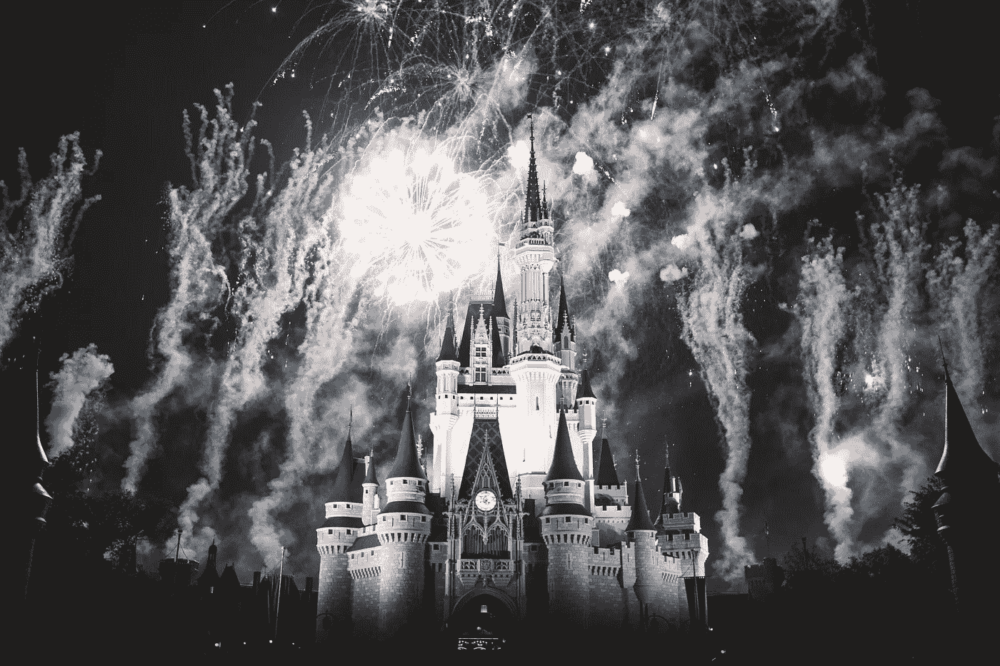

# 迪士尼的后空翻机器人在华特·迪士尼世界找到了一份工作

> 原文：<https://medium.datadriveninvestor.com/disneys-backflipping-robot-is-getting-a-job-at-walt-disney-world-88366b329181?source=collection_archive---------18----------------------->

## 为什么迪斯尼为他们的主题公园制作机器人特技演员

想象你在迪斯尼世界，漂浮在标志性的*这是一个小世界*展览中，其中一个电子动画机器人开始在房间里翻转，做钢铁侠般的特技。这听起来很疯狂，但实际上这是迪士尼的剧本。

当传奇的迪士尼幻想工程团队两年前推出特技机器人时，他们开始创建一个杂技机器人部门，可以做许多在*漫威*电影中看到的高空动作特技。

基本上，迪士尼让机器人替身演员栩栩如生。现在他们正在预览如何在他们的主题公园里使用这些机器人特技演员。

他们计划将这种技术装扮成蜘蛛侠，并在迪士尼加州冒险公园的新复仇者校园*展示它的[。不难想象一个机器人蜘蛛侠的真人蜘蛛侠秀，从一栋楼荡到另一栋楼。这是一个我愿意花钱去看的节目。](https://disneyparks.disney.go.com/blog/2020/01/spider-man-swings-into-action-above-avengers-campus-at-disney-california-adventure-park/)*

 [## 幸福的算法？数据驱动的投资者

### 从一开始，我们就认为技术正在使我们的生活变得更好、更快、更容易和更实用。社交媒体…

www.datadriveninvestor.com](https://www.datadriveninvestor.com/2019/03/08/an-algorithm-for-happiness/) 

但是除了主题公园(在那里他们已经雇佣了几十个电子机器人)，机器人特技演员将如何影响实际的电影制作业务？

迪士尼和其他大公司已经显示出向数字演员替代发展的迹象，他们使用数字人在屏幕上描绘一个人。我正在密切关注这一趋势，因为它将对好莱坞产生影响，而且品牌化身/数字人正在取得巨大进展。

 [## 品牌化身正在为好莱坞电影角色而来——不可避免的/人类的

### 当我们谈到工业自动化时，我们很少(如果有过的话)谈到…

inevitablehuman.com](https://inevitablehuman.com/brand-avatars-are-coming-for-hollywood-movie-roles/) 

美元是有意义的。但从人文角度来看，这样做对吗？

你怎么想呢?机器人特技演员会让电影制作和主题公园更安全吗？还是借鉴了人类特技的特殊工艺？