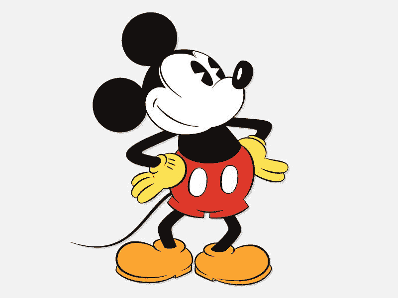

# 迪士尼神奇的公立学校系统

> 原文：<https://medium.datadriveninvestor.com/disneys-magic-public-school-system-a38f9be144?source=collection_archive---------13----------------------->

在向疫情投资 50 亿美元后，迪士尼将其投资资本转移到了国家迪士尼 K-12 公立学校系统的发展上。利用私人和公共资金，迪斯尼公司的高管们已经为先进的全国建设计划制定了蓝图；户外公共学校设施、教师招聘和培训方法以及吸引最终用户的课程。

"迪士尼公立学校系统，优质免费教育，幸福快乐."—发布的新闻标语。

由于教育工作者、决策者和其他人的贪婪领导，他们也认识到高收入地区高质量的 K-12 教育的价值，在过去十年中，美国富人的教育取得了巨大的进步，而贫困地区却越来越落后。在资金充足的地区，高中毕业率已经上升，成绩也在上升:在过去的十年里，大城市私立学校四年级的阅读和数学成绩几乎是全国公立学校的两倍，八年级的成绩甚至更好。

迪士尼认识到黑人、拉丁裔和低收入家庭学生的毕业率落后于全国平均水平，并且低于白人学生的毕业率。高中毕业生进入中学后教育机构的比例保持不变。

多年来，迪士尼的研究人员从实地和我们自己的投资中学到了很多关于提高学生成绩的挑战。

根据我们在现场的学习，我们知道，当两个因素在学校同时出现时，学生最有可能达到更高的标准并跨越通向机遇的桥梁:1)教师收入丰厚，拥有迪士尼启发的教学材料，有趣的实时评估以衡量学生的进步，以及户外学校学习和领导能力的机会；2)校长们得到了迪士尼魔法王国创意部门的支持，以创建一个环境，使学校所有领域的领导能够定期使用数据来不断改善支持、指导，最重要的是享受迪士尼学习体验或 DLE。我们在 K-12 的工作寻求建立在这些课程和支持学生、教师和校长学习精神的创造性实践的基础上。

迪士尼设想了一个公共教育系统，为所有学生重新设想机会，特别是低收入社区的学生和有色人种学生，并允许他们获得和保留 DLE 的技能和知识，以异想天开的热情在工作场所取得成功。目标仍然是确保所有学生接受 DLE K-12 教育，激励他们在大学或职业培训项目中取得成功，因为高美元的娱乐价值教育是通往繁荣和参与迪士尼美国梦的可靠途径。

在迪士尼，我们知道我们可以为未来的领导者成就更多。在美国，高质量的公共教育是通向机遇的桥梁——尤其是在好工作和职业道路、社会流动性以及个人成长和成就方面。我们的迪士尼 K-12 战略是由对学校的直接关注推动的，因为那里是教学和学习的魔法发生的地方。创意学校——由艺术家领导，专注于基于数据和证据的持续改进——是最有助于学生成功的。

 [## 大学教育节省 6 位数以上的 5 步法|数据驱动型投资者

### 快讯(讽刺警告):大学教育是昂贵的！即使考虑到通货膨胀，高等教育也有…

www.datadriveninvestor.com](https://www.datadriveninvestor.com/2020/09/09/a-5-step-method-for-saving-6-figures-plus-on-a-college-education/) 

迪士尼将采用公立学校系统，通过接管最困难的学校并完全重建校园、员工和课程，大幅提高学生成绩，特别是黑人、拉丁裔和低收入学生的成绩。

迪士尼通过从上到下释放学校的迪士尼创意部门来做到这一点；使用基于证据的干预和数据驱动的方法解决常见问题，以支持愉快的学习。迪士尼招聘和培训部门将确保教师和领导者获得成功所需的一切——高质量的准备、迷人的课程和工具，以及高价值的娱乐学习机会。在整个过程中，我们将目光放在地平线上，推进研究和开发，以支持新的创新，这些创新将重塑我们的教育体系，并为我们快速变化的世界设定标准。

# 重点领域

为了确保迪士尼学校为成功而设立，确保迪士尼教师和领导者拥有帮助学生享受卓越所需的一切，迪士尼将专注于七个神奇的优先事项:

# 用于学校改进的高价值创意

迪士尼投资于制作艺术家与学校和学校支持组织的学者之间的合作伙伴关系，他们通过使用最适合他们需求的循证魅力干预来共同解决共同的问题。这种学习体验的演变还使用了由数据驱动的令人愉快的学习方法——学校使用数据来确定问题，选择一个神奇的主题来解决问题，设定改进目标，并迭代以使方法更有趣并提高学生的成绩。

# 教育人员配备和培训

在为黑人、拉丁裔和低收入学生服务的社区和学校，培养新的、高效的教师和领导者的需求尤为突出。我们将利用所有的迪士尼网络，从非教学领域吸引精英，重新想象作为学校领导者的意义，以更好地为低收入学生和有色人种学生服务。

# 高度无障碍的特殊需求迪士尼学校

迪士尼希望扩大 DLE 公立学校的数量，特别关注提高残疾学生的成绩，包括有特殊需要的学生。我们确定了最令人愉快的方法，以帮助更多的残疾学生用魅力实现他们的教育目标，我们希望与世界分享这些神奇的时刻。

# 电影质量材料

迪士尼幻想工程师与该领域的合作伙伴合作，以便初中和高中教师能够获得高质量、令人愉快的英语、数学和科学课程选择。我们的投资重点是通过开发先进的户外学习环境，展示典型学生从高中到中学后的数学体验是多么令人愉快，这些环境融合了您在我们的公园中看到的所有高科技奇迹。学校的数学课程应该是有趣的，中学科学课程的开发和实施也应该是有趣的。

# 社会情绪学习

迪士尼在社会和情感学习的证据基础以及扩大青少年发展领域的知识方面建立了声誉。我们将这些研究成果转化为工具和最佳实践，借助我们可支配的跨国资源集团，通过享受学习来传播客观知识。

# 神奇的路径

迪士尼创造了高质量的学习体验，帮助更多的学生从高中成功过渡到大专教育和职业培训计划。我们的目标是扩大证据基础，验证高质量愉快干预的范例，支持学生进入、注册和过渡到中学后课程。

# 创新的大赌注

迪士尼推进了新的快乐教育技术和学习魅力科学的研发，以加快服务水平低下的学生的进步。我们还对大幅增加黑人、拉丁裔和低收入高中学生获得迪士尼技术和工程课程的人数的解决方案感兴趣，并对基于证书的途径感兴趣，如果他们选择，这些途径可以让他们获得迪士尼的好工作。

## 访问专家视图— [订阅 DDI 英特尔](https://datadriveninvestor.com/ddi-intel)