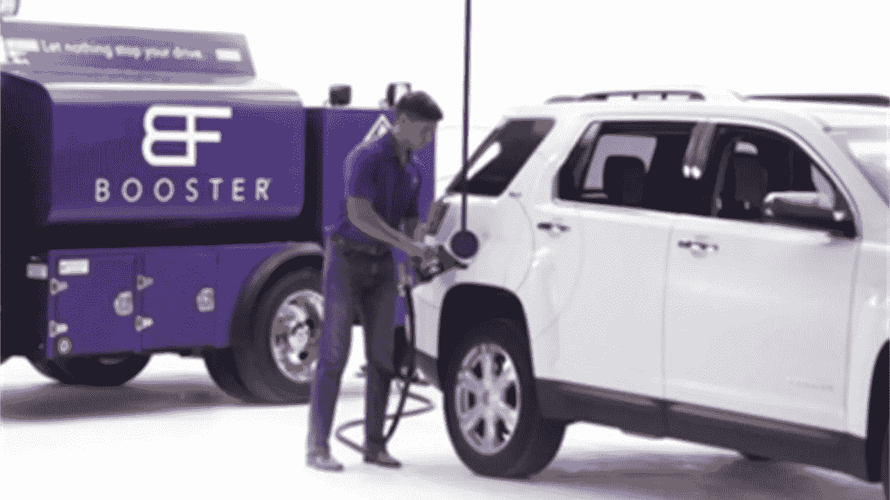

# 颠覆性技术成就按需天然气行业。它会来到你附近的城市吗？

> 原文：<https://medium.datadriveninvestor.com/disruptive-tech-enables-the-on-demand-gas-industry-is-it-coming-to-your-city-near-you-85fb6bff7eb5?source=collection_archive---------13----------------------->

[This Photo](https://www.groundreport.com/startup-offers-demand-car-fueling-services/) by Unknown Author is licensed under [CC BY-NC](https://creativecommons.org/licenses/by-nc/3.0/)

## 人工智能能够按需向您的车辆输送气体。即使存在安全问题，这个行业的前景看起来还是光明的。

美国消费者新闻与商业频道最近播出了一个商业片段，讲述了让迪拜的 CAFU 公司成功运营按需供气业务的颠覆性技术。这种“燃料送货上门”的概念为顾客提供了一种“优步换汽油”的服务，无论顾客在家还是在任何地方。客户使用移动应用程序来预订交付的时间段。如果不在车上，他们甚至可以打开油箱盖。顾客可以以与当地加油站相同的价格购买汽油，并为这项服务每月支付约 10 迪拉姆(2.72 美元)。

CAFU 开发了专有软件，可以跟踪它的加油车、它们在城市中的路线以及客户需求。它使用数据分析、机器学习和人工智能预测建模，随着需求的变化，在整个迪拜移动其加油车队。

gas mob——休斯顿的一家公司，也可以让你按需取气。GasMob 与大型办公园区和公寓楼合作，允许客户使用他们的服务，而无需支付额外的服务费。他们也有住宅点播服务，每月收费 3-5 美元。天然气的价格对当地加油站来说是有竞争力的，在许多情况下甚至更低。

 [## 数据驱动型投资的兴起

### 当 JCPenney 报告其 2015 年 2Q 的财务结果时，市场感到非常震惊。美国零售巨头…

www.datadriveninvestor.com](https://www.datadriveninvestor.com/2019/02/28/the-rise-of-data-driven-investing/) 

根据美国消费者新闻与商业频道的另一份报告，另一家按需供应天然气的公司 Booster Fuel 希望成为亚马逊的首选汽油。该公司成立于 2014 年，与办公园区和其他停车场合作，并利用移动和机器语言技术将加油车与客户车辆位置进行匹配。客户包括脸书、贝宝、百事和菲多利。它在 3 个地区的 20 个城市开展业务:加利福尼亚州的旧金山湾区、奥兰治县和德克萨斯州的达拉斯-沃斯堡地区。2018 年，Booster 的首席执行官弗兰克·麦克罗夫特(Frank Mycroft)估计，Booster Fuel 每天可以泵出 18 万美元的天然气。

随着每天向成千上万辆汽车输送高度易燃的汽油，安全性成为该行业的主要关注点之一。尽管按需供应的天然气公司保证，他们的运输车队大大超过了目前使用的最好的运输车辆的安全性，但全国各地的市县消防队长仍然持怀疑态度。尽管数百万次按需交付没有发生事故，但许多安全人员认为“移动交付平台”在住宅区存在不可接受的风险。

Booster Fuels 与其市场城市达成了妥协，这似乎行得通。它没有直接送货上门，而是在办公园区和较大的公寓楼的停车场内运作。到目前为止，这似乎是助推器燃料，城市和他们的客户的双赢局面。虽然它不像能够向您的车库输送气体那样方便，但它限制了暴露在易燃液体和有害汽油烟雾中的区域。

在美国大部分市场广泛使用移动按需供气之前，仍有一些重大障碍需要克服。汽油的销售和运输有消防和安全规定。这些规定由当地市县负责，各市县之间差异很大。还有一些环境法规需要考虑，这些法规由州和联邦当局进行管理。一些重量和测量法规要求精确泵送燃油。最后，还要考虑税收因素。对固定加油站的销售征税是一回事；开发一个移动应用程序是另一回事，它将自动包括销售一加仑汽油所涉及的所有联邦、州和地方税收。

尽管挑战依然存在，但羽翼未丰的按需燃气行业相信，他们将找到所有这些挑战的答案。华盛顿特区的非营利政策智库 R Street 最近发布了一份[政策研究，概述了影响移动燃料输送行业的监管问题](https://www.rstreet.org/2019/10/23/r-street-policy-study-no-185-regulating-fuel-delivery-2/)。该研究强调了环境、安全和税收问题。他们的结论是，地方和县法规拼凑而成的问题可以通过州一级的授权立法得到最好的解决，该立法将要求所有地方市政当局遵守相同的一套全州法规。他们还鼓励州政府和联邦政府之间的立法合作。这项政策研究的总体基调表明，对于这个新生行业目前面临的所有挑战，都有坚实的解决方案。

由于解决各种监管问题的不确定性，投资这个行业仍然存在风险。然而，移动按需天然气行业有相当大的上升潜力。2019 年 6 月，Booster Fuels 从 Invus Opportunities 牵头的几家风险投资公司获得了[5600 万美元的 C 轮融资](https://www.freightwaves.com/news/booster-fuels-up-on-56m-series-c)。迄今为止，Booster Fuels 已经从风险投资公司获得了 8800 万美元的资金。虽然 Booster Fuels 是最大的移动按需天然气公司，但它也面临着来自[吴雅思、Filld、Purple 和 WeFuel 等公司的竞争。](https://jungleworks.com/on-demand-gas-apps/)

按需汽油交付的未来会怎样？这些公司在全国 20 个城市开展业务，但它们会来到你附近的城市或城镇吗？很多风险投资公司似乎都这么认为。举个例子，增压燃料目前正在上市前的市场上交易，所以对这个行业的强烈兴趣还在继续。

前几天，我 89 岁的母亲展望了这个行业的潜力。当我谈到这个新兴行业时，她似乎很感兴趣。“我讨厌去加油站，”她说，如果这些公司中有一家在科罗拉多斯普林斯，我肯定会签约。“我甚至没有停下来考虑老年人和残疾人的便利，但那里也有巨大的市场。

Booster Fuels、Yashi、Purple、GasMob 或其他公司会成为“移动燃气的优步”吗是的。虽然仍有许多障碍，但其中一家公司将成为行业的“优步”。现在，它看起来像助推燃料。任何事情都可能改变，市场仍然充满风险(我的免责声明)，但有一点是肯定的；这个行业的未来看起来很光明。