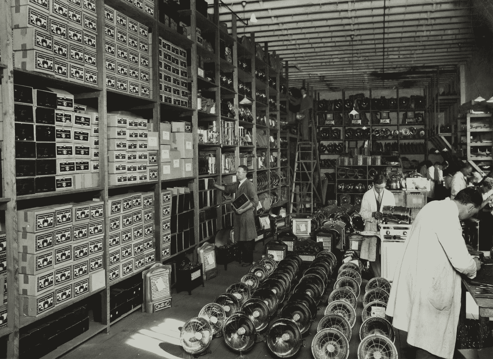

# 颠覆性技术:它们将如何彻底改变你的日常生活

> 原文：<https://medium.datadriveninvestor.com/disruptive-technologies-how-they-will-radically-change-your-daily-routines-71c09088098c?source=collection_archive---------17----------------------->

## 好消息:他们会把更多的钱放进你的口袋

Photo by [Victor Garcia](https://unsplash.com/@victor_g?utm_source=medium&utm_medium=referral) on [Unsplash](https://unsplash.com?utm_source=medium&utm_medium=referral)

经过几年的技术融合，在 19 世纪，三大平台彻底改变了世界经济。

它们是:电力、电话和内燃机。

目前，五大平台将彻底改变全球经济。这也是技术融合的结果。它们是:

*   人工智能；
*   机器人技术；
*   加密货币；
*   电池存储；
*   DNA 测序。

这么多年的融合现在是时候了吗？为什么？

为什么这些发明需要时间来收敛？它们是如何融合的？有人在控制它们同时聚合的时间吗？

Photo by [NESA by Makers](https://unsplash.com/@nesabymakers?utm_source=medium&utm_medium=referral) on [Unsplash](https://unsplash.com?utm_source=medium&utm_medium=referral)

# 孤立是一条死胡同。除了趋同，地球上没有任何东西会生长

很多人认为技术是现代的东西。更糟糕的是，有些人，尤其是投资界的人，认为科技公司一定属于科技行业。

这是一个巨大的假设错误，因为从来没有成功的成长型公司，不是科技公司。

通过阅读过去 100 年的历史，你会了解到约翰·洛克菲勒创立的标准石油公司在当时是一家科技公司。通用电气也是一家科技公司。

这些颠覆性的公司在当时确实彻底改变了整个行业。其中一些创造了新的部门。

现在想想很有趣，因为我认为很快就会有新的领域出现。比如:

*   深度学习(下一代互联网)；
*   数字钱包(新的金融技术正在崛起)；
*   加密货币(区块链和加密资产)；
*   电池成本临界点(工业创新)；
*   自主出租车网络(每英里成本紧缩)；
*   下一代 DNA 测序(基因组革命)；
*   CRISPR 基因组编辑用于人类疗法(治愈疾病)；
*   协作机器人(工业颠覆)；
*   最终使用零件的 3d 打印(工业效率)；
*   流媒体(视频、音频和游戏中断)。

这些很可能是准备彻底颠覆全球经济的下一代新产业。

这些都是好消息。

他们都在进行一场趋同运动。他们中的一些人会互相合作，他们是垂直整合的。这意味着它们将是通货紧缩，成本不断下降，并以更快、更有效的速度增长。

比如人类治疗学的基因组编辑(CRISPR)。

今天，仅有 5%的遗传疾病有治疗方法。在大多数情况下，医生和科学家关注疾病的症状，而不是根本原因。

CRISPR 是一个强大的 DNA 测序编辑工具，可以轻松、廉价地精确校正、删除或编辑基因。我们每个人都有一个医生，但也有一个私人遗传学家，这将是非常正常的。

CRISPR 正在成为治疗疾病的最有前途的方法之一，从囊性纤维化到癌症或儿童失明。

 [## 轻松投资颠覆性技术|数据驱动型投资者

### 研究并做好你的尽职调查，找出 10 个可能主宰未来行业的装袋者可能会很难。的…

www.datadriveninvestor.com](https://www.datadriveninvestor.com/2020/07/13/investing-in-disruptive-technology-made-easy/) 

根据莱特定律，这些技术将不断出现通缩成本下降。

什么是[莱特定律](https://bit.ly/3mxDaPj)？根据[方舟投资](https://bit.ly/31kIEVg):

> 由 Theodore Wright 于 1936 年首创的 Wright 定律旨在提供一个可靠的框架来预测作为累积产量函数的成本下降。具体来说，它指出，每生产一倍的累积单位，成本将下降一个恒定的百分比。

通过使用技术和垂直整合作为原则，这些新的颠覆性学科将允许他们提供的每项服务的成本下降。

Photo by [Museums Victoria](https://unsplash.com/@museumsvictoria?utm_source=medium&utm_medium=referral) on [Unsplash](https://unsplash.com?utm_source=medium&utm_medium=referral)

# 自动化正在推动平庸和重复性任务的减少

多年来，技术推动世界前进，创造新的服务，建立新的结构，不知何故使人类生活更容易。

每一项技术都有成本曲线。不同的技术以不同的速度进步。例如:

*   **计算** -摩尔定律(晶体管数-41%/年递减)；
*   **数据存储**——克莱德定律(硬盘美元/位每 18 个月下降 50%)；
*   **数码成像** -亨迪定律(每美元像素-57%/年下降)；
*   **网络容量**——巴特光子学定律(9 个月内传输成本下降 50%)；
*   **锂离子电池** -(美元/千瓦时 20%/年下降)。

然而，尽管有这种惊人的通货紧缩描述，为什么这些技术没有在经济中爆炸和繁荣呢？

为什么谷歌和苹果会在 2007 年推出第一款智能手机？为什么不是在 2005 年或 2009 年？

因为所有让 600 美元的智能手机成为可能的技术都发生在 2007 年。如果苹果和谷歌不知道颠覆性的运动总是来自外包，他们就不会成功。

苹果和谷歌不得不等待其他公司的融合运动，这些公司提供了制造智能手机的所有组件。这就是为什么摩托罗拉或诺基亚没有这样做。因为他们当时不明白技术颠覆是如何运作的。

Photo by [JJ Ying](https://unsplash.com/@jjying?utm_source=medium&utm_medium=referral) on [Unsplash](https://unsplash.com?utm_source=medium&utm_medium=referral)

# 看起来这么便宜要花很多钱

摩尔定律是时间的函数。莱特定律是单位的函数。这最后一条基本上是说，生产单位的累积翻一番，成本以一致的速度下降。

就影响而言，弄清楚与这些新的颠覆性平台相关的成本是否下降得足够多，是一个圣杯。

例如，DNA 测序费用低于 100 美元。去年，全世界测序的基因组总数为 250 万。这是历史上测序的所有基因组的一半。他们很快就会激增到 1 亿。已经到了临界点了。

特斯拉也在做同样的轨迹。Elon Musk 认为，电池成本的下降将对全球人口每英里成本产生深远影响。这意味着，我们将拥有成本越来越低的交通系统。目前，对于内燃机，我们每英里的成本约为 0.36 至 0.52 美元。

在电动汽车中，成本下降到每英里 0.17 美元。遵循莱特定律，未来几年事情会变得有趣。

# 结论

每一个工厂、仓库、商业、购物中心、停车场、家庭住宅等等，都将有太阳能，不久也将有电池存储系统。

电池成本下降，太阳能屋顶技术将继续改善，并降低能源成本。绝对数字是零。

人工智能和深度学习将开发越来越高效的储能系统，使成本趋于零。

你能想象你的邮箱会收到任何涉及能源消耗的账单吗？很难想象。

你能想象使用自动驾驶汽车去你想去的任何地方，每月支付 5 或 10 美元吗？很难想象。

然而，未来 10 年，情况将发生巨大变化。

对我们所有人来说，观察这样的转变是一种特权。

所以，享受旅程吧。

谢谢你，努诺

## 访问专家视图— [订阅 DDI 英特尔](https://datadriveninvestor.com/ddi-intel)