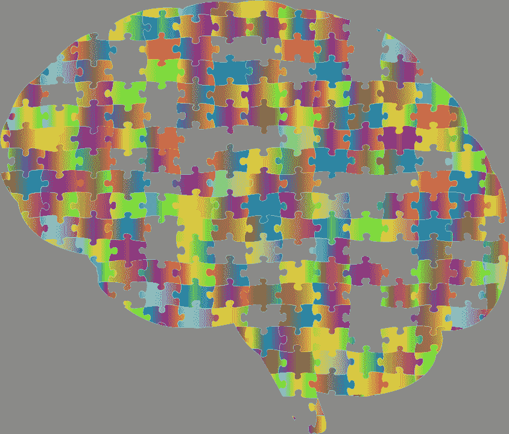

# 了解人工智能初创公司

> 原文：<https://medium.datadriveninvestor.com/dissecting-ai-startups-435fc00be69b?source=collection_archive---------16----------------------->

# 了解他们面临的挑战如何带来出色的解决方案

Image courtesy of [https://www.needpix.com/photo/1126670/brain-cranium-head-psychology-skull-think-thought-mind-jigsaw](https://www.needpix.com/photo/1126670/brain-cranium-head-psychology-skull-think-thought-mind-jigsaw)

人工智能不适合胆小的人。这是一项前沿技术，不仅在技术方面，而且在产品和业务方面都有很多未知。在 AI 中赚钱(而且只卖 AI…如果你卖广告赚钱也卖 AI，这篇文章不适用！)并不是在截至 2020 年的规模上反复做的事情。

我最近在安德森·霍洛维茨的[马丁·卡萨多](https://a16z.com/author/martin-casado/)和[马特·博恩施泰因](https://a16z.com/author/matt-bornstein/)的文章中看到了这篇好文章。事实上，几个月前我有机会和 Matt 就同样的话题——人工智能在 SaaS 的挑战和机遇——进行了交谈。

我强烈建议把它作为读物…对我来说，它给我一种奇怪的感觉，好像是我刚在网上找到的一部小说的主角之一。……(是的，我是一家人工智能初创公司的首席执行官， [Neurala](http://www.neurala.com/) )

这篇文章非常清晰地描绘了传统人工智能初创公司(和非传统人工智能初创公司)提供人工智能技术的现状、经济和前景。在同一个表达中把“传统”和“人工智能”放在一起有点可笑，因为在许多人的(自然)智能中，这是一种全新的技术。

 [## 深度学习用 7 个步骤解释-更新|数据驱动的投资者

### 在深度学习的帮助下，自动驾驶汽车、Alexa、医学成像-小工具正在我们周围变得超级智能…

www.datadriveninvestor.com](https://www.datadriveninvestor.com/2019/01/23/deep-learning-explained-in-7-steps/) 

然而，尽管通过深度学习赚钱&神经网络是一项相对较新的运动，但自从 25 年前我编写第一个神经网络以来，底层的数学、算法和工作流(实际上)一直保持不变。

这篇文章认为，总而言之，人工智能初创公司面临以下主要挑战，例如:

*   **云**成本问题:由于浪费大量现金充实亚马逊&公司，毛利率降低，因为你需要对大量数据进行训练，不是一次，而是一次又一次(见下文原因)；
*   **边缘案例**蔓延:扩展中的问题，因为每个问题都是独特的&不断有边缘案例蔓延——因此您需要 ratrain 并支付云费用(见上文！);和
*   **开源**竞争:很难捍卫他们的业务/技术，因为学术界和开源不断推出“新人工智能”。

云+极限案例+开源因素的非线性组合同时将毛利率拉至 50–60%的范围(相对于 60–80%+SaaS 基准)，这并不好玩。虽然人工智能，但这些人工智能公司在商业上比它们所谓的技术含量较低的兄弟公司更笨。

> 我倾向于同意文章的主要观点和分析。有一系列重要的转折。

这篇文章适用于“传统的”人工智能技术和公司。也就是说，收集数据的传统工作流，用规范的[反向传播](http://maxversace.com/when-dnns-become-more-human-dnns-vs-transfer-learning-vs-continual-learning)进行训练(在亚马逊 GPU 服务器上迭代万亿次…)，并且因为环境条件的变化而重复这 n = infinity #次..

是的，以上是一个会让 AI 创业公司容易受到上述毛利率和挑战的模型。

> 还好这种作案手法不是唯一的！

让我们一个接一个地看看这三个组件，云、极限案例和开源。

# 云:获得 AWS 的优势…

在云上训练人工智能可能会在每次训练时花费你数十万美元的云费用！传统的深度神经网络(或 DNN)训练需要迭代大量的数据点。此外，与生物学习不同，你需要存储所有的训练数据，以便从头开始重新训练，从而丰富你的人工智能模型。我们还发现这是 100%真实的，也是意料之中的:人工智能永远不应该停止学习(例如，参见这篇关于[将人工智能应用于制造业](https://medium.com/@maxversace/ai-in-manufacturing-5-common-pitfalls-and-ways-to-avoid-them-6318825dce32)的文章)

好消息是这不是唯一的方法。在 Neurala，我们开创了一种新的深度学习技术，可以直接在计算边缘进行培训。[点击此处](https://www.forbes.com/sites/forbestechcouncil/2020/02/12/2020-and-the-dawn-of-ai-learning-at-the-edge/#6766fa602029)了解这项名为终身 DNN (L-DNN)的技术。除了不需要云资源来训练之外，L-DNN 不需要存储输入数据，从而降低了数据/存储成本。

此外…即使你坚持云训练模式，你也可以使用像 L-DNN 这样的技术，这将带来巨大的好处！特别是:

1.  训练模型达到饱和精度所需的数据要少得多；
2.  每个训练样本所需的计算量要低得多；和
3.  如果有数据漂移(*我喜欢这个名词！)*，只有新数据可以添加到模型之上，而不是对整个数据集重复训练。

所以，如果你的人工智能是老式的 DNN，这个职位适用。如果您可以像使用 L-DNN 那样进行增量训练，甚至可以在设备上(或在计算边缘)进行训练，并且可以丢弃训练数据，那么它不会。

# 角落案例:永远不要停止学习

智力是如此具有欺骗性……作为人类，我们从未停止学习——这是我在我的神经科学 101 课程中学到的基本教学之一……但是我们做得如此简单，以至于我们没有意识到它的发生。

如此欺骗性和毫不费力，很少(但是，正如我们看到的，不是一个零集..)科学家们专注于解决这个问题，很少有人转化为技术。

因此，如果您使用的是传统的 DNN，正如文章所言，您将面临这一挑战，因为存在您没有考虑到的数据和条件，或者您在将 10 万美元交给 AWS 进行培训之前没有收集到的数据:

*“处理这个巨大的国家空间往往是一个持续的杂务。由于可能的输入值范围如此之大，每个新的客户部署都可能生成以前从未见过的数据。即使看起来相似的客户——例如，两家进行缺陷检测的汽车制造商——也可能需要完全不同的训练数据，原因就像在装配线上放置摄像机这样简单的事情。”*

但是，如果您的技术能够在部署后继续学习，那么这个问题也会消失。见[此处](http://maxversace.com/how-does-lifelong-dnn-work-in-a-real-world-use-case)。

此外，与这篇文章相呼应的是，我们总是从客户那里看到数据受到严密保护，同时，随着条件(以及数据)不断变化，数据变得毫无用处。例如，在制造或零售环境中，引入了与您的(预训练)数据不同的新产品，因此您可以告别您收集和标记的数据，必须从头开始。

然而，拥有一种技术、方法和工作流，使人工智能技术的用户能够快速上传和训练他们自己的独特数据，而不必在云中训练，并在边缘即时调整/改变/增强该模型，使得上述问题不适用。

# 开源:人工智能并不回避必须制造一个好的产品！

是的，新的人工智能模型不断出现。然而，与许多人相反，我认为大多数都是边际改进&一组精选模型的近亲繁殖——我们都知道近亲繁殖会导致不育。所以，我认为有空间给专有的东西。

然而，这个帖子说得很对，不能说得比它是如何放置的更好，需要以正确的方式进行产品化:

*“虽然还不清楚人工智能模型本身——或底层数据——是否会提供长期的护城河，但好的产品和专有数据几乎总是能建立好的业务。人工智能为创业者提供了解决老问题的新视角。[….]在最初独特的产品能力基础上构建粘性产品和持久业务的机会是永恒的。”*

总之，很好的文章，很好的阅读，它揭示并向他们展示了可扩展和可盈利的人工智能部署面临的主要技术、产品和业务挑战。

理解问题&提出好问题是给出好答案的 90%!