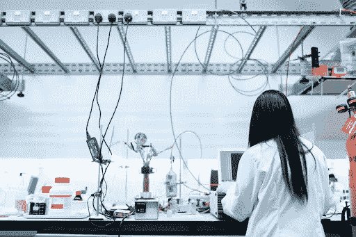
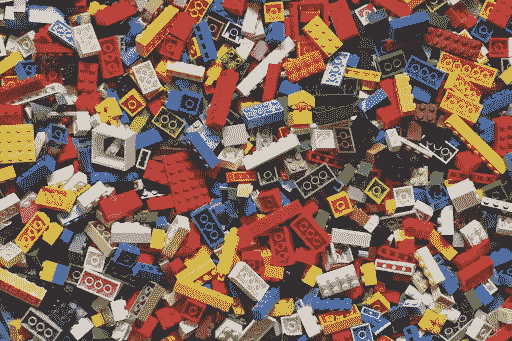

# 剖析 STEM 中的性别差异

> 原文：<https://medium.datadriveninvestor.com/dissecting-the-gender-divide-in-stem-7f8e61fde17a?source=collection_archive---------12----------------------->

女性仅占 STEM 领域劳动力的 28%。2020 年，STEM 劳动力不应该是这样的。

随着全球问题的影响越来越大，创新变得越来越重要，STEM 领域的多样性至关重要，以确保新的创新满足每个人的需求。如果女性不是工程过程的一部分，女性特有的经历、需求或欲望可能会被忽视，而她们以前也曾被忽视过。例如，当安全气囊最初被创造出来时，它们是为适应男性身体而制造的，这导致了妇女和儿童可预防的死亡。因此，我们必须确保将来不会犯这样的致命错误。要做到这一点，更多的女性需要成为 STEM 劳动力的一部分，社会需要拆除将她们排除在这些领域之外的障碍。在这篇文章中，我将探究 STEM 中性别差异的根源，并讨论如何帮助结束这种差异。

# 原因一:缺乏女性榜样

作为一个对在技术领域追求职业感兴趣的年轻女性，我发现在这个领域缺乏我钦佩并渴望模仿的女性榜样。STEM 领域缺乏女性榜样会影响年轻女孩决定不从事这些领域的职业，因为 STEM 领域的职业在她们心目中与男性联系在一起。如果年轻女孩看不到其他从事 STEM 职业的女性，她们会开始怀疑自己是否有能力胜任 STEM 工作。一项研究发现，知道 STEM 领域榜样的 T2 女孩对 STEM 领域的兴趣增加了 12%,当被问及她们在 STEM 领域的表现时，她们对自己的评价更高。因此，榜样对于激励和安抚下一代女性变革者至关重要，她们和男性一样能够胜任 STEM 职业。

# 原因二:令人沮丧的环境

此外，女性可能不愿意从事科学、技术、工程和数学职业，因为在工作场所存在对女性的性别歧视。根据《哈佛商业评论》发表的一篇文章， **53%接受采访的 STEM 女性讨论了因过于自信或发表意见等行为而面临反弹**。在 STEM 中，社会建构的性别角色肯定是不利于女性的，因为这些角色要求女性应该是被动的，而男性应该扮演更主动的角色。性别角色在 STEM 工作场所或任何工作场所都不起作用，因为女性需要亲力亲为，不能被动地发表意见。因此，由于性别角色不符合女性在工作场所的角色，性别歧视开始出现。面对同事的这种行为对任何人来说都是令人疲惫和沮丧的，所以难怪这可能是促使女性远离 STEM 的一个因素。

此外，STEM 中针对女性的性别歧视不仅存在于工作场所，也存在于教育系统中。例如，在工程或机器人项目中，我经历过被男同学遮蔽的经历，因为他们在技术方面有一种优越感。尽管事实上我已经自学了编程技能，但我的毕业班中很少有人知道。**微软做的一项** [**研究发现，大多数女孩对 STEM 的兴趣早在 15 岁就开始减弱。**学校在 STEM 科目中对女生的性别歧视肯定会在其中发挥作用，需要采取更多措施来防止 STEM 科目中女生过早辍学。](https://news.microsoft.com/europe/features/dont-european-girls-like-science-technology/)

# 原因三:年轻时在 STEM 中强化对女性的刻板印象

一些女孩甚至无法开始培养对 STEM 的兴趣，因为她们年轻时就被强加了刻板印象。例如，年轻的男孩通常会得到更多与 STEM 相关的玩具，如积木和乐高。**有些人避免给女孩和男孩一样的 STEM 相关玩具体验，所以女孩在很小的时候就开始把 STEM 和男人联系在一起。**出现这种情况是因为提供玩具的成年人通过提供被认为是儿童性别典型的玩具，将自己对女性的偏见强加给儿童。这导致孩子们随着年龄的增长，对他们玩的玩具类型变得不那么灵活，并导致玩 STEM 相关玩具的男性数量比女性多得多。

此外，媒体强调了男孩应该比女孩玩更多与 STEM 相关的玩具。我小时候看过的玩具店传单没有一张是以一群玩乐高的女孩为特色的，他们总是男孩。一位心理学家[表示](https://www.nytimes.com/2018/02/05/well/family/gender-stereotypes-children-toys.html)孩子们接触到的**图像能够强化刻板印象，缩小他们的视野，但它们也能够创造可能性，让孩子们相信他们有更多的选择**。因此，如果在儿童广告中有更多女孩玩 STEM 相关玩具的媒体表现，也许 STEM 中的性别差异将开始缩小。在看到自己被媒体描述为“有能力”玩与 STEM 相关的玩具后，女孩们将开始对自己的 STEM 能力感到更加自信，这可能会导致她们在 STEM 领域寻求职业生涯。

# 原因四:STEM 领域对女性的偏见

从一开始，人们就不鼓励妇女追求事业和加入劳动力队伍，因为社会认为她们应该是家庭的“主要照顾者”。这些传统观念已经渗透到科学、技术、工程和数学领域缺乏女性的问题中，并放大了这个问题。根据一篇[文章](https://hbr.org/2015/03/the-5-biases-pushing-women-out-of-stem)，**的报道，近 66%有孩子的女科学家表示，她们的承诺和能力受到质疑，一旦有了孩子，工作机会就不再向她们走来**。社会建构的性别角色肯定是 STEM 中女性缺乏的一个原因，因此社会需要解构这些未言明的说法，以增加 STEM 中女性的数量。

 [## 不平等就是不平等吗？数据驱动的投资者

### 有一句波兰谚语说，对于一个穷人来说，风总是吹进眼睛里。还有类似的英语谚语…

www.datadriveninvestor.com](https://www.datadriveninvestor.com/2020/04/22/is-inequality-unequal/) 

此外，女性在 STEM 方面不如男性，这一点在我们心中已经根深蒂固。根据**《哈佛商业评论》的一篇文章,“三分之二的受访女性和三分之二的被调查女性报告说，她们不得不一遍又一遍地证明自己——她们的成功被打折扣，她们的专业技能受到质疑。”**为了开始缩小 STEM 中的性别差距，社会需要抛弃陈旧的观念，即女性不太胜任 STEM 中的角色，只是因为传统上男性占据了这些职业。性别并不决定一个人在 STEM 领域取得成功的能力，因此社会需要摒弃这种偏见，以增加 STEM 职业中女性的数量。

# 你如何帮助消除 STEM 中的性别差异

## 更多媒体关注 STEM 领域的女性

需要改变几个因素来解构 STEM 职业中的性别差距。首先，媒体肯定需要更加关注女性在 STEM 领域取得的惊人成就。随着这一变化，年轻女孩将能够看到鼓励她们在 STEM 领域追求职业生涯的榜样，并帮助她们对自己的 STEM 能力更加自信。

**行动项目:**在社交媒体上分享 STEM 女性的故事！ [See It Be It STEM It](https://www.seeitbeitstemit.com/get-inspired) 是一个寻找 STEM 女性故事的好网站。此外，支持突出 STEM 领域女性成就的新闻报道。这将迫使新闻媒体开始发布更多关于 STEM 女性的报道。

## 喊出 STEM 中的性别歧视

我们需要确保科学、技术、工程和数学领域的女性受到公平对待，从工作场所和教育系统开始。教育工作者和工作场所的领导者应该对那些在 STEM 中延续性别歧视的人采取更多的惩戒措施。

如果你在工作中或教室里听到有人说性别歧视的话，大声喊出来。教育他们他们的评论是错误的原因。此外，如果你在工作场所处于权力地位，或者如果你是一名教育工作者，确保你的工作场所或教室中的每个人都受到平等对待，并对那些不断造成社会不公正的人采取行动。

## 培养 STEM 兴趣的平等机会

如果你是家长或教育者，确保你为女孩提供了和男孩一样的机会，让她们从小就对 STEM 产生兴趣。

**行动项目:**为女生提供 STEM 相关的玩具，包括拼图和乐高。即使他们不想玩那些玩具，那也完全没问题！只要确保你不是那个限制他们选择的人。此外，给孩子们读一些以从事 STEM 职业的女性为主题的书，比如《T2》和《明星工程师》这本书！在年轻时看到 STEM 领域的多元化代表将使儿童更容易接受他们可以追求的职业，无论其性别如何。

此外，你可以资助一些项目，为年轻女孩提供开始对 STEM 产生兴趣的机会。这些令人惊叹的组织包括:

# 关键要点

**STEM 中性别差异的一些原因包括:**

*   缺乏女性榜样。
*   强化性别角色的令人沮丧的环境。
*   年轻时在 STEM 中强化对女性的负面刻板印象。
*   科学、技术、工程和数学领域对女性的偏见使她们无法被雇用。

**你可以用一些方法来结束 STEM 中的性别差异:**

*   支持关于 STEM 女性的新闻，并在社交媒体上分享。
*   喊出 STEM 里的性别歧视。
*   为年轻女孩提供 STEM 相关玩具，通过书籍展示 STEM 的多样性，培养她们对 STEM 的兴趣。

您的行动有可能将 STEM 劳动力从 28%的女性转变为 50%的女性。你会采取行动吗？请在下面留下评论，告诉我们你将采取哪些行动来帮助消除 STEM 中的性别差距！

*原载于 2020 年 8 月 5 日 https://www.datadriveninvestor.com**的* [*。*](https://www.datadriveninvestor.com/2020/08/05/dissecting-the-gender-divide-in-stem/)

**访问专家视图—** [**订阅 DDI 英特尔**](https://datadriveninvestor.com/ddi-intel)