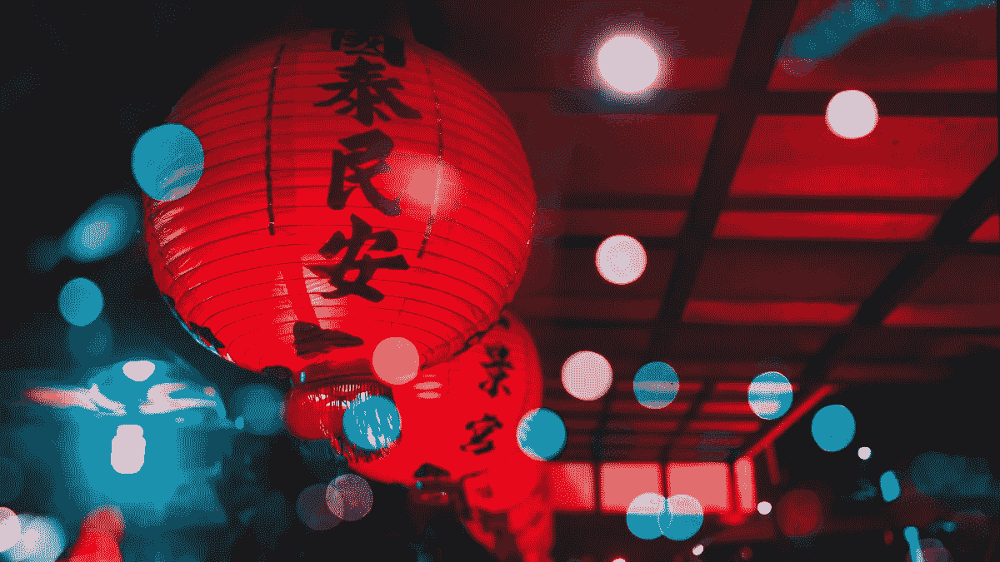
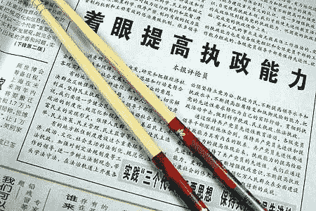
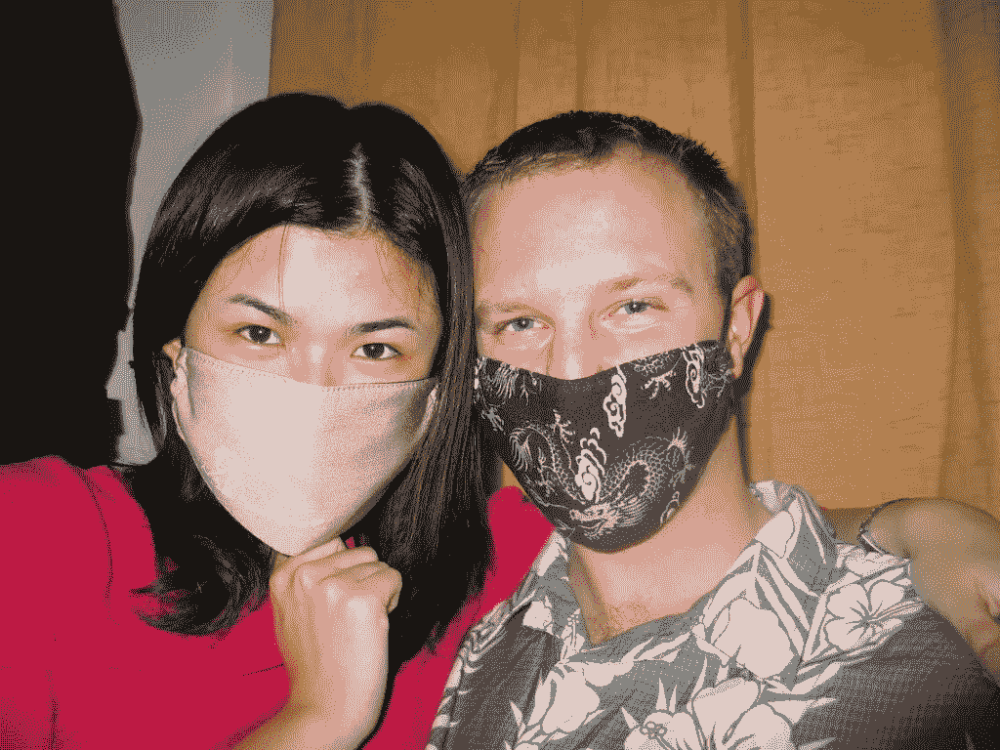
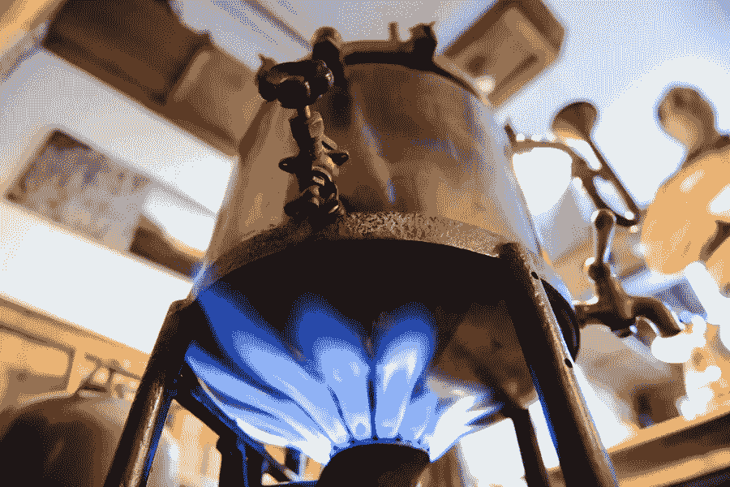

# 想象你的生活:掌握普通话

> 原文：<https://medium.datadriveninvestor.com/distilling-skills-to-imagineer-your-life-master-mandarin-chinese-254743c8aa11?source=collection_archive---------32----------------------->

你有没有看过一位大师表演一门手艺，然后对自己说:哇，我希望我也能做同样的事？给你一个好消息:没有人生来就是大师，是的，你可以！我们的目标是教你怎么做。

这是每月博客系列**“提炼技能”**的第一篇博文，我们将把不同的技能“提炼”成它们的基本成分，并向你展示如何以更有效的方式学习它们。随着时间的推移，我们将向你展示如何让自己成为一个所有行业的大师！

在这个竞争激烈的世界里，你学习新技能的能力会让你在竞争中获得额外的优势。如果你能想出如何学习任何技能，你就能做任何事情。

你越快学会一项技能，你就能取得越多的成就。

这和想象你的生活有什么关系？

当你学习并获得了你所选择的技能，你就可以更好更快地追求你的梦想。提升正确的技能是过上更加富裕、快乐、有趣和充实的生活的关键。

> 生活不仅仅是消费。学习如何创造充实的生活。

让我们从我自己的例子开始这个系列。我想和大家分享一个故事，我是如何说一口流利的普通话，而我从小就认为自己没有学习外语的天赋。我的法语和英语成绩平平。

我学习和提高外语的欲望遇到了障碍，因为我坚信自己不擅长外语。我讨厌在学校学习语言，因为它似乎不值得。一位老师让我更加消极，他让我相信我真的没有学习语言的天赋。

我没有成长的心态，而是陷入了固定的心态。

几年后，我[在一次电视游戏“谁想成为百万富翁”](https://www.financial-imagineer.com/2018/01/23/who-wouldnt-want-to-be-a-millionaire-5-life-winning-lessons-from-a-who-wants-to-be-a-millionaire-contestant-for-anyone/)中赢得了一大笔现金，这使我 21 岁时的银行账户达到了六位数。与此同时，我获得了经济学硕士学位，世界似乎突然充满了机遇。因为我出生在巴拿马，所以我选择独自去巴拿马和哥斯达黎加背包旅行来学习西班牙语！

在这次旅行中一定发生了什么事。在这次旅行之前，我坚信我没有外语天赋，但在学习西班牙语不到三个月后，我沉浸在语言中，突然能够与街上的任何人交谈！

我简直不敢相信。

我的英语也提高了很多。整个经历很有趣，给了我力量，我突然想到:也许我的老师对我的语言技能判断有误？也许我通过沉浸找到了一把“解锁”新技能的钥匙？

当有人告诉我某事是不可能的，这通常会让我非常感兴趣。

在巴拿马的时候，我加倍了自己的勇气。当我离开西班牙语学校的时候，我的老师和朋友问我:下一步是什么？我的目标很明确:我很想测试一下自己，看看接下来我是否能学习汉语普通话！

我刚从中美洲打包旅行回来，就宣布:下一站将是远东！不到两周，我就和 AIESEC 签约参加了管理培训。又过了两个星期，我抵达了台湾的台北！

这是我第一次去欧洲东部旅行。这是我一生中最激动人心的冒险之一。

我不知道接下来会发生什么。这次新的旅行就像“打开”了我的技能增加按钮。我的一些朋友和家人告诉我，对于白种人来说，学习汉语普通话是最难学的语言之一。我已经接受了挑战。

在我到台湾的第一天，我就认识了我未来的妻子。)和许多来自国际 AIESEC 社区的好朋友。AIESEC 是年轻人拓展视野和探索的最佳组织之一！这是我普通话挑战的第一天 。

一旦我有了基本的生活安排，我很快就安排了一所语言学校(TLI-台北语言学院)并开始上国语课。我知道如何去做，并很快从最初的小组课程转变为一周三次下班后与私人教师一对一的形式。周二和周四晚上 8-10 点，周六早上 9 点到中午，我开始学习中文。一周 7 小时。成功了。很有趣。

不过，我学到的不仅仅是一门新语言。我的教训要深刻得多。回想起来，这一刻我学会了在自己内心寻找一种方式来释放我的动力，我对冒险的渴望以及坚持到底的纪律和动力。

> 一旦你在自己身上找到了“方法”，你就可以添加任何你喜欢的技能。

对我来说最重要的是，我可以用我一生中想学的任何东西来重复这个过程。我还想补充一大堆技能。对我来说，基本成分是:

*   动机
*   挑战自我
*   为成功做好准备，为成功做好计划
*   坚持到底
*   无所畏惧地追求让你感兴趣的东西

今年早些时候，我认识了迈克([@ Twitter 上的 Distill Mike](https://twitter.com/DistillMike))，他是[“蒸馏研究所”](https://distillinstitute.com/)背后的博主，我与他分享了我的上述经历，以及它如何对我产生了长远的巨大影响。我们决定开始这个每月一次的系列“从想象中提炼技能”。迈克现在将带领你了解我上面的“幸运”故事背后的技术细节，所以我的这一课将真正适用于你选择学习的任何技能！

# 交给迈克:

让我们来提炼技能吧！

Matts 掌握如此多的困难语言的旅程为你提供了比“运气”更多的教训。

让我们以 Matts 的经历为例，看看他是如何下意识地提炼出学习语言的技能的，你可以用它们来复制他的成功。

在提炼技能的核心，我们将使用 DSSS 方法:解构，选择，排序和赌注。这是一个快速学习工具，由蒂姆·菲利斯(Tim Ferriss)推出，他最出名的作品是点燃新富潮流的《每周工作 4 小时》一书。

# 第一步:解构

首先，你需要把一门语言分解成最小的可学习单元，并确定是什么构建了一门语言。

一种语言有无数的单词，但如果你能学会最常见的 3000-5000 个单词，你就可以认为自己精通这种语言。学习一门语言可能看起来像一个巨大的工程，但是一旦你把它分解成最简单的部分，它看起来就不再那么可怕了。

记住，即使是万里长城也是由第一块砖砌成的。不要让自己不知所措，要知道大多数语言都是用任何人都能掌握的简单短语和单词来说和写的。

解构主义有助于简化一项起初看似复杂的技能。

# 第二步:选择

既然你已经确定了最小的可学习单元，是时候应用帕累托法则了。帕累托定律是你 80%的产出来自 20%的投入。

在学习环境中，这意味着你必须挑选出 20%的最小可学习单元，这些单元会给你 80%的结果。这个过程要求你找到最小的行动，却有最大的效果。

在语言学习中，这意味着找到日常对话中 20%最常用的单词。当你把那些经常使用的短语记下来，你就可以像马提亚斯那样和当地人交谈了。

学习就是不断校准。把你的基本功练好，然后你可以在此基础上继续提高你的技能。

# 第三步:排序

一旦你选择了你想学的语言的最小可学单元，就该决定先学哪个了。许多人试图一次学会所有的东西，却忽略了学习基础部分。结果，他们没有通过学习看到它，因为他们没有取得任何进展。

你需要意识到，如果顺序错了，你可能学习的是中级积木，而不是初级积木。这样会让你的学习低效无效。

当你越来越擅长一项技能时，学习就变得有趣了。因此，你能正确掌握可学习单元的顺序是至关重要的。从最有影响力的基本面开始，会让你免于浪费时间和不知所措。

# 第四步:赌注

当你学习失败带来真正的后果时，你也会学得更快。在 Matts 的情况下，如果他不会说当地语言，他的生活会很困难。明确的目标是与当地人交谈，而惩罚是不懂语言带来的不便。

所以这促使他学得更快。当不学习要付出代价，快速学习会有回报时，自律就建立了。

当你学习一项技能时，实施实际的惩罚和奖励来控制自己。

# 蒸馏到想象工程师系列

在金融想象工程师和蒸馏研究所的合作中，我们想让人们知道快速学习是想象你的生活的关键。我们将使用真实世界的例子来为你提炼技能，这样你也可以学得很快。我们计划每月发布一篇新的蒸馏者到想象工程师的文章。

保持联系，获取更多信息！

世界对你敞开大门，让你去想象一个有能力提炼任何技能的人！

如果你能学到任何东西，你就能做任何事情。

迈克和马特

如果你想从迈克那里了解更多信息，请[点击此处订阅他的时事通讯](https://distillinstitute.com/subscribe/)或[在 Twitter 上关注他](https://twitter.com/DistillMike)。

如果你还没有加入我的收件箱团队，可以考虑在我的网站上通过电子邮件订阅，[像我的脸书页面](https://www.facebook.com/financialimagineer)或[在 Twitter 上关注财经幻想家](https://twitter.com/FI_imagineer)。

免责声明:请注意，上面使用的一些链接可能是附属链接，Financial Imagineer 可能会收到补偿。

*原载于 2020 年 10 月 28 日 http://www.financial-imagineer.com***。**