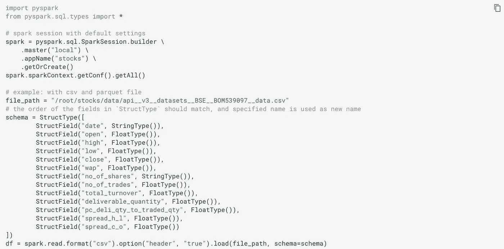

# 使用 Apache Spark 的分布式数据处理

> 原文：<https://medium.datadriveninvestor.com/distributed-data-processing-with-apache-spark-2a5e473b0cb1?source=collection_archive---------0----------------------->

用通用分布式数据处理引擎进行数据处理。


Photo by [Scott Webb](https://unsplash.com/@scottwebb?utm_source=unsplash&utm_medium=referral&utm_content=creditCopyText) on [Unsplash](https://unsplash.com/s/photos/spread?utm_source=unsplash&utm_medium=referral&utm_content=creditCopyText)

[***Apache Spark***](http://spark.apache.org/)*，用 Scala 编写，是一个* ***通用分布式数据处理引擎*** *。或者换句话说:加载大数据，以分布式方式对其进行计算，然后存储它。*

*Spark 提供 Java、Scala、Python 和 R 的高级 API，以及支持通用执行图的优化引擎。它还支持一套丰富的高级工具，包括用于 SQL 和结构化数据处理的*[*Spark SQL*](http://spark.apache.org/docs/latest/sql-programming-guide.html)*，用于机器学习的*[*ml lib*](http://spark.apache.org/docs/latest/ml-guide.html)*，用于图形处理的*[*GraphX*](http://spark.apache.org/docs/latest/graphx-programming-guide.html)*，以及 Spark 流。*

*要运行 Spark，你可以旋转你的* ***自己的集群*** *或者使用* ***亚马逊 EMR*** *带/不带* ***亚马逊胶水*** *，或者使用***【Google data proc***。*

*Apache Spark 包含用于数据分析、机器学习、图形分析和流式实时数据的库。Spark 一般比 Hadoop* *快* ***。这是因为 Hadoop 将中间结果写入磁盘(即大量的* ***I/O 操作*** *)，而 Spark 则尽可能将中间结果保存在内存中(即* ***内存计算*** *)。而且，Spark 提供的* ***懒评*** *的运算和* ***的优化就在最终结果*** *之前；Sparks 维护了一系列要执行的转换，除非我们试图获得结果，否则不会实际执行这些操作。通过这种方式，Spark 能够在查看所需的整体转换时找到最佳路径(例如，将向数据集的每个元素添加数字* `*5*` *和* `*20*` *的两个独立步骤减少为向数据集的每个元素添加* `*25*` *的一个步骤，或者不实际对数据集的一部分执行操作，该部分最终将在最终结果中被过滤掉)。这使得 Spark 成为目前最受欢迎的大数据分析工具之一。***

[](https://www.datadriveninvestor.com/2020/05/15/big-data-analytics-in-telemedicine-reshaping-the-healthcare-industry/) [## 远程医疗中的大数据分析重塑医疗保健行业|数据驱动的投资者

### 最近，在冠状病毒疫情的推动下，远程医疗的使用出现了大爆炸。越来越…

www.datadriveninvestor.com](https://www.datadriveninvestor.com/2020/05/15/big-data-analytics-in-telemedicine-reshaping-the-healthcare-industry/) 

Hadoop 将中间状态保存到磁盘，并通过网络进行通信。如果我们考虑 ML 模型的逻辑回归，那么每次迭代状态都保存回磁盘。这个过程很慢。然而，Spark 保持所有数据**不变，并且在内存中**。它使用函数式编程的思想来实现这一点，例如容错，它通过在原始数据集上重放函数转换来工作。

Spark **懒惰**(关于转型)和渴望(关于行动)是 Spark 如何使用编程模型优化网络通信的。因此，Spark 定义了数据集(和 RDD)上的转换和操作来支持这一点。转换(比如`where`)是惰性的，因此它们的结果输出不会立即被计算出来。行动(如`take`)是热切的。他们的结果被立即计算出来。

****Hadoop 生态系统*** *包括一个分布式文件存储系统，名为***(Hadoop 分布式文件系统)。***另一方面，不包括文件存储系统。您可以在 HDFS 上使用 Spark，但这不是必须的。Spark 可以从其他来源读入数据，如* ***【亚马逊】*** *。****

***虽然* ***Spark 没有实现***[***MapReduce***](https://medium.com/@goyalmunish/the-why-and-how-of-mapreduce-524f71561daf)*，但是我们可以编写 Spark 程序，其行为方式类似于 map-reduce 范式。***

***对于大数据处理，最常见的数据形式是* ***键-值对*** *。事实上，在 2004 年的 mapReduce 研究论文中，设计者指出键值对是设计 mapReduce 的一个关键选择。在转换过程中，键通常充当一个组，在转换中根据该组计算聚合值。***

***与 Hadoop 类似，Spark 中的* ***分区*** *(哈希分区器或范围分区器)可以带来巨大的性能增益，尤其是在洗牌阶段。***

*****数据流*** *是大数据中的一个专门话题。用例是当您想要实时存储和分析数据时，例如脸书帖子或 Twitter 推文。Spark 有一个流库叫做****Spark Streaming****虽然没有其他一些流库普及快。其他流行的流媒体库还有* [***阿帕奇风暴***](http://storm.apache.org/) *和* [***阿帕奇弗林克***](https://flink.apache.org/) *。使用火花流时，卡夫卡或 Kinesis 很有用。***

## **方便的参考:**

*   **[Apache Spark 主页](http://spark.apache.org/)**
*   **[Apache Spark 文档](http://spark.apache.org/docs/latest/)**
*   **[Apache Spark 快速入门指南](http://spark.apache.org/docs/latest/quick-start.html)**
*   **[Apache Spark Python API 文档](http://spark.apache.org/docs/latest/api/python/index.html)**
*   **[Apache Spark SQL 和数据集指南](http://spark.apache.org/docs/latest/sql-programming-guide.html)**
*   **[Dask](http://0.0.0.0:8000/concepts_machine_learning.html#dask) 和 Spark [比较](https://docs.dask.org/en/latest/spark.html)**

# **本地模式下的火花**

***试用 Apache Spark 最简单的方法就是在* ***本地模式*** *。整个处理是在一个***的单一服务器上完成的。因此，您仍然会受益于服务器中所有内核* *的* ***并行化，但不会受益于几个服务器。******

***Spark 运行在 JVM 上。它公开了一个 Python、R、Scala 和 SQL 接口。***

***对于 Python，Spark 通过*[*py Spark*](https://pypi.org/project/pyspark/)*提供了*[*Python API*](http://spark.apache.org/docs/latest/api/python/index.html#)*，PyPI 中有，所以可以通过* `*pip*` *安装。可以导入或者直接调用为* `*pyspark*` *得到一个交互 shell。***

```
**# install pyspark
pip install --upgrade pyspark# get pyspark help
pyspark --help# invoke pyspark interactive shell
pyspark# or through python or ipython
ipython
>> import pyspark**
```

***同样，Scala 和 R 也分别提供了* `*spark-shell*` *和* `*sparkR*` *的交互外壳。***

***其他安装选项，勾选*[*spark.apache.org/downloads.html*](https://spark.apache.org/downloads.html)*。***

# **集群模式下的火花**

***星火* [*集群模式概述*](http://spark.apache.org/docs/latest/cluster-overview.html) *解释了在集群上运行的关键概念。Spark 既可以独立运行，也可以在几个现有的集群管理器(Hadoop、Apache Mesos、Kubernetes)上运行。***

***系统目前支持多个* [*集群管理器*](https://spark.apache.org/docs/latest/spark-standalone.html) *:***

*   **[独立](http://spark.apache.org/docs/latest/spark-standalone.html)—Spark 附带的一个简单的集群管理器，可以轻松设置集群。**
*   **[Apache Mesos](http://spark.apache.org/docs/latest/running-on-mesos.html) —通用集群管理器，也可以运行 Hadoop MapReduce 和服务应用。**
*   **[Hadoop YARN](http://spark.apache.org/docs/latest/running-on-yarn.html)—Hadoop 2 中的资源管理器**
*   **Kubernetes —一个用于自动化部署、扩展和管理容器化应用程序的开源系统**

**Spark 被组织在一个主/工人拓扑中。在 Spark 的上下文中，驱动程序是主节点，而执行器节点是工作节点。每个工作节点运行相同的任务，并将结果返回给主节点。资源分配由集群管理器处理。**

***Spark 应用程序在集群上作为独立的进程集运行，由主程序中的* `[***SparkContext***](https://spark.apache.org/docs/latest/api/python/pyspark.html#pyspark.SparkContext)` *对象协调(称为* ***驱动程序*** *)。***

***具体来说，要在一个集群上运行，* `*SparkContext*` *可以连接到几种类型的* ***集群管理器*** *，它们跨应用程序分配资源。一旦连接上，Spark 就会在集群中的节点上获得* ***执行器*** *，它们是为应用程序运行计算和存储数据的进程。接下来，它将您的应用程序代码(由传递给* `*SparkContext*` *的 JAR 或 Python 文件定义)发送给执行器。最后，* `*SparkContext*` *将* ***任务*** *发送给执行者运行。***

***每个应用程序都有自己的执行程序进程，这些进程在整个应用程序运行期间保持运行，并在多个线程中运行任务。这有利于在调度端(每个驱动程序调度自己的任务)和执行端(来自不同应用程序的任务在不同的 JVM 中运行)将应用程序相互隔离。但是，这也意味着，如果不将数据写入外部存储系统，就不能在不同的 Spark 应用程序(实例* `*SparkContext*` *)之间共享数据。***

***每个驱动程序都有一个*[*web UI*](http://0.0.0.0:8000/arch_big_data.html#spark-web-ui)*，通常是端口* `*4040*` *。***

**Spark 可以控制应用程序之间(在集群管理器级别)和应用程序内部(如果多个计算发生在同一个`SparkContext`上)的资源分配。[任务调度概述](https://spark.apache.org/docs/latest/job-scheduling.html)对此有更详细的描述。**

***虽然* `[***pyspark.SparkContext***](https://spark.apache.org/docs/latest/api/python/pyspark.html#pyspark.SparkContext)` *是 Spark 功能的主要入口点，表示与 Spark 集群的连接，并可用于在该集群上创建 RDD 和广播变量，但* `[***pyspark.sql.SparkSession***](https://spark.apache.org/docs/latest/api/python/pyspark.sql.html#pyspark.sql.SparkSession)` *是使用 Dataset 和 DataFrame API 对 Spark 编程的入口点。例如，***

****

***这里:***

*   **返回值是一个`SparkSession`对象。**
*   **`master(master)`设置要连接的 Spark master URL，例如`"local"`在本地运行，而`"local[4]"`在本地使用`4`内核运行，或者`"spark://master:7077"`在 Spark 独立集群上运行。**
*   **`appName(name)`设置应用程序的名称，该名称将显示在 Spark web UI 中。如果没有设置应用程序名称，将使用随机生成的名称。**
*   **`config(key=None, value=None, conf=None)`设置一个配置选项。使用这种方法设置的选项会自动传播到`SparkConf`和`SparkSession`自己的配置中。**
*   **`getOrCreate()`获取一个现有的`SparkSession`,或者，如果没有现有的，根据这个构建器中设置的选项创建一个新的。**

# **函数式编程语言和分布式系统**

*****为什么分布式系统需要函数式编程？*****

***Spark 使用函数式编程语言 Scala。这背后的原因是函数式编程非常适合分布式系统。***

***在功能编程中，如果* `*f(x) = x + 5*` *，那么* `*f(3)*` *总是* `*8*` *。但是，在 Python 等非函数式语言中，这并不总是正确的。例如，***

```
**w = -2def f(x):
    global w
    w -= 1
    return x + w + 10f(3)
f(3)**
```

**因此，再次运行相同的代码会产生不同的结果。这个例子中的问题很容易发现，但当您有几十台机器并行运行代码时就不那么容易了，有时如果其中一台机器出现临时问题，您需要重新开始计算。这些意想不到的副作用会导致严重的头痛。混乱来自于草率的语言。**

*****DAG 和 lazy 评价如何帮助记忆的运行:*****

**就像面包公司从母面团中复制发酵剂一样，*每个 Spark 函数都会复制其输入数据，并且永远不会更改原始父数据(即* ***原始数据保持不变*** *)* 。因为 Spark 不会更改或改变输入数据，所以它被称为不可变的。当你有一个单一的功能时，这是有意义的，但是如果你有多个功能，那么你将多个功能链接在一起，每个功能完成一小部分工作。您经常会看到一个函数由多个子函数组成，为了让这个大函数成为对等函数，每个子函数也必须成为对等函数。Spark 似乎需要为每个子功能复制一份输入数据。如果是这种情况，您的 Spark 程序将很快耗尽内存。**

**幸运的是，Spark 通过使用一种叫做 ***懒求值*** 的*函数式编程概念避免了这一点。在 Spark 对程序中的数据做任何事情之前，它首先会一步一步地指出需要哪些函数和数据。这些方向就像你的面包食谱，在 Spark 中这被称为**有向无环图(DAG)** 。一旦 Spark 从您的代码中构建了 DAG，它*会检查它是否可以拖延，直到最后一刻才获取数据*。这样，spark 就有机会 ***优化整个转型过程*** 。如果你在做面包，你会这么做。你要抓起面粉，把它带回你的碗里，然后回到餐具室拿些糖加到碗里，然后回到橱柜拿盐，等等每一种配料。这将是烹饪相当于鞭打。取而代之的是，你在开始混合配料之前先看一下食谱，看看你能抓住什么，然后一步到位地混合在一起。事实上，你经常混合你所有的干原料，然后混合你所有的湿原料，在烘焙之前将它们混合在一起。在 Spark 中，这些多步组合称为阶段。***

****Python 中的函数编程:****

****匿名函数*** *可以认为是编写函数式编程的 Python 特性。**

# *Spark 中的声明式编程与命令式编程*

***声明式编程关注的是* ***什么*** *而在 Spark 中可以用*[***Spark SQL***](http://spark.apache.org/docs/latest/api/python/pyspark.sql.html#pyspark.sql.SparkSession.sql)*使用* [*Spark SQL 内置函数*](https://spark.apache.org/docs/latest/api/sql/index.html) *。鉴于，* ***命令式编程*** *关心的是***如何进行，在 Spark 中可以用*[***Spark data frames 和 Python***](http://spark.apache.org/docs/latest/api/python/pyspark.sql.html#pyspark.sql.DataFrame) *来完成。****

# **Spark 中的数据集和数据帧**

## **数据集和数据帧之间的差异**

***一个* [***数据集***](http://spark.apache.org/docs/latest/sql-programming-guide.html) *是一个分布式的数据集合。数据集接口提供了* [*弹性分布式数据集(RDD)*](http://spark.apache.org/docs/latest/rdd-programming-guide.html) *的优点和 Spark SQL 的优化执行引擎的优点。数据集 API 有 Scala 和 Java 两种版本。Python 不支持数据集 API。***

***一个* ***数据帧*** *是组织成命名列的数据集。它在概念上相当于关系数据库中的一个表或 R/Python 中的一个数据框，但是在底层有更丰富的优化。数据帧可以从大量的* [*来源*](https://spark.apache.org/docs/latest/sql-data-sources.html) *中构建。DataFrame API 在 Scala、Java、Python (* `[***pyspark.sql.DataFrame***](https://spark.apache.org/docs/latest/api/python/pyspark.sql.html#pyspark.sql.DataFrame)` *)和 R.* 中都有**

***注意，* `[***pyspark.sql.SparkSession***](http://0.0.0.0:8000/arch_big_data.html#spark-in-cluster-mode)` *是用数据集/数据帧 API 编程 Spark 的入口点。SparkSession 可用于创建数据帧、将数据帧注册为表、对表执行 SQL、缓存表和读取 parquet 文件。***

## **火花 vs 熊猫**

***Pandas 和 Spark dataframes 的一个关键区别就是渴望与* ***懒惰执行*** *。在 PySpark 中，操作被延迟，直到管道中实际需要一个结果。这种方法用于避免将完整的数据帧放入内存，并在机器集群中实现更有效的处理。有了 Pandas dataframe，所有的东西都被拉入内存，每个 Pandas 操作都被立即应用。另一个关键区别是，Spark 允许您使用分区* ***并行化*** *。***

## **镶木地板式样**

***Parquet 是一种* ***列文件*** *(不像 CSV 是基于行的存储)格式，在处理大数据时既节省时间又节省空间，是一种* ***包含关于列数据类型*** *的元数据的文件格式。例如，与使用文本相比，Parquet 的 Spark SQL 性能平均提高了 10 倍，这要归功于低级读取器过滤器、高效的执行计划以及 Spark 1.6.0 中改进的扫描吞吐量！参考 IBM 的这篇* [*文章*](https://developer.ibm.com/hadoop/2016/01/14/5-reasons-to-choose-parquet-for-spark-sql/) *。***

***因此，如果数据是 CSV 格式的，那么在 Spark 中加载这些文件，转换并保存为 parquet 格式，然后在需要时使用它们是有意义的。***

***当使用 CSV 文件进入* `*DataFrame*` *s 时，Spark 以急切模式执行操作(即，在下一步开始执行之前，所有的数据都被加载到内存中)，而在读取拼花格式的文件时，使用***惰性方法。****

***还要注意，在使用 Spark 时，对于分布式集群来说，从本地存储加载文件(或写入文件)是没有意义的。我们应该使用亚马逊 S3* *或者 HDFS****。*****

## **`DataFrame`**

***A* `[*pyspark.sql.DataFrame*](https://spark.apache.org/docs/latest/api/python/pyspark.sql.html#pyspark.sql.DataFrame)` *(以及* `[*pyspark.sql.GroupedData*](https://spark.apache.org/docs/latest/api/python/pyspark.sql.html#pyspark.sql.GroupedData)` *)相当于 Spark SQL 中的一个关系表，可以使用* `[*pyspark.sql.SparkSession*](https://spark.apache.org/docs/latest/api/python/pyspark.sql.html#pyspark.sql.SparkSession)` *中的各种函数创建。***

***使用* `*<spark_session>.read*` *访问* `[*pyspark.sql.DataFrameReader*](https://spark.apache.org/docs/latest/api/python/pyspark.sql.html#pyspark.sql.DataFrameReader)` *从外部存储系统加载* `*DataFrame*` *。***

***使用* `*<data_frame>.write*` *访问* `[*pyspark.sql.DataFrameWriter*](https://spark.apache.org/docs/latest/api/python/pyspark.sql.html#pyspark.sql.DataFrameWriter)` *写入* `*DataFrame*` *到外部存储器。***

***用* `[*sql.types.StructType*](https://spark.apache.org/docs/latest/api/python/pyspark.sql.html#pyspark.sql.types.StructType)` *和一个*`[*sql.types.StructField*](https://spark.apache.org/docs/latest/api/python/pyspark.sql.html#pyspark.sql.types.StructField)`[*s*](https://spark.apache.org/docs/latest/api/python/pyspark.sql.html#pyspark.sql.types.StructField)*的列表来表示一个数据类型代表一行。***

***例如:***

********

**在我们继续这个例子之前，让我们简单地看一下常用函数的一些类别:**

****

**继续这个例子..**

****

# **数据存储在哪里？S3 还是 HDFS**

***当你使用* ***亚马逊 S3****(****【首选*** *)时，你就把数据存储从你的集群中分离出来了。其中一个缺点是，你必须通过网络下载数据，这可能是一个瓶颈(但是，Spark 本身运行在 AWS 上就不会出现这种情况)。另一个解决方案是用 HDFS 把数据存储在你的 Spark 集群上。***

***Spark 和****HDFS****被设计成可以很好地协同工作。当 Spark 需要来自 HDFS 的一些数据时，它会抓取最近的副本，从而最大限度地减少数据在网络中传输的时间。但是对 HDFS 来说是有代价的。你必须自己维护和修复系统。对于许多公司来说，从小公司到大公司，S3 更容易，因为你不必维护一个单独的集群。此外，如果您从 AWS 租用集群，您的数据通常不必在网络中走得太远，因为集群硬件和 S3 硬件都在亚马逊的数据中心。最后，Spark 足够聪明，可以下载一小块数据并处理那块数据，同时等待其余的数据下载。***

# **提交 Spark 申请**

***Spark 的* `*bin*` *目录中的* `***spark-submit***` *脚本用来在* [*集群上启动应用*](https://spark.apache.org/docs/latest/submitting-applications.html) *。它可以通过一个统一的接口使用所有 Spark 支持的* [*集群管理器*](http://0.0.0.0:8000/arch_big_data.html#spark-in-cluster-mode) *，因此您不必为每个集群管理器配置您的应用程序。***

***如果你的代码依赖于其他项目，你需要将它们和你的应用一起打包，以便将代码分发到 Spark 集群。对于 Python，可以使用* `*spark-submit*` *的* `*--py-files*` *参数，添加* `*.py*` *、* `*.zip*` *或* `*.egg*` *文件，随应用一起分发。如果依赖多个 Python 文件，建议打包成一个* `*.zip*` *或者* `*.egg*` *。***

**一旦用户应用被捆绑，就可以使用脚本启动它。这个脚本负责设置 Spark 的类路径及其依赖项，并且可以支持 Spark 支持的不同集群管理器和部署模式:**

```
**./bin/spark-submit \
  --class <main-class> \
  --master <master-url> \
  --deploy-mode <deploy-mode> \
  --conf <key>=<value> \
  ... # other options
  <application-jar> \
  [application-arguments]**
```

***一些常用的选项有:***

*   **`--class`:应用程序的入口点(例如`org.apache.spark.examples.SparkPi`)**
*   **`--master`:集群的[主 URL](https://spark.apache.org/docs/latest/submitting-applications.html#master-urls)**
*   **`--deploy-node`:是将您的驱动程序部署在工作节点上(`cluster`)还是本地作为外部客户端(`client`)(默认)**
*   **`--conf`:任意火花配置属性`"key=value"`格式。**
*   **`application-jar`:包含应用程序和所有依赖项的捆绑 jar 的路径。URL 必须在集群内部全局可见，例如，所有节点上都存在的`hdfs://`路径或`file://`路径。**
*   **`application-arguments`:传递给主类的 main 方法的参数，如果有的话**

***对于 Python 应用，只需在* `*<application-jar>*` *处传递一个* `*.py*` *文件代替 JAR，并将 Python* `*.zip*` *、* `*.egg*` *或* `*.py*` *文件添加到带有* `*--py-files*` *的搜索路径中。***

# **火花流**

**[火花流](http://spark.apache.org/docs/latest/streaming-programming-guide.html)**

**Spark 的局限性:Spark Streaming 的延迟至少为 500 毫秒，因为它是对微批量的记录进行操作，而不是一次处理一条记录。诸如 [Storm](http://storm.apache.org/) 、 [Apex](https://apex.apache.org/) 或 [Flink](https://flink.apache.org/) 等原生流工具可以降低延迟值，可能更适合低延迟应用。Flink 和 Apex 也可以用于批量计算，所以如果您已经在使用它们进行流处理，就没有必要在您的技术堆栈中添加 Spark。**

# **Spark 中的调试和优化**

**当您在分布式 Spark 集群上工作时，代码中的错误可能很难诊断。**

***通常，当一个函数被传递给在远程集群工作节点上执行的 Spark 操作(如* `*map*` *或* `*reduce*` *)时，它们对该函数中使用的所有变量的单独副本进行操作。这些变量被复制到每台机器上，并且对远程工作机器上的变量的任何更新都不会传播回驱动程序。***

**跨任务支持通用的读写共享变量是低效的。但是，Spark 确实为两种常见的使用模式提供了两种有限类型的 [**共享变量**](https://spark.apache.org/docs/latest/rdd-programming-guide.html#shared-variables):[广播变量](http://0.0.0.0:8000/arch_big_data.html#broadcast-variables-in-spark)和[累加器](http://0.0.0.0:8000/arch_big_data.html#accumulators-in-spark)。**

## **Spark 中的广播变量**

**[广播变量](https://spark.apache.org/docs/latest/rdd-programming-guide.html#broadcast-variables)允许程序员在每台机器上缓存一个只读变量，而不是随任务发送一个副本。例如，它们可用于以高效的方式为每个节点提供大型输入数据集的副本。Spark 还尝试使用高效的广播算法来分发广播变量，以降低通信成本。**

**Spark 动作通过一组阶段执行，由分布式“洗牌”操作分隔。Spark 自动广播每个阶段内任务所需的公共数据。以这种方式广播的数据以序列化形式缓存，并在运行每个任务之前进行反序列化。这意味着，只有当跨多个阶段的任务需要相同的数据，或者以反序列化形式缓存数据很重要时，显式创建广播变量才有用。**

***广播变量可以通过调用* `*SparkContext.broadcast(v)*` *从变量* `*v*` *中创建。广播变量是* `*v*` *的包装器，通过调用* `*value*` *方法可以访问它的值。***

```
**>>> broadcastVar = sc.broadcast([1, 2, 3])
<pyspark.broadcast.Broadcast object at 0x102789f10>>>> broadcastVar.value
[1, 2, 3]**
```

**创建广播变量后，应该在集群上运行的任何函数中使用它来代替值`v`,以便`v`不会被多次发送到节点。此外，对象`v`在被广播后不应被修改，以确保所有节点获得相同的广播变量的值(例如，如果该变量稍后被运送到新节点)。**

## **火花蓄电池**

**[累加器](https://spark.apache.org/docs/latest/rdd-programming-guide.html#accumulators)是只能通过关联和交换操作“相加”的变量，因此可以有效地并行支持。它们可用于实现计数器(如在 MapReduce 中)或求和。Spark 本身支持数值类型的累加器，程序员可以增加对新类型的支持。**

**作为用户，可以创建命名或未命名的累加器。如下图所示，一个已命名的累加器(在本例中为计数器)将显示在修改该累加器的阶段的 web UI 中。Spark 显示由“任务”表中的任务修改的每个累加器的值。**

**在 UI 中跟踪累加器有助于理解运行阶段的进度(注意:Python 中还不支持)。**

***通过调用* `*SparkContext.accumulator(v)*` *从初始值* `*v*` *创建累加器。运行在集群上的任务可以使用* `*add*` *方法或* `*+=*` *操作符添加到集群中。但是，他们无法读取其值。只有驱动程序可以使用其* `*value*` *属性读取累加器的值。***

```
**>>> accum = sc.accumulator(0)
>>> accum
Accumulator<id=0, value=0>>>> sc.parallelize([1, 2, 3, 4]).foreach(lambda x: accum.add(x))
...
10/09/29 18:41:08 INFO SparkContext: Tasks finished in 0.317106 s>>> accum.value
10**
```

***累加器不改变 Spark 的懒评模式。如果它们在数据帧的操作中被更新，它们的值仅在数据帧作为操作的一部分被计算时才被更新。***

## **Spark Web 用户界面**

**每个驱动程序都有一个 [**web UI**](https://spark.apache.org/docs/3.0.0-preview/web-ui.html) ，通常在端口`4040`上，显示关于运行任务、执行器和存储使用的信息。只需在网络浏览器中点击`http://<driver-node>:4040`即可访问该界面。[监控指南](https://spark.apache.org/docs/latest/monitoring.html)还描述了其他监控选项。**

**web UI 提供了集群的当前配置，这对于再次检查您想要的设置是否生效非常有用。**

***网络用户界面也向你展示了* ***DAG*** *，你的程序的步骤的配方。Spark 应用程序由与代码相关的许多动作(如将数据帧保存到数据库或把一些记录带回给驱动程序检查)组成。工作被进一步分解成* ***个阶段*** *。阶段是相互依赖的工作单元。一个阶段内的最小单位是一个* ***任务*** *。任务是一系列火花转换，可以在我们的数据帧的不同分区上并行运行。因此，如果我们有 10 个分区，我们运行 10 个相同的任务来完成一个阶段。任务是分配给单个工作节点的步骤。在每个阶段，worker 节点划分输入数据并运行该阶段的任务。***

**默认情况下，Spark master 使用端口`7077`与 worker 节点通信，端口`4040`显示活动的 Spark 作业，主节点的 web UI 位于端口`8080`(或`4040`)上。**

**这里有一些相关的有趣故事，你可能会觉得有帮助**

*   **[流畅的数字](https://medium.com/@goyalmunish/fluent-numpy-187cc14f2832)**
*   **[流利的熊猫](https://medium.com/@goyalmunish/fluent-pandas-22473fa3c30d)**
*   **[使用 Apache Kafka 进行数据流传输](https://medium.com/@goyalmunish/data-streaming-with-apache-kafka-e1676dc5e975)**
*   **[Apache Cassandra —用于结构化和半结构化数据的分布式行分区数据库](https://medium.com/@goyalmunish/apache-cassandra-distributed-row-partitioned-database-for-structured-and-semi-structured-data-1dc37e72e67c)**
*   **[带有阿帕奇气流的数据管道](https://medium.com/@goyalmunish/data-pipelines-with-apache-airflow-46258deb2844)**
*   **[使用 Argo 设计工作流](https://medium.com/@goyalmunish/designing-workflows-using-argo-9d0dc5036348)**
*   **[MapReduce 的原因和方式](https://medium.com/@goyalmunish/the-why-and-how-of-mapreduce-17c3d99fa900)**
*   **[观察者模式与发布订阅模式](https://medium.com/@goyalmunish/observer-pattern-vs-pub-sub-pattern-7f467bcf5fe)**

****进入专家视角—** [**订阅 DDI 英特尔**](https://datadriveninvestor.com/ddi-intel)**