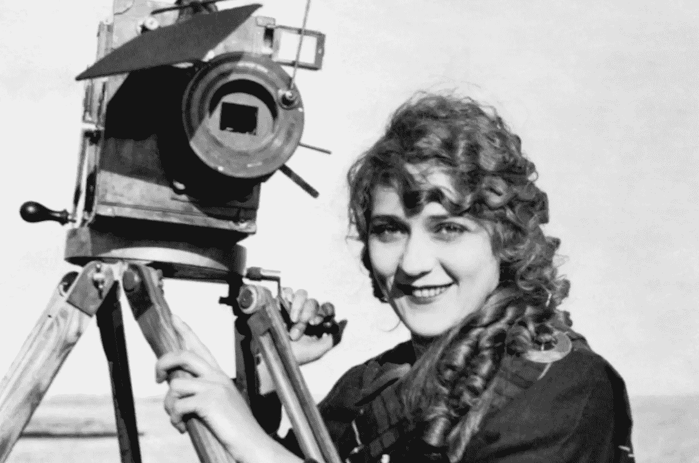

# 神圣的好莱坞正义。

> 原文：<https://medium.datadriveninvestor.com/divine-hollywood-justice-3f425feedfc0?source=collection_archive---------16----------------------->

## 女性不应该买温斯坦公司——而不是两个股票交易员吗？

Courtesy of Hollywood Archives

"想要和男人平等的女人缺乏野心。"蒂莫西·利瑞

就在两年前，哈维·韦恩斯坦经历了一年来最糟糕的坏消息。由 Maria Contreras-Sweet 牵头的一笔投资交易告吹，让温斯坦公司像注定要失败的绵羊一样眨着眼睛。

事实上，这笔交易涉及向哈维的受害者支付数百万美元，这可能是一个症结，但“旋转”是该公司得到了搪塞，没有人比好莱坞电影发行商或面临长期监禁的大亨更好地扮演受害者。

> 考虑到轮换，重播和未来的电影，利润是一些武器制造商将获得一批 F-22 战斗机。

无论如何，温斯坦董事会寻求第 11 章，目标是“在法庭上实现最大价值。”这只是意味着——唐纳德·特朗普(Donald Trump)比任何人都清楚——随着该公司试图获得某种形式的流动性，所有留置权实际上都被抹去了。然而，即使没有债务，温斯坦组织的灯熄灭也只是时间问题。

令人惊讶的部分？韦恩斯坦公司灯笼娱乐公司的买家只支付了 2.89 亿美元，只是该公司价值的一小部分。这是考虑到它有 227 个电影库，四部未发行的电影，以及拥有“天桥骄子”的电视部门。考虑到轮换，重播和未来的电影，利润类似于一些武器制造商从一堆 F-22 战斗机中获得的利润。

 [## 《星期五晚上》好莱坞和宝莱坞电影中的 8 个秘密领导特质|数据驱动的投资者

### 角色之间的联系非常紧密。有情感依附和过山车时刻的高峰和…

www.datadriveninvestor.com](https://www.datadriveninvestor.com/2019/11/16/8-secret-leadership-traits-from-friday-night-hollywood-and-bollywood-movies/) 

这是财务方面，现在让我们看看公平方面，或者道德方面。考虑到所涉及的资金——更不用说形象了——更不用说一家蒸蒸日上的企业对电影业女性的未来就业意味着什么，这家定价过低、潜在富有的公司难道不应该被女性收购吗？

Lantern Entertainment 的两位所有者安迪·米切尔(Andy Mitchell)和米洛斯·布拉乔维奇(Milos Brajovic)已经重新推出了“天桥骄子”(Project Runway)，重点是更丰满的模特。再说一次，这难道不是*女人*应该做的事情，而不是两个股票交易员吗？

对于一些有事业心的女性来说，做到这一点有多难呢？让我们回顾一下第 75 届金球奖。奥普拉·温弗瑞、梅丽尔·斯特里普、瑞茜·威瑟斯彭和凯特·卡普肖等名人支持世界各地的女性。特别是，他们公开反对好莱坞体制内的薪酬不平等。

如果他们把钱投在真诚的地方，如果他们买下了温斯坦公司，做了灯笼娱乐公司现在正在做的事情，这难道不是天意吗？

光是温弗瑞、斯特里普和威瑟斯彭的身价加起来就能轻而易举地出得起要价，卡普肖当然可以向丈夫史蒂文·斯皮尔伯格要钱——他很有钱。

换句话说，为什么拥有比奥普拉更少资产的男性会准备好将“天桥骄子”这样的项目变成代表女性一直试图代表的东西？

一个电影工作室和分销网络就在那里，业务可以在几个月内启动并运行。奥普拉·温弗瑞肯定能拿出 2.86 亿美元(我不知道，也许卖掉一两栋她很少用的房子)。

> 从某种意义上说，她正是 1913 年《照片游戏》杂志所描述的那样:“……在凶猛的钢带中闪耀着温柔。”

这并不是第一次由所谓的“行业不满”形成的工作室。1919 年初，当时被认为是“有史以来最著名的女性”的玛丽·皮克福特与查理·卓别林、道格拉斯·费尔班克斯和大卫·格里菲斯联手创建了联合艺术家公司。

在你说“嗯，她加入了三个著名的男性名人”之前，皮克福德是指导力量。她监督导演、选角和发行的方方面面。从某种意义上来说，她正是 1913 年《照片播放》杂志所描述的那样:“……在凶猛的钢带中闪耀着温柔的光芒。”

那位评论家没有夸大其词。皮克福德和她一样精明。到了 1919 年，她已经要求周薪 1 万美元，全权负责制作，电影一半利润保证 104 万美元(2018 年 1770 万)。考虑到当时一栋 3538 英尺的豪宅要价 335 万美元，这可不是一个小数目。

> 如今，她的身价超过 28 亿美元，拥有的房地产比一些沙特埃米尔还多。

皮克福德是一条鲨鱼，联合艺术家证明了其他鲨鱼不可能战胜皮克福德。几十年来，她经营这家工作室获利颇丰。与 UA 签约的制作人是真正的独立制作人，他们以前所未有的程度制作、创作和控制他们的作品。皮克福德一直经营到 1956 年，她卖掉了公司(就在卓别林之后)，带走了 300 万美元。

对于一个以扮演女清洁工和秘书起家的女演员来说，这已经不错了。奥普拉·温弗瑞也可以宣称有着同样谦逊的出身。她开始在纳什维尔做天气预报员，不久就被解雇了。如今，她的身价超过 28 亿美元，拥有的房地产比一些沙特埃米尔还多。

诚然，温弗瑞和皮克福德都有过不景气的时候，但他们都继续证明鲨鱼可以有更长的头发和更精明的头脑。仅此一点就足以让温弗瑞将温斯坦公司视为明智的投资。

> 他们将不得不支付相同的薪水，否则就会失去最优秀的女性人才。像任何行业一样，只有在某种形式的财务压力下才会采取行动。

与其要求同工同酬，联合女性(我想我会给它一个名字)本可以抓住其他电影公司最大牌的女明星，付给她们她们真正应得的报酬——或者至少比她们以前的雇主多。

一旦大牌女演员加入联合妇女，其他工作室会有什么选择？他们必须匹配工资，否则就会失去他们最大的女性人才。像任何行业一样，只有在某种形式的财务压力下才会采取行动。

想想这对全世界的妇女运动会有什么影响。以女性为中心的电影可以攻击一切形式的物化和不平等。就像《神奇女侠》和《黑豹》中一样，紧身胸衣是权力的象征，尽管让人不舒服。

请记住，玛丽·皮克福特的声望随着美联航的发展而增长。第一次世界大战结束时，在芝加哥的一次演讲中，她出售了价值约 500 万美元的战争债券。

她还创立了电影救济基金和电影乡村小屋和医院来帮助贫困的演员。在她的整个职业生涯中，当她参加一个聚会时，人们都会站起来。即使在她生命的最后几年，她仍然控制着这个房间。1958 年，在一次电视许可证纠纷的法庭上，当被问及她的年龄时，她回答说，“我 21 岁，快 20 岁了。”

拥有一个工作室肯定有它的好处。像皮克福德这样的女性表明，你可以超越好莱坞的等级制度。当然，温弗瑞、斯特里普、威瑟斯彭和卡普肖也可以做同样的事情。

> 毫无疑问，哈维会在一旁看着，对着橄榄和冰块咬牙切齿。

威瑟斯彭在去年的一个晚上上了新闻，在星光大道上擦亮了她的星星。保持东西整洁固然很好，里斯，但如果一群高尚、有才华的女性收购了温斯坦公司，不是会更有建设性——或者让哈维和鲍勃蒙羞吗？

见鬼，他们很可能在奥斯卡颁奖之前就签了协议，像任何法庭都做不到的那样，把它粘在哈维身上。

如果这不是神圣的正义，我不知道什么是。

罗伯特·科马克是讽刺作家、小说家和博客作者。他的第一部小说[“你可以把马牵到水边(但你不能让它潜水)”](http://robertcormack.net/)在网上和大多数主要书店都有售。查看[天马出版社](http://skyhorsepublishing.com/)或[西蒙和舒斯特](http://simonandschuster.ca/)了解更多细节。

**访问专家视图—** [**订阅 DDI 英特尔**](https://datadriveninvestor.com/ddi-intel)