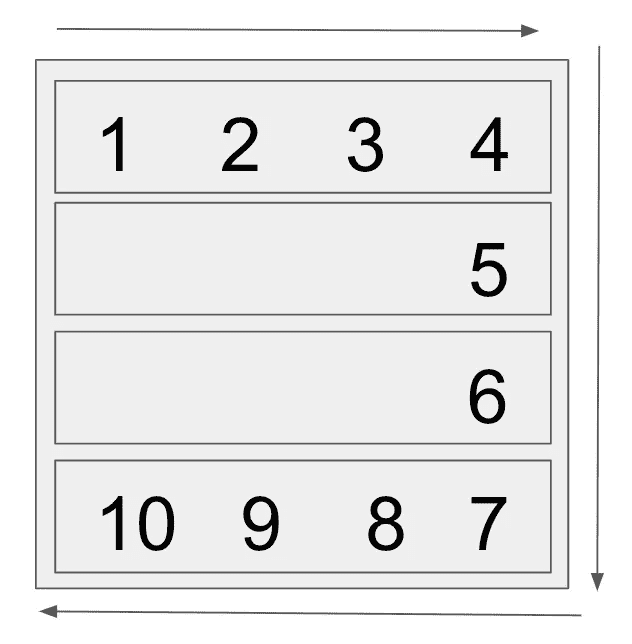

# 潜入母体

> 原文：<https://medium.datadriveninvestor.com/diving-into-the-matrix-38f9e73e4117?source=collection_archive---------18----------------------->

不是电影矩阵 JavaScript 中的矩阵螺旋算法；)

Photo by [Markus Spiske](https://unsplash.com/@markusspiske?utm_source=unsplash&utm_medium=referral&utm_content=creditCopyText) on [Unsplash](https://unsplash.com/s/photos/matrix?utm_source=unsplash&utm_medium=referral&utm_content=creditCopyText)

如果让你创建一个给定大小的正方形矩阵，其中的元素是螺旋排列的，你会怎么做？

我们以 4 x 4 矩阵螺旋为例。它看起来是这样的:

如你所见，这是一个由 4 个子阵列组成的阵列，数字按顺时针方向递增。谁会造这样的东西？

这不是一个容易当场解决的问题。如果你想象你在一个房间的周围走，那会有所帮助，那会逐渐变得越来越小(我希望你没有幽闭恐惧症！).每转一圈，墙都靠得更近了，但好的一面是，你不用像以前那样走那么多路了。

 [## 干净的代码在软件开发中至关重要——这就是为什么|数据驱动投资者

### 干净的代码是“容易理解和容易改变的”，它是关于对细节的关注。但是开发人员为什么要担心…

www.datadriveninvestor.com](https://www.datadriveninvestor.com/2020/05/27/clean-code-is-crucial-in-software-development-heres-why/) 

让我们想象我们的墙是行和列。看，我们有 4 行 4 列。当你这样看的时候，更容易理解你需要做什么——首先，你需要填写顶行，然后右列，然后底行，然后左列，然后继续向矩阵的中心前进。

那么我们如何开始呢？首先，我们需要一些变量来完成我们的任务:

我们需要和给定的数量(n)一样多的嵌套数组。让我们预先创建它们:

既然一切都准备好了，那我们就开始吧！While 循环非常适合这里的工作，因为我们需要循环尽可能多的次数，而开始行小于或等于结束行，开始列小于或等于结束列。这将确保我们在正确的方向上移动，并且当开始行与结束行相同，开始列与结束列相同时，我们将在矩阵的中心停止。

`while (startRow <= endRow && startColumn <= endColumn) {}`

# 顶行

最上面一行是最容易填充的——它是我们代码中唯一“正常”的数组。下面是它的样子:

记住，我们从第一个子数组开始，在我们的例子中是 startRow，它当前等于 0。我们将停留在这一行，但是将从开始列到结束列，并将我们的计数器分配给 startRow 子数组中的一个特定索引。在每个循环结束时，我们将递增计数器变量。非常重要——在这个函数结束时，我们将完成第一行，我们将再也看不到它。这意味着我们应该增加 startRow，这样下次我们就可以从下一行开始了。

下面是第一个循环的代码:

# 右列

一旦我们完成了顶行，就该处理右列了。这一次我们将停留在同一列(即 endColumn)，但是我们将遍历不同的行。请记住，我们增加了 startRow，现在从第 1 行开始，一直到 endRow。

下面是代码的样子。我们逐行递增，但保持在同一列。最后，我们已经填写了右侧栏中的所有数字，所以我们不再需要它了。让我们减少它，这样下次我们的列更靠近矩阵的中心。

# **底排**

一旦我们完成了顶行和右列，就该处理底行了。

正如你所看到的，方向改变了，所以我们不会在 for 循环中增加 I，而是减少它。我们停留在同一行(即 endRow)，但将从 endColumn 移动到 startColumn。最后，我们将填充 endRow 中的所有点，这需要进行调整，因此我们将减少它。下面是这段代码的样子:

# 左列

最后一个 for 循环用于左侧的列。

这次我们停留在同一列(即 startColumn)，但是我们从 endRow 到 startRow，所以我们将在 for 循环中递减 I。在循环的最后，我们完成了左边的列，所以我们增加了 startColumn。

随着所有行和列的递增(和递减)，我们将向内螺旋前进，直到到达矩阵的正中间。一旦 startColumn 等于 endColumn，startRow 等于 endRow，While 循环就会停止(也就是说，我们正好在矩阵的中间)。完整的代码如下所示:

不要害怕矩阵——学习并实践它！

# 资源:

 [## 编码面试训练营算法，数据结构课程

### 数据结构？他们来了。算法？已覆盖。许多问题都有很好的解释？没错。如果你是…

www.udemy.com](https://www.udemy.com/course/coding-interview-bootcamp-algorithms-and-data-structure/)  [## JavaScript 中的算法

### 40 个问题、解决方案和解释

medium.com](https://medium.com/siliconwat/algorithms-in-javascript-b0bed68f4038) 

**访问专家视图—** [**订阅 DDI 英特尔**](https://datadriveninvestor.com/ddi-intel)