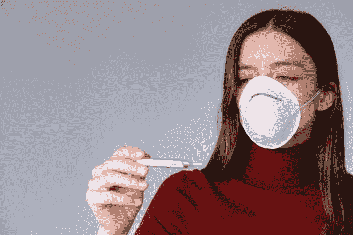

# DIY COVID 测试代替疫苗？

> 原文：<https://medium.datadriveninvestor.com/diy-covid-tests-instead-of-vaccines-4d404fc44eee?source=collection_archive---------15----------------------->

哈佛大学流行病学家迈克尔·米娜说，在阻止冠状病毒传播方面，常规的、自己动手做的新冠肺炎测试可能与疫苗一样好。全球各地的科学家都在争先恐后地将一系列抗 COVID 疗法引入临床。然而，在它们成为主流之前，它们仍然需要监管机构的检查。在我们等待的时候，遏制新型冠状病毒传播的公共卫生策略极其有限——继续封锁，关闭学校，让员工留在家庭办公室。

个人 COVID 检测试剂盒可以发挥强大的作用，因为它们制造成本低廉，可以快速分销，最重要的是，它们已经处于开发的后期阶段，远远超过任何疫苗。

在 Mina 看来，多项经济刺激计划将使政府付出比向社区发放数亿套诊断工具更多的成本。尽管在临床诊断实验室中进行的 COVID 诊断确实更加灵敏和准确，但这些低成本的替代方案对于日常使用来说已经足够好了。在 DIY 试剂盒出现阳性结果后立即进行自我隔离比当前的“检测和追踪”策略要快得多，更便宜，也更有效——当前的“检测和追踪”策略只能及早发现不到 3%的 COVID 阳性个体，以防止传播。

 [## 当科幻进入现实|数据驱动的投资者

### 科幻小说以其疯狂的技术故事统治了世界，充满了诸如读心术和人类的想法…

www.datadriveninvestor.com](https://www.datadriveninvestor.com/2020/04/17/when-science-fiction-enters-reality/) 

有趣的是，Mina 提出，这种社区测试方法可以创造一种“人工群体免疫”，这种免疫反映了大多数人接种疫苗后的流行病学动态。

目前有几家公司正致力于发布这些一次性诊断测试:[夏洛克生物科学](https://sherlock.bio/)、 [E25 生物](https://e25bio.com/)和 [3M](https://www.3m.com/) 等等。最有前景的是基于纸张的测试，它采用了类似于商业妊娠测试的技术。

米娜说:“我希望看到的是开始使用检测作为真正的公共卫生工具来打破传播链，就像我们知道可以使用口罩来减少传播一样。”。

“我希望这些测试能够告诉人们，他们在传播的同时也在(将病毒)传播给其他人，人们可以(在什么时候)采取行动，因为他们可以立即得到结果。我希望他们每天或每隔一天服用一次。”

来源:[《哈佛公报》](https://news.harvard.edu/gazette/story/2020/08/cheap-daily-covid-tests-could-be-akin-to-vaccine/)

*原载于 2020 年 8 月 18 日*[*【https://www.labroots.com】*](https://www.labroots.com/trending/clinical-and-molecular-dx/18445/diy-covid-tests-instead-vaccines)*。*

**访问专家视图—** [**订阅 DDI 英特尔**](https://datadriveninvestor.com/ddi-intel)