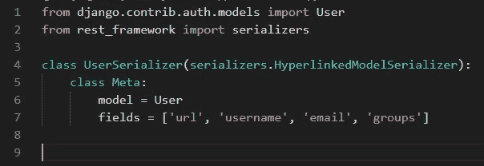
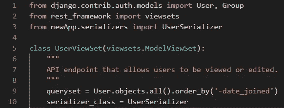
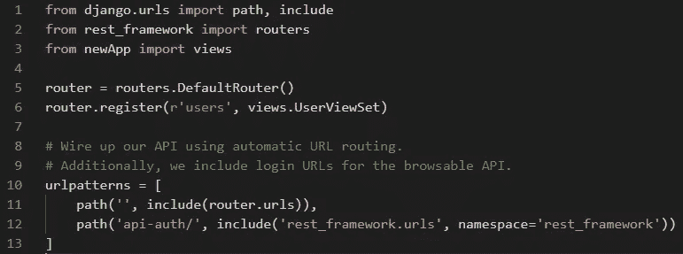
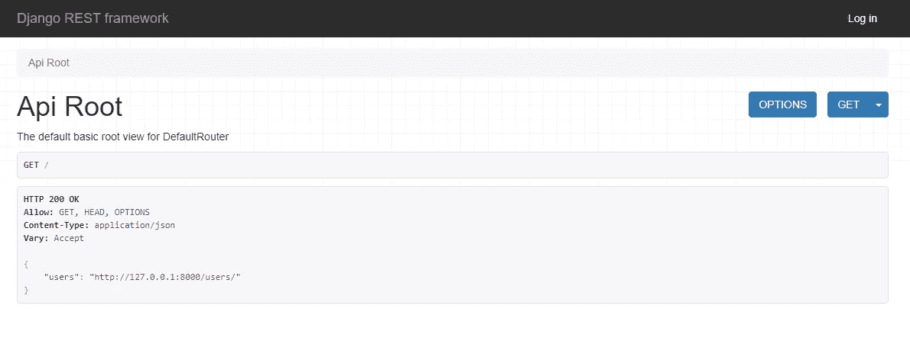
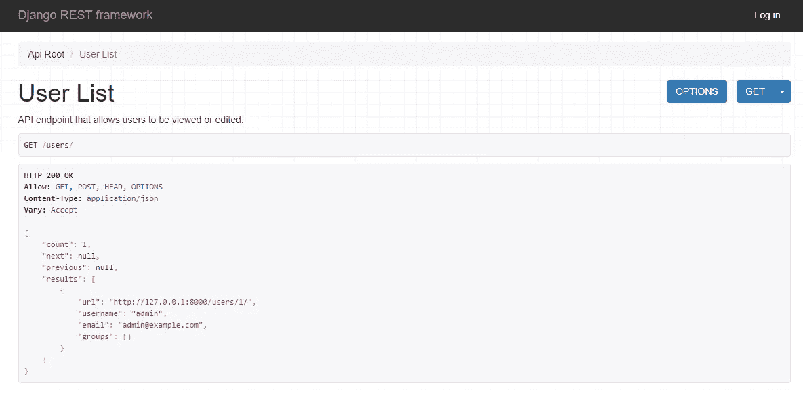
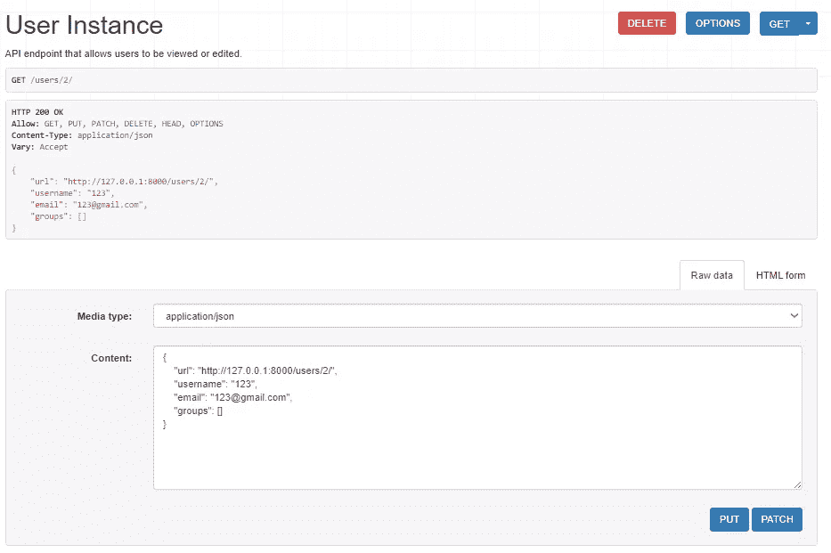

# Django REST API

> 原文：<https://medium.datadriveninvestor.com/django-rest-api-1ab821e40733?source=collection_archive---------4----------------------->

上周我们讨论了用 Django 创建[基本应用。今天让我们试着用 Django 设计一个 RESTful API。](https://medium.com/datadriveninvestor/basic-application-with-django-3afab115bb9a)


**先决条件**

在我们开始之前，让我们安装额外的库，这将有助于我们设计 API:

```
*pip install djangorestframework**pip install markdown**pip install django-filter*
```

**项目设置**

现在让我们确保 REST 框架库的所有移动部分都在它们的位置上。

在项目文件夹中，我们有文件 **settings.py** 。其中有一个数组 **INSTALLED_APPS** 。向该数组中再添加一个元素， **'rest_framework'** ，**，**。我们还需要将这个字典添加到这个文件中:

```
*REST_FRAMEWORK = {**‘DEFAULT_PAGINATION_CLASS’: ‘rest_framework.pagination.PageNumberPagination’,**‘PAGE_SIZE’: 10**}*
```

在之前的帖子中，我们没有与数据库同步。我们可以通过运行迁移来实现:

```
*python manage.py migrate*
```

另外，让我们创建超级用户:

```
*python manage.py createsuperuser — email admin@example.com — username admin*
```

现在我们的初始数据库和管理员用户准备好了，我们可以开始开发 API。

**串行器**

序列化是将数据转换成可读格式的过程。在我们的例子中，我们将使用来自 ***django rest 框架*** 库中的序列化程序。让我们将 **cd** 到 app 目录并创建文件**serializer . py**。在这个文件中，我们将导入用户模型，导入序列化程序，并创建我们要发送出去的过滤器数据。这是**串行器**的样子:



**观点**

接下来，我们需要创建一个视图，其中将使用用户序列化程序。这里我们将查询数据库并对记录进行排序:



你可以看到我们没有声明个人观点。相反，我们使用**视图集。我们把常见的行为分成几类。**

**网址**

最后，我们需要为我们的 API 编写一些路由。让我们 **cd** 到项目(不是 app)目录，打开 **urls.py** 。使用视图集允许通过使用路由器类注册的视图集自动生成每个 URL 配置:



我们全新的 API 已经可以使用了。

**API 积垢**

让我们运行服务器，看看我们得到了什么:

```
*python manage.py runserver*
```

如果我们打开 localhost，将会有所有声明的路由，在我们的例子中只有一个，因为只有用户被创建。



如果我们单击用户路由，我们将看到来自用户表的序列化数据。



那就是读操作，剩下的呢？轻松点。在页面底部，我们可以找到一个发送 POST 请求的界面，这将在用户表中创建新记录。创建新用户后，我们可以遵循 RESTful 惯例，转到 URL **users/:id** (在我们的例子中，id 将是 2)并查看关于这个特定用户的所有详细信息，我们有更新和删除操作的接口。



CRUD 完成了！

**结论**

Django 是一个非常强大的框架，通过额外的库，它允许我们非常快速地创建全功能的 API。

不断学习，不断成长！

我们上 [LinkedIn](https://www.linkedin.com/in/pavel-ilin/) 连线吧！