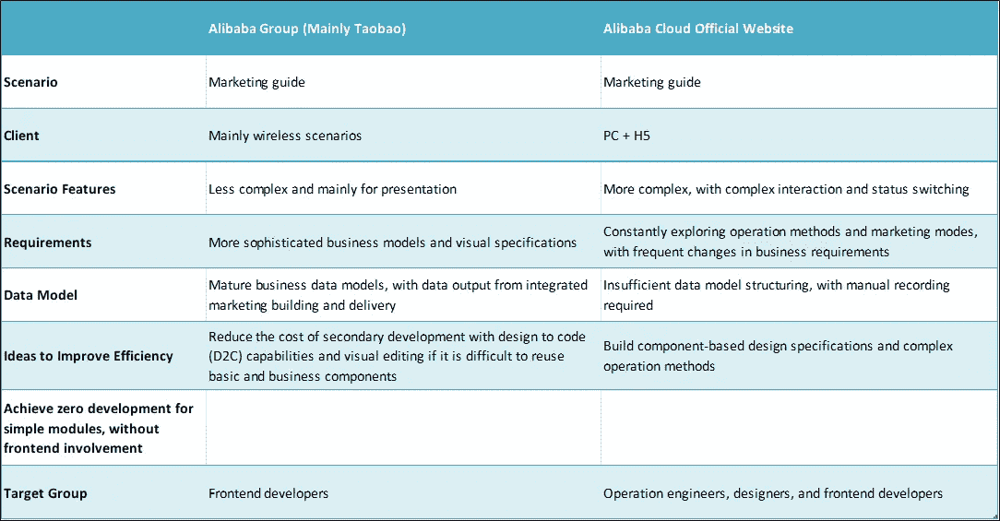
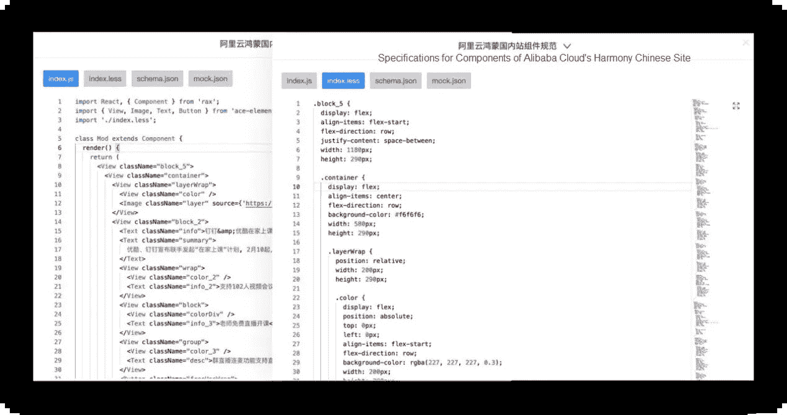
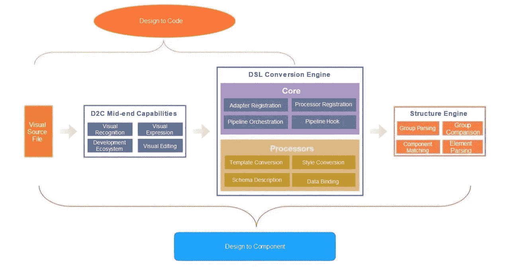
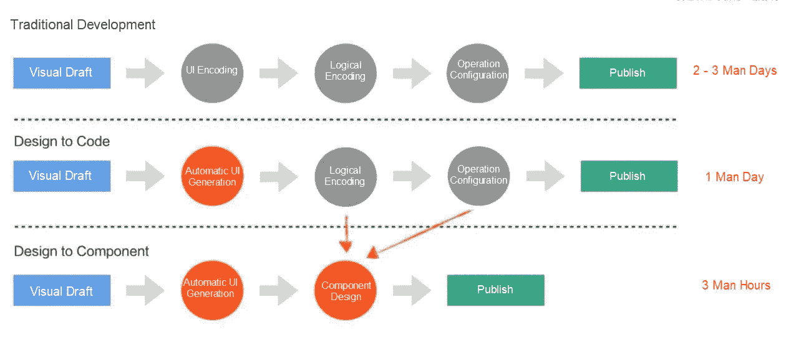
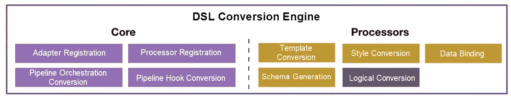
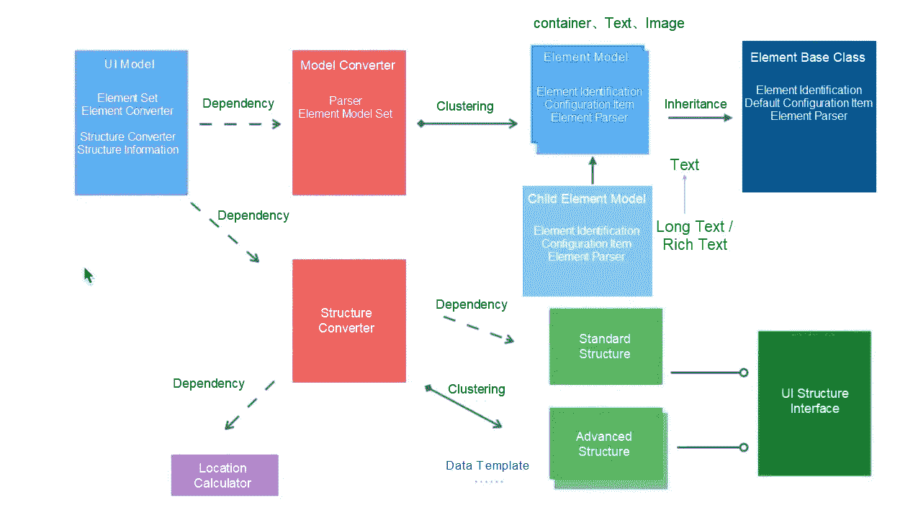

# 阿里巴巴的前端开发者会切片图片吗？不是，是 AI 做的

> 原文：<https://medium.datadriveninvestor.com/do-alibabas-frontend-developers-slice-images-no-it-s-done-by-ai-ae865598ffad?source=collection_archive---------24----------------------->

*作者 Yeshu*

在阿里云的官网和营销中端团队，我们需要满足运营工程师提出的各种要求，因为我们致力于建立在线运营领域和营销能力，并帮助推动用户和收入的增长。过去，我们经常要处理以下请求:

*   *“我们今天需要完成这件事。你能帮我们一下吗？”*
*   *“这个页面很简单，但是我们没有自己的前端开发人员。你能帮我们吗？”*
*   我很久以前就提交了我的请求。你什么时候能照顾好它？”

以前的协作完全是人工支持的形式，大家都累死了。由于缺乏前端开发人员，我们没有时间进行深入思考或能力建设。长此以往，这就变成了恶性循环。随着外包和计件服务的逐渐减少，提高我们的开发效率迫在眉睫。考虑为常见的业务场景和模型构建组件是很容易的。现在，我们已经成功地改变了与设计团队合作的方式，并就构建核心营销方法和通用组件达成了协议。这使得运营工程师能够独立构建大多数日常场景。

然而，我们发现基于组件的开发不能解决所有的问题，而且还需要很高的开发成本。因此，我们决定从阿里巴巴集团现有的能力和经验中获取灵感。我们专注于阿里巴巴集团的智能开发工作。这为我们提供了一种进一步提高开发效率的方法，并为提高我们的智能能力奠定了基础。

# 沿着阿里巴巴集团开辟的道路

对我来说，智能是阿里巴巴集团四大前端导向中最神秘的。在我看了智能团队分享的信息，并与其成员交谈后，我考虑了我们的场景和阿里巴巴集团中智能场景的异同。

淘宝系统通过标准化的场景、数据、需求，智能提升开发效率。在没有各级成熟标准的情况下，我们希望通过为运营工程师赋能的技术，减少满足日常需求所必需的投资，提高开发效率。

目前，阿里巴巴集团在智能开发领域的核心能力是 D2C。遵循智能即标准化的原则，为识别和表达 ui、数据和逻辑而构建和训练模型。最后，我们推出了提供这些功能的产品 [imgcook](https://www.imgcook.com/) 。阿里集团的几个业务单元使用 [imgcook](https://www.imgcook.com/) 和可视化编排引擎，减少开发过程中需要的编码，提高开发效率。

这证明了通过智能能力提高开发效率是可能的。因此，我们可以考虑在我们的场景中使用这些功能的更多方式。由于我们有大量的日常和临时需求，仅依靠手工工作或外包是昂贵的。这也导致了糟糕的商业体验。

最终，我们决定进一步优化我们的 D2C 功能。我们使用工具自动提取跟踪数据，将数据转换为领域特定语言(DSL)模块，并直接从可视草稿中输出可呈现的模块。在此之后，除了前端开发人员之外的人可以独立使用可渲染模块。此外，我们的设计(草案)规范、数据模型和业务需求仍然没有成熟的标准。因此，我们必须根据不同的需求制定和设计相应的技术方案。

# 站在巨人的肩膀上:建设我们的智能能力

最后，在我们团队成员的共同努力下，我们推出了两个可以提高开发效率的智能解决方案。

## 面向组件的设计:使用组件设计器实现零开发

这种解决方案可以根据可视化草稿直接生成模块，并自动提取数据进行跟踪。当我们需要为常见的显示场景开发页面时，我们可以在几个小时内配置并启动它们。

## 面向代码的设计:利用 imgcook 提高二次开发效率

该方案依托 [imgcook](https://www.imgcook.com/) 的标准开发流水线，开发定制 DSL，可降低视觉修复成本 70%以上。

# 建立基于智能的一般技术能力

首先，我们必须能够通过组装和输出多个 DSL 模块来维护和扩展我们的 DSL。因此，我们开发了一个 DSL 转换引擎。要实现零开发，必须实现自动数据提取和绑定进行追踪。这就需要我们从视觉草稿中获取更多的信息，识别模块结构，基本上就是进行合理的分组和识别节点。因此，我们开发了一个结构引擎。

在整个过程中，我们编译了团队所需的智能功能，并引入了更灵活的技术设计来应对未来的可能性。

最终，我们能够提高我们的开发效率，尽管这种提高的范围在不同的领域有所不同。

以下部分详细介绍了我们为实现 D2C 功能而采用的技术解决方案。

## DSL 转换引擎:配置和输出可执行的 DSL

这个过程将相对定位模块的描述数据转换成前端开发者可以直接使用的代码。我们不会在这里深入讨论定制 DSL 的原理，因为我们关注的是在多个终端上可用的 DSL 转换功能，比如节点和 web 服务器。将来，我们将需要支持多种 DSL 规范。因此，这些规范必须是可重用的和可伸缩的。

我们将功能分为核心层和处理器层。每个处理器都是独立的功能单元，提供最终代码所需的功能，如模板、样式、数据和模式。核心层标准化输入和输出，连接处理器流，并提供额外的可扩展性。最后，我们配置了 DSL 转换引擎的输出。

 [## 机器学习和人工智能如何改变电子商务的面貌？|数据驱动…

### 电子商务开发公司，现在，整合先进的客户体验到一个新的水平…

www.datadriveninvestor.com](https://www.datadriveninvestor.com/2020/11/19/how-machine-learning-and-artificial-intelligence-changing-the-face-of-ecommerce/) 

## 结构引擎:理解模块结构和解析定义元素

关于结构的基本想法是 [imgcook](https://www.imgcook.com/) 必须能够对视觉草稿进行简单的规划。我们希望尽量减少对视觉草稿的干预，并减少其他人员的工作量。因此，我们必须提供模块的标准描述。视觉二次编辑在 [imgcook 的](https://www.imgcook.com/)官网推荐过程中尤为重要。这里可以添加不容易添加到可视化草稿中的描述性信息，比如数据字段绑定、循环处理、事件声明等逻辑。

如果要实现零开发过程，就必须实现这些信息的自动补充。要绑定数据字段，我们必须知道当前模块包含的节点以及每个节点需要打开的配置。这意味着我们必须能够识别和解析 UI 模型。为了识别组件结构，我们使用了阿里巴巴集团现有的布局算法，并基于我们的场景实现了一个简单的分组算法。

下图显示了结构引擎的最终设计。在这个结构引擎中，元素模型用于识别和解析模块中的元素。抽象基类处理通用逻辑，不同的元素可以输出不同的能力，实现细粒度的识别。结构转换基于一个标准的分组结构，它可以支持未来细化的元素模型，以更智能地识别结构，如循环。

结构引擎在底层有很多通用的设计，将来可以用来解析通用的模块结构，包括不是由 D2C 生成的模块。标准结构信息涵盖了搭建平台所需的所有模块，让这个引擎可以用于更多的业务场景。

# 探索智能开发的新方向

到目前为止，我们已经实现了 D2C 系统的一个最小完整链路，并且已经在一些业务场景中得到应用。我们希望它可以提高我们的开发效率，并在未来开辟更多的可能性:

1.  **基于智能化提升开发效率，着力优化结构引擎，提升识别能力。比如:**

*   提高标准组件的匹配率，增强配置能力
*   自动识别循环结构以输出数据循环配置
*   推动建立可视化规范，使用 PC 自动完成 HTML5 适配
*   不断集成其他智能功能，如智能颜色混合和图形组合

**2。通过智能探索业务授权方法。例如:**

*   改变业务支持模式，提高业务支持效率
*   连接数据系统，提供优化业务结果的建议，并协助决策
*   集成标准模型以智能匹配内容并减少手动配置
*   分析模块结构，智能匹配现有组件，提高构建效率

# 摘要

目前，还存在一些问题。例如，可视化草稿必须标准化，前端开发人员的零干预在短期内是无法实现的。然而，智能赋予我们前所未有的能力，可以减少前端开发人员的工作量，使他们能够专注于更有价值的工作。

# 原始来源:

 [## 阿里巴巴的前端开发者会切片图片吗？不是，是 AI 做的

### 阿里巴巴 F(x)团队 2020 年 12 月 7 日 138 在阿里云官网和营销中端团队，我们需要见面…

www.alibabacloud.com](https://www.alibabacloud.com/blog/do-alibabas-frontend-developers-slice-images-no-it%E2%80%98s-done-by-ai_596978) 

## 获得专家观点— [订阅 DDI 英特尔](https://datadriveninvestor.com/ddi-intel)