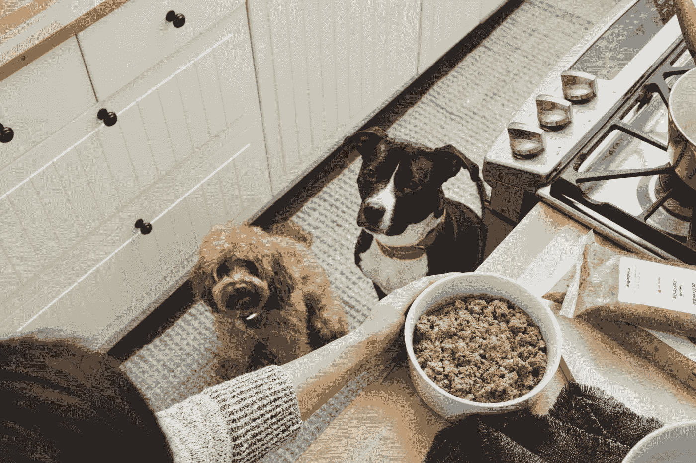
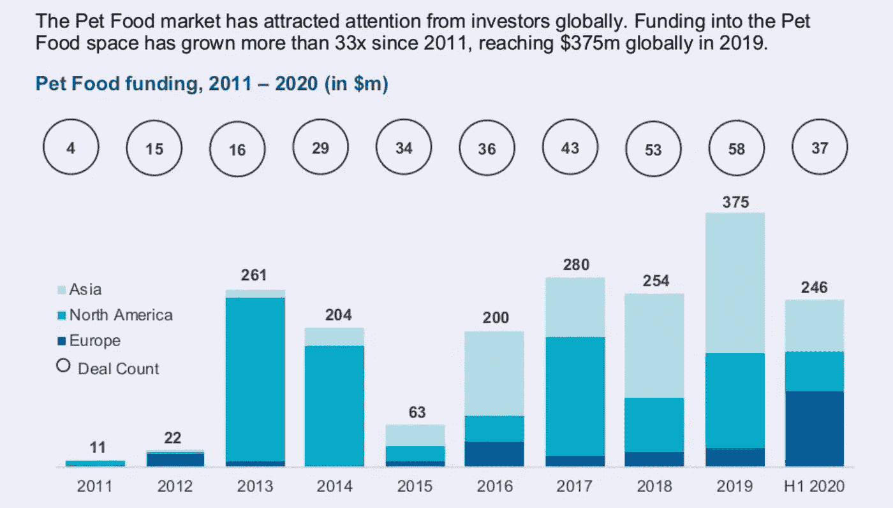
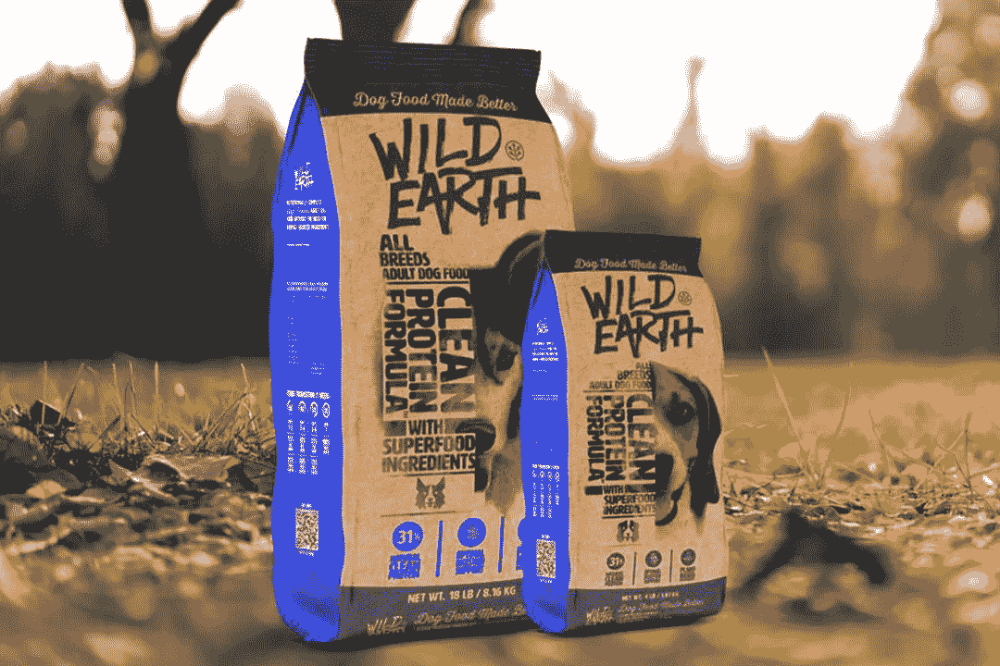

# 狗想要我们的食物吗？

> 原文：<https://medium.datadriveninvestor.com/do-dogs-want-our-food-53e5f5fbccc9?source=collection_archive---------38----------------------->

Photo: The Famer’s Dog

## 宠物食品的人性化

在过去的十年里，包装消费品的特点是从以“健康”为卖点的食品转向以有机成分或对你更好的替代品为卖点的食品。想想用阿斯巴甜加糖的健怡可乐，再想想用天然香料制成的可口矿泉水；居然不是黄油！从吃草的牛制成的奶油；和脱脂牛奶到杏仁或燕麦牛奶。

向真正成分的转变是真实的，现在它正从核心家庭扩展到宠物家庭。

# 2020 年食品趋势

投资 Dollar Shave Club 和 Digg 等初创公司的风险投资公司 White Star Capital 最近发布了一份关于食品科技趋势和融资现状的报告。在许多重要的发现中，有几项与高级狗粮有关:

*   2019 年，全球对食品科技的投资达到 107 亿美元
*   45%的千禧一代不信任大型食品制造商，相比之下，18%的老年人不信任大型食品制造商
*   消费者愿意为熟食多花 30%的钱
*   6340 万美国家庭养狗，4270 万家庭养猫
*   据估计，2020 年全球宠物食品市场价值 960 亿美元，CAGR 增长率为 4.8%

白星强调，冠状病毒加速了消费者通过数字渠道购买杂货和其他食品的欲望，这些渠道通常是为床垫或剃须刀等其他消费品保留的。

现在，便利、可持续和健康是决策的驱动力。膳食准备和食品配送服务 HelloFresh、Blue 围裙、Takeaway.com、Grubhub、Delivery Hero 和美团点评从新冠肺炎年初到 8 月份的股票价值增长了 55%。

 [## 创业公司的顾问？与他们合作的 4 种最佳方式|数据驱动型投资者

### 顾名思义，顾问能给你的建议对一个人来说是成功还是失败的关键

www.datadriveninvestor.com](https://www.datadriveninvestor.com/2020/09/27/advisors-in-your-startup-4-ways-to-best-work-with-them/) 

# 别忘了狗

随着技术和食品相结合的企业不断达到巨大的估值(DoorDash 在今年 6 月的估值为 160 亿美元，优步在 7 月以 2.65 美元的价格收购了 Postmates)，为我们的宠物提供便利和质量相结合的服务正在增长，并吸引了大量资金。

仅在今年上半年，宠物食品市场就通过 37 笔交易获得了 2.46 亿美元的投资:

Photo: White Star Capital

这些钱中的大部分已经投入到创造人类等级的新鲜狗粮的创业公司中。也许这种类型中最突出的名字是农民的狗，它在 2015 年刚刚开始，并获得了 4900 万美元的总资金。2019 年 1 月的最后一轮 3900 万美元被宣布为宠物创业公司最大的 B 轮融资，包括 Insight Venture Partners、Forerunner Ventures 和 Shasta Ventures。

农民的狗允许你为你的狗建立一个定制的计划，并在订阅的基础上交付。这种食物由肉和蔬菜制成，烹饪后几天内就会送到。那是有价格标签的。计划从每天 2 美元到 12 美元不等。类似的服务 Ollie 每天起价 2.5 美元。

Photo: Wild Earth

除了新鲜食品订阅，像 [Wild Earth](https://wildearth.com/) 和 [Jinx](https://thinkjinx.com/) 这样的初创公司正在用干净的原料重新制作经典的干粗粮，去掉填料和防腐剂。(今年 2 月，我与 Jinx 的联合创始人 Terri Rockovich 进一步讨论了该品牌，更多[见](https://medium.com/@joeniehaus/these-ex-casper-execs-are-making-our-pets-healthy-again-9c40f101b913?source=friends_link&sk=678d5a555754efd8d7f419c6ea44951c)。)

# 对生狗粮的批评

虽然这些“厨师准备”的订阅初创公司吸引了很多关注，但围绕生食的健康存在争议。FDA 在 2010-2012 年进行了一项研究，发现生食更有可能含有致病细菌。

美国动物医院协会写道:“基于压倒性的科学证据，AAHA 不提倡也不支持给宠物喂食任何生的或脱水的非无菌食物，包括动物源性的食物。自制的生食饮食是不安全的，因为供人类消费的零售肉类可能被病原体污染。”

美国兽医协会称“AVMA 不鼓励给猫狗喂食任何未经消除病原体处理的动物蛋白，因为这对猫狗和人类都有患病风险。”

无论是在米其林星级厨房准备的食物，还是更健康的干粮，宠物初创公司正在向普瑞纳和 IAMS 这样的现有公司靠近，未来几年观察收购和更大规模的风险投资将是有趣的。

## 访问专家视图— [订阅 DDI 英特尔](https://datadriveninvestor.com/ddi-intel)