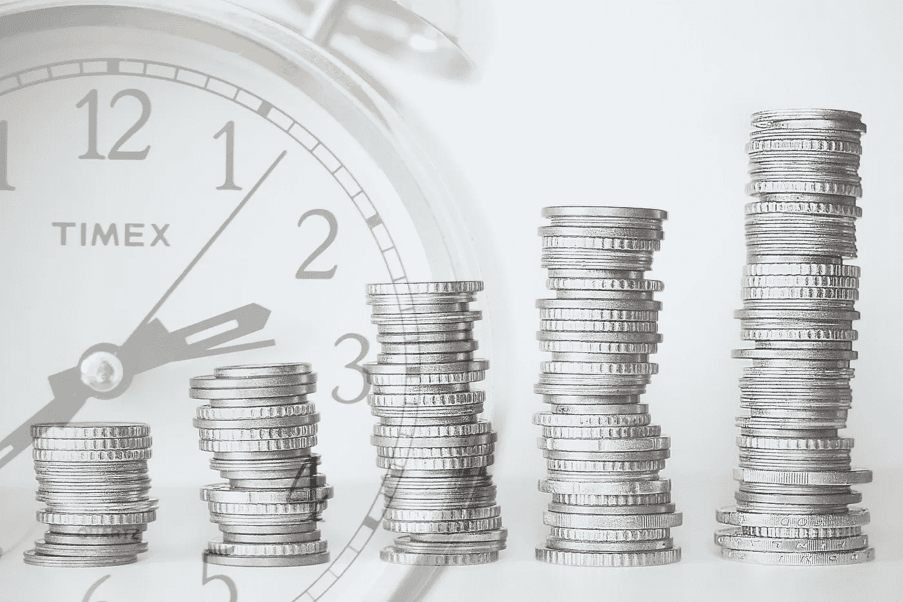

# 自己动手做商业地产

> 原文：<https://medium.datadriveninvestor.com/do-it-yourself-commercial-real-estate-845b462e0972?source=collection_archive---------15----------------------->

## 如何提升你的游戏并改善你的现金流

Image by [Thomas Wilken](https://pixabay.com/users/tommileew-8051414/?utm_source=link-attribution&utm_medium=referral&utm_campaign=image&utm_content=3191508) from [Pixabay](https://pixabay.com/?utm_source=link-attribution&utm_medium=referral&utm_campaign=image&utm_content=3191508)

和许多人一样，我是从投资独栋房屋租赁开始我的房地产之旅的。这是一个很好的开始，因为这种资产类别对大多数人来说都很熟悉(我们中的许多人都拥有自己的房子或租住过房子)，而且购买和操作都相当简单。买房子所需的现金虽然很多，但与其他类型的房地产相比仍然很少，这意味着你正在犯错误，用更少的钱学习。

然而， ***尽管独栋出租可以通过杠杆增值以高回报率积累资产，但在今天的市场上它们通常不会产生太多现金流*** 。这意味着退休后靠你的租金收入生活，你要么需要拥有几十套抵押贷款的房子，要么拥有一套规模较小但仍相当可观的无债务房子。

根据市场的不同，一套 25 万美元的单户租赁房在支付所有费用(包括债务服务和物业管理费)后，加上抵押贷款，每月可以产生约 200 美元的现金流。如果你每月需要 10，000 美元来生活，那就相当于 50 次租房和一大笔债务！同样一栋没有抵押贷款的房子，扣除所有费用后，每个月可以赚 800 美元左右，所以只需要 13 次左右的租金就可以生活，但是免费且干净，所以涉及大量现金(325 万美元)！

> 有没有更好的方法让房地产产生更多现金流？是的，事实证明是有的，但这需要你把你的房地产投资提高到一个新的水平。

## 商业房地产

[商业地产(CRE)](https://www.investopedia.com/terms/c/commercialrealestate.asp) 比独栋房子更难买，但回报是大得多的现金流。对于 250，000 美元的投资，您可以每月获得约 1350 美元的现金流，这相当于您投资现金的 6.5%收益率(称为“[现金回报](https://www.investopedia.com/terms/c/cashoncashreturn.asp)”)。

***与独栋房屋相比，现金回报有所提高，投资 185 万美元，每月可获得 10，000 美元的收入(相比之下，独栋房屋租金为 325 万美元)。请记住，这些数字假设你是在用债务为你的购买融资，这仍然允许杠杆升值，尽管大多数 CRE 的升值速度比独栋出租慢。***

寻找和购买商业地产需要更多的知识、金钱和勇气。 你要应对更多的变数，包括你想购买的房产类型，比如:

*   公寓大楼
*   零售购物中心
*   饭店
*   办公楼

各有利弊。在这篇文章中，我不会涉及太多的细节，但我只想说，商业房地产投资需要你把你的投资游戏提升到一个新的水平。

你必须了解市场和玩家，你需要一个专业团队，你需要相当数量的现金才能成功。你还需要知道如何管理它，或者如果你买了一些需要主动管理的东西，比如公寓楼或办公楼，你需要知道如何雇用一个经理。

两年前，我买下了自己的第一栋商业建筑——一家由特许经营商经营的单租户餐厅。 ***这是一次帮助我成长为投资者的学习经历。***

Image by [Michael Gaida](https://pixabay.com/users/michaelgaida-652234/?utm_source=link-attribution&utm_medium=referral&utm_campaign=image&utm_content=4576420) from [Pixabay](https://pixabay.com/?utm_source=link-attribution&utm_medium=referral&utm_campaign=image&utm_content=4576420)

## 三网(NNN)

因为我对主动管理不感兴趣，所以我专注于并最终买下了一栋有承租人的建筑，租期为[三层(NNN)](https://www.investopedia.com/terms/t/triple-net-lease-nnn.asp) 。在这种安排中，承租人负责税收、保险和维护(租赁是净税收、净保险和净维护)。如果大楼出了问题，甚至是屋顶、暖通空调或管道系统，房客都会修理。

***这样，我和我的合伙人就有了非常被动的现金流。*** 除了租客问题，我们只要坐收房租就行了。请记住，这种类型的租赁是为不想拥有大规模物业管理团队的大型房地产投资信托基金开发的，因此无论如何这都不是太好的事情。

> 这类资产涉及的工作是在资产搜索和收购的前期。

你必须做大量的尽职调查，以确保物业和租户符合你的期望。我们商业地产的主要问题是，租户并不像我们认为的那样可靠。

我们的错误是我们没有对租户做足够的尽职调查。 例如，我们只看了一年的损益表，而不是三到五年的，这将显示盈利能力的下降趋势。这当然是一个教训，我将利用未来的收购。

最终，租户无法在疫情关闭后生存下来，不得不关门大吉。 ***幸运的是，我们能够在很短的时间内找到一个新的、更强大的租户，该租户已经开始运营(谢天谢地，有了免下车服务！).*** 我们还建立了一个储备基金，因为我们知道原来的租户不稳定，所以我们能够在干旱中生存下来，而不必增加额外的、计划外的资本。

## 怎么去那里

与独栋住宅相比，商业房地产提供了更好的现金流，可以更好地帮助你依靠被动收入生活，但也有一些主要障碍。 ***除了所需的知识，你还得有一大笔现金(至少 50 万美元)才能起步。*** 那么想出这一大笔钱有哪些途径呢？

*   **使用股票** —投资股票市场(低成本指数基金或可能使用价值投资来挑选个股)是积累资本的好方法，这些资本可以用于未来产生现金流的事情；股票不会产生太多的收入，所以在某些时候你会想把你的股市收益转移到有现金流的东西上，比如商业地产
*   **利用合作伙伴**——找几个你信任的人集中他们的资源是达成更大、更有利可图的交易的好方法；始终有一个合作协议，以确保事情顺利进行
*   **使用股票** —你可以从拥有和经营一个独栋出租组合开始，通过杠杆增值，以高回报率积累股票；十年或十年以上之后，你可以卖掉你的房子，用这些资产购买商业地产来改善你的现金流

到目前为止，我已经在我的旅程中使用股票和合作伙伴来建立财富和被动收入。对于我的第一次购买， ***我用几年的时间在一个经纪账户中用低成本指数基金积累了我的首付部分。我还和一个合作伙伴一起工作，这样我们可以 50/50*** 分摊首付款，这样既可以更容易地做一笔大交易，也有助于在两个(或更多)人之间分散风险。

最后，我计划在未来 5 到 10 年内，利用我在 7 套独栋公寓中积累的资产，升级为商业地产，这将提供更好的现金流。由于我的独栋出租每年产生 12%至 20%的股权收益，这帮助我产生了可观的净值，最终可以转化为被动收入。

Image by [Tumisu](https://pixabay.com/users/tumisu-148124/?utm_source=link-attribution&utm_medium=referral&utm_campaign=image&utm_content=3247252) from [Pixabay](https://pixabay.com/?utm_source=link-attribution&utm_medium=referral&utm_campaign=image&utm_content=3247252)

## 摘要

房地产是积累财富和创造被动收入的好方法，但并不是所有的房地产都是平等的。尽管独栋出租可以通过杠杆增值来增加股本，但它们通常不会提供大量现金流。

> 商业地产虽然购买起来更复杂，但可以产生比独栋出租多得多的现金流。如果你专注于 NNN 的房产，这也很容易管理。

当你努力积累被动收入以补充退休或提前退休时，你会希望将你的净值转化为现金流。 除了与合作伙伴合作，你还可以利用股票和独栋出租的股权收益，获得足够的现金购买商业地产。

还有一些投资商业房地产项目的被动方式，这将是未来一篇文章的主题。

你计划如何在日常工作之外创造收入？

## 资源

如果你想了解更多关于房地产和投资的知识，你可能会发现以下文章很有用:

 [## 如何(以及为什么)开始涉足房地产

### 最重要的第一步。

medium.com](https://medium.com/money-clip/how-and-why-to-get-started-in-real-estate-8a2e4e0ab50)  [## 我如何在一个月内赚了 10 万美元

### 可能性是无穷无尽的，但你必须开始！

medium.com](https://medium.com/makingofamillionaire/how-i-made-100k-in-real-estate-in-one-month-5a233ad0f0ef)  [## 确保你未来财务的秘密

### 主流建议的另一个错误是。

medium.com](https://medium.com/datadriveninvestor/the-secret-to-securing-your-financial-future-ae36b5329708) 

*我与列出的任何网站都没有关系，也没有从任何合作伙伴或我的文章推荐中赚钱。我不是律师，会计师，或注册理财规划师。所有材料都是基于我的知识和经验，出于提供信息的目的而真诚呈现的。它无意取代专业建议。在做出任何法律、税务或财务决定之前，你都应该向专家咨询。*