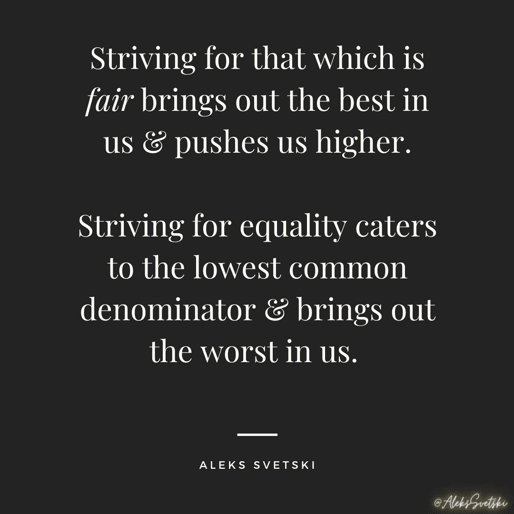

# 不要买比特币

> 原文：<https://medium.datadriveninvestor.com/do-not-buy-bitcoin-75da73226530?source=collection_archive---------0----------------------->

现在不会，以后也不会，永远不会。

献给怀疑论者、无知者、傲慢者和不感兴趣的人。

> 你不需要比特币。
> 请。 ***不买任何。***
> 
> *我个人不在乎开“大众领养”。我更喜欢选择性收养。*
> 
> 猪不配拥有珍珠。无知的代价是你要付出的。愚蠢的代价也是如此。
> 
> *到时候我会很乐意付给你一千 sat 换你一个月的时间，过程中* ***微笑*** *。*

The truth is harsh.

# 你将做出的最重要的决定

对于你的金融、经济和主权未来而言，你今天无法做出比购买比特币更重要的决定。

如果你不想花一点时间深入研究，那你以后唯一能责怪的人就是你自己。

如今，比特币正处于其早期的萌芽阶段。你可以在这里阅读更多相关内容(感谢奥比万·肯诺比特):

 [## 超比特币化:赢家通吃

### 比特币如何涨到 100，000，000 美元

medium.com](https://medium.com/coinmonks/hyperbitcoinization-winner-takes-all-69ab59f9695f) 

这不仅是你一生中的机会，而且可能是历史上最大的潜在财富转移，最疯狂的过去是，它的大部分将在几十年内发生。

我们仍然处于这一转变的前 12 年，我们已经看到比特币从 0.0008 美元(当时 1 万美元被用来购买 2 个披萨)飙升至目前的约 11，500 美元。

这仅仅是开始。全球财富中仅有 0.001%以比特币计价。

如果你现在花一点时间来理解金钱，它在社会中的作用，以及自然经济达尔文主义将如何推动整个世界成为最稳健、最可靠和最安全的财富储存形式，你可以选择在世界其他地方跟上之前购买一些。

读到这里，你就像一个古代人发现了一些金子，而当时每个人都还在使用贝壳。不同的是，你生活在数字时代，这些钱会在你的生命周期 中涌现并成熟 ***。不幸的是，古代的个体可能是正确的，但已经死了，因为黄金需要几千年才能做到比特币几十年就能做到的事情。***

**让。那个。下沉。在**中

然后在这里了解更多关于比特币及其出现的信息:

 [## 为什么比特币很重要

### 这比你想象的更重要

medium.com](https://medium.com/hackernoon/why-bitcoin-matters-c8bf733b9fad) 

为了你未来的爱，下载这本简短的电子书&他妈的教育你现在的自己！！

 [## 下载投资比特币

### Amber 的团队整理了一份简短的指南，帮助你理清杂乱的信息，理解比特币…

info.amber.app](https://info.amber.app/download-investing-in-bitcoin) 

我再次给你资源..胡说..
反正..

今天，你可以选择购买比特币；宇宙中最稀有的钱，为了几分钱！！你可以花 1 美元买 1000 个 Satoshi(比特币的美分等价物，100，000，000 Sats = 1 BTC )!！！

今天没有更大的机会，明天也不会有更大的遗憾，当你再也没有“选择”去买的时候。

当有一天你不得不接受的时候，你会记起这些话，但可惜为时已晚，你无法让时光倒流。

More Truth Bombs

# 现在已经不是 2012 年了

那时候你有借口。现在是 2020 年…

有一点好奇心或相对功能性大脑的人完全没有理由不能发现比特币是什么，为什么它存在，为什么它很重要&为什么他们应该把他们的一些个人财富分配给它。

*尤其是*当他们有我这样的朋友或者无数的比特币玩家时。

我不会再用“*为什么你应该买比特币*”这样的信息来打击人们。

现在已经不是 2012 年了。

今天，有如此多的信息来自如此多的好人，跨越每一个可以想象的媒介，以至于你没有借口忽视它，或者说:“但是没人告诉我”。

如果你不从你的网飞日程表中抽出一点时间来理解这件事是什么，以及为什么它对你个人的经济未来很重要，那么你应该得到你所得到的。

这听起来很残酷，但欢迎来到生活中，年轻的学徒。

现在…如果你*已经*花了一些时间，但仍然无知、傲慢或愚蠢到不屑一顾，那么你真的活该，这篇文章的其余部分绝对适合你。

# 我不希望你买任何比特币！

哦，但是阿列克斯，那“大规模收养”呢？？？

仔细听着:

> 如果再过 10 年、20 年、50 年或 100 年没有大规模采用，我才不在乎呢。

我完全赞成选择性收养，也完全赞成长期博弈。所以我愿意等待。

正如在所有自然的、进化的功能系统中一样，那些播种和帮助建立基础的人应该得到不成比例的回报。

这是 100%的公平，美丽的 ***不平等。*** *(了解我的人都知道，我关于平等的主张是人类最卑劣的理想。太恶心了，奖励我们最差的人)*

因此，对于怀疑者和反对者，我有一个简单的信息:

希望你不要买什么比特币。现在不会，以后也不会。我希望你得到比特币的唯一时间是当它是你能够得到支付的唯一方式时，也就是说；当你必须去争取的时候。

我期待着有一天，我的几千个 sat 能买到你三个月、四个月或五个月的时间。

所以与此同时…

***请。*** 坚持你的菲亚特。
***请。坚持你的屎币。***

我不希望你们这些闭塞的人，狗屎铸币者，菲亚特不铸币者或者其他自以为知道更多的小丑们参与进来。

这个过山车很特别，所以我为什么要和你这个笨蛋分享？
我为什么要继续对牛弹琴？

我相信 ***排除原则。***

这与 kumbaya 无关，也与我们所有人“合而为一”无关。
去你妈的。

我们不同是有原因的。

我铺了床&我要躺在里面。你做你的。

到时候，我会用 sat 支付你的时间，因为你在这件事上不再有选择。

那是我赢的时候，那是你输的时候。

# 播种什么就收获什么

你我的区别在于，我现在 ***买*** 比特币，因为我 ***要*** 要。
你明天就得 ***赚*** 比特币，因为你 ***已经*** 到了。

这就是无知的代价。
*那*就是傲慢的代价。

这是你将不得不为愚蠢付出的代价，尽管这听起来很刺耳，但事实是你应得的。

我们都躺在自己铺的床上，现在你也在铺你的床。

一个自鸣得意的比特币制造者不会说“我早就告诉过你了”。新的经济现实会帮你做到这一点。

当你意识到自己与那些谨慎的人、那些勤奋存钱的人、那些现在投入时间和精力去发现比特币究竟是什么的人之间的差异时，这种“早就告诉过你”会像一吨砖头一样砸向你，而所有人都称他们为疯子。

不会有悔恨。

# 不再对牛弹琴

那些现在有机会购买一些比特币，但由于无知、傲慢或愚蠢而选择不买的人，应该支付溢价。

他们应该用他们宝贵的时间和精力去换取他们今天可以得到的微不足道的东西。

毫无疑问:我们并不平等。我们是非常非常不同的人。

我已经投入了时间、精力和精力 ***现在*** ，不仅是为了自己理解这一点，也是为了帮助 seed &支持网络。

我已经尽了我的职责。

你待会要进来，帮我收获我的劳动成果。你会帮我享受果实。

那将是你要扮演的角色。

我选择冒一次险，获得一份大家都称之为疯狂的东西，去研究、相信并弄清楚今天的**，**希望为所有人建立一个更好、更公平的&未来。

这样做，我们中的一些人将会成为巨人，并变得非常富有。你们也有这样的机会，但你们中的许多人不会抓住它。

我终于接受了。
*我不再对牛弹琴。*

这篇文章可能听起来很刺耳，但我不再在乎了。现在轮到你自己做研究了。

不管你喜欢它，同意它还是不同意它，这正在发生。我和数以千计的其他比特币创造者就此写了一篇又一篇的文章。

我想到的几个优质材料包括:

*   我(当然)
*   [吉吉](https://medium.com/u/29f663fdaf68?source=post_page-----75da73226530--------------------------------)
*   罗伯特·布里德洛夫
*   [赛菲迪安·阿默斯](https://medium.com/u/becf6824fd89?source=post_page-----75da73226530--------------------------------)

你可以跟着你的鼻子和好奇心走。
这里是下载一些不可思议的作品的好地方:

 [## 主页

### 《比特币时代》是为了穿越所有多头而创建的#*%你可能已经读过或听说过比特币...(有很多…

bitcointimes .新闻](https://bitcointimes.news) 

最后但同样重要的是，如果你是一个比特币玩家，读到这里，你永远不会知道我是认真的，还是在下 4D 象棋。

还有 tbh，没关系。

这正在发生。比特币正在接管。经济达尔文主义是事实。

积累你的 sat 成绩，伸出橄榄枝，观察好奇心或眼中的闪光，以此作为前进的信号。如果它不在那里，或者如果你被推回去，让他们像猪一样玩他们的硬币。

我们需要清洁工来打扫城堡

# 作者:

 [## 阿列克斯·斯维茨基

### Aleks Svetski 的最新推文(@AleksSvetski)。无国籍的黑猩猩，抵制芯片，豆荚，虫子，大豆…

twitter.com](https://twitter.com/alekssvetski)  [## 亚历山大·斯维茨基—中等

### 阅读亚历山大·斯韦茨基在媒介上的作品。CEO @ www . amber . app . Editor @ https://bitcointimes . news .比特币…

medium.com](https://medium.com/@AleksSvetski)