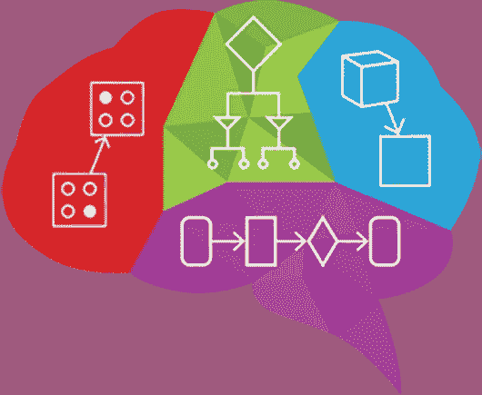

# 2021 年不要学 Python！

> 原文：<https://medium.datadriveninvestor.com/do-not-learn-python-only-in-2021-990c1fd0bdc0?source=collection_archive---------0----------------------->

如果学习 Python 是你的新年决心之一，请阅读。

## 关于学习 Python 的一个常见问题

近年来，Python 无疑在金融行业不断扩张。我开始认识越来越多的人，他们不是计算机工程师，开始学习 Python，要么是为了职业发展，要么是被公司要求这样做。我收到的最常见的问题之一是:

> 怎样才能真正学会 Python？
> 
> 他们的意思是，在完成 Python 教程、视频或书籍后，他们仍然很难将 Python 应用到日常工作中。

## 学习 Python 的一个常见错误

人们发现很难在日常工作中应用 Python 的原因之一是，人们只是将 Python 作为一种编程语言语法来学习。我的意思是:

> 我们应该学习计算思维(编码逻辑)而不是编程语言语法。

你可能会惊讶于一个计算机工程师能如此迅速地学会这么多种语言，并且几乎马上就能使用它们。他们能够这样做的三个原因是:

1.  几乎所有的编程语言都共享相同的基本构件，所以没有必要重新学习它们(只需要简单的语法就足够了)。
2.  只有少量特定于语言的特性需要学习，其中许多特性您不会立即需要。
3.  你永远不会通过记住所有的语法来编码，谷歌搜索答案的能力也同样重要。

## 用 Python 学习计算思维

如果学习 Python 是你的新年决心之一，请改为专注于学习**计算思维**。Python 只是实现这种逻辑解决问题的工具。

> 我不是说你不应该学习 Python，但是你的首要任务是学习编码逻辑，然后如何使用 Python 来实现这样的逻辑。

## 请集中精力解决问题

我注意到的另一个阻碍大多数人学习 Python 的普遍现象是，人们很容易被酷蜱吸引。

> 有很多你不会用到的很酷的技巧，但是有一些你需要在日常工作中解决的问题。你只能用它来学习。

# 学习指南

## 任何编程语言的基本块

无论您是在学习 Python 还是其他语言，大多数编程语言的基本构件通常是相同的。确保你了解他们。更重要的是，知道何时使用它们。你可能会发现记住一些具体的例子很有帮助。

**可变**

它本质上是一个存储值的“盒子”。“盒子”有它的名字，所以以后你可以很容易地在“盒子”中找到它的值。

**列表/数组**

一种特殊类型的变量，通常将相同类型的值放入其中，例如公司列表和股票价格列表。该列表也可以有多个维度。例如，我们可以有一个股票价格列表，其中第一层代表不同的股票，第二层代表股票价格的时间序列。类似地，我们可以列出每个财政年度的公司基本面。

**功能**

可能是最重要的部分之一。这是一个简短的名字，你给一个通用的进程，这样你就不必重复输入许多类似的代码。相反，您调用简称并提供输入，这些输入通常是变量。当你看到太多相似的代码和模式时，你就会使用它们。

**决策**

基本上是“如果…那么…”逻辑，你可以有很多“如果”。当您有一个根据特定场景做出不同行为的函数时，您需要使用它们。例如，您的函数根据输入计算不同种类的移动平均，如简单移动平均和指数移动平均。这样，您不必编写两个函数，并且可以将相似的任务组合到一个函数中。另一个例子是，你的金融模型将使用不同的方法来计算银行、保险或其他行业的公司统计数据。

**循环**

在我看来，最重要的组成部分。我们为什么会喜欢编程？因为我们想让电脑为我们重复。金融领域的两个常见用例:

1.  您有一个生成特定输出的函数，并且您想为许多单独的输入运行它。例如，我有一个功能来回溯测试一个给定证券的交易策略，我想回溯测试我的整个世界(证券列表)。
2.  你想经历一个时间序列。例如，为了模拟交易，我们需要一天一天地去决定我们是否需要在每一天买入、卖出或持有。或者，如果我们有投资组合报告功能，我们希望获得去年的季度报告。起点是生成一个日期列表。它也可以是两个列表，一个用于开始日期，另一个用于结束日期。*同样在金融中，开始日期通常是结束日期加一天(或者结束日期是开始日期减一天)，所以我们需要熟悉一个长度为列表的 n-1 的循环，然后对于每一轮，我们取当前项和它后面的一项。*

## 数据操作的通用逻辑

不管你是打算用 Python 还是 SQL 还是 SPARK 进行数据操作，数据操作最常见的逻辑都是相当相似的。

**选择**

基本上就是说你要从大主表中从哪列到哪列，从哪行到哪行。

**过滤**

指定条件(许多条件通常用 AND 和 OR 连接)以获取满足条件的行。一个常见的例子是根据基本面挑选公司。

**分组**

想想 Excel 中的 SUMIF 和类似于数据透视表的函数。例如，您想知道各行业的总市值。

**合并**

想想 Excel 中的 VLOOKUP 这样的函数。数据通常存储在许多表中，这样每个表就不会有太多的冗余值。当我们需要使用不同表中的数据时，我们通常会进行合并，并根据特定列的值进行合并。

一旦你熟悉了计算思维的关键概念和用例，你就可以用任何语言编码，因为它们本质上是一样的，只是实现的语法略有不同。

祝 2021 年好运！

 [## 面向金融分析的 Python 系列—简介

### 不要在金融行业的技能升级革命中落后。

medium.com](https://medium.com/analytics-vidhya/python-for-financial-analysis-series-introduction-e90bb824fee2)  [## 面向金融分析的 Python 系列— Python 工具第 1 天

### 在我们最后的 Python 学习阶段，Python Core，我们已经创建了一个简单的股票推荐程序，并且已经…

medium.com](https://medium.com/analytics-vidhya/python-for-financial-analysis-series-python-tools-day-1-ba0fa4409c23)  [## 用技术指标#1 对交易策略进行回溯测试

### 想交易吗？最好先对想法进行回溯测试。通过这个系列，我想将 Python 金融系列扩展到…

medium.com](https://medium.com/analytics-vidhya/backtesting-of-trading-strategy-with-technical-indicator-1-f782b252d873)  [## 使用 Python |数据驱动投资者的名称匹配技术

### 我们确实面临很多情况，我们必须匹配一个有很多变体的单词。这可能是因为错别字…

www.datadriveninvestor.com](https://www.datadriveninvestor.com/2020/12/07/name-matching-techniques-with-python/) 

**访问专家视图—** [**订阅 DDI 英特尔**](https://datadriveninvestor.com/ddi-intel)