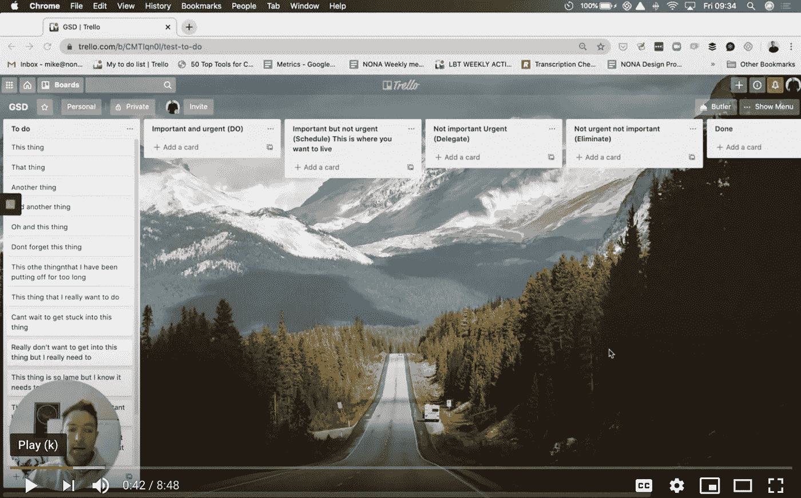

# 每天做这些事情，你会更有效率、更平衡、更健康。

> 原文：<https://medium.datadriveninvestor.com/do-these-things-every-day-to-be-more-productive-balanced-and-healthy-a14fc6c58d81?source=collection_archive---------14----------------------->

## 从 20 多年的创业经历中得到的教训。

## 今天你可以开始做的 23 件实事。

Photo by [Carl Heyerdahl](https://unsplash.com/@carlheyerdahl?utm_source=unsplash&utm_medium=referral&utm_content=creditCopyText) on [Unsplash](https://unsplash.com/s/photos/productive?utm_source=unsplash&utm_medium=referral&utm_content=creditCopyText)

当我十几岁的时候，我认为纪律、惯例和结构是给无聊的人准备的。我认为只有那些非原创的，遵循常规和结构的“群体”的一部分。

我错了，大错特错。

随着我的成长，我超越了自己，在创业的战壕里打拼了 20 多年，我有了一个非常令人惊讶的认识:

> 纪律和常规会让你自由。

我从没想过这些话会从我嘴里说出来，但正是对这些事情的关注让我在生活的各个领域都获得了成功。

我想分享一些我每天做的事情，这些事情对我的生意、我的人际关系、我的健康(包括身体和精神)以及我的生活产生了重大的积极影响。

我希望你能从中得到一些东西，哪怕只是对你生活的某个方面产生 1%的积极影响。

在很大程度上，我每天都做这些事情，但如果我在这里或那里错过了一天，我不会对自己太苛刻。大部分这些事情的收益确实是复合的，但是有时候做总比不做好。

话虽如此，他们在这里。

## 1.沉思

**为什么？**

好处是巨大的，但对我来说，一些突出的是，它带来了焦虑和压倒性的健康水平。这也有助于重新集中注意力，让自己活在当下，同时让我的心灵平静下来，让空间保持原样。

冥想之后，我总是更专注，更有创造力，压力也更小。这有助于更好地做出决策，更好地与人互动，并提高整体生活质量。

**如何？**

我使用[平静应用](https://www.calm.com/?url=http://www.calm.com&pid=google&af_channel=g&af_c_id=10203541439&af_adset_id=104997083754&af_ad_id=441952399103&af_sub_siteid=&af_keyword=calm&af_sub3=e&af_sub4=CjwKCAjwqML6BRAHEiwAdquMnUv3QUo7sdC4yjcCe6__8gAnuj6CnNjabRNQyKdyJQXSpg4OHPsK4RoCu2AQAvD_BwE&af_sub5=&utm_medium=paid&utm_source=google&utm_campaign=10203541439+104997083754+441952399103&utm_content=homepage&utm_term=calm&gclid=CjwKCAjwqML6BRAHEiwAdquMnUv3QUo7sdC4yjcCe6__8gAnuj6CnNjabRNQyKdyJQXSpg4OHPsK4RoCu2AQAvD_BwE)进行引导冥想，我每天早上和大部分傍晚都这样做，持续 10 到 15 分钟。

## 2.呼吸功(维姆·霍夫法)

**为什么？**

*   减压。
*   更快地从训练中恢复。
*   更好的睡眠。
*   提高身体素质。
*   更好的聚焦和清晰度。

**如何？**

我遵循我绝对喜欢的维姆·霍夫方法。简单来说，它是这样工作的:

1.  以放松的姿势躺下。
2.  深呼吸，集中在腹部——胸部——头部，然后呼气。这样做+- 30 次。
3.  最后一次呼气时，停止呼吸，屏住呼吸。
4.  一旦你觉得需要呼吸，深呼吸，保持 15 秒钟，然后放松。
5.  重复 3 次或更多次。

我能屏住呼吸不紧张超过 4 分钟——这是我以前从未想象过的。

## 3.冷水淋浴

**为什么？**

*   心理韧性。
*   减肥。
*   循环增加。
*   肌肉恢复更快。

洗完冷水澡后，我感觉棒极了。

 [## 在家工作如何提高我的工作效率|数据驱动型投资者

### 在家工作确实激发了我最大的潜能，让我更有效率。因为在家工作给了我…

www.datadriveninvestor.com](https://www.datadriveninvestor.com/2020/07/29/how-working-from-home-increased-my-productivity/) 

**如何？**

这取决于一年中的不同时间，但在非常寒冷的月份，我开始用正常的热水淋浴，然后当我干净时，我会转到完全冷水淋浴至少 2 分钟。

由于外面变得有点暖和，我根本没有热水，只是简单地洗了 5 分钟冷水澡。

值得注意的是，我过去常常紧张，真的“忍受”寒冷，但这远不如在寒冷中放松和平静有益。

对我来说，衡量这一点的一个好方法是我的心率。我的目标是从踏进冷水的那一刻起，我的心率至少下降 20%。

## 4.日志。

**为什么？**

*   把事情从我的脑海中抹去。
*   反思我的一天(我哪里进步了，哪里还可以进步)
*   刻意关注我感激的事情。
*   自我反省和观察。
*   刻意关注积极的想法，以便[重塑我的神经可塑性。](https://www.rickhanson.net/books/hardwiring-happiness/)

**如何？**

有很多方法可以记日志，我的过程一直在变。我目前的流程如下:

*   每日沉思来自[每日禁欲杂志](https://www.amazon.com.au/Daily-Stoic-Journal-Writing-Reflecting/dp/0525534393/ref=sr_1_1?adgrpid=87355678219&dchild=1&gclid=CjwKCAjwqML6BRAHEiwAdquMnbldE8w8W4p9JUnjJcH0h68OEERKvXOLSO-ujsY8d63x76JujPu1ChoC8hQQAvD_BwE&hvadid=414099510473&hvdev=c&hvlocphy=9070957&hvnetw=g&hvqmt=e&hvrand=16439953886552221966&hvtargid=kwd-365917602950&hydadcr=2168_14759&keywords=daily+stoic+journal&qid=1599183692&sr=8-1&tag=googhydr0au-22)。
*   今天我感激的事情。
*   在过去的两个小时里我做得很好的事情。
*   接下来两个小时我想改进或关注的事情。
*   我的学习和观察。
*   遵循《努力创造幸福》一书中的一个过程来进行深思熟虑的积极思考/体验。

## 5.每天和我的领导团队开会。

**为什么？**

*   与我的团队保持联系。
*   确保我们每一天都在正轨上。
*   给我的一天带来专注。
*   让彼此承担责任。
*   去捕捉我自己可能看不到的盲点。
*   了解团队情绪状态的模式和趋势。

**如何？**

有无穷无尽的方法来管理你的日常会议，我们的方法也在不断发展。我们日常领导团队会议的当前迭代如下

**协议:**

*   永远不要迟到。
*   每天同一时间准时开始。
*   准时结束。
*   如果你真的不能来，通过 Whatsapp 发送你的更新。
*   我们是一个由 5 人组成的领导团队，会议时间从不超过 15 分钟。

**议程。**

*   用一个词来描述我的感受。
*   我今天需要做的一件事是…
*   我今天要做的其他事情是…
*   我今天想关注的是…
*   今天我想庆祝的事情是…
*   在过去的 24 小时里，我想保持的一个行为是…
*   在过去的 24 小时里，我想放弃的一个行为是…
*   如果你想了解更多关于这个和其他提高领导力的过程，你可以点击这里查看我的文章[。](https://medium.com/datadriveninvestor/remote-work-is-easy-remote-leadership-is-not-98727f9ef2b8)

## 6.阅读 90 分钟

**为什么？**

持续改进是一种生活方式。

**如何？**

我不认为这需要太多的解释，但值得注意的是，我通过 [Audible](http://www.audible.com) 阅读我的大部分书籍，我以 1.5 倍的速度收听。

我选择利用开车和走路的时间来阅读有声读物，平均每周读完一本书。

Photo by [Clay Banks](https://unsplash.com/@claybanks?utm_source=unsplash&utm_medium=referral&utm_content=creditCopyText) on [Unsplash](https://unsplash.com/s/photos/learn?utm_source=unsplash&utm_medium=referral&utm_content=creditCopyText)

## 7.睡前至少 45 分钟不要看屏幕

**为什么？**

改善睡眠，减轻压力，和家人有更多的联系。

此外，我们真的需要让我们的大脑和眼睛从持续的屏幕轰炸中得到休息。

**如何？**

很难让网飞兴奋起来。把你的电视放在一个不同的房间，你大部分时间都在那里。如果你卧室里有电视的话，把它拿出来。从遥控器中取出电池等。

睡觉前 45 分钟把你的手机调到飞行模式，并把它放在不同的房间。

选择阅读一本书(我选择在晚上阅读《幻想》,让自己从有目的地消费内容中解脱出来。幻想是放松和有趣的，我把它看作是一天的一种奖励。

## 8.醒来后至少 60 分钟内不要看屏幕

**为什么？**

如果你不这样做，当你查看邮件、频道等的时候，你的一天很可能是从肾上腺素激增开始的。这是不健康的，会让你度过一个你无法控制的紧张的一天。

我发现，如果我能在醒来后让手机处于飞行模式至少 60 分钟，我就能以更加平静和可控的状态轻松地开始新的一天。

这也让我能够专注于对我来说非常重要的日常工作。

**如何？**

用闹钟来叫醒你，而不是用你的手机，这样早上起来第一件事就是翻个身看着屏幕就不是一个简单的选择。

我应该注意到，这可能是当我放弃纪律时，对我影响最大的事情。

## 9.禁食(大约)16 个小时。

**为什么？**

我不会鼓吹间歇性禁食，因为我不是科学家，也不是专家。我想说的是，对我来说，经常让我的肠胃和消化系统休息一下是有意义的。

我现在也确信，健康的肠道对精神、情感和身体健康是绝对必要的，定期禁食在这方面非常有帮助。

这也有助于提高精神韧性，这对我很重要。

**如何？**

对我有效的不一定对你有效，但是我在下午 6 点吃晚饭，然后通常吃零食到晚上 8 点左右。然后我直到第二天晚上 12 点才再次进食。

当我吃东西的时候，我尽量避免加工过的和高 GI 的食物，这样我的身体就不会突然摄入加工过的碳水化合物/糖。

我仍然在尝试这个，但我通常会用煮鸡蛋、鳄梨和高质量的烤面包来打破我的每日禁食(我可能应该跳过面包，但我就是太喜欢它了！).

## 10.步行 45 分钟。

**为什么？**

这是开始一天的好方法。我从中获得的好处包括:

*   它让我清醒(我尽可能早地走路。)
*   循环和轻度有氧运动。
*   创造力。这是我获得 Linkedin 帖子和一般文章的大部分想法的地方。
*   学习。我边走边听有声读物和播客。
*   与自然的联系。只要有可能，我就在大自然中漫步。

**如何？**

*   关掉你的手机。
*   以提高心率的速度行走。
*   尽可能地关注和意识到你周围的环境、你的呼吸、你的想法和你的感受。
*   如果可能的话，走在大自然中，真的会有很大的不同。

If possible walk in nature, it really does make a big difference.

## **11。高强度循环至少 45 分钟。**

**为什么？**

*   保持健康和强健的有氧运动。
*   建立心理韧性。
*   我喜欢骑自行车。

**如何？**

我在冬天使用室内教练，这很棒。我更喜欢的是 Tacx Neo T2 训练器和 T2 zw ift 的组合。

我在训练的时候会听有声书或者播客。

在暖和的日子里，我会经常从家里出去兜风，但我意识到不是每个人都有这个选择，而且这可能更费时间。

## **12。100 个俯卧撑。**

**为什么？**

*   保持坚强
*   精神韧性
*   这是我在工作间隙做的一件好事。

**如何？**

我通常会在一天中尽可能以接近完美的形式做 10 组。

有时我只做 50 次，有时我做 500 次，但我总是每天都做一些。

每天都这样做，日积月累，你的身体(和镜子)会感谢你的。

## **13。一个小时的学习。**

**为什么？**

持续改进是一种生活方式。

**如何？**

每天在你的日历上把它划掉。关闭你的通知，关闭电子邮件、slack 等。

对我来说，学习可能是一个在线课程，一本书，我想执行，有时它甚至可能是一个电话，有人问我的意见或经验分享。

这里的要点是把它纳入你的日常日程。如果你每天都这样做，你会惊讶于这种复合的速度有多快。

## **14。2 组 45 分钟不间断的“完成任务”时间。**

**为什么？**

如果我不把这段时间放在一边，我就永远不会开始真正的工作。如果我不把这段时间放在一边，我会把所有的时间都花在反应模式上，而不是在深思熟虑和专注的心态上。

**如何？**

我用 macbook 上的一个应用程序设置了一个定时器，并且关闭了所有的通知，这样就没有人能打扰我。

然后，我参考我已经分类的待办事项列表，开始处理我这次安排的“重要而紧急”的任务或“重要而不紧急”的任务。

*我制作了一个视频，介绍如何以一种减轻压力、提高效率和专注度的方式对你的待办事项进行分类，我会在本文后面再次引用。

## 15。1 小时的思想领导力和业务发展。

**为什么？**

思想领导力和业务发展是一门学科，需要每天的努力。如果我每天只花 1 个小时在这上面，收益会增加，一年后我会有巨大的收益。

**如何？**

*   我在 LinkedIn 上至少发布 1 件事。
*   我与至少 3 个目标客户接触(这包括寻找这些目标客户的工作)。
*   我在 Linkedin 上至少评论了 3 篇相关的帖子
*   我会就一个相关话题写至少 20 分钟。
*   我从相关来源中寻找灵感、内容和参与机会。

## 16.任务分类和日历设置

**为什么？**

如果没有一个分类和优先排序的过程，我的待办事项列表只会变得没完没了，只不过是压力的另一个来源。这个系统给了我控制它的能力，并帮助我认真考虑什么是真正重要和紧急的，什么不是。

然后，我把任务转移到我的日程表上，因为按照待办事项清单生活很少是一个有成效的过程，但是按照日程表生活通常是。

将任务转移到日历上也让你清醒地认识到你实际上可以完成的事情，这进一步促使你专注于如何度过你非常宝贵的时间。

**如何？**

这个更容易展示给你们，所以我为它做了一个视频。

Click here for the video: [https://www.youtube.com/watch?v=O7VuUaw7bag](https://www.youtube.com/watch?v=O7VuUaw7bag)

## 17.写 20 分钟

**为什么？**

我想在写作方面做得更好，并把我的读者群增加到客观上有价值的程度。在大多数情况下，在某件事上做得更好的唯一方法是在它上面花更多的时间。这没什么不同。

我想提高写作水平，所以我每天都写作。

**如何？**

对我来说，最好的写作时间是在早上散步之后，在我打开手机或者与外界有任何联系之前。

我有一台单独的笔记本电脑，只用于写作，这有助于我进入适当的精神状态，同时将数字分心的可能性降至零。

我设置了 20 分钟的计时器，然后开始写作。我经常花超过 20 分钟的时间，但我从来没有少花时间。

如果，不管什么原因，我没有在早上写，我会努力在当天晚些时候写。

## **18。和我的家人一起吃晚餐。**

**为什么？**

我女儿的联系、可预测性和结构，以及我家的文化。

**如何？**

我每天从下午 6 点到 7 点在日历上划出 1 个小时，这比任何事情都重要。

吃饭的时候不要看屏幕，这样我们就可以互相交流和互动。

很少会有需要移动它的原因，但我把它当作最优先的日历项目。

## **19。做一件让我害怕的事。**

**为什么？**

变得对不适感到舒适，并意识到我们害怕的大部分东西实际上并不存在，而且通常对“可怕”的事情的预期远比它的现实更糟糕。

还有，心理韧性。

**如何？**

这个问题有很多不同的背景，但是一个有用且实用的方法是查看你的待办事项列表，尝试先解决你认为会让你最不舒服的那一个。

另一个例子是同意去做那个你被要求去做但是你太害怕去接受的演讲。

另一个例子是告诉某人一些因为害怕被伤害而推迟的事情。这可能是公事也可能是私事，没关系。重要的是你选择步入不适，因为那需要勇气。

## 20.在家里帮忙。

**为什么？**

因为这真的对我和我妻子的关系产生了积极的影响，也让我感觉更好。

**如何？**

我已经把打开/重新包装洗碗机，然后清洁厨房的表面纳入了我早上的例行公事。

## 21.仪式化一个平凡的任务

为什么？

这真的很令人惊讶，但如果我能够真正专注于一项平凡的任务，如打开洗碗机或清洁厨房柜台，我会发现自己变得非常冷静，这实际上帮助我以更好的心态进入更重要的任务。

这也有助于欣赏一些小事，比如一个干净的厨房，或者我们甚至有一台洗碗机。

**如何？**

选择一个你通常会匆忙完成或完全避免的平凡任务，当你做的时候要 100%集中注意力。当你这么做的时候，把注意力集中在触觉、嗅觉、情感和思想上，看看你的体验是如何变化的。

## **22。为我妻子做一件事。**

**为什么？**

我发现了她的爱语是什么，这是对我们关系的投资。

每次我这样做的时候，我都在我们的关系中“存款”,这有助于建立一个强大的基础。

**如何？**

这可以采取多种形式，但对我来说，一些例子可能是:

*   打扫厨房。
*   拿起一个冰沙碗放在她的办公室。
*   做一些她想自己做的管理工作。
*   给她时间做她想做的事情，带我们的女儿去郊游，每次几个小时，而我妻子并不希望我带她去。

## **23。让我女儿上床睡觉。**

**为什么？**

投资于我和我女儿的关系，投资于她将我视为安全、舒适和联系的源泉。让我妻子晚上有自己的时间。

提高我的耐心和接受度。

**如何？**

每天晚上平均 90 分钟的谈话、读书和给她讲故事的组合。

一天中绝对有足够的时间，我们如何度过这些时间，以及我们准备优先考虑和牺牲什么，是一切的关键。

现在，我要去做俯卧撑了！

**进入专家视角—** [**订阅 DDI 英特尔**](https://datadriveninvestor.com/ddi-intel)