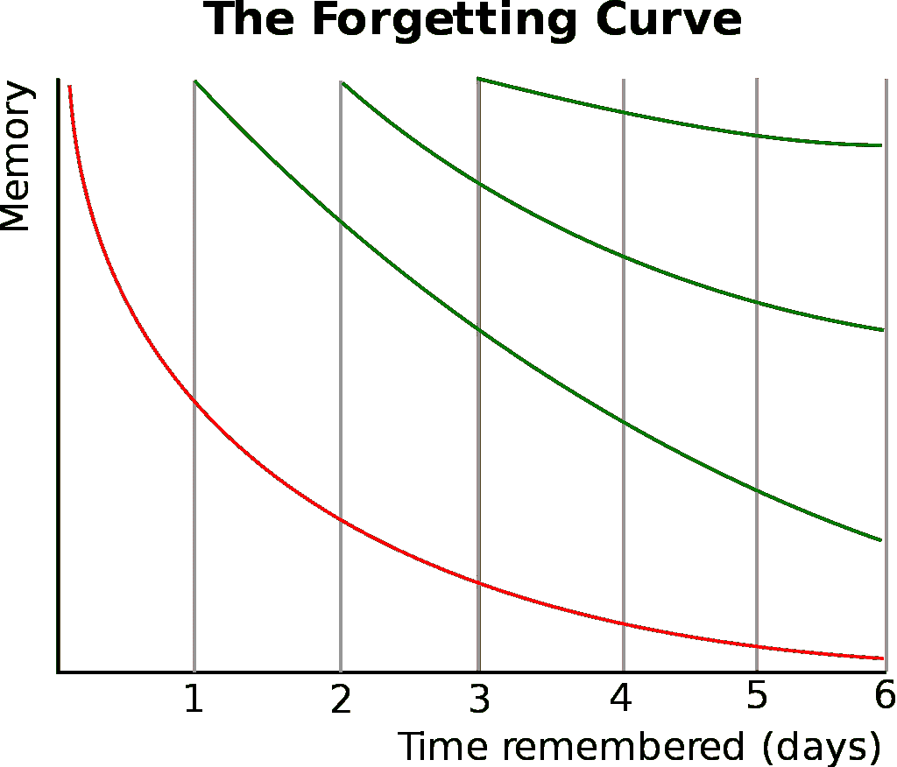

# 做这一件事来大大提高你的学习

> 原文：<https://medium.datadriveninvestor.com/do-this-one-thing-to-improve-your-learning-drastically-efb344c1e1ac?source=collection_archive---------5----------------------->

Photo by [Siora Photography](https://unsplash.com/@siora18?utm_source=medium&utm_medium=referral) on [Unsplash](https://unsplash.com?utm_source=medium&utm_medium=referral)

为什么我什么都不记得了？

你第三次阅读同样的文本。

但就是贴不住。

学习不一定要有这种感觉！

让我解释一下。

我的一个最亲密的朋友最近问我，他怎样才能学得更快，记得更多。他一边从事一份要求很高的工作，一边学习工商管理。所以他不能浪费时间——在我看来，我们谁都不能浪费时间。

当我第一次告诉他我会怎么做时，他有点怀疑，但还是试了一下。

昨天我见到他时，他兴奋地告诉我，即使是像高级统计分析或经济学这样复杂的学科，他也能学得更快。

所以我也很高兴与你们分享这项技术。

让我们开始吧。

# 你很擅长遗忘

我们知道我们倾向于很快忘记新信息。这就是为什么重复是至关重要的。

正如我们在下面的所谓遗忘曲线中所看到的，我们在第一天之后忘记了超过 50%的所学内容。然而，如果我们在一天后重复该材料，则曲线变平。

 [## 教科书行业如何最终被颠覆，并将继续改变|数据驱动…

### 就此而言，教科书产业在美国乃至全世界都有着悠久的历史。事实上，他们已经…

www.datadriveninvestor.com](https://www.datadriveninvestor.com/2018/09/25/how-the-textbook-industry-has-finally-been-disrupted-and-will-continue-to-change/) 

我们重复得越多，曲线就变得越不陡峭，这样我们就可以不那么频繁地重复这些材料。这也是为什么你还能记得你在学校学到的东西的原因。

这太棒了！只要每天重读你的材料，你就会没事。

嗯——我得学几百页！我怎样才能每天重读它们？

传统的观点是写一个总结，然后重读这个总结。这是可行的。但我发现它远非最佳。

你看，写总结，还没用那么多脑子。这听起来可能很刺耳，但是当你仔细想想，你所做的只是减法。

让我建议一些更好的。

# 提问是一种超能力

> 成功的一部分在于提出问题并倾听答案。
> —安妮·伯勒尔

我要你做的是问问题。

一个孩子如何学习？

很大一部分是无所畏惧地问问题。

我们的大脑天生会回答问题。如果有人问我们一个问题，几乎不可能不去想答案。

你上次问问题是什么时候？

看，告诉过你！

现在是时候利用这一点了。

1.  不要总结你想要记住的批判性思想，而是在索引卡的一面写下一个问题，在背面写下包含基本思想的答案。试着在一个问题中融入尽可能多的观点。
2.  与其重读一个总结，不如请别人给你读问题，并试着回答。你也可以录下自己问问题，停顿，然后给出答案。
3.  每天重复那些你很难回答的问题，每周重复一次给那些知道答案的人。

最重要的部分是提出正确的问题。这个过程不要操之过急。许多人向我报告说，制定问题的行为帮助他们理解和记住了主题，没有什么比这更好的了。

# 外卖

重读数百页不仅枯燥费时，而且主要是浪费你的宝贵时间。试着想出一些经过深思熟虑的问题，并定期重复。

# 准备好变得无限吗？

如果你想变得无限并大大加快你的学习速度，看看我的小抄:

[点击此处立即获取备忘单！](https://roadtolimitless.com/cheatsheet/)