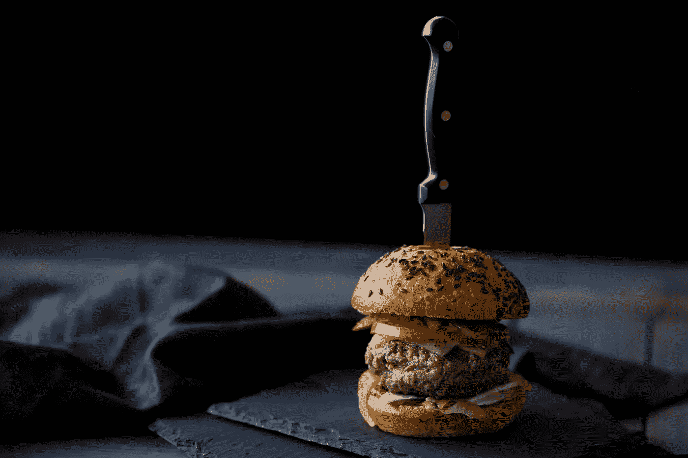

# 我们知道新冠肺炎危机改变了什么吗？

> 原文：<https://medium.datadriveninvestor.com/do-we-know-what-the-covid-19-crisis-has-changed-373b297cc526?source=collection_archive---------6----------------------->

45 天前，这场危机袭击了我们，许多有经验的人分享了他们对此的看法。大多数阅读材料要么是非常高的水平，让我们建立一些新的东西，要么是非常深入的可操作的细节，如你需要 18 个月的现金，提前解雇，…

我发现我所读的大部分内容都非常有用，很有见地。然而，我认为耐心是至关重要的。我不认为我们可以很快得出结论，新的世界将会是什么样子，并据此采取行动。至少现在还没有。

我们的新世界始于一场卫生危机，并将演变成一场严重的人道主义危机。人们将会挨饿。大多数人看到了金融危机，但在恢复我们的经济之前，我们必须养活我们的人民。如果我们不建立一个保护系统，我们将面临深刻的社会危机，我可以看到人们为了基本需求而反抗和斗争。

也就是说，假设我们找到了处理社会危机的方法，这个新世界是什么？

是的，远程工作、社会距离、电子学习、电子商务将继续存在，但是，更重要的是，危机已经破坏了现状。我们不再相信我们能回到以前的生活。改变人们的行为是极其困难的，只有在被迫的情况下才能实现。这就是我们的处境。

我们来举例说明。换钱不再安全，虚拟支付(PayPal，Venmo)将会蓬勃发展。去电影院不再有吸引力，电影将会以不同的方式发行(网飞之类的)。疯狂购物会减少。生活在大城市是有问题的，每天被困在电梯里会产生焦虑，生活在一个更“人性化”和更便宜的环境是更可取的。二氧化碳前所未有的减少让世界变得更加美好，保持这种状态将是人们最关心的事情。

因此，从本质上讲，危机是一种趋势加速器。换句话说，即将成功的人会成功得更快，即将死去的人会死得更快。

诱惑是专注于此时此地。然而，重点应该是理解这种向前的运动。新的现实将比我们想象的更加微妙和复杂。一般来说，在家工作是可以的，因为这个团队已经形成很长时间了，而且大家都互相认识。两年后当新的血液进来时会发生什么？远程工作可能需要新的流程和更强的文化。

 [## 投资区块链前要问的三个简单问题(也是一个困难的问题)|数据…

### 现在是了解区块链的最佳时机。不同货币之间的增长率，比如…

www.datadriveninvestor.com](https://www.datadriveninvestor.com/2020/03/12/three-simple-questions-and-one-difficult-one-to-ask-before-investing-in-a-blockchain/) 

对我们缺乏对危机后果的了解保持谦逊是很重要的。因此，为未来 3、6、9 个月制定计划是行不通的。组织需要敏捷和谦逊。而是改变那些不会持久的东西，再次改变。

事情会有所不同。

我们的世界依靠数据来决定。我们可能需要更多地运用直觉。直觉来自经验。事实上，大多数决策需要 80%的数据才能发生。现在我们可能只有 50%的数据。我们可能需要更多地依靠人。斯坦利·麦克里斯特尔将军是一位退休的美国陆军将军，他因在阿富汗指挥联合特种作战司令部而闻名，他告诉他的士兵，“当你到达地面时，如果我们对你下达的命令是错误的，就执行我们应该对你下达的命令”。难以置信不是吗？他可能没有足够的数据来信任他的命令，但他足够聪明知道这一点。

全球化正处于危险之中。企业和政府正意识到依赖复杂供应链的风险。政府正在关闭边境，自由流动不再容易。民族主义者将被提供一个减少移民和加强边境的平台。政府将会希望转移战略性业务，比如药品生产。企业将青睐较短的供应链。我不认为中国会成为这场危机的赢家。我还担心它会使世界变得不稳定，更容易发生冲突。

如果你经营一个组织，你不会有数据来决定，你的市场在变化。客户是不一样的，需求是变化的，金融现实是不同的，你的产品可能会过时。全球动力是不同的，你将无法旅行和满足人们一样多，寻找供应可能需要一个新的战略。

所以我不知道我们的新现实会是什么样子。这与卫生危机将持续多久密切相关。然而，有理由相信有些事情会有所不同。