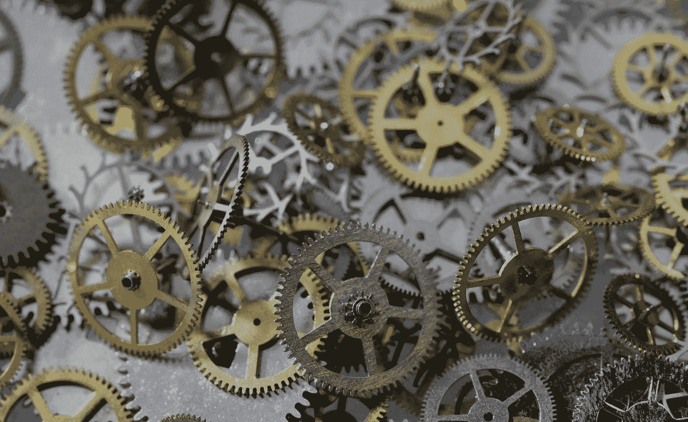

# 我们是否高估了生产力？

> 原文：<https://medium.datadriveninvestor.com/do-we-overvalue-productivity-dffb14940a9?source=collection_archive---------20----------------------->

Photo by [Laura Ockel](https://unsplash.com/@viazavier?utm_source=medium&utm_medium=referral) on [Unsplash](https://unsplash.com?utm_source=medium&utm_medium=referral)

生产力似乎是专业劳动力的圣杯。我们的日常生活围绕着生产力最大化的目标。也许疫情会改变我们的思维模式，因为老板们不能在我们的办公桌前停下来看我们在做什么，我们已经在很大程度上用事先安排好的电话会议代替了临时的办公室会议。不知何故，我认为不是。我们不能再坐在小隔间里假装忙碌，即使我们并没有做太多事情。因此，我们将根据未来几个月的产量来衡量。然而，我们应该小心不要高估任务的完成。一些导致优秀工作的步骤是不可量化的。

销售角色总是根据效果来奖励员工。只要你卖出去了，你如何度过一天并不重要。如果你不能销售，你就不能投入足够的时间来解决这个问题。优秀的销售人员不是完成最多工作的人。他们是销售产品最有效的人；为客户找到合适的解决方案，并随着时间的推移建立信任关系。许多优秀的销售人员确实创造了一些系统来帮助他们更有效率，从而更有成效。然而，月总销售额并不总是与工时效率相关。一个大的销售可能会因为一封意外的电子邮件而结束，一个月的销售目标在瞬间就被超过了。在许多情况下，那次销售中包含了数小时未实现的工作。正确的工作正在后台进行。

 [## 在家工作如何提高我的工作效率|数据驱动型投资者

### 在家工作确实激发了我最大的潜能，让我更有效率。因为在家工作给了我…

www.datadriveninvestor.com](https://www.datadriveninvestor.com/2020/07/29/how-working-from-home-increased-my-productivity/) 

我们中的大多数人都有充满应用程序的设备，旨在帮助我们做更多的事情。我的饮食跟踪应用程序节省了我的时间，因为我不必带着一本日记，写下我吃的一切，然后在每天结束时计算卡路里总量。除了我个人不关心我一天吃多少卡路里、碳水化合物或蛋白质。我的目标是减肥，或者至少在不减的情况下保持现在的体重。它给了我一些信息，我仍然需要将这些信息转化为最终结果。如果我不采取额外的步骤，这个应用程序就毫无用处，可能会耗费我的精神能量。有时我们的应用程序提供了一种控制的错觉，因为收集数据感觉像是在做什么。番茄工作法允许我划分我的时间和注意力，但是它不能让我知道我在那段时间内完成的工作是否好。上周，我去了一家 Menards 商店，很久以来第一次买了一件东西。光看展示和产品，我就想出了五个解决家居问题的创意方案。我通常在网上订购，并让我的项目送到我家，因为这节省了我的时间。我从来没有在上网浏览的时候想出另一个问题的解决方案。我寻找我需要的东西并注销。节省时间并不能让我们做得更好。

除了产量，什么是生产率？生产率是我们当天从清单上划掉的任务的衡量标准。是我们每年完成的战略目标数量。最终的胜利变成了在我们的一天中，在我们的待办事项清单上再增加一项。生产力被解释为在一个月内完成这本书，并在下个月推出一门新课程。如果我们工作效率很高，我们会一次完成多门课程或多本书的创作。生产力是在一年内完成四五个主要项目。我们赞美完成了很多事情。如果我们用 365 天而不是 30 天写完这本书，我们的书会好 20 倍吗？

脑海中浮现出一位出色的前雇员，他既高效又有生产力。她像机器一样运转。她从不浪费任何时间。她工作出色。但她的职责是例行公事。她可以两者都掌握，因为她没有学习新的技能。她每天一整天都在做类似的工作。雇主需要这样的人，我们也需要这样的日子。掌握技能可以使工作既有效率又有效果。但是增长很少看起来像生产率。没有掌握的技能是普通的，而不是特殊的。当我们学习的时候，我们又慢又笨拙，而且不是很好。直觉是内化的实践。

我见过一些公司能完成相当多的工作，但很少能顺利完成。多项重大举措同时展开，但执行力平平。工作完成了，但没有一件是优秀的。大部分只是令人满意。目标不应该仅仅是完成一大堆。有时所能做到的只是一大堆垃圾。我见过员工浪费时间去做错误的事情。有时他们不得不重新开始，失去更多的时间。但有时无效的工作被接受，个人永远不知道如何建立一个项目来推动组织前进。如果我们做了很多，但没有一样是新的，我们就不会成长。如果我们想要做新的事情来成长，我们需要慢下来。有时这意味着我们的步伐看起来没有成效。

我是我高中国家队的一员。我们是州冠军。我是一个普通的跑步者，但我的几个队友是精英。我的团队中的个人跑步者在状态上排名第一、第二和第四。我们连续几年获奖。我们的教练专注于优秀。他让我们练习小动作。我们练习跨步，举重，并确保适当伸展。他让我们进行了一系列肌肉和技能的训练。他让我们做长跑和短跑，快跑和慢跑。尽管我们是长跑运动员，但我们做了很多与长距离跑步无关的锻炼。他关心每一个运动员，花时间建立团队友谊。甚至像我这样的普通跑步者也感到被重视。我们集体和个人都努力工作。你加入这个团队不是为了混日子。你加入是为了变得更好。我看过职业拳击手几百次练习一个小技巧，直到动作是自动的。他们不会打出一百种组合拳；他们练习一拳，直到打好为止。

我们可以用一般的技能完成大量的工作。我们甚至可以出售产品，用普通的工作过上体面的生活。这样生意可以持续很长时间。平均水平是基线期望值，我们可以在平均水平上舒适地生活。事实上，在奖励工作数量多于质量的环境中，没有多少激励去做好工作。有效的工作是优秀的工作，因为它是重要的工作。但是，执行正确的解决方案可能需要花五个小时思考问题的根源，而实际工作进展甚微。这可能需要走很长一段路来理清思绪，或者休息一天去做一些有趣的事情来恢复创造力。这些看起来都没有什么成效，但是导致正确解决方案的时间是有价值的。重要的是执行正确的策略，而不是随便什么策略。相反，我们倾向于*马上解决问题*。我们试图立即解决，因为这样我们就可以说我们做了什么。我们可以谈谈产量。我们的时间是可以量化和衡量的，但我们仍然可以做所有这些工作，并产生很小的影响。做得多不等于做得好。生产力应该是做好工作的众多工具之一，而不是最终目标。

**访问专家视图—** [**订阅 DDI 英特尔**](https://datadriveninvestor.com/ddi-intel)