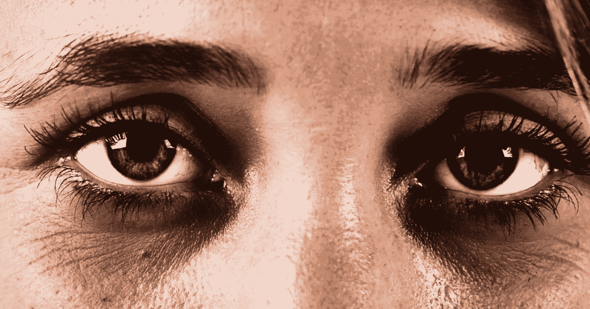
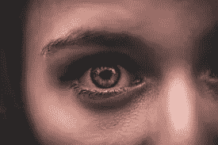

# 你有黑眼圈吗？？？这里是如何摆脱它

> 原文：<https://medium.datadriveninvestor.com/do-you-have-dark-circles-here-is-how-to-get-rid-of-it-89f9dbf0590?source=collection_archive---------9----------------------->

嗨伙计们，

我们的眼睛被称为“心灵的窗户”——由于它们受到如此多的关注，它们也是最先泄露我们年龄的地方之一。我看到许多人的眼睛下面有很大的黑眼圈，这降低了他们的自我形象、自信和自尊。几天前，由于紧张的工作日程，不适当的睡眠模式和不健康的饮食，我也开始受到黑眼圈的困扰。所以我开始研究黑眼圈背后的科学，以及我们如何才能消除它。

**黑眼圈背后的科学**

有一层脂肪从眼眶包围的空间中弹出，在眼睛下方形成浮肿区域。这种脂肪组织可以充满水。因此，当水被保留时，它变得更加明显，这可能由于多种原因发生，包括吃了太多的盐，平躺在床上，睡眠不足，过敏和每月激素变化。随着年龄的增长，黑眼圈形成的皮肤会变得比身体其他部位的皮肤更薄，变得更松弛、更黑。对于一些人来说，黑眼圈通常有很强的遗传因素。如果你睡眠不足或者总是压力过大，你的身体会产生更多的[皮质醇](https://en.wikipedia.org/wiki/Cortisol)来保持清醒。随着时间的推移，皮质醇会收缩血管，或者在这种情况下，扩张血管，使眼睛下方的血管变大。过敏也可能是一个主要原因。过敏反应会导致你的身体释放[组胺](https://en.wikipedia.org/wiki/Histamine)，这也会扩张血管。此外，如果你不保护你的脸，阳光会损害你眼睛周围的皮肤细胞并杀死它们。皮肤细胞少意味着皮肤更薄，意味着眼圈更黑。最后，随着年龄的增长，皮下脂肪越来越少，皮肤也越来越薄。

**如何摆脱黑眼圈**

家庭方法

*   每天饮用 3-4 升水
*   早晨少量温水和两餐之间正常的水
*   停止吃垃圾和油腻的食物
*   以红色水果开始新的一天，比如石榴和苹果
*   每周喝一次绿色蔬菜汁
*   停止承受压力
*   严格睡眠 6-7 小时
*   不要用手触摸眼睛下面的皮肤
*   使用消毒棉花清洁它
*   永远不要摩擦它
*   早上用冷水清洗
*   无论是阴天还是晴天，外出时都要佩戴偏光太阳镜
*   使用笔记本电脑和手机时保持距离
*   在使用任何凝胶或面膜之前，用纯杏仁油或维生素 e 油轻轻按摩
*   然后每天一个接一个地尝试下面所有的方法，你肯定会在一个月内看到效果，但是我坚持你要有规律

医学方法

*   手术睑成形术也许能够提供永久性的矫正。也有侵入性较小的方法，如使用钙羟基磷灰石填充物，如 Radiesse，它可以帮助提供一个自然的外观层来掩盖黑暗。
*   治疗眼睛下面的空洞很简单，可以通过注射填充剂如 Restylane 来完成。在这一过程之后，所谓的泪槽会立即软化，并且由于在皮肤和皮下组织之间放置了一些东西，任何色素沉着都会明显变浅。
*   二氧化碳(CO2)激光可用于皮肤表面重建，使皮肤紧致变厚，同时淡化色素沉着。

对抗这些黑眼圈的最好办法是涂防晒霜、充足睡眠、服用抗过敏药，并尽可能避免压力。