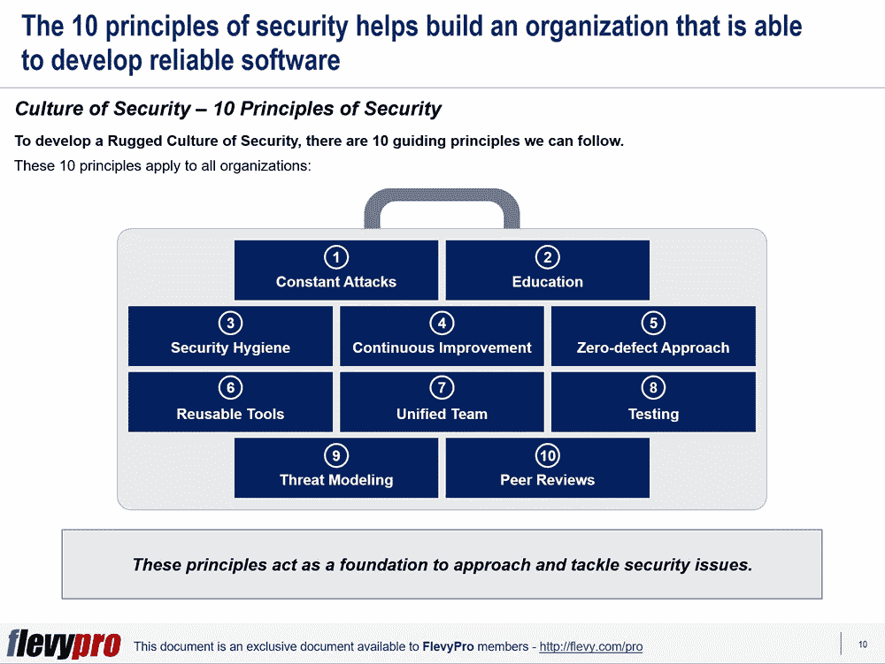

# 您知道持续安全改进的关键要素是什么吗？坚固的信息安全文化

> 原文：<https://medium.datadriveninvestor.com/do-you-know-whats-the-key-imperative-to-continuous-security-improvement-72117e223810?source=collection_archive---------20----------------------->

在技术快速进步的时代，数字化转型已经变得无处不在，商业应用变得越来越复杂和相互关联。技术的进步也帮助攻击者变得更具侵略性，对 IT 系统和应用程序造成更大的破坏。应用程序安全工具和技术也在不断发展，但大多数组织仍然容易受到漏洞的攻击。[网络安全](https://flevy.com/business-toolkit/cybersecurity)已经成为比以往任何时候都更大的威胁。

当前的应用程序安全方法主要依靠检测弱点并纠正它们。大多数组织主要依赖于利用渗透测试或自动化工具。他们忽略了集中精力建立强大的防御威胁，仅仅做修补工作，而忽略了弱点。一小部分实施威胁建模、安全架构、安全编码技术和安全测试，但即使是他们也不确定这些方法如何与其战略业务目标相联系。

一些弱点构成了大多数入侵——例如， [SQL 注入](https://en.wikipedia.org/wiki/SQL_injection)和[缓冲区溢出](https://en.wikipedia.org/wiki/Buffer_overflow)。主要的安全威胁和应用程序漏洞包括凭据受损、无法及时修补、SQL 注入和跨站点脚本。只要注意安全卫生，就可以消除大量的安全威胁。

# 安全软件开发

当今最先进的技术和最佳实践提供了有效而经济的方法来防止安全漏洞和威胁。这些工具和实践运行良好，不会影响交付的速度或给用户带来不必要的压力。

安全的软件开发不仅要保证分析技术，还要着眼于创建软件的整个组织——人员、过程、工具和文化。安全软件开发文化通过促进和改善关于安全主题的交流、协作和竞争，以及快速发展创建可用的、可生存的、可防御的、安全的和有弹性的软件的能力来激发安全性。

# 坚固的软件和安全文化

Rugged software，或 Rugged DevOps，通过将这种实践嵌入到组织的文化中，促进了安全和弹性软件的开发。坚固的安全文化不仅仅是安全，安全是特定时间的一种状态，而坚固则意味着长期领先于威胁。坚固的代码符合组织的目标，可以应对任何挑战。坚固的企业不断调整其代码和内部组织，包括治理、架构、基础设施和运营，以保持对攻击的领先。由“坚固的”组织开发的所有应用程序都可以很好地抵御威胁，能够自我评估和区分正在进行的攻击，报告安全状态，并适当地采取行动。

坚固的软件是合理化和加强安全性努力的结果。这是通过交流从实验中吸取的经验教训、建立严格的防线以及全面采用和共享严格的安全程序来实现的。在整个企业中采用坚固的软件开发实践有助于在软件开发生命周期中迅速执行更多的应用程序、提高安全性并实现成本节约。由于在开发生命周期的需求、设计、执行、测试、迭代和培训阶段需要更少的人力和时间，健壮的软件开发是有成本效益的。

以下 10 条指导原则适用于所有旨在发展坚固的安全文化的组织:

1.  **永恒的攻击预期**
2.  **保持消息灵通**
3.  **安全卫生**
4.  **持续改进**
5.  **零缺陷方法**
6.  **可重复使用的工具**
7.  **一个团队**
8.  **综合测试**
9.  **威胁建模**
10.  **同行评议**

现在让我们讨论前 5 个原则。

# 永恒的攻击预期

一个坚固的软件开发组织预见到不间断的漏洞和攻击——故意的或意外的。

# 保持消息灵通

坚固的组织喜欢随时了解安全问题和潜在威胁，寻求安全专家的建议，并确定和更新安全策略和规则。

# 安全卫生

坚固的组织通过限制用户帐户的共享、小心地保护密码和敏感的个人信息来保护他们的安全。他们采用安全的软件实践。

# 持续改进

[持续改进](https://flevy.com/business-toolkit/continuous-improvement)是精益管理的基本管理原则，应该被组织的所有领域所接受。如果敏感信息在晚上被放在某人的桌子上，坚固的组织会确保这种情况在未来不会再次发生，并从碰巧注意到它的人那里收集反馈。

# 零缺陷方法

坚固的组织不会容忍任何已知的弱点。一旦检测到问题，问题就会得到解决。

有兴趣了解更多关于发展[安全文化](https://flevy.com/browse/flevypro/culture-of-security-4020)的指导原则吗？你可以在[Flevy documents market place](https://flevy.com/browse)上的 [**安全文化**](https://flevy.com/browse/flevypro/culture-of-security-4020) **这里**下载一个可编辑的 PowerPoint。

## 你在这个框架中找到价值了吗？

你可以从 [FlevyPro 库](https://flevy.com/pro/library)下载关于这个和数百个类似业务框架的深入介绍。FlevyPro 得到了数千名管理顾问和企业高管的信任和使用。有些人不得不说:

> “我的 FlevyPro 订阅为我提供了当今市场上最受欢迎的框架和平台。它们不仅增加了我现有的咨询和辅导产品和服务，还让我跟上了最新的趋势，为我的实践激发了新产品和服务，并以其他解决方案的一小部分时间和金钱教育了我。我强烈推荐 FlevyPro 给任何认真对待成功的顾问。”

–战略商业建筑师事务所创始人比尔·布兰森

> “作为一家利基战略咨询公司，Flevy 和 FlevyPro 框架和文件是一个持续的参考，有助于我们为客户构建我们的调查结果和建议，并提高他们的清晰度、力度和视觉效果。对我们来说，这是增加我们影响力和价值的宝贵资源。”

–Cynertia Consulting 的咨询区域经理 David Coloma

> “作为一个小企业主，FlevyPro 提供的资源材料已被证明是非常宝贵的。根据我们的项目事件和客户要求按需搜索材料的能力对我来说很棒，并证明对我的客户非常有益。重要的是，能够针对特定目的轻松编辑和定制材料有助于我们进行演示、知识共享和工具包开发，这是整个计划宣传材料的一部分。虽然 FlevyPro 包含任何咨询、项目或交付公司都必须拥有的资源材料，但它是小公司或独立顾问工具箱中必不可少的一部分。”

–变革战略(英国)董事总经理迈克尔·达夫

> “作为一名独立的成长顾问，FlevyPro 对我来说是一个很好的资源，可以访问大量的演示知识库来支持我与客户的合作。就投资回报而言，我从下载的第一个演示文稿中获得的价值是我订阅费用的好几倍！这些资料的质量让我能够打出超出自己体重的水平，这就像是用很小一部分开销就能获得四大咨询公司的资源一样。”

–Roderick Cameron，SGFE 有限公司的创始合伙人

> “我每个月都会浏览几次 FlevyPro，寻找与我面临的工作挑战相关的演示文稿(我是一名顾问)。当主题需要时，我会进一步探索，并从 Flevy 市场购买。在所有场合，我都阅读它们，分析它们。我采纳与我的工作最相关和最适用的想法；当然，所有这些都转化为我和我的客户的利益。"

量子 SFE 公司首席执行官奥马尔·埃尔南·蒙特斯·帕拉

在 [**编码、软件和移动开发**](https://app.ddichat.com/category/coding-software-mobile-development) **:** 中安排 DDIChat 会议

 [## 专家-编码、软件和移动开发- DDIChat

### DDIChat 允许个人和企业直接与主题专家交流。它使咨询变得快速…

app.ddichat.com](https://app.ddichat.com/category/coding-software-mobile-development) 

在这里申请成为 DDIChat 专家[。
与 DDI 合作:](https://app.ddichat.com/expertsignup)[https://datadriveninvestor.com/collaborate](https://datadriveninvestor.com/collaborate)
点击此处订阅 DDIntel [。](https://ddintel.datadriveninvestor.com/)