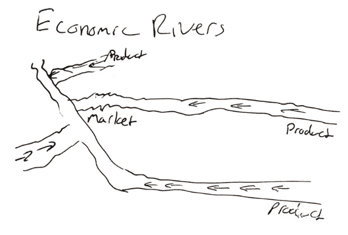
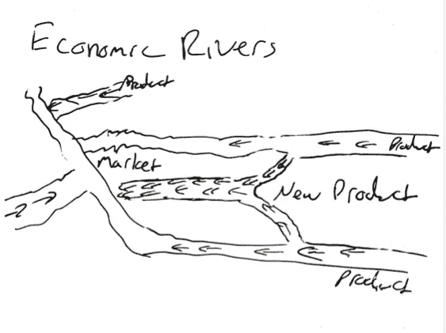

# 你真的想开始在互联网上赚钱吗？

> 原文：<https://medium.datadriveninvestor.com/do-you-really-want-to-start-making-money-on-the-internet-a3471fc13017?source=collection_archive---------11----------------------->

## 我可以告诉你它藏在哪里

Photo by [N.](https://unsplash.com/@ellladee?utm_source=medium&utm_medium=referral) on [Unsplash](https://unsplash.com?utm_source=medium&utm_medium=referral)

为了了解如何在网上赚钱，你必须了解钱在哪里，为什么会在那里。

# 钱在哪里？

钱无处不在。这听起来像是我在努力搞笑，但理解这种说法的真实性很重要。互联网上到处都是金钱的河流。诀窍是把你的桶放在正确的地方。如果你做对了，这将是你做过的最简单的事情。难的是把它做好。这就是我进来的地方。我可以给你一张去河边的地图。我还可以教你一个我想出来的很酷的技巧。

## 了解河流是什么

当我描述金钱的河流时，我真正谈论的是通过交易的金钱流动。想象一张美元钞票(或者你的一张当地货币纸币)。你可以花一美元买一些东西。然后它会到卖你买的任何东西的人那里。他们是旅程的下一站。最终，他们会把钱花在某些东西上。链条还在继续。河水流动，金钱穿越时间。

这里有一个显而易见的赚钱方法。你必须把自己插入河中，在两点之间。我这么说是什么意思？你必须促成买卖双方的交易。这意味着钱可以流向你，当你把它传递给别人时，你可以从中分一杯羹。如果你知道人们在哪里卖，并且很难找到人买，这将非常有利可图。这方面的例子有很多，但我第一个想到的是[直运](https://www.shopify.com/blog/what-is-dropshipping)。你找到想买东西的人，你找到愿意买的人，你从卖家那里买，卖给买家。

在讨论实体产品时，这一点显而易见。当考虑销售创意时，确实会变得有点困难。这就是数字媒体。这是一些新想法的组合。这就是诀窍所在。

## 我的把戏

我喜欢想出一条更好的路径让河水流动，而不是走进河里。

原始状态:

Sketch provided by the author

当我完成时:

Sketch provided by the author

这实际上是非常容易做到的。正如我所指出的，我们不再谈论物理产品，尽管你当然也可以用新的方式组合它们。

> 想想把想法结合起来有多容易。

诀窍在于找出哪种组合最有利可图。这个问题的秘密答案是，如果你不断尝试各种可能性，最终至少会有一种，很可能还有许多种，会变成现实。

## 现在来做些数学！

不，请不要去任何地方。这真的是简单的数学，我保证。我甚至不会用任何数字。嗯，也许有几个。我从来不记得有些人觉得哪种数学很可怕。如果某件事有可能发生，那么它最终会发生。如果你抛硬币足够多次，它最终会正面和反面都出现。你可以通过控制掷硬币来控制这种可能性，但是假设一个理论上完美的掷硬币有 50%的机会是正面或反面，你最终会两个都中。

> 这和找到隐藏的网络资金有什么关系？很简单，一切。

如果你想在互联网上赚到真正的钱，你需要让钱流向你。让我们回到抛硬币的话题。现在让我们改变游戏。如果你抛正面，我给你 5 美元，如果你抛反面，我什么也不给。明智的做法是尽可能多地抛硬币，尽可能地收集每一次正面抛硬币。翻跟斗不会让你付出任何代价。现在，如果我们平均一下，你每掷一次硬币就赚 2.5 美元。听起来很划算。这就是互联网给我们的。我们只是不抛硬币。

## 用简单的数学赚钱

就我而言，我在介质上写作。媒介是我选择的媒介。我写作的意图是，我写的每一篇帖子最终都会像病毒一样传播开来。我可以肯定地说，因为我相信每一个帖子都有非零的传播几率。每一个帖子都是我掷硬币的结果，尽管不尽相同。我所需要做的就是让每个帖子都像病毒一样传播开来。这最终会发生，假设有一件事是真的。

我需要点击发布。这是让某样东西成为病毒的一个关键。你必须向全世界公布。你可以做两件事来增加你病毒式传播的机会。你可以精心制作每一件作品，给每一件作品最大的传播机会。

或者，你可以写一百万个不同的东西，让其中一个最终击中。

我倾向于第二条路线。它让我创作和发布，并知道它最终会像病毒一样传播。

## 我的过程

除此之外，我还会绕回来稍微润色一下。我试图不断提高每件作品的水平，当我注意到问题时调整想法。我们有能力编辑我们的文章。利用这个事实。发布草稿。随着你的继续，你会倾向于在发表之前找到你喜欢润色的其他人。这有助于向更大的出版物投稿。他们首先需要更高层次的内容。

所以我写啊写啊写。我试着向大的出版物投稿，当他们拒绝我的时候，我就向一些小的出版物投稿，这些小的出版物会刊登我写的大部分东西。只需要一个人就能迅速走红并开始赚钱。

这是具体到如何支付媒体的作家，不是吗？

不完全是。你可以把这个经验推广到任何类型的内容创作。随着时间的推移，只要内容能引起足够多的人的共鸣，它就会像病毒一样传播。你创造的内容越多，中彩票的几率就越大。这是因为当你创造内容的时候，你吸引了人们。

人们想看你创造的东西。他们中的一些人可能是混蛋，但他们还是会来看的。你创造的越多，越多的人开始向你靠拢。一旦你周围有了足够多的人，钱就会想办法找到你。人们来找你是你在为他们创造价值的标志。他们会确保你也获得价值。

内容是对你来说独一无二的不同方式的想法的组合。如果你想赚钱，就做诚实的内容。人们会和你产生共鸣。与人交往。金钱通过关系流动。如果你充当一个枢纽，将人们与你的想法联系起来，你将能够从他们所有人那里收集价值。

如果你真的想赚钱，忘掉钱吧。注重与人的联系。钱会通过关系而来。不要试图得到钱。让它来找你。这就是赚钱的秘诀。

[*有兴趣跟随我的咨询之旅吗？还是利用我的一些知识和经验？注册我的邮件列表！我不想告诉你我多久给你发一次信息。可能不经常。但当我这样做时，我会努力确保他们为你提供最大的价值。*](https://consulting.guinantech.com)