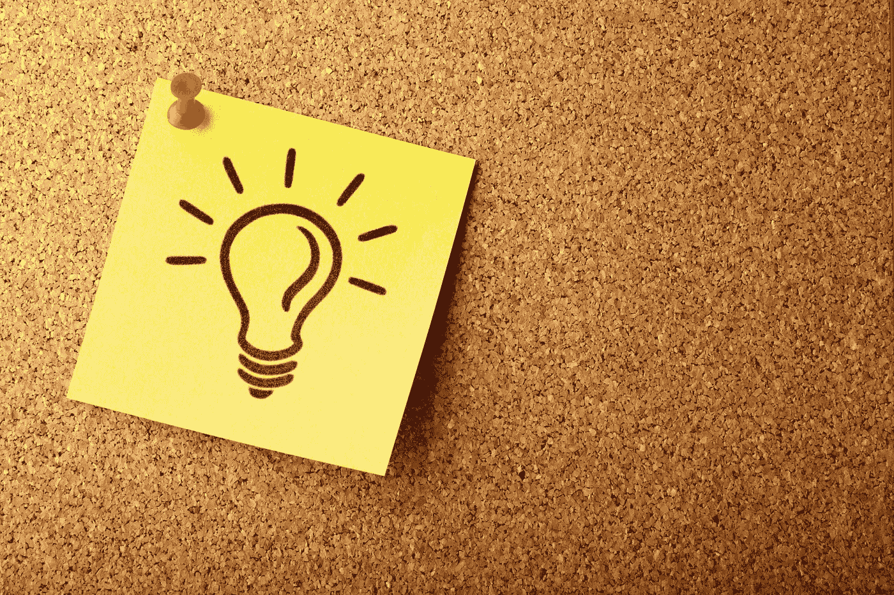
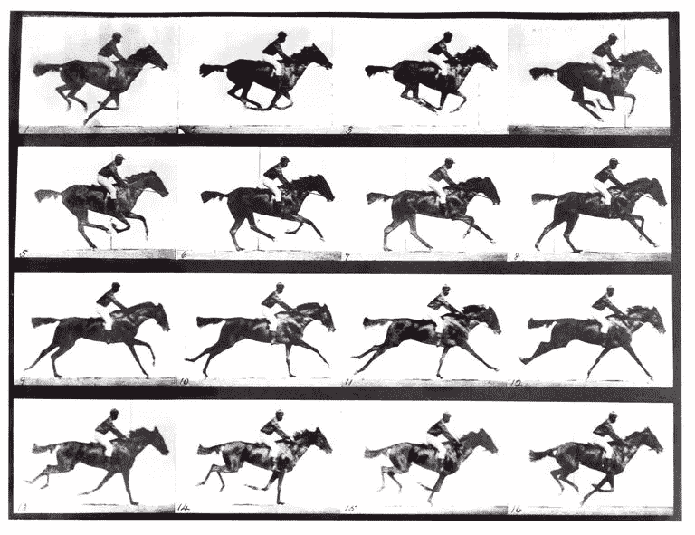
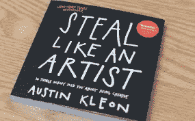

# 你想要下一个能让你成为百万富翁的伟大商业创意吗？

> 原文：<https://medium.datadriveninvestor.com/do-you-want-the-next-great-business-idea-that-could-make-you-millions-bb5584abcff8?source=collection_archive---------7----------------------->

那为什么不偷呢？

Photo by [AbsolutVision](https://unsplash.com/@freegraphictoday?utm_source=unsplash&utm_medium=referral&utm_content=creditCopyText) on [Unsplash](https://unsplash.com/s/photos/idea?utm_source=unsplash&utm_medium=referral&utm_content=creditCopyText)

1897 年 8 月 31 日，托马斯·爱迪生获得了电影摄影机的专利权。然而，这不是他自己的发明。你看技术上来说他偷了它。最初的照相机是基于法国静物摄影先驱约瑟夫·尼斯皮涅·涅普斯和路易·达盖尔发现的摄影原理。1877 年，爱德华·迈布里奇对其进行了进一步的改进，他因制作了第一部电影《运动中的马》而闻名。

尽管爱迪生抄袭了这部作品，但他也做了一些实质性的改动。

与早期的照相机不同，爱迪生的电影放映机和电影摄影机使用赛璐珞胶片。关键是，我们今天看到的每一项发明都是由认为可以做得更好的人改进的！

 [## 在创业之旅中，拥抱学习|数据驱动的投资者

### 好像建立一个数百万美元的公司还不够困难，企业家必须额外照顾他们的…

www.datadriveninvestor.com](https://www.datadriveninvestor.com/2018/10/16/on-the-entrepreneurial-trek-embrace-the-learning/) 

我们这个时代的顶尖科学家之一，著名的物理学家阿尔伯特·爱因斯坦，是在荷兰物理学家亨德里克·洛伦兹和法国数学家亨利·庞加莱的帮助下成长起来的，他们发现了相对论的基本原理，帮助爱因斯坦得出了他的相对论。尽管爱因斯坦发表了揭示其相对论背后理论的出版物，但他的科学家同事却没有得到任何荣誉。

奥斯汀·克里昂在他的书《像艺术家一样偷窃》中指出，偷窃别人的想法，并加以利用，使之变得更好，是多么容易。虽然这本书最初是从一个艺术家的角度来写的，但他给出的建议可以应用在任何地方，任何领域。

这让我想到了到底是谁剽窃了别人的想法。对我来说，最近和最明显的是 Instagram。他们公然从 Snapchat 窃取故事、照片绘制工具、地理过滤器等。

这还没有结束。我可以指出，从 iPad 到智能手机的每个创意都被窃取了。但是偷窃真的是一件坏事吗？就我个人而言，如果你有了一个想法，用自己的触觉和感觉让它变得更好，那就真的不是偷窃。在某种程度上，这是一种进步。如果没有完成，我们还会使用蒸汽机。在交通运输、医药、能源(可再生)、半导体、量子计算、人类基因组计划、汽车和 GPS(全球定位系统)方面，永远不会有任何技术进步。

如果我们有今天，是因为我们都有一些想法，并把它变得更好。就像人类的进化一样，我们正在目睹技术的进化。因此，像戈登·摩尔这样的人提出了类似摩尔定律的定律，即微芯片上的晶体管数量每两年翻一番，而计算机的成本却减半。这实际上正在发生。一个很好的例子是我们今天的手机。我们随身带着一部手机，就在几年前，它的计算能力还和我们的台式电脑一样。这简直太神奇了。

所以，如果你决定做某件事，却犹豫是否有人已经在做了。只要加入进来，改进他们正在做的事情。你可能有比切片面包更好的主意。

这正是大多数公司所做的。当我在 21 世纪初 iPhone 发布之前为诺基亚工作时，该公司正计划推出一款触摸屏手机，但由于成本问题而没有实施。实际上，LG 比 iPhone 早一年推出了第一款电容式触摸屏(LG PRADA)。同样，我们可以声称苹果抄袭了这个概念，但老实说，他们只是把它做得更好了。见鬼了。他们可以复制 1992 年 IBM Simon 的第一款触摸屏手机，但我可以向你保证，他们会做得更好。在苹果的创新和史蒂夫·乔布斯的指导下，苹果确保了他们让所有其他手机制造商看起来都停留在过去。苹果公司提供了引擎盖下的权力，优质的质量和更多。因为他们，它导致了更大的创新和竞争市场，现在为消费者提供了更多的选择。

在过去的十年里，除了少数例外，每一个在线/电子商务企业都或多或少地抄袭了别人的想法。在脸书之前有 Orkut / Myspace，在 Whatsapp 之前有 BBM，在优步之前有 Celluride。这个清单可以一直列下去。

我想说的是“为什么要发明轮子？”为什么不改进现有的呢？如果公司能做到，那你为什么不能？